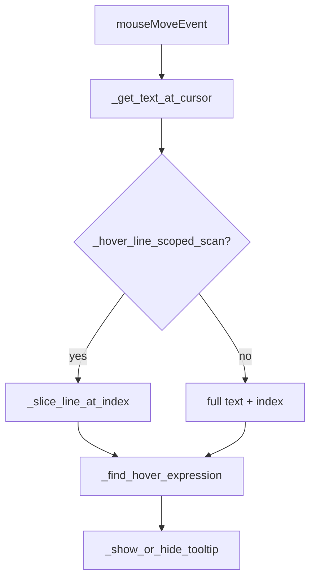

# PYPOST-122: Architecture — line-scoped hover scan

## Summary

Narrow the hover expression lookup in `VariableHoverMixin` to the current line when the host
widget is a multiline plain-text editor. `VariableAwarePlainTextEdit` enables the flag;
`VariableAwareLineEdit` keeps full-text scan (single line).

## Design

### Change points

| File | Change |
| ---- | ------ |
| `pypost/ui/widgets/mixins.py` | `_hover_line_scoped_scan` flag; `_slice_line_at_index`; `_prepare_hover_scan_context`; use scoped text in `mouseMoveEvent` |
| `pypost/ui/widgets/variable_aware_widgets.py` | Set `_hover_line_scoped_scan = True` on `VariableAwarePlainTextEdit` |
| `tests/test_variable_hover.py` | Slice helper tests; large-doc deep-line hover test |

### Flow

### Line slicing

- Input: full document text and document-global cursor index from `_get_text_at_cursor`.
- `_slice_line_at_index` finds `\n` boundaries and returns `(line_text, index_in_line)`.
- `_find_hover_expression` runs `VariableHoverHelper.find_expression_at_index` on the slice
  only — O(matches on line) instead of O(matches in document).

### Unchanged components

- `VariableHoverHelper` — same regex patterns and resolution.
- `VariableAwareLineEdit` — `_hover_line_scoped_scan` stays `False`.
- `VariableAwareTableWidget` — separate hover path, unaffected.

### Limitation

Placeholders split across lines are not matched (same as before; tokens are single-line in
practice).

## Tests

| Test | Asserts |
| ---- | ------- |
| `test_slice_line_at_index_middle_of_line` | Correct line extraction |
| `test_slice_line_at_index_first_line` | First-line boundary |
| `test_line_scoped_scan_finds_variable_on_deep_line` | FR-1 / NFR-1 with 400+ line body |
| Existing `TestVariableAwarePlainTextEditTooltips` | FR-2, FR-3 regression |
