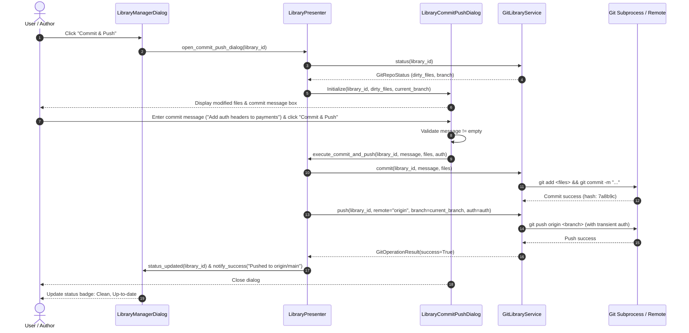
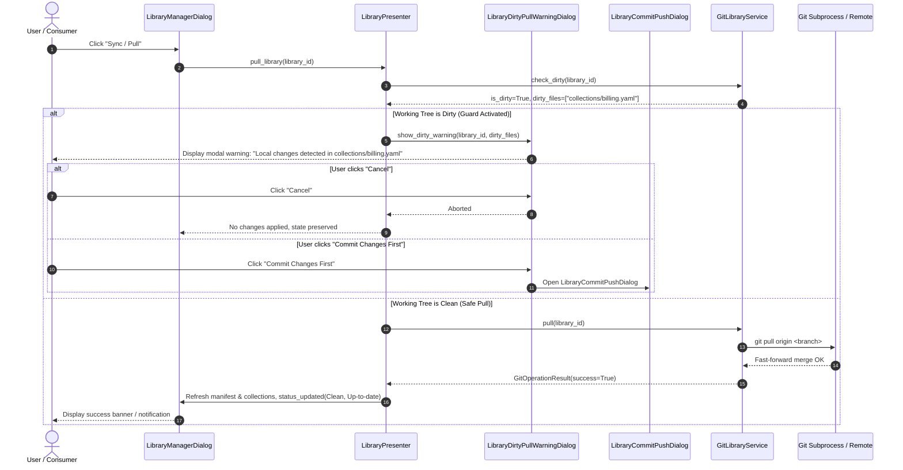

# PYPOST-1223: [Libraries] UI library manager panel, dirty check guards, and two-way Git commit/push flow

## Research

### 1. Existing UI Patterns in PyPost (`pypost/ui/`)
An inspection of `pypost/ui/` reveals clear architectural conventions consistently used across the application:
- **Presenter / Controller Architecture (MVP)**:
  - Presenters (`pypost/ui/presenters/env_presenter.py`, `collections_presenter.py`, `tabs_presenter.py`) are `QObject` subclasses that encapsulate domain state, coordinate background/storage operations, and expose Qt `Signal`s for loose coupling with views and main windows.
  - Views (`pypost/ui/dialogs/`, `pypost/ui/widgets/`) build Qt widget layouts and connect user interactions to presenter slots or callbacks.
- **Dialog & Sub-Widget Composition**:
  - Complex dialogs (e.g. `EnvironmentDialog` in `pypost/ui/dialogs/env_dialog.py`) decompose layouts into specialized sub-widgets (`EnvironmentListWidget`, `EnvironmentVariablesWidget`).
  - Dialogs operate on working copies and commit state to backend services upon user confirmation (`accept()`).
- **Modal Dialogs & Confirmation Guards**:
  - `pypost/ui/collection_item_dialogs.py` establishes standard patterns for confirmation modals (`confirm_delete`, `prompt_dirty_sibling_tab_reload`, `show_rename_failure`, `show_request_failed_error`). Modals use standard `QMessageBox` or custom `QDialog`s with distinct button roles (`AcceptRole`, `RejectRole`, `DestructiveRole`).
- **Widget Identification & Automation (`pypost/ui/widget_ids.py`)**:
  - Widgets assign standard object names via `set_widget_id(widget, CONSTANT_ID)` to facilitate robust headless testing and UI driving without fragile text matching.

### 2. Integration with Core Services and Models
- **`GitLibraryService` (`pypost/core/git_service.py`)**:
  - Provides `clone()`, `fetch()`, `pull()`, `status()`, `list_branches()`, `checkout()`, `check_dirty()`, `discover_manifest()`, and `delete_library()`.
  - Enforces safety guards: `check_dirty()` detects unstaged, staged, and untracked modifications; `pull()` and `checkout()` raise `GitDiagnosticError(GitDiagnosticErrorCode.DIRTY_WORKING_TREE)` when modifications exist.
  - *Extension Required*: `GitLibraryService` currently lacks high-level `commit()` and `push()` methods for the two-way sync flow. These will be added to `GitLibraryService` along with `GitOperationType.COMMIT` and `GitOperationType.PUSH` in `pypost/models/git_library.py`.
- **`LibraryManifest` & Serializers (`pypost/core/library_manifest.py`, `pypost/models/library_manifest.py`)**:
  - Loads and validates manifests (`pypost-library.yaml`, `.json`), inspects declared collection paths, and reports missing collection files.
- **`LocalOverlayManager` (`pypost/core/local_overlay_manager.py`)**:
  - Persists user secrets and variable overrides outside the Git repository in `~/.pypost/libraries_data/<library-id>/overlay.json` with 0o600 / 0o700 file permissions.
  - Deleting or disconnecting libraries cleanly unregisters or cleans up overlays.
- **`LibraryVariableResolver` (`pypost/core/variable_resolver.py`)**:
  - Resolves effective runtime variables across base defaults, active presets, and local overlays with provenance tracking.

---

## Implementation Plan

### High-Level Plan
1. **Extend Git Domain Models and Core Service**:
   - Add `GitOperationType.COMMIT` and `GitOperationType.PUSH` to `pypost/models/git_library.py`.
   - Add `commit(library_id, message, files=None, auth=None)` and `push(library_id, remote="origin", branch=None, auth=None, set_upstream=True)` to `GitLibraryService` (`pypost/core/git_service.py`).
2. **Build Library Presenter Layer (`pypost/ui/presenters/library_presenter.py`)**:
   - Create `LibraryPresenter(QObject)` to manage library discovery, status polling, dirty state verification, branch switching, pull/commit/push execution, and clone operations.
   - Emit signals (`libraries_loaded`, `library_selected`, `status_updated`, `operation_started`, `operation_completed`, `operation_failed`).
3. **Implement UI Widgets and Dialogs (`pypost/ui/dialogs/library_dialogs.py`, `pypost/ui/widgets/library_manager_panel.py`)**:
   - `LibraryManagerDialog`: Master-detail manager window with library list, status header, collection list, and action buttons.
   - `LibraryCloneDialog`: Modal with URL, branch, and hybrid auth selector (SSH Agent, PAT with token/user, Custom SSH Key with path picker and passphrase).
   - `LibraryCommitPushDialog`: File change list, non-empty commit message input, target branch selector, and "Commit" / "Commit & Push" actions.
   - `LibraryDirtyPullWarningDialog`: Guard modal warning user about uncommitted local changes, showing modified file list, with "Cancel" and "Commit Changes First" options.
   - `LibraryBranchSwitchDialog`: Modal / popup to switch branches with dirty check guard.
   - `LibraryConfirmDeleteDialog`: Confirmation modal for unregistering or deleting library files and overlays.
4. **Integrate Main Window & Hotkeys (`pypost/ui/main_window.py`, `pypost/ui/widget_ids.py`)**:
   - Add "Libraries" menu and toolbar shortcut in `MainWindow`.
   - Register widget IDs for UI test automation.
5. **Add Comprehensive Unit and UI Test Suite**:
   - Failing repro test (`tests/test_ui_library_manager_repro.py`) covering all functional requirements.
   - Dialog unit tests and presenter lifecycle tests.

### Mandatory — Failing Repro (Step 3)
- **Target File**: `tests/test_ui_library_manager_repro.py`
- **What it Asserts**:
  1. **LibraryPresenter Lifecycle**: Initializing presenter scans base directory, loads manifests, and emits `libraries_loaded` and `status_updated`.
  2. **LibraryManagerDialog UI Construction**: Dialog populates connected libraries list, shows status badges (branch, clean/dirty badge with dirty file count, ahead/behind counters), and lists manifest collections.
  3. **Dirty Pull Guard Modal**: Triggering pull on a dirty library pauses execution and displays `LibraryDirtyPullWarningDialog` with the exact list of dirty files; clicking "Cancel" halts the pull, clicking "Commit Changes First" opens the commit dialog.
  4. **Clean Pull Flow**: Triggering pull on a clean library calls `GitLibraryService.pull()`, applies updates, and refreshes the UI status to up-to-date.
  5. **Two-Way Commit & Push Flow**: `LibraryCommitPushDialog` displays modified/untracked files, validates non-empty commit message, stages files, commits with message, and pushes to remote upstream.
  6. **Clone Dialog with Hybrid Auth**: `LibraryCloneDialog` captures Git URL, branch, and authentication mode (SSH Agent, PAT, Custom SSH Key), executes `service.clone()`, discovers manifest, and selects the new library in the UI list.
  7. **Branch Switcher**: Lists local and remote branches, blocks switching when dirty, and switches branch when clean.
  8. **Disconnect & Delete**: Confirms deletion and removes library directory and local overlay.
  9. **Structured Error Diagnostics**: Verifies user-friendly error dialogs for `AUTH_FAILED`, `REPO_NOT_FOUND`, and `MERGE_CONFLICT`.
- **How it Fails Before Implementation**:
  - `pypost/ui/presenters/library_presenter.py`, `pypost/ui/dialogs/library_dialogs.py`, `pypost/ui/widgets/library_manager_panel.py`, `GitLibraryService.commit`, `GitLibraryService.push`, and `GitOperationType.COMMIT` / `PUSH` do not exist yet. Import errors and attribute errors will fail immediately and deterministically.

---

## Architecture

### Module Breakdown and Responsibilities

```
pypost/
├── core/
│   ├── git_service.py              # Extended with commit() and push() operations
│   ├── git_auth.py                 # Hybrid authentication environment builder
│   ├── library_manifest.py         # Manifest parser, discovery, and disk validation
│   ├── local_overlay_manager.py    # Local user secrets and variable overrides manager
│   └── variable_resolver.py        # 3-tier effective variable resolution engine
├── models/
│   ├── git_library.py              # Extended with COMMIT, PUSH operation types and status models
│   └── library_manifest.py         # Manifest, overlay, and variable models
└── ui/
    ├── widget_ids.py               # Standard UI automation widget IDs for library manager
    ├── main_window.py              # Menu bar, shortcut, and toolbar integration for Library Manager
    ├── collection_item_dialogs.py  # Shared QMessageBox and diagnostic dialog helpers
    ├── dialogs/
    │   └── library_dialogs.py      # LibraryManagerDialog, CloneDialog, CommitPushDialog, DirtyGuardDialog
    ├── presenters/
    │   └── library_presenter.py    # LibraryPresenter coordinating UI events with GitLibraryService
    └── widgets/
        └── library_manager_panel.py# Sub-widgets: LibraryListWidget, LibraryDetailWidget, CollectionsWidget
```

| Module / Component | Responsibility |
| --- | --- |
| `pypost.models.git_library` | Domain models (`GitRepoStatus`, `GitBranchInfo`, `GitAuthConfig`, `GitOperationResult`, `GitOperationType` extended with `COMMIT`, `PUSH`, `GitDiagnosticErrorCode`). |
| `pypost.core.git_service.GitLibraryService` | Core Git backend service: clone, fetch, pull, status, branch checkout, dirty checks, staging, committing, pushing, and repository deletion. |
| `pypost.ui.presenters.library_presenter.LibraryPresenter` | MVP Presenter / Controller: loads connected libraries, queries status, coordinates dirty checks, invokes Git operations asynchronously, emits Qt signals, and handles diagnostic error classification. |
| `pypost.ui.dialogs.library_dialogs.LibraryManagerDialog` | Master-detail dialog for managing connected libraries: library list sidebar, repository status banner, collection table, and action bar (Pull, Commit & Push, Switch Branch, Clone, Delete). |
| `pypost.ui.dialogs.library_dialogs.LibraryCloneDialog` | Modal dialog for cloning a repository: URL input, branch input, hybrid auth mode selector (SSH Agent, PAT, Custom SSH Key) with credential inputs. |
| `pypost.ui.dialogs.library_dialogs.LibraryCommitPushDialog` | Two-way commit modal: changed files checklist, commit message editor, branch target selector, "Commit Only" and "Commit & Push" actions. |
| `pypost.ui.dialogs.library_dialogs.LibraryDirtyPullWarningDialog` | Blocking warning modal displayed when pull is attempted on a dirty repository: displays modified files list, "Cancel", and "Commit Changes First" buttons. |
| `pypost.ui.widgets.library_manager_panel` | Reusable sub-widgets (`LibraryListWidget`, `LibraryDetailWidget`, `LibraryCollectionsWidget`) composing the manager layout. |
| `pypost.ui.widget_ids` | Automation constants for widget discovery and headless test driving. |

---

### Component Diagram (Mermaid)

```mermaid
graph TD
    subgraph UI Layer ["PyPost Desktop UI (PySide6)"]
        MW["MainWindow (Menu & Toolbar)"]
        LMD["LibraryManagerDialog"]
        LCD["LibraryCloneDialog"]
        LCPD["LibraryCommitPushDialog"]
        LDPW["LibraryDirtyPullWarningDialog"]
        LP["LibraryPresenter (QObject)"]
    end

    subgraph Core Domain & Services ["PyPost Core & Models"]
        GLS["GitLibraryService"]
        LOM["LocalOverlayManager"]
        LM["LibraryManifest Parser"]
        LVR["LibraryVariableResolver"]
        GAC["GitAuthEnvironmentManager"]
    end

    subgraph Storage & External ["Filesystem & Network"]
        LIB_DIR["~/.pypost/libraries/<library-id>/ (.git, manifest, collections)"]
        OVR_DIR["~/.pypost/libraries_data/<library-id>/overlay.json (secrets)"]
        GIT_CLI["Git CLI Binary (subprocess)"]
        REMOTE["Remote Git Server (GitHub / GitLab / SSH)"]
    end

    MW -->|Opens| LMD
    LMD -->|Dispatches Actions| LP
    LMD -->|Opens| LCD
    LMD -->|Opens| LCPD
    LMD -->|Shows if dirty on pull| LDPW

    LP -->|Queries & Mutates| GLS
    LP -->|Loads / Deletes Overlays| LOM
    LP -->|Loads Manifests| LM
    LP -->|Resolves Variables| LVR

    GLS -->|Runs Subprocess| GIT_CLI
    GLS -->|Injects Credentials| GAC
    GLS -->|Reads/Writes Repos| LIB_DIR
    LOM -->|Reads/Writes Secrets (0o600)| OVR_DIR
    GIT_CLI -->|Pushes / Pulls / Clones| REMOTE
```

---

### Sequence Diagram 1: Two-Way Git Commit & Push Flow



---

### Sequence Diagram 2: Safe Pull with Dirty Check Guard Warning



---

### Extended Data Models & Types

In `pypost/models/git_library.py`:
```python
class GitOperationType(str, Enum):
    CLONE = "clone"
    FETCH = "fetch"
    PULL = "pull"
    CHECKOUT = "checkout"
    STATUS = "status"
    BRANCH_LIST = "branch_list"
    COMMIT = "commit"      # Added for two-way flow
    PUSH = "push"          # Added for two-way flow
```

In `pypost/core/git_service.py`:
```python
def commit(
    self,
    library_id: str,
    message: str,
    files: Optional[list[str]] = None,
    auth: Optional[GitAuthConfig] = None,
    timeout: Optional[float] = None,
) -> GitOperationResult:
    """Stage specified (or all dirty) files and create a Git commit."""
    ...

def push(
    self,
    library_id: str,
    remote: str = "origin",
    branch: Optional[str] = None,
    auth: Optional[GitAuthConfig] = None,
    set_upstream: bool = True,
    timeout: Optional[float] = None,
) -> GitOperationResult:
    """Push local commits to remote tracking branch with transient auth credentials."""
    ...
```

---

### Diagnostic Error Presentation Mapping

When a `GitDiagnosticError` occurs during any UI interaction, `LibraryPresenter` maps the error code to clear, actionable user messages:

| Error Code | User Dialog Title | User-Facing Actionable Message |
| --- | --- | --- |
| `AUTH_FAILED` | Authentication Failed | "Could not authenticate with the remote Git repository. Please verify your Personal Access Token, SSH key, or SSH agent credentials." |
| `DIRTY_WORKING_TREE` | Uncommitted Changes Detected | "The operation was blocked because you have uncommitted changes in your local library. Please commit your changes before pulling or switching branches." |
| `REPO_NOT_FOUND` | Repository Not Found | "The remote repository could not be found or reached. Please verify the repository URL and your network connection." |
| `BRANCH_NOT_FOUND` | Branch Not Found | "The specified branch does not exist on the remote or local repository." |
| `MERGE_CONFLICT` | Merge Conflict | "Automatic merge failed due to conflicting changes. Please resolve merge conflicts using Git before syncing." |
| `GIT_NOT_INSTALLED` | Git Not Found | "Git executable was not found on your system PATH. Please install Git to use collection libraries." |
| `DESTINATION_NOT_EMPTY` | Directory Already Exists | "A library with this ID or folder name already exists in your local library storage." |
| `TIMEOUT` | Operation Timed Out | "The Git operation timed out. Please check your network connection and try again." |
| `COMMAND_FAILED` | Git Operation Failed | "Git command failed: {error_details}." |

---

## Q&A

| Question | Answer |
| --- | --- |
| **How does the UI prevent freezing during Git network operations?** | `LibraryPresenter` executes blocking Git operations (clone, fetch, pull, push) through worker threads or non-blocking event dispatch, displaying indeterminate progress indicators on active buttons/spinners and disabling duplicate click triggers. |
| **How does the Commit dialog ensure secret values are not accidentally committed to Git?** | Secret variables and local overrides are strictly isolated in `~/.pypost/libraries_data/<library-id>/overlay.json`, which is outside the Git working tree (`~/.pypost/libraries/<library-id>/`). The commit dialog only inspects and stages files within the Git repository directory. |
| **What happens if a user tries to switch branches while having uncommitted changes?** | `LibraryPresenter` runs `check_dirty(library_id)` prior to `service.checkout()`. If dirty files exist, the checkout is blocked and an informational modal dialog appears informing the user to commit or stash changes first. |
| **Can the Library Manager dialog be used headless in automated tests?** | Yes. All dialogs, widgets, and presenters use standard PySide6 components and `set_widget_id` constants, allowing automated pytest suites to instantiate dialogs, invoke presenter methods, simulate button clicks, and assert widget states without interactive GUI prompts. |
| **How are multiple connected libraries discovered at startup?** | `LibraryPresenter.load_libraries()` scans `GitLibraryService.base_dir` for subdirectories containing a `.git` folder and a manifest file (`pypost-library.yaml`/`.json`), querying `status()` for each to populate the manager list. |

---

## Completion Criteria

- [x] All modules defined, described, and mapped to files.
- [x] Dependencies between UI components, presenters, and core services clearly documented.
- [x] Mermaid component diagram and sequence diagrams for two-way commit/push and dirty guard pull included.
- [x] Step 3 failing repro test plan documented with specific assertion details and failure modes.
- [x] Roadmap updated to mark Step 2 as in progress (`[/]`).
