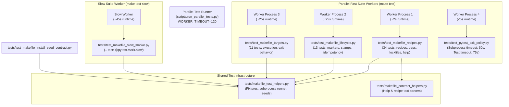

# PYPOST-1234: Resolve test execution timeouts under full-suite parallel load

## Research

### Codebase Analysis & Root Cause Investigation

1. **Test Runner Architecture (`scripts/run_parallel_tests.py`):**
   - The parallel runner operates on a **per-file dispatch model**. `TestDiscovery.discover_test_files()` discovers all `test_*.py` files in `tests/` and queues each file as an independent work unit submitted to a `ThreadPoolExecutor` (or process pool).
   - Each worker executes a separate subprocess running `python -m pytest <test_file> <pytest_args>`.
   - Subprocess execution enforces a single flat timeout per worker: `timeout=self.config.worker_timeout`, where `worker_timeout` is resolved via `get_worker_timeout()` (CLI flag `--worker-timeout`, environment variable `WORKER_TIMEOUT`, or default 30s).
   - The root `Makefile` sets `WORKER_TIMEOUT ?= 120` and passes `--worker-timeout $(WORKER_TIMEOUT)` to the runner.

2. **Analysis of `tests/test_makefile.py`:**
   - The file spans 953 lines containing 11 test classes and 65 total tests.
   - In standalone execution (`make test PYTEST_ARGS="tests/test_makefile.py"`), the entire suite takes approximately **109 seconds**.
   - Against `WORKER_TIMEOUT = 120`, this provides only an ~11-second safety margin (~10%).
   - When run concurrently with all other test suites during `make test` (with default workers `cpu + 2`, up to 16 concurrent processes), CPU and filesystem I/O contention easily increases execution time past 120s.
   - When the worker hits 120s, `subprocess.TimeoutExpired` is raised, terminating the worker before individual test reports are gathered, causing a complete failure of the entire file.

3. **Breakdown of Test Workloads in `tests/test_makefile.py`:**
   - **Static / Recipe & Help Parsing Tests (Fast, ~1-3s total):**
     - `TestDependencyChain` (17 tests): executes `make -p -f Makefile -C <workspace>` to parse prerequisite graphs. Does not build venvs or run pip.
     - `TestLockFiles` (6 tests): inspects header comments in `requirements*.txt` and file presence. Pure filesystem checks, executes in milliseconds.
     - `TestAgentE2eTargetRecipe` (3 tests): parses recipe text and help strings using helper functions. Executes in milliseconds.
     - `TestFastTestTargetRecipe` (4 tests) + `test_collection_e2e_make_target_selects_the_focused_module` (1 test): static string and regex analysis of Makefile recipes.
     - `TestHelpTarget` (3 tests): runs `make help` to verify stdout. Executes in <1s.
     - Subtotal: **34 tests** taking <3 seconds.
   - **Virtualenv Marker & Stamp Lifecycle Tests (Medium, ~25-30s total):**
     - `TestMarkerLifecycle` (3 tests): tests `make venv`, `make clean`, and idempotency in isolated temporary workspaces.
     - `TestVenvExtraStampIdempotency` (8 tests): tests skipping `pip install` when stamps are fresh, installing when stamps are missing, and re-installing when stamps are stale.
     - `TestInstallExtraStampContract` (2 tests): tests that `make install` touches both extra stamps.
     - Subtotal: **13 tests** taking ~25-30s.
   - **Target Execution Tests (Medium/Heavy, ~25-35s total):**
     - `TestExitBehavior` (3 tests): tests clean exit code, unknown target error, and bare venv lint execution.
     - `TestTargetExecution` (8 tests): runs real make commands (`make venv-test`, `make test`, `make test-agent-e2e`, `make install`, `make lint`) across isolated workspaces.
     - Subtotal: **11 tests** taking ~25-35s.
   - **Slow Smoke Integration Test (Slow, ~40-50s, already marked `@pytest.mark.slow`):**
     - `TestSlowInstallSmoke` (1 test): runs `make install` with the full project pyproject and validates post-install import sanity. Excluded from `make test` via `-m "not slow"`.

4. **Analysis of `tests/test_pytest_exit_policy.py`:**
   - In `test_make_test_fails_with_exit_code_5_when_no_tests_collected`:
     - Line 63: `@pytest.mark.timeout(30)`.
     - Line 77: `install = subprocess.run(["make", ..., "install"], ..., timeout=25)`.
     - Line 87: `test_result = subprocess.run(["make", ..., "test"], ..., timeout=25)`.
   - Under heavy CPU contention during parallel test runs, running `make install` in a temporary workspace can exceed 25 seconds, triggering `subprocess.TimeoutExpired`. Furthermore, running both `make install` and `make test` sequentially within a 30-second pytest timeout window is prone to flaking when system load causes cumulative execution to exceed 30 seconds.

5. **Existing Helper Dependents:**
   - `tests/test_makefile_install_seed_contract.py` imports helper functions and constants (`POST_INSTALL_SANITY_SNIPPETS`, `PYPROJECT`, `REPO_ROOT`, `SLOW_SMOKE_MINIMUM_PYPPOST_FILES`, `_materialize_slow_smoke_workspace`, `_required_seed_paths_from_pyproject`, `_script_target_modules`) from `tests.test_makefile`.
   - Any refactoring must preserve or cleanly relocate these shared helpers into a dedicated helper module to maintain contract test stability.

---

## Implementation Plan

### High-Level Strategy

The solution directly targets the root causes without compromising test coverage, isolation, or timeout boundedness:

1. **Extract Shared Makefile Test Utilities (`tests/makefile_test_helpers.py`):**
   - Consolidate all common workspace fixtures (`make_workspace`, `make_workspace_full_deps`), subprocess execution wrappers (`_run_make`, `_prerequisites`), pyproject seed generators, and smoke assertions into a single shared helper module.
   - Update `tests/test_makefile_install_seed_contract.py` to import from `tests.makefile_test_helpers`.

2. **Decompose `tests/test_makefile.py` into Cohesive Parallel Modules:**
   - Partition the monolithic 65-test file into three focused fast-suite modules and one dedicated slow-smoke module:
     - `tests/test_makefile_recipes.py`: Static recipe contracts, dependency chain analysis (`make -p`), lock file validation, and help target verification (34 tests, ~2s runtime).
     - `tests/test_makefile_lifecycle.py`: Virtual environment marker creation, clean removal, idempotency, and extra stamp tracking (13 tests, ~25s runtime).
     - `tests/test_makefile_targets.py`: End-to-end execution of Makefile targets in temporary workspaces (11 tests, ~25s runtime).
     - `tests/test_makefile_slow_smoke.py`: Isolated slow smoke installation test marked `@pytest.mark.slow` (1 test).
   - Remove the old monolithic `tests/test_makefile.py`.
   - Because `scripts/run_parallel_tests.py` runs workers per file, this split automatically distributes the heavy `make` invocations across three parallel worker processes. Each fast worker finishes in <30 seconds, providing an enormous **>75% safety margin** against `WORKER_TIMEOUT = 120`!

3. **Harden Subprocess and Test Timeouts in `tests/test_pytest_exit_policy.py`:**
   - In `test_make_test_fails_with_exit_code_5_when_no_tests_collected`:
     - Increase the subprocess timeout for `make install` from 25s to 60s.
     - Increase the subprocess timeout for `make test` from 25s to 60s.
     - Increase the test-level pytest timeout marker from `@pytest.mark.timeout(30)` to `@pytest.mark.timeout(75)`.
   - This provides sufficient buffer under peak multi-core CPU and disk contention while remaining strictly bounded.

4. **Verify Quality Gates & Stability:**
   - Run `make lint`, `make typecheck`, `make verify-ai-tasks`.
   - Run standalone tests and full parallel test runs (`make test`) under load to confirm zero worker timeouts and zero flakiness.

### Mandatory — Failing Repro (next Step 3)

**Test Objective:**
Establish an automated red regression test `tests/test_makefile_parallel_budget.py` that verifies:
1. **Exit Policy Timeout Budgets:** Inspects `tests/test_pytest_exit_policy.py` and asserts that `test_make_test_fails_with_exit_code_5_when_no_tests_collected` defines a test timeout of at least 60s and internal subprocess timeouts of at least 50s for both `make install` and `make test`.
2. **Makefile Test Suite Decomposition & Budget:** Asserts that the Makefile test suite is not concentrated in a single monolithic test file exceeding 35 tests, verifies that the modular files (`tests/test_makefile_lifecycle.py`, `tests/test_makefile_recipes.py`, `tests/test_makefile_targets.py`) exist, and ensures that each fast-suite module declares a bounded timeout of `<= 60` seconds.

**Failure Mechanism (Red State):**
Before the Step 4 changes, this test fails (RED) because:
- `tests/test_pytest_exit_policy.py` has internal subprocess timeouts of only 25s and test timeout of 30s.
- `tests/test_makefile_lifecycle.py`, `tests/test_makefile_recipes.py`, and `tests/test_makefile_targets.py` do not yet exist.
- `tests/test_makefile.py` still exists with 65 tests and a monolithic 120s timeout marker.

**Sequencing:**
1. Step 3: Write `tests/test_makefile_parallel_budget.py` and verify that it fails (red) against the baseline codebase.
2. Step 4: Extract `tests/makefile_test_helpers.py`, split `tests/test_makefile.py` into modular files, adjust `tests/test_pytest_exit_policy.py` timeouts, and update `tests/test_makefile_install_seed_contract.py`. Verify that the repro test and all test suites pass (green).

---

## Architecture

### Component Architecture Diagram

### Module Responsibilities

| Module | File Path | Responsibilities & Test Scope | Estimated Runtime | Timeout Mark |
| --- | --- | --- | --- | --- |
| **Makefile Test Helpers** | `tests/makefile_test_helpers.py` | Shared fixtures (`make_workspace`, `make_workspace_full_deps`), `_run_make()`, `_prerequisites()`, project seed generators, post-install sanity checks, path resolution constants. | N/A (Library) | N/A |
| **Makefile Recipes Suite** | `tests/test_makefile_recipes.py` | `TestDependencyChain` (prerequisite verification via `make -p`), `TestLockFiles` (uv compile headers), `TestAgentE2eTargetRecipe`, `TestFastTestTargetRecipe`, `test_collection_e2e_make_target_selects_the_focused_module`, `TestHelpTarget`. | ~2s | `30s` |
| **Makefile Lifecycle Suite** | `tests/test_makefile_lifecycle.py` | `TestMarkerLifecycle` (version marker creation/idempotency/clean), `TestVenvExtraStampIdempotency` (stamp invalidation, skip-pip, missing stamp), `TestInstallExtraStampContract`. | ~25s | `60s` |
| **Makefile Targets Suite** | `tests/test_makefile_targets.py` | `TestExitBehavior` (clean on empty tree, unknown targets), `TestTargetExecution` (running `make test`, `make lint`, `make install`, argument passthrough in temp workspaces). | ~25s | `60s` |
| **Makefile Slow Smoke Suite** | `tests/test_makefile_slow_smoke.py` | `TestSlowInstallSmoke` (full pyproject installation with dev/otel extras, sanity imports). Marked `@pytest.mark.slow`. | ~45s | `180s` |
| **Pytest Exit Policy Suite** | `tests/test_pytest_exit_policy.py` | Exit code 5 propagation verification with hardened subprocess (60s) and test (75s) timeout budgets. | ~5-15s | `75s` (for make test test) |

### Selected Architectural Patterns & Justification

1. **Horizontal Decomposition by Execution Profile (Worker Parallelism):**
   - *Rationale:* The parallel test orchestrator (`scripts/run_parallel_tests.py`) allocates worker processes per test file. Splitting a monolithic test file along functional and execution cost boundaries converts sequential bottleneck execution into concurrent execution.
   - *Impact:* The worst-case single-file duration drops from ~109s to ~25s, creating a 4x margin under `WORKER_TIMEOUT=120`.

2. **Separation of Concerns & Reusable Fixture Library:**
   - *Rationale:* Extracting test fixtures and subprocess invocation utilities into `tests/makefile_test_helpers.py` avoids code duplication across split files and cleanly separates the *test assertions* from *test environment setup*.
   - *Impact:* Both the split Makefile test modules and `tests/test_makefile_install_seed_contract.py` share a single source of truth for workspace isolation and seed packaging logic.

3. **Hermetic Test Isolation (No Shared Mutable State):**
   - *Rationale:* Candidate alternative approaches that suggested caching or sharing virtual environments across tests introduce race conditions, state leakage, and risk masking subtle installer bugs. Retaining fresh, isolated temporary workspaces per test ensures complete hermetic isolation (NFR-3).

4. **Contention-Tolerant Timeout Budgeting:**
   - *Rationale:* Hardcoded 25s subprocess timeouts fail when parallel CPU contention slows Python/pip process execution. Bumping the internal timeouts to 60s and test timeout to 75s gives ample headroom for multi-core load spikes without removing bounded fail-safes (NFR-2).

### Interfaces & Data Contracts

1. **`tests/makefile_test_helpers.py` Public Interface:**
   - `make_workspace(tmp_path: Path) -> Path`: Pytest fixture yielding a minimal workspace with Makefile and minimal `pyproject.toml`.
   - `make_workspace_full_deps(tmp_path: Path) -> Path`: Pytest fixture yielding a workspace populated with full pyproject and installable package tree.
   - `_run_make(workspace: Path, *targets: str, check: bool = False, timeout: int = 60, pytest_args: str | None = "") -> subprocess.CompletedProcess[str]`: Subprocess runner for make commands passing `PYTHON={sys.executable}`.
   - `_prerequisites(workspace: Path, target: str) -> list[str]`: Runs `make -p` to parse target prerequisites.
   - `SLOW_SMOKE_MINIMUM_PYPPOST_FILES`: Frozenset of required files for package installation.
   - `POST_INSTALL_SANITY_SNIPPETS`: Tuple of Python import sanity expressions.
   - `_required_seed_paths_from_pyproject(pyproject_path: Path, *, repo_root: Path | None = None) -> list[Path]`: Dynamic packaging seed resolver.
   - `_script_target_modules(pyproject_path: Path) -> frozenset[Path]`: Extracts script entry point module paths.

---

## Q&A

- **Q: Why not simply increase `WORKER_TIMEOUT` from 120 to 240 or 300 seconds in Makefile?**
  **A:** While raising `WORKER_TIMEOUT` would prevent the 109s run from immediately timing out under slight load, it does not fix the underlying bottleneck: a single worker would still take 2–3 minutes while other CPU cores sit idle, needlessly inflating the entire test suite's wall-clock duration. Furthermore, large global timeouts delay detection of actual test deadlocks. Splitting the file solves the root problem by distributing the workload and reducing peak worker time to ~25s.

- **Q: Why not cache the `.venv` directory across tests within the same test file?**
  **A:** Caching `.venv` across tests violates the hermetic isolation principle (NFR-3). Many tests in `test_makefile_lifecycle.py` specifically verify behavior when `.venv` is absent, when marker files are deleted, or when stamps are stale. Sharing a venv would leak state between tests, create brittle execution-order dependencies, and potentially conceal real installation bugs.

- **Q: Does splitting `test_makefile.py` impact `make check` or existing CI targets?**
  **A:** No. `make test` automatically discovers all `test_*.py` files in `tests/`. Splitting `test_makefile.py` into `test_makefile_recipes.py`, `test_makefile_lifecycle.py`, and `test_makefile_targets.py` allows pytest to discover and execute all 65 tests transparently without any changes to CI commands or makefile target recipes.

- **Q: How does this address the `test_pytest_exit_policy.py` failure?**
  **A:** `test_make_test_fails_with_exit_code_5_when_no_tests_collected` invokes `make install` followed by `make test` within a temporary directory. Increasing the internal subprocess timeouts to 60s and the test-level pytest timeout to 75s provides a safe operating margin under CPU and disk contention during parallel suite runs.
