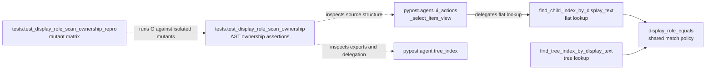

# PYPOST-1236: Pin display-value ownership regression coverage

## Research

The current implementation places the shared DisplayRole equality policy and both flat and
recursive lookup helpers in `pypost/agent/tree_index.py`. The ownership suite parses that module
and `pypost/agent/ui_actions.py` with Python's standard `ast` module; it does not require Qt
objects or a display server. The existing PYPOST-1041 repro establishes synthetic source mutants
as the repository pattern for proving that architectural checks fail for a targeted violation.

Python documents `ast.parse` as the source-to-AST entry point and `ast.walk` as a recursive
descendant traversal helper, which supports the existing hermetic inspection approach:
[Python `ast` documentation](https://docs.python.org/3/library/ast.html).

The requirements restrict this task to regression coverage. Production lookup behavior, public
runtime APIs, and user-facing diagnostics are therefore unchanged. The architecture extends the
test fixture/mutant boundary only.

## Architecture

### Module diagram

### Responsibilities

| Component | Responsibility | Change in this task |
| --- | --- | --- |
| `pypost.agent.tree_index` | Owns the canonical display-value match, flat sibling lookup, recursive tree lookup, and explicit exports. | None |
| `pypost.agent.ui_actions` | Delegates item-view text selection to the flat lookup helper. | None |
| `tests/test_display_role_scan_ownership.py` | Defines structural ownership assertions and condition-specific assertion messages. | Strengthen/clarify assertions as Step 4 work |
| `tests/test_display_role_scan_ownership_repro.py` | Supplies deterministic synthetic source variants and proves each ownership assertion catches its targeted mutant. | Add or extend in Step 3 |
| `ai-tasks/PYPOST-1236/*.md` | Records requirements, architecture, and workflow evidence. | This artifact only |

### Dependencies and interfaces

The test layer depends on source files as UTF-8 text and on `ast.parse`, `ast.walk`, and pytest.
It must not import or execute the production lookup module while constructing mutants. The
ownership suite's `_parse(path: Path)` seam reads `path.read_text(encoding="utf-8")` and passes
the source to `ast.parse`. The repro harness monkeypatches the module-level `_parse` callable in
`tests.test_display_role_scan_ownership`: it returns a parsed mutant AST when the requested path
is `_TREE_INDEX` and delegates to the real `_parse` for other paths. This preserves the actual
interface while substituting synthetic source for one module at a time.

The relevant production interfaces remain unchanged:

- `display_role_equals(index, text) -> bool` is the single display-value comparison owner.
- `find_child_index_by_display_text(model, text, parent=None) -> QModelIndex | None` performs a
  direct-child scan and delegates comparison to the shared owner.
- `find_tree_index_by_display_text(tree, text) -> QModelIndex | None` performs depth-first tree
  traversal and delegates comparison to the shared owner.
- `_select_item_view(...)` delegates flat text selection to
  `find_child_index_by_display_text` without owning a second display comparison.
- `tree_index.__all__` explicitly exports the shared matcher and both lookup helpers.

The test interfaces are condition-oriented rather than runtime APIs. The existing aggregate test
will retain its public pytest entry point, but its checks will be exposed as three private,
independently invocable assertion helpers. The aggregate test will parse the real modules once and
call each helper with the relevant ASTs. The repro harness will call one helper at a time after
monkeypatching `_parse`, so a mutant can target exactly one condition without relying on another
assertion to fail first.

Each assertion must identify one contract condition and use the exact diagnostic substring shown
below:

| Condition | Isolated mutant | Required diagnostic |
| --- | --- | --- |
| AC-1 flat shared ownership | Flat helper compares DisplayRole inline and bypasses the shared matcher. | `find_child_index_by_display_text must call display_role_equals instead of inlining DisplayRole comparison` |
| AC-2 flat no duplicate ownership | Flat path performs the shared comparison plus a second local display comparison. | `find_child_index_by_display_text must not compare ItemDataRole.DisplayRole inline; use display_role_equals` |
| AC-4 tree shared ownership | Tree path performs an inline comparison while preserving other tree checks. | `find_tree_index_by_display_text must call display_role_equals instead of inlining DisplayRole comparison` |

The matrix must run each mutant independently against the relevant ownership assertion. A mutant
may not combine flat delegation and duplicate-comparison violations, and the tree mutant must not
reuse the flat diagnostic. The expected outcome is a failing assertion with the row's diagnostic,
not a successful lookup result; this proves structural ownership even when runtime output remains
correct.

### Architectural rationale

- **Static AST inspection:** Ownership is a source-structure contract, so AST inspection detects
  bypasses that ordinary lookup examples can miss. It is deterministic, fast, and independent of
  GUI lifecycle state.
- **Mutation testing:** Synthetic source makes each acceptance condition observable and prevents
  one broad assertion from masking another. Mutants are parsed in memory and never written to
  production paths.
- **Single-owner policy:** Keeping matching in `display_role_equals` prevents flat and tree
  traversal from developing divergent comparison behavior.
- **No production dependency changes:** The task is test-only and preserves runtime behavior,
  APIs, performance expectations, and user-facing behavior.

## Implementation Plan

Step 3 will add a bounded, deterministic red repro under `tests/` before changing the ownership
suite. The design is:

1. Refactor the aggregate ownership test into independently invocable helpers for flat
   delegation, flat duplicate comparison, and tree shared ownership. Parse each requested source
   through `_parse(Path)`, preserving the existing UTF-8 source-reading seam.
2. Define three minimal in-memory `tree_index` source mutants, changing one ownership axis per
   mutant while retaining all unrelated structure and valid Python syntax.
3. Monkeypatch the module-level `_parse` seam so only `_TREE_INDEX` receives the selected mutant,
   then invoke only the relevant assertion helper. Wrap the invocation in
   `pytest.raises(AssertionError)` and match the exact diagnostic substring from the table,
   proving the assertion fails for the intended reason.
4. Include a control source variant that satisfies the contract and verify it does not produce a
   false failure. Keep all scenarios free of Qt instantiation, network access, retries, and
   unbounded waits; retain the repository timeout marker.

The sequence is: write and run the red repro with `make test`, then in Step 4 update the ownership
suite until all three mutant cases fail with their distinct diagnostics and the compliant control
case passes. Existing export and tree traversal checks remain covered. No production source or
runtime test behavior is changed by this architecture step.

## Q&A

**Q: Why does the repro inspect source rather than execute lookup behavior?**

A: The acceptance conditions concern ownership boundaries. Static inspection can detect duplicate
or bypassed comparison logic even when the final index returned by a mutant is correct.

**Q: Why are the mutants independent?**

A: AC-1, AC-2, and AC-4 must be independently pinned. Combining violations would allow one failure
to hide a missing assertion for another condition.

**Q: What is the runtime impact?**

A: None. The planned changes are test-only, parse small source strings in memory, and use the
existing bounded fast-suite conventions.

**Q: What is the Step 2 status?**

A: The architecture artifact is recorded and the roadmap remains `[/]` until the acceptance gate
owner reviews it.
