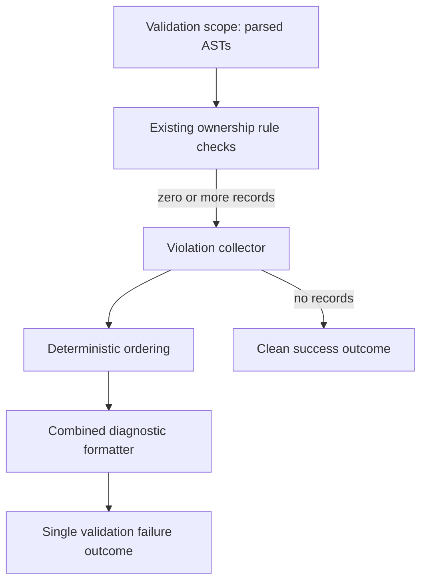

# PYPOST-1237: Aggregate DisplayRole ownership violations

## Research

The current ownership guard is implemented in
`tests/test_display_role_scan_ownership.py`. It parses the production AST and
uses independent assertions for the flat finder, tree finder, and duplicate
`DisplayRole` ownership checks. Those assertions currently stop at the first
failure within the aggregate test.

The existing test contract and the requirements are the source of truth for
which conditions are violations. The design keeps those conditions unchanged
and changes only collection and presentation. Pytest supports a custom
assertion message, including multiline output, which is suitable for exposing
one readable combined diagnostic in the final failure result. See the
[pytest assertion reporting documentation](https://docs.pytest.org/en/stable/how-to/assert.html).

## Implementation Plan

Step 3 will add a red, test-only regression repro before any implementation
change. The repro will exercise the validator with a bounded synthetic scope
containing multiple independent ownership violations. It will verify that one
failure result contains every diagnostic, in stable order, and that the first
violation does not suppress later diagnostics.

Step 3 will also cover a single-violation scope and a clean scope. The clean
scope must pass without ownership diagnostics. The repro will use in-memory
or temporary source representations at the existing parser seam, with no Qt
process, filesystem-wide scan, network service, or unbounded retry. It will
remain a red test until Step 4 introduces the aggregation boundary.

The intended sequence is:

1. Define the failing multi-violation, single-violation, and clean controls.
2. Review and accept the deterministic red repro.
3. Implement the collector and one-result presentation in the existing test
   validator.
4. Run the focused repro and existing ownership tests until green.

## Architecture

### Scope and pattern

This is a test-only validation architecture. It uses a collect-then-present
pattern: each existing ownership rule contributes zero or more structured
violation records; a coordinator combines them; one final assertion reports
the complete ordered collection. Production lookup behavior, public APIs, and
DisplayRole ownership rules remain unchanged.

### Module diagram



### Modules and responsibilities

| Module or component | Responsibility |
| --- | --- |
| Existing AST parser seam | Read the bounded source inputs already used by the guard. |
| Existing ownership checks | Evaluate each unchanged flat/tree ownership condition. |
| Violation record | Carry rule identity, lookup context, and diagnostic text. |
| Violation collector | Run all checks and retain every discovered record. |
| Ordering policy | Preserve a fixed rule/context order for repeatable output. |
| Diagnostic formatter | Render all records into one readable failure message. |
| Aggregate validator | Pass on an empty collection; fail once when it is non-empty. |

### Dependencies and interfaces

Dependencies point from orchestration toward existing checks; no production
module is changed or made dependent on the test validator.

```text
AST input -> ownership checks -> ViolationRecord[] -> formatter -> result
                                     |
                                     +-> no records: success
```

The Step 4 implementation should preserve the following logical interfaces:

- `SourceUnit(path: Path, context: str, tree: ast.Module)`: identifies one
  bounded AST input. The aggregate scope contains the units in this order:
  `flat`, `tree-duplicate`, and `tree-ownership`.
- `ValidationScope(units: tuple[SourceUnit, ...])`: is the complete test-side
  validator input. It contains only the selected bounded AST units; the
  validator reads `tree` for inspection and `path`/`context` for identity.
- `ViolationRecord(rule: str, context: str, path: Path, detail: str,
  source_order: int)`: is one immutable test-side record. `detail` retains
  the existing individual diagnostic wording, while `source_order` is the
  integer position of the source unit in the scope.
- `check_<rule>(scope: ValidationScope) -> Iterable[ViolationRecord]`:
  evaluates one existing ownership condition without terminating the overall
  validation run.
- `collect_violations(scope) -> list[ViolationRecord]`: invokes every check,
  concatenates all records, and applies the stable ordering policy.
- `format_violations(records) -> str`: includes each record's rule identity,
  lookup context, and existing diagnostic detail.
- `validate_scope(scope) -> success or one failing outcome`: succeeds when the
  collection is empty and otherwise emits one combined diagnostic.

The exact Python names may follow the existing test module conventions in Step
4. The observable contracts above are required; no production API expansion is
part of this task.

For the Step 3 fixtures, the parser seam has an explicit input-to-scope
mapping. The monkeypatched `_parse(path: Path)` returns
`ast.parse(fixture_by_path[path], filename=str(path))`. After parsing, the
aggregate test constructs the following scope, preserving both the path and
context label for every result:

```text
parsed_by_path = {path: _parse(path) for path in fixture_by_path}
ValidationScope(units=(
    SourceUnit(Path("flat.py"), "flat", parsed_by_path[Path("flat.py")]),
    SourceUnit(Path("tree_duplicate.py"), "tree-duplicate",
               parsed_by_path[Path("tree_duplicate.py")]),
    SourceUnit(Path("tree_ownership.py"), "tree-ownership",
               parsed_by_path[Path("tree_ownership.py")]),
))
```

The scan wrapper requests those exact three paths from `_parse`; scope
construction pairs each returned AST with its fixed context label. Separate
AST modules therefore preserve both tree violations while records identify
which fixture produced each diagnostic.

Existing assertion helpers adapt at the test boundary: retain each helper's
current AST predicate and diagnostic text, move its matching branch into a
record-producing function returning `ViolationRecord` values, and keep the
existing assertion helper as a thin compatibility wrapper over those records.
The aggregate validator calls the record-producing functions directly, so an
individual match cannot assert before later helpers run. This changes only
collection/presentation and leaves ownership rules and wording authoritative.

### Diagnostic and ordering contract

Every violation must retain enough identity to distinguish the affected lookup
context and ownership condition, satisfying AC-4. The formatter must preserve
the existing diagnostic wording for each individual violation and combine
records with a clear separator. Ordering must be deterministic: evaluate rules
in the established flat/tree order, then order records within a rule by the
existing source/context order. Do not deduplicate distinct violations.

The aggregate validator has exactly one failure boundary for a non-empty
collection. A check may create multiple records, but no check may raise or
return control in a way that prevents later checks from running. A zero-record
collection produces no violation diagnostics and remains successful.

### Acceptance mapping

| Requirement | Architectural proof |
| --- | --- |
| AC-1 | Collector retains every record from the complete scope. |
| AC-2 | Checks return records; coordinator runs all checks before presenting. |
| AC-3 | Validator has one final failure boundary for non-empty records. |
| AC-4 | Records include rule and lookup-context identity. |
| AC-5 | Empty collection follows the success path with no diagnostics. |
| AC-6 | Existing checks and individual diagnostic text remain unchanged. |

### Concrete Step 3 failing-repro design

Create `tests/test_display_role_scan_ownership_aggregate_repro.py` with a
module-level `pytestmark = pytest.mark.timeout(10)`. The test invokes the
existing AST seam in `tests/test_display_role_scan_ownership.py`: monkeypatch
that module's `_parse(path: Path)` so each request for `_TREE_INDEX` returns
the AST for the fixture path, using
`ast.parse(fixture_by_path[path], filename=str(path))`, then invoke the
aggregate validator entry point exposed by Step 4. The UI-actions parse is not
needed for this repro. The fixtures are in-memory and do not instantiate Qt or
scan the repository.

Use three separately parsed synthetic fixture files, each with one relevant
function. This avoids defining `find_tree_index_by_display_text` twice in one
AST module: `_function_defs()` keys functions by name, so distinct parsed
modules are required for both tree cases to survive parsing.

1. `flat.py` defines `find_child_index_by_display_text` with a direct
   `ItemDataRole.DisplayRole` comparison and no `display_role_equals` call.
   This is the flat delegated-ownership violation.
2. `tree_duplicate.py` defines `find_tree_index_by_display_text` with both a
   `display_role_equals` call and a direct `ItemDataRole.DisplayRole`
   comparison. This is the tree duplicate-inline-ownership violation.
3. `tree_ownership.py` defines `find_tree_index_by_display_text` with its tree
   lookup but without a `display_role_equals` call. This is the independent
   tree delegated-ownership violation and uses the current guard's tree rule,
   rather than inventing a new ownership condition.

The fixture-path mapping must preserve the context labels `flat`,
`tree-duplicate`, and `tree-ownership` when records are collected, even though
the repeated tree function name occurs in separate AST modules. Assert these exact
diagnostic substrings, preserving the existing wording from the ownership
guard:

- `find_child_index_by_display_text must call display_role_equals instead of
  inlining DisplayRole comparison`
- `find_tree_index_by_display_text must not compare ItemDataRole.DisplayRole
  inline; use display_role_equals`
- `find_tree_index_by_display_text must call display_role_equals instead of
  inlining DisplayRole comparison`

The expected order is flat delegated ownership, tree duplicate ownership, then
tree ownership, matching the fixture's rule/context order. The test must call
the aggregate validator once and capture its single failure outcome. It must
assert that the outcome contains all three substrings, each exactly once, in
that order, and that the validator was entered once. This distinguishes one
combined outcome from three separately raised outcomes: a split-outcome mutant
fails because one invocation must yield one captured failure, while a
fail-fast mutant fails because the second and third substrings are absent.

Add two controls in the same file. A one-violation fixture contains only the
flat delegated-ownership defect and must produce exactly the first substring,
with no tree diagnostics. A clean fixture defines the shared helper and both
finder functions using the shared ownership path, and must complete
successfully with no ownership diagnostic. All fixtures must be passed through
the `_parse(Path)` monkeypatch and the same aggregate validator invocation.

The repro remains test-only and bounded, with no production edits, external
services, filesystem-wide scan, sleep, retry, or Qt process. It is expected to
be red before Step 4 because the current validator stops at the first
assertion; it becomes green only when all checks contribute records and one
final failure boundary presents them together.

## Q&A

**Q: Does this alter DisplayRole ownership rules?**

A: No. Existing checks remain authoritative; only their results are collected
and presented together.

**Q: What is the failure boundary?**

A: One final validation failure is produced after all checks have contributed
their records. An empty collection is successful.

**Q: Why retain structured records before formatting?**

A: Structure preserves rule and context identity, enables deterministic ordering,
and prevents later diagnostics from being lost to an early assertion.

**Q: What is out of scope?**

A: Production code, lookup semantics, public interfaces, UI behavior, unrelated
validation domains, logging, metrics, and broad refactoring.
