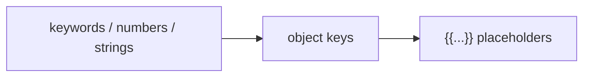

# PYPOST-124: Architecture — variable highlighting in JsonHighlighter

## Summary

Extend `JsonHighlighter.highlightBlock` with a final pass that colors `{{...}}` placeholders
using the shared tokenizer regex. No new widgets or wiring — `RequestEditor` and
`ResponseView` already attach `JsonHighlighter` to their documents.

## Design

### Single change point

| File | Change |
| ---- | ------ |
| `pypost/ui/widgets/json_highlighter.py` | Import `TEMPLATE_PLACEHOLDER_PATTERN`; add `variable_format`; apply after key rule |

### Rule order (per line)

Later rules overwrite earlier formats on overlapping ranges. Placeholders inside `"..."`
values are first colored green by the string rule, then overridden by the variable pass.

### Placeholder detection

- **Source:** `pypost.core.template_expression_tokenizer.TEMPLATE_PLACEHOLDER_PATTERN`
- **Matches:** `{{host}}`, `{{ urlencode(db) }}`, nested function chains per tokenizer
  contract (PYPOST-536).
- **Not used:** `VariableHoverHelper.VARIABLE_PATTERN` (plain-name only); highlighter
  follows full placeholder scanner for parity with hover on function expressions.

### Visual format

| Element | Foreground | Weight |
| ------- | ---------- | ------ |
| Keywords | darkblue | bold |
| Numbers | blue | normal |
| Strings | green | normal |
| Keys | purple | normal |
| Placeholders | darkorange | bold |

### Components unchanged

- `pypost/ui/widgets/request_editor.py` — still `JsonHighlighter(self.body_edit.document())`
- `pypost/ui/widgets/response_view.py` — still `JsonHighlighter(self.body_view.document())`

## Tests

| Test | Asserts |
| ---- | ------- |
| `test_highlights_template_variable_in_string_value` | AC-1 |
| `test_highlights_function_expression_placeholder` | AC-2 |
| `test_variable_highlight_overrides_string_green` | FR-3 / braces not green |
| Existing `TestJsonHighlighter` cases | AC-3 regression |

Assertions use `_hex_color_at` + `QTextLayout.formats()` (PYPOST-103 pattern).

## Traceability

| Requirement | Implementation |
| ----------- | -------------- |
| FR-1, FR-3 | Final `finditer` loop in `highlightBlock` |
| FR-2 | `TEMPLATE_PLACEHOLDER_PATTERN` import |
| FR-4 | Rule order unchanged for non-placeholder JSON |
| AC-1–AC-4 | `tests/test_json_highlighter.py` |
