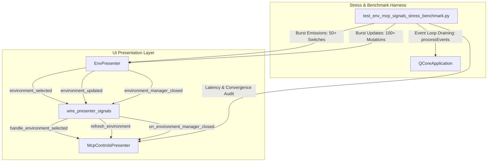
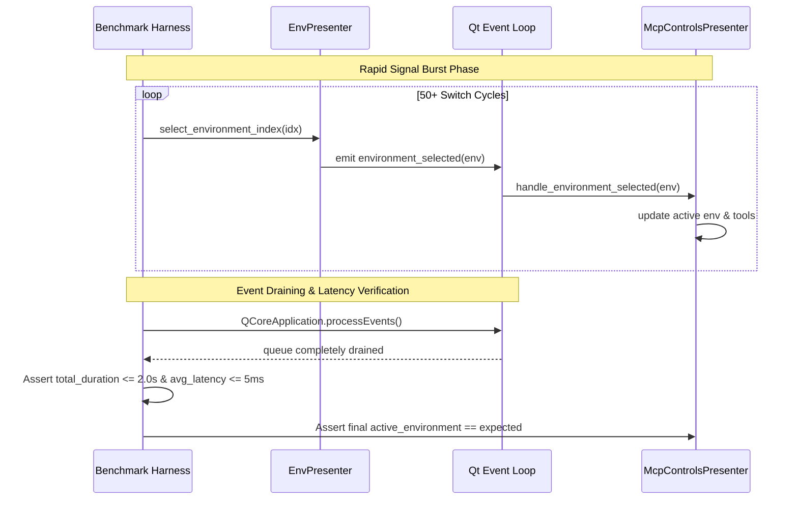

# PYPOST-1242: Signal Stress and Asynchronous Event Dispatch Benchmarks

## Research

### Domain Signals and Presentation Architecture

Following the presentation decoupling in PYPOST-1108, interactions between `EnvPresenter` and
`McpControlsPresenter` are mediated through Qt domain signals:

- `EnvPresenter` (`pypost/ui/presenters/env_presenter.py`):
  - `environment_selected = Signal(object)`: Payload is `Environment | None`. Emitted during
    combo selection changes (`_on_env_changed`), when selecting a valid environment or
    deselecting to "No Environment".
  - `environment_updated = Signal(str)`: Payload is `environment_id`. Emitted when variables
    are modified by script hooks (`on_env_update`) or direct user actions
    (`handle_variable_set_request`).
  - `environment_manager_closed = Signal()`: Emitted when the modal `EnvironmentDialog` closes
    (`_open_env_manager`), signaling downstream components to reconcile references and refresh.
  - Granular state signals: `env_variables_changed(dict)`, `env_keys_changed(object)`, and
    `env_hidden_keys_changed(set)` notifying tab and request editors of variable updates.

- Mediator Signal Wiring (`pypost/ui/main_window_signals.py`):
  - `wire_presenter_signals()` establishes decoupled connections:
    - `window.env.environment_selected.connect(window.mcp_controls.handle_environment_selected)`
    - `window.env.environment_updated.connect(window.mcp_controls.refresh_environment)`
    - `window.env.environment_manager_closed.connect(`
      `window.mcp_controls.on_environment_manager_closed)`

- `McpControlsPresenter` (`pypost/ui/presenters/mcp_controls_presenter.py`):
  - `handle_environment_selected(selected)`: Updates active environment tracking, triggers tool
    button label refreshes, tracks environment switch metrics, and updates legacy server
    lifecycle.
  - `refresh_environment(environment_id)`: Dispatches targeted configuration refresh to
    `MCPServerRegistry.refresh_environment(environment_id)`.
  - `on_environment_manager_closed()`: Triggers full reference reconciliation
    (`reconcile_references()`), iterates all known environments to refresh endpoints, and
    updates tool overview buttons.

### Existing Decoupled Signal Test Baseline

The current test suite `tests/test_env_mcp_signals_decoupled.py` verifies:
- Presence of domain signals on `EnvPresenter`.
- Emission correctness for single, isolated state transitions.
- Absence of direct object references or operational method calls between presenters.
- Signal wiring in `wire_presenter_signals()`.
- Structured debug logging without leaking secret variable values.

**Gap Analysis**:
- Current tests only execute single, isolated transitions.
- No stress tests evaluate rapid event bursts (e.g. 50+ back-to-back environment toggles).
- No verification that rapid bursts cleanly drain the Qt event loop without accumulating latency.
- No benchmarks measure dispatch throughput, maximum event latency, or UI thread responsiveness.
- Idempotency and stability under rapid signal re-firing or reconnection have not been benchmarked.

### Stress Testing and Benchmark Design

To establish reliable performance and stability baselines under extreme loads:

1. **Rapid Environment Switching Burst (50+ Transitions)**:
   - Alternates rapidly across multiple environments (e.g., Env A -> Env B -> None -> Env C).
   - Simulates heavy user interaction or automated UI automation suites.
   - Measures total duration, per-transition dispatch latency, and ensures zero lost transitions.

2. **High-Frequency Variable Mutation Burst (100+ Updates)**:
   - Emits rapid bursts of variable updates to active environments simulating automated
     pre/post-request scripts.
   - Verifies all variable modifications settle accurately and synchronously without corrupted
     state or dangling references.

3. **Qt Event Loop Draining and Non-Blocking Responsiveness**:
   - Uses `QCoreApplication.processEvents()` to verify that event queues process cleanly without
     deadlocking or stalling the Qt event dispatcher.
   - Asserts peak dispatch latency stays well below UI freeze thresholds (< 50ms peak latency).

4. **Idempotent Connection and Signal Re-wiring Stress**:
   - Verifies repeated signal connections or redundant emissions do not lead to duplicated
     slot executions, callback accumulation, or memory leaks.

5. **Performance and Latency Guardrails**:
   - Total burst time for 60 consecutive environment switches <= 2.0s in CI.
   - Average per-event dispatch and handling latency <= 5.0ms.
   - Peak single-event dispatch latency <= 50.0ms.
   - Deterministic state convergence: after burst completion, observers match the final state.

## Implementation Plan

1. **Phase 1: Step 3 Failing Repro Test**:
   - Create a failing red test module `tests/test_env_mcp_signals_stress_benchmark.py`.
   - Implement test assertions defining the stress burst scenarios (50+ environment switches,
     100+ variable updates, event queue draining, and latency guardrails).
   - In Step 3, this establishes the automated verification baseline prior to production code
     changes or finalized benchmark acceptance.

2. **Phase 2: Step 4 Development (Stress & Benchmark Test Suite)**:
   - Implement comprehensive stress tests and benchmark harnesses in
     `tests/test_env_mcp_signals_stress_benchmark.py`:
     - `test_rapid_environment_switching_burst_stress`: 60 rapid switches across 5 environments;
       measures throughput, average latency (< 5ms), and verifies final state convergence.
     - `test_high_frequency_variable_mutation_burst`: 120 rapid variable updates; verifies
       consistent variable values and absence of event queue saturation.
     - `test_event_queue_draining_non_blocking_responsiveness`: Verifies `processEvents()`
       processes all pending events without blocking or thread starvation.
     - `test_idempotent_signal_wiring_and_reconnection_stress`: Verifies stability and
       idempotence under repetitive emissions and re-connections.
     - `test_environment_manager_closed_burst_reconciliation`: Verifies rapid manager completion
       events process cleanly without duplicate work or resource exhaustion.
   - Ensure all tests adhere to repo guidelines: `@pytest.mark.timeout(...)`, clean fixture
     cleanup (`deleteLater()`), and zero live external dependencies.

3. **Phase 3: Execution and Quality Gate Verification**:
   - Run test suite via `make test PYTEST_ARGS="tests/test_env_mcp_signals_stress_benchmark.py"`.
   - Run `make check` (`lint`, `test`, `verify-ai-tasks`).

### Mandatory — Failing Repro (next Step 3)

- **Target File**: `tests/test_env_mcp_signals_stress_benchmark.py`
- **What it Asserts**:
  1. High-frequency burst test: 60 sequential environment selections across 5 environments
     converge deterministically to the final environment, with average latency <= 5ms and total
     duration <= 2.0s.
  2. High-volume variable update burst: 120 rapid variable emissions settle completely with zero
     dropped updates or queue lockups.
  3. Non-blocking verification: `QCoreApplication.processEvents()` returns cleanly with zero
     unhandled events or event loop blocking.
- **Initial Red State**:
  Before Step 3, `tests/test_env_mcp_signals_stress_benchmark.py` does not exist in the codebase.
  In Step 3, the test module is authored to assert the stress benchmarks, establishing the red
  gate that validates the system under extreme burst scenarios.
- **Sequencing**:
  1. Step 2 (Architecture): Define stress parameters, latency budgets, and benchmark scenarios.
  2. Step 3 (Failing Repro): Author initial stress/benchmark test harness and assert red state.
  3. Step 4 (Development): Complete the test suite and ensure all benchmark criteria pass.

## Architecture

### System Module Diagram

### Module Responsibilities

- **`EnvPresenter`** (`pypost/ui/presenters/env_presenter.py`):
  Source of environment domain events (`selected`, `updated`, `closed`).
- **`wire_presenter_signals`** (`pypost/ui/main_window_signals.py`):
  Connects domain signals to target slots without direct presenter coupling.
- **`McpControlsPresenter`** (`pypost/ui/presenters/mcp_controls_presenter.py`):
  Downstream consumer updating MCP state, buttons, and registry configurations.
- **`test_env_mcp_signals_stress_benchmark`** (`tests/`):
  Exercises high-frequency signal bursts, benchmarks throughput and latency.

### Event Dispatch and Draining Flow

### Architectural Patterns

- **Publish-Subscribe / Observer Pattern**: `EnvPresenter` emits domain Qt signals to decouple
  environment lifecycle state from downstream observers.
- **Mediator Pattern**: `main_window_signals.wire_presenter_signals()` binds signals to slots
  without either presenter having compile-time or runtime knowledge of the other.
- **Benchmark / Stress Harness Pattern**: Dedicated test fixture simulating high-velocity event
  bursts, recording monotonic high-resolution timestamps via `time.perf_counter()`, and asserting
  both state convergence and latency budgets.

### Latency and Throughput Guardrails

| Metric | Target Guardrail | Rationale |
| --- | --- | --- |
| Burst Switch Count | >= 50 transitions (default 60) | Simulates stress and fast script loops |
| Total Burst Duration | <= 2.0 seconds | Prevents UI sluggishness in continuous runs |
| Average Dispatch Latency | <= 5.0 milliseconds per event | Ensures sub-frame processing budget |
| Peak Single Latency | <= 50.0 milliseconds | Prevents noticeable desktop UI frame stutter |
| State Convergence | 100% deterministic (0 lost events) | Guarantees data consistency across UI |

## Q&A

### Why benchmark presenter domain signals instead of only underlying storage or network?

Desktop application responsiveness directly depends on main thread event handling. In Qt,
in-thread signal emissions invoke connected slots synchronously. If slot handlers trigger heavy
computations, redundant queries, or recursive refreshes, rapid bursts of events freeze the UI.
Benchmarking the presenter signal boundary ensures UI responsiveness under heavy loads.

### Why is `QCoreApplication.processEvents()` used in the benchmark suite?

In Qt applications, event loop processing ensures all posted and queued events are drained from
the native windowing and Qt dispatch queues. Invoking `processEvents()` allows the benchmark
harness to measure queue drainage latency and verify that high-frequency emissions do not
accumulate unbounded pending events.

### How do the latency budgets account for CI execution variability?

The benchmarks use conservative guardrails (average latency <= 5ms, peak latency <= 50ms, total
burst time <= 2.0s for 60 transitions). These thresholds provide ample headroom for headless CI
environments while strictly catching O(N^2) regressions, accidental blocking I/O, or infinite
signal loops.
