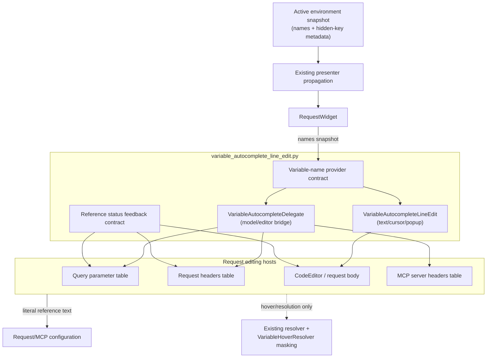

# PYPOST-1243: Reusable variable autocomplete editing capability

## Research

The current `VariableAutocompleteLineEdit` and `VariableAutocompleteDelegate` live in
`pypost/ui/widgets/mcp_server_headers_table.py`. The delegate depends on the concrete MCP
headers table, while `RequestWidget.set_variables()` already propagates an environment
snapshot to query parameters, request headers, and the body editor.

Existing ownership boundaries are retained: key/value tables own model serialization and key
validation; `CodeEditor` owns body formatting, folding, and syntax validation; existing hover
and template-resolution services own values and sensitive-value masking.

Qt's item-view architecture supports this extraction through a custom
`QStyledItemDelegate`; `QLineEdit.textEdited` is appropriate for user-triggered completion
without reacting to programmatic model population.

- [QStyledItemDelegate, Qt for Python](https://doc.qt.io/qtforpython-6/PySide6/QtWidgets/QStyledItemDelegate.html)
- [QLineEdit, Qt for Python](https://doc.qt.io/qtforpython-6/PySide6/QtWidgets/QLineEdit.html)

## Implementation Plan

1. Move the two reusable classes to
   `pypost/ui/widgets/variable_autocomplete_line_edit.py`, preserving trigger detection,
   filtering, popup navigation, insertion formatting, and dismissal behavior.
2. Replace the MCP definitions with compatibility imports/re-exports and make the delegate
   consume a variable-name provider rather than an MCP-specific parent type.
3. Install the delegate for variable-capable query-parameter and request-header value cells;
   retain their existing serialization and request-construction paths.
4. Connect the same completion contract to the multiline `CodeEditor` body host at its
   cursor, while leaving body formatting, folding, validation, and persistence unchanged.
   The host contract accepts complete body text and a cursor offset, and returns a replacement
   range plus formatted reference for `CodeEditor` to apply.
5. Feed all hosts from the existing presenter-driven active-environment snapshot. Completion
   receives names only; values and `hidden_keys` remain in existing resolver/hover services.
6. Revalidate existing references when the environment changes and publish visible status
   feedback for empty, incomplete, and unavailable references. Preserve literal text, multiple
   references, and surrounding content in query parameters, headers, and request bodies.

**Mandatory — Failing Repro (next Step 3):** Add red automated tests before production
changes. Import the extracted classes from the new module, verify the MCP compatibility path
if retained, and cover `{{` triggering, case-insensitive filtering, keyboard/mouse selection,
non-terminal insertion, multiple references, and popup dismissal. Add query-parameter,
header, and body host tests using a local environment snapshot, including environment
switching and incomplete/unavailable feedback. Assert that sensitive values never appear in
candidates, inserted text, feedback, or captured logs. The tests should fail in Step 3 because
the module and shared host wiring do not yet exist; no live network dependency is needed.

## Architecture

### System module diagram



### Components and responsibilities

| Component | Responsibility | Boundary |
| --- | --- | --- |
| `VariableAutocompleteLineEdit` | Detect, filter, display, select, and insert `{{ VAR }}`. | Receives names only; never resolves or displays values. |
| `VariableAutocompleteDelegate` | Create editors and bridge Qt `EditRole` data. | Depends on a provider, not `McpServerHeadersTable`. |
| Variable-name provider | Supply sorted names and update active editors. | Does not expose environment values. |
| Reference status service/sink | Classify references and publish safe visible feedback. | Publishes status and reference name only; never values. |
| Query/header table adapters | Install the delegate and preserve model serialization. | Key validation and request construction remain local. |
| MCP headers adapter | Reuse shared classes and retain MCP table behavior. | Preserve existing MCP imports during migration. |
| Body editor adapter | Apply the completion contract to the multiline body cursor. | `CodeEditor` retains formatting, folding, validation, and persistence. |
| `RequestWidget` / presenter path | Push the environment snapshot to request hosts. | No direct environment signal subscriptions. |
| Existing resolver/masking services | Resolve references in established hover, preview, and send flows. | Values and `hidden_keys` never enter autocomplete. |

### Interfaces

Use a narrow Python protocol/duck-typed boundary:

```python
class VariableNameProvider(Protocol):
    def variable_names(self) -> Sequence[str]: ...

    def set_variable_names(self, names: Iterable[str]) -> None: ...
```

The shared host contract is implemented by each variable-capable host:

```python
class VariableReferenceStatus(TypedDict):
    kind: Literal["empty", "incomplete", "unavailable"]
    span: tuple[int, int]
    message: str


class VariableReferenceFeedbackSink(Protocol):
    def show_reference_feedback(
        self, statuses: Sequence[VariableReferenceStatus]
    ) -> None: ...


class VariableCompletionHost(Protocol):
    def complete_at_cursor(
        self, text: str, cursor_offset: int
    ) -> tuple[int, int, str] | None: ...

    def refresh_reference_status(self, text: str) -> None: ...
```

`complete_at_cursor` replaces only the incomplete reference at the supplied cursor. Query
parameter and header adapters pass the current value-cell text and commit the returned literal
text through their existing models. The body adapter passes the complete multiline document and
`CodeEditor` cursor offset, then applies the returned range through the editor's document API;
newlines, text after the cursor, and other references remain untouched. Each adapter connects
`refresh_reference_status` to its visible cell/document validation presentation, so every host
uses the same feedback sink for the three status kinds. An empty reference publishes “variable
name is missing,” an incomplete reference publishes “variable reference is unfinished,” and an
unavailable name publishes “variable is unavailable,” with the reference name but no value.

The shared editor keeps the existing public operations: `set_variables`,
`trigger_autocomplete`, `apply_completion`, `dismiss_popup`, `current_candidates`, and
`is_popup_visible`. The delegate accepts a provider and configurable variable columns,
defaulting to the current value column. Newly created editors receive the current snapshot;
the host refreshes active editors when the environment changes. The query-parameter table,
request-header table, and multiline request-body host all invoke the same completion and feedback
interfaces; the MCP adapter remains compatible through the table-host path.

### Data flow

1. The presenter pushes active-environment names through the existing `RequestWidget` path;
   hidden-key metadata remains separate.
2. Each query-parameter and header table host updates its provider and rechecks every value cell.
   The body host updates the same name source and rechecks every reference in its multiline
   document, while retaining its current cursor position.
3. Typing `{{` or a name prefix causes the shared editor to inspect only text before the
   cursor and perform case-insensitive prefix matching.
4. Selection replaces only the incomplete trigger and adjacent closing delimiters, inserts
   `{{ VAR }}`, and preserves unrelated prefix/suffix text.
5. The host commits literal reference text to its model/document. Existing resolution later
   interprets it unchanged.
6. The shared status service scans each host's literal text and sends statuses to that host's
   feedback sink. Empty `{{ }}`, incomplete `{{ VAR`/`{{ VAR }`, and unavailable `{{ MISSING }}`
   are visibly identified in query-parameter cells, header cells, and the body document. An
   environment update repeats this scan for all three hosts, refreshing both suggestions and
   statuses without changing valid literal text. No value is rendered; existing masking remains
   authoritative.

### Compatibility and scope boundaries

- Keep the old MCP module's import surface as compatibility re-exports during extraction.
- Preserve `Up`/`Down`, `Enter`/`Return`/`Tab`, `Escape`, focus-loss, and hide-event behavior;
  dismissing the popup must not cancel or unexpectedly commit cell editing.
- Empty or unavailable candidate lists hide the popup and leave text unchanged.
- Existing header formatting, environment switching, request construction, resolution rules,
  and sensitive-variable handling remain unchanged.
- Candidate limits/indexing (PYPOST-1244), theme and popup styling (PYPOST-1245), and
  platform/focus/IME coverage (PYPOST-1246) are explicitly deferred.

## Q&A

### Why use a provider instead of passing `Environment`?

The same editor serves table cells and a multiline body. A name-only provider keeps it
independent of environment, MCP, and request models while fitting the existing snapshot flow.

### How are sensitive variables protected?

Autocomplete receives and inserts only names/reference text. Resolver and hover services retain
values and `hidden_keys`; feedback never displays values.

### What is the acceptance gate?

Step 2 requires review and approval of this architecture before Step 3. This step creates no
production code or tests and leaves its roadmap marker in progress.
