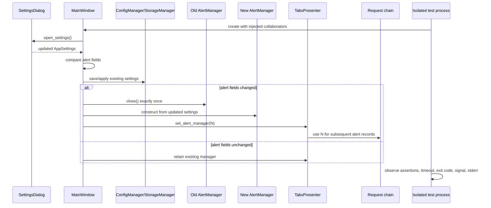

# PYPOST-1251: Resolve MainWindow alert-reload test SIGSEGV

## Research

The existing alert reload path is a synchronous Qt-main-thread composition-root
operation:

1. `MainWindow.open_settings()` obtains a new `AppSettings` from
   `SettingsDialog` and compares the three alert fields.
2. On a change, `MainWindow._reload_alert_manager()` closes the current
   `AlertManager`, constructs a replacement from the saved settings, and calls
   `TabsPresenter.set_alert_manager()`.
3. `AlertManager` owns a `RotatingFileHandler`; `close()` closes and removes
   that handler. `emit()` writes JSON records and may perform webhook delivery.
4. Requests reach the manager through `TabsPresenter`/`RequestWorker`/
   `RequestService`, so the active manager must remain the sole consumer after
   replacement.

The primary behavioral seam is already covered by
`tests/test_main_window_alert_reload.py`: changed webhook settings, unchanged
settings, consumer propagation, and records before and after a log-path change.
`tests/test_settings_alert_main_window_e2e.py` covers persistence through the
settings dialog. Existing crash evidence in `doc/dev/agent_dialog_settle.md`
and `doc/dev/gui_batch_segfault.md` shows that native failures must be judged
from the child process return code, not from assertions printed before a crash.
Those documents establish the repository convention of `QT_QPA_PLATFORM=offscreen`,
`PYTHONFAULTHANDLER=1`, bounded timeouts, and isolated child pytest processes
for GUI crash evidence.

No ownership conclusion is assumed at this stage. Step 3 must first establish
whether the alert reload lifecycle reproduces the reported crash in the
available supported environment and must preserve the distinction between a
Python assertion failure, a timeout, and a native signal termination.

## Implementation Plan

Step 3 will add a deterministic, timeout-bounded repro at the existing
`tests/test_main_window_alert_reload.py` lifecycle seam or in a narrowly named
sibling test module. It will construct the window with injected managers,
drive changed and unchanged settings without network access, emit records on
both sides of a destination change, and run the scenario in an isolated child
process when native teardown must be observed. The parent test will assert the
child return code and include stdout/stderr tails, signal information, and
environment metadata in a failure message. The test will not convert a crash
to an xfail or ignore a non-zero child result.

The implementation decision after the red repro is evidence-driven:

- If a PyPost-owned lifecycle defect is reproduced, Step 4 will make the
  smallest fix at the identified ownership boundary while preserving the
  existing reload and record-routing contracts.
- If only a runtime/environment crash is reproduced, Step 4 will add or reuse
  bounded process isolation and record an evidence-backed limitation and
  supported-environment guidance. It will not claim that an unverified
  upstream suspicion is a fix.
- If bounded supported attempts do not reproduce the crash, final evidence
  will state the exact environment, attempts, limits, and that the issue is
  classified rather than silently declared fixed.

**Mandatory — Failing Repro (next Step 3):** Add a red automated test before
changing production code. Use a fresh child process with offscreen Qt and
faulthandler enabled for the complete alert reload lifecycle. The fixture
should inject a fake config manager and tabs presenter, use temporary old and
new log paths, emit a `before-reload` and `after-reload` payload, and exercise
both changed and unchanged settings. Assert the desired lifecycle outcomes
and the child exit status. Keep the test module-level timeout at the
repository-required bound and make the clean control pass; the red condition
must be the missing or unsafe crash-boundary behavior, not an absent fixture,
live webhook, or an unconditional expectation of a crash.

## Architecture

### Components and responsibilities

| Component | Responsibility in this task | Boundary |
| --- | --- | --- |
| `SettingsDialog` / `AppSettings` | Produce and carry persisted alert fields | Input values only; no lifecycle ownership |
| `MainWindow` | Compare old/new fields and orchestrate replacement | Qt main-thread lifecycle coordinator |
| `AlertManager` | Own one log handler and optional webhook configuration; close and emit | Resource owner with explicit `close()` |
| `TabsPresenter` and request chain | Receive active manager and pass it to future workers | Consumer propagation interface |
| `ConfigManager` / `StorageManager` | Persist settings and complete existing save prerequisites | Existing infrastructure; unchanged semantics |
| Repro harness/test child | Execute bounded lifecycle and classify process outcome | OS-process boundary for native crash detection |
| Crash evidence artifact | Record environment, phase, return code/signal, and conclusion | Developer-facing diagnostic output |

### Module interaction

### Interfaces and invariants

- `MainWindow._alert_settings_changed(previous: AppSettings, updated:
  AppSettings) -> bool` remains the predicate for the three alert fields.
  Unrelated settings must not trigger replacement.
- `MainWindow._reload_alert_manager() -> None` consumes `self.settings`,
  closes the prior manager if present, creates one replacement with `log_path`,
  `webhook_url`, and `webhook_auth_header`, then publishes that exact instance
  via `self.tabs.set_alert_manager(...)`.
- `AlertManager.close() -> None` is the resource-release contract. After the
  boundary, the old manager must not receive records and its handler must not
  remain attached. The replacement accepts `AlertPayload` through
  `emit(payload)` and routes records only to its configured destination.
- `TabsPresenter.set_alert_manager(alert_manager: AlertManager | None) ->
  None` is the consumer propagation contract. Future request workers resolve
  the replacement manager through presenter state.
- The crash harness returns command, environment (OS, Python, PySide6/Qt, QPA),
  duration, timeout flag, return code, signal name, and bounded stdout/stderr
  tails. A negative subprocess return code is native termination and always a
  failure classification.

### Selected patterns and rationale

- **Composition-root orchestration:** `MainWindow` already owns the settings
  transition and is the narrowest correct place to coordinate replacement.
- **Explicit resource ownership:** `AlertManager.close()` provides a visible
  release point for the file handler, essential when diagnosing deferred
  Qt/Python teardown.
- **Dependency injection:** Existing manager injection and presenter seams make
  tests deterministic without real servers, webhooks, or fixed filesystem paths.
- **Process isolation for native diagnostics:** A child process prevents a
  SIGSEGV from corrupting the test runner and makes the OS-level result
  observable. It is diagnostic containment, not permission to hide a crash.
- **Evidence-based classification:** Functional assertions and process outcome
  are evaluated together so behavior cannot mask native instability.

### Acceptance mapping

| Requirement | Architectural coverage |
| --- | --- |
| Reproduce/classify ownership | Isolated child harness plus structured environment and signal evidence |
| Preserve changed-settings reload | Existing predicate and replacement sequence |
| Avoid unchanged reload | Explicit unchanged branch and existing mock seam |
| Route records correctly | Old-manager close, replacement publication, and two temporary log paths |
| Identify boundary/environment | Phase-labelled child report and bounded subprocess outcome |
| Provide regression or limitation | Step 3 red repro followed by evidence-driven Step 4 and docs |
| Preserve compatibility/scope | No changes to settings meaning, webhook protocol, or unrelated alert paths |

## Q&A

- **Q: Should the architecture assume the crash is caused by `AlertManager`?**
  **A:** No. Candidate boundaries are manager replacement, Qt dialog teardown,
  and test-process teardown. Ownership is a Step 3/4 conclusion.
- **Q: Why use a child process if existing tests are green?**
  **A:** Assertions can pass before a native process crash, so the child return
  code and signal are part of the reliability contract.
- **Q: Are real webhooks or a new alert delivery design required?**
  **A:** No. Network delivery is out of scope; injected managers and temporary
  log destinations cover routing deterministically.
- **Q: What is deliberately unchanged?**
  **A:** Alert settings semantics, record schema, retry behavior, and the
  existing consumer propagation path remain compatibility constraints.
