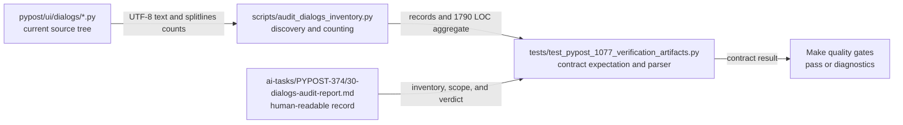

# PYPOST-1252: Synchronize the dialog-audit inventory

## Research

### Governing inputs

- Accepted requirements: [`10-requirements.md`](10-requirements.md).
- Jira issue: [PYPOST-1252](https://pypost.atlassian.net/browse/PYPOST-1252).
- Inventory: [`audit_dialogs_inventory.py`](../../scripts/audit_dialogs_inventory.py).
- Contract test: `tests/test_pypost_1077_verification_artifacts.py`.
- Audit report: [`PYPOST-374/30-dialogs-audit-report.md`](../PYPOST-374/30-dialogs-audit-report.md).

### Current source-authoritative evidence

The inventory script is the measurement authority. It discovers Python files under
`pypost/ui/dialogs/`, excludes `__init__.py`, reads UTF-8 text, and counts physical lines with
`splitlines()`. `total_loc()` sums the discovered records. The current checkout establishes this
tuple:

| Fact | Current source-authoritative value | Stale frozen value |
| --- | ---: | ---: |
| Discovered dialog modules | 9 | 9 |
| `settings_dialog.py` | 263 LOC | 260 LOC |
| `mcp_servers_dialog.py` | 486 LOC | 486 LOC |
| Full aggregate | 1790 LOC | 1787 LOC |

The three-line difference is fully accounted for by `settings_dialog.py`. The MCP server dialog
already matches its 486-LOC record and is preserved as out of scope. The existing offline contract
test parses the report's Module Inventory and Testability summary, so the test and report form one
coherence boundary around the source inventory.

The design also retains ordinary `pytest` assertion diagnostics for the red repro. The
[pytest assertion documentation](https://docs.pytest.org/en/stable/how-to/assert.html) describes
the standard assertion and failure-introspection behavior used by the existing test module.

## Implementation Plan

This is a mechanical synchronization of existing audit artifacts. It introduces no runtime
abstraction, new dependency, audit-policy change, or production dialog change.

1. **Step 3 — red repro.** Run the existing offline contract test
   `test_dialog_audit_report_has_full_discovery_and_coherent_aggregates` through the repository
   Make target before editing either artifact. The red result must show the source inventory at
   nine modules and 1790 LOC while the frozen expectation/report still contain 1787 LOC and the
   report still records `settings_dialog.py` at 260 LOC. It must also confirm that
   `mcp_servers_dialog.py` remains 486 LOC.
2. **Step 4 — synchronized update.** Update the existing contract expectation and the directly
   affected inventory/aggregate statements in `PYPOST-374/30-dialogs-audit-report.md` together.
   Set `settings_dialog.py` to 263 LOC and the full aggregate to 1790 LOC. Preserve all other
   module rows, report sections, testability rows, MCP semantics, and stale-claim assertions.
3. **Step 4 — green verification.** Run the focused contract test and the applicable Make quality
   targets after both artifacts are updated. The quality gate must pass because the record is
   coherent, not because coverage or assertions were weakened.
4. **Scope gate.** If the source-authoritative inventory differs again before Step 4, stop and
   re-evaluate the tuple. Do not change production code, unrelated dialogs, MCP semantics, or
   unrelated audit records to force a pass.

### Mandatory — Failing Repro (next Step 3)

The red repro is the existing deterministic test in
`tests/test_pypost_1077_verification_artifacts.py`. Its test name is
`test_dialog_audit_report_has_full_discovery_and_coherent_aggregates`. It should run before any
source or artifact update and should assert that:

- discovery contains exactly nine dialog modules and totals 1790 LOC;
- `settings_dialog.py` is represented at 263 LOC;
- `mcp_servers_dialog.py` remains represented at 486 LOC;
- the parsed Module Inventory exactly matches the discovered filename/LOC set;
- the report scope, testability rows, MCP summary, and completion wording remain coherent; and
- prohibited historical claims remain rejected.

The failure is forced by the local stale expectation and report, with no Jira, MCP transport, GUI,
or other live dependency. The sequence is: reproduce the red contract, independently review the
red result, update the test and report together in Step 4, then run the focused green contract.
Step 3 must not edit production code, the report, the requirements, or the contract expectation.

## Architecture

### Architectural decision and pattern

Retain the existing source-authoritative documentation-as-contract pattern. The inventory script
measures the current source; the contract test enforces the executable expectation; and the
PYPOST-374 Markdown file is the human-readable audit record. The contract and report are updated
together so that the same current tuple—`settings_dialog.py` at 263 LOC and 1790 LOC overall—is
represented at both sides of the boundary.

This preserves the quality signal in both directions: an obsolete snapshot must not reject a valid
current inventory, and an incomplete or contradictory record must continue to fail. Discovery,
set-equality checks, aggregate checks, and stale-claim checks remain unchanged in meaning.

### System module diagram



### Components and responsibilities

| Component | Responsibility | Planned change |
| --- | --- | --- |
| `pypost/ui/dialogs/*.py` | Source inventory inputs | None |
| `settings_dialog.py` | Current 263-LOC inventory entry | No production change |
| `mcp_servers_dialog.py` | Unaffected 486-LOC inventory entry | Preserve record |
| `audit_dialogs_inventory.py` | Discovery and source-authoritative counting | None |
| Contract test | Enforces nine modules, 263/486 LOC rows, and 1790 total | Update frozen values |
| PYPOST-374 report | Human-readable inventory and audit verdict | Update matching values |
| Make quality gate | Runs the repository verification contract | No policy change |

No component owns dialog runtime behavior in this design. The settings dialog is an inventory
subject only; its layout, validation, persistence, lifecycle, and public interactions remain
outside the architecture boundary.

### Dependencies and interfaces

- `discover_dialog_modules() -> list[DialogModule]` supplies sorted filename, relative path,
  physical-line count, and non-empty-line count for each dialog.
- `total_loc(modules: list[DialogModule]) -> int` supplies the aggregate, currently 1790 LOC.
- `check_audit_report_covers(modules: list[DialogModule]) -> list[str]` retains the existing
  filename-completeness check and must not hide the settings mismatch.
- The contract test reads the report as UTF-8 Markdown, parses its bounded Module Inventory and
  Testability summary sections, and compares them with the discovered records.
- The report remains the existing PYPOST-374 path. No new API, configuration, storage, or service
  dependency is introduced.

The interface contract after Step 4 is the following:

```text
source discovery -> nine records, including settings_dialog.py: 263
source aggregation -> 1790 LOC
contract parsing -> report inventory and testability rows
contract comparison -> coherent pass or actionable mismatch
```

### Data and control flow

1. The contract test invokes the inventory functions against the current dialog tree.
2. The inventory returns one immutable `DialogModule` per included file and sums to 1790 LOC.
3. The test reads the frozen report and extracts its inventory and testability sections.
4. It compares filenames, per-module LOC, the 263-LOC settings entry, the 486-LOC MCP entry, the
   1790-LOC aggregate, required summary wording, and prohibited historical claims.
5. The Make quality gate reports a pass or a diagnostic failure. No dialog is instantiated and no
   MCP role, transport, or service is contacted.

### Architectural invariants and exclusions

The following invariants are retained:

- every dialog module under the existing discovery rule remains covered;
- the report inventory contains exactly one row per discovered module;
- the displayed aggregate is the sum of those individual records and is 1790 LOC;
- `settings_dialog.py` is recorded at 263 LOC;
- `mcp_servers_dialog.py` remains recorded at 486 LOC;
- MCP activity, tools, and server-manager semantics remain unchanged; and
- a passing result still means a complete, coherent record rather than a relaxed audit policy.

The change excludes production dialog code, UI behavior, MCP runtime behavior, audit methodology,
future drift automation, unrelated dialogs, and unrelated audit records.

### Testing strategy

- **Step 3 red repro:** run the existing offline contract test against the stale 260/1787 record;
  it must fail while reporting the current 263/1790 source tuple.
- **Step 3 review:** independently verify that the red result is caused by the stale settings
  record and aggregate, not by a weakened assertion or live dependency.
- **Step 4 focused green test:** rerun the same contract after the expectation and report are
  updated together; it must accept the 263/1790 tuple and preserve the 486-LOC MCP row.
- **Artifact validation:** run `make verify-ai-tasks` after task artifacts are changed.
- **Static/document validation:** run `make lint` for Python and Markdown quality checks.
- **Quality interpretation:** classify failures from unrelated pre-existing tests separately; do
  not modify unrelated files to make this contract pass.

### Risks and mitigations

| Risk | Mitigation |
| --- | --- |
| Settings count changes before Step 4. | Re-measure and review the full tuple. |
| Aggregate omits the settings row. | Update both artifacts and rerun exact set/sum checks. |
| MCP row changes accidentally. | Verify its invariant 486-LOC value in red and green tests. |
| Stale 260/1787 text remains. | Search the report and retain stale-claim assertions. |
| Coverage is weakened to pass. | Keep exact inventory, aggregate, and section assertions. |
| Scope expands into runtime work. | Enforce the settings-only artifact boundary. |

### Compatibility and rollout

This is a repository-artifact correction with no database, configuration, release, or user-facing
rollout. The eventual contract-test and report edits should land together. Until Step 4 is
accepted, the stale record remains intentionally visible through the red contract failure.

## Q&A

- **What is authoritative?** The current source inventory produced by
  `discover_dialog_modules()` and `total_loc()` is authoritative for the 263/1790 tuple.
- **What is corrected?** The `settings_dialog.py` inventory row changes from the stale 260 record
  to 263 LOC, and the full aggregate changes from 1787 to 1790 LOC.
- **What happens to `mcp_servers_dialog.py`?** Its 486-LOC value already matches the source and
  remains unchanged and out of scope.
- **Why update the test and report together?** They are the executable and human-readable halves
  of one audit contract; splitting the update would create temporary contradictory records.
- **Does this change production behavior?** No. It changes only audit artifacts and their expected
  current facts; dialog behavior and user interactions are unchanged.
- **Does this redesign audit policy?** No. Existing discovery, exact inventory, aggregate, and
  stale-claim semantics are retained.
- **What is the Step 3 red test?** The existing offline contract test, run before changing the
  stale expectation or report, with no live Jira, MCP, GUI, or network dependency.
- **What is the Step 2 acceptance gate?** An independent architecture review must confirm the
  settings-only scope, 263/1790 values, preserved 486-LOC MCP row, defined interfaces, and red
  repro sequence. The roadmap remains `[/]` until the orchestrator accepts that review.
