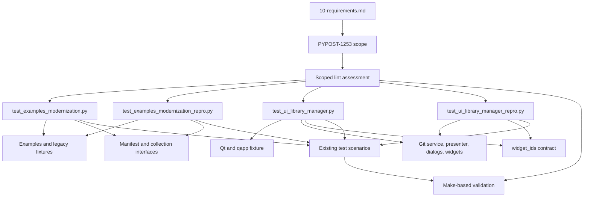

# PYPOST-1253: Resolve pre-existing lint findings in four test modules

## Research

### Requirements and repository findings

- Step 1 defines a maintenance-only boundary: four existing test modules, three finding
  categories, and no production or broad lint-policy changes.
- The Jira baseline is 30 findings: 16 `F401`, 12 `E501`, and 2 `W293`.
- The per-module scope is `tests/test_examples_modernization.py` (4 findings),
  `tests/test_examples_modernization_repro.py` (1), `tests/test_ui_library_manager.py` (15),
  and `tests/test_ui_library_manager_repro.py` (10).
- `.flake8` sets `max-line-length = 100` and enables the `T201` plugin check. This task does not
  change that configuration and does not absorb `E402` or any other finding category.
- The Makefile `lint` target currently runs Flake8 against `pypost/`, not `tests/`. A successful
  `make lint` therefore cannot by itself prove the four-module acceptance criterion. Later
  validation must use an existing or narrowly scoped Make target; this architecture does not
  authorize a raw linter command or a broad lint-policy change.

### Lint semantics

Flake8 documents `F401` as an unused import and delegates the style categories to pycodestyle.
Pycodestyle defines `E501` as a line exceeding the configured maximum and `W293` as whitespace
on an otherwise blank line. The intended fixes are therefore source-preserving edits:

- remove only imports confirmed unused by the scoped assessment;
- wrap long signatures, calls, and literals without changing values, ordering, or assertions;
- remove whitespace from blank lines while retaining the surrounding block structure.

Line-level suppressions are not an architectural option: the requirements explicitly prohibit
finding suppression and require the complete baseline to be resolved.

References: [Flake8 error codes](https://flake8.pycqa.org/en/latest/user/error-codes.html),
[pycodestyle error codes](https://pycodestyle.pycqa.org/en/latest/intro.html),
[task requirements](10-requirements.md), and [project Flake8 configuration](../../.flake8).

## Implementation Plan

1. Establish the Jira baseline against exactly the four named modules and retain the category
   ledger (`F401`/`E501`/`W293`) as the before-state.
2. Apply a minimal, file-local cleanup in each module. Remove only unused imports, reflow only
   overlong lines to the existing 100-character policy, and strip whitespace from blank lines.
   Do not rename symbols, alter fixtures, change test ordering, rewrite assertions, add
   suppressions, or modify production imports.
3. Review the diff against the existing scenario map below. Every test must continue to exercise
   the same manifest, collection, Git service, presenter, dialog, widget-ID, and fixture paths.
4. Reassess exactly the four modules and confirm zero `F401`, `E501`, and `W293` findings, with
   the resolved count matching 16/12/2. Run the permitted Make-based quality checks and the
   focused existing tests through Make targets where the repository exposes those checks.
5. Confirm the final diff contains no production files, no lint configuration changes, no files
   outside the Jira boundary, and no changes to the application behavior contract.

### Mandatory Step 3 failing-repro plan

**Red quality check, no production edits:** Step 3 should create a temporary or task-scoped
automated quality check that assesses only the four named modules for `F401`, `E501`, and `W293`
under the existing `.flake8` policy. It must fail before Step 4 because the current baseline
contains 30 findings, and it must report the file/category/count details needed to distinguish
this issue from PYPOST-1233's `E402` work. The check must not alter production code or broaden
the project lint policy.

The check is a quality repro rather than a runtime behavior test: it asserts that the scoped
lint result is empty, not that application output changes. Step 3 must run it through a Makefile
target only. If no existing Make target can express the four-file assessment, record the
tooling limitation and use `N/A — no behavioral change` for the workflow artifact instead of
adding an out-of-scope test or invoking Flake8 directly. Step 4 then performs the same scoped
assessment after the four-file cleanup and turns the quality repro green.

## Architecture

### Boundary and selected patterns

The architecture is a dependency-preserving test-maintenance boundary. The four test modules
remain the only editable code surface; the application modules, fixtures, Qt runtime, and lint
configuration are dependencies or validation inputs, not change targets.

The selected patterns are:

- **Characterization/regression tests:** existing test classes and functions remain the source of
  truth for scenarios and assertions.
- **Mechanical refactoring:** edits are limited to import declarations and formatting/whitespace
  layout, which minimizes semantic risk and keeps review attributable to the 30 findings.
- **Scoped quality gate:** the finding ledger and the four-module assessment provide a narrow
  interface for proving completion without reclassifying unrelated repository debt.

No MVC, repository, dependency-injection, or production architectural change is needed. The
tests already consume the application through its public Python and Qt-facing interfaces.

### Module responsibilities

<table>
<thead>
<tr>
<th>Module</th>
<th>Existing responsibility</th>
<th>Cleanup boundary</th>
</tr>
</thead>
<tbody>
<tr>
<td><code>test_examples_modernization.py</code></td>
<td>
Checks example-library manifest discovery and structure, modern collection loading, and legacy
fixture/environment compatibility.
</td>
<td>
Imports and line layout only; preserve all manifest, collection, fixture, and assertion paths.
</td>
</tr>
<tr>
<td><code>test_examples_modernization_repro.py</code></td>
<td>
Reproduces the example manifest validity and legacy collection-loading contract.
</td>
<td>
Imports and line layout only; preserve filesystem paths and compatibility assertions.
</td>
</tr>
<tr>
<td><code>test_ui_library_manager.py</code></td>
<td>
Exercises presenter/service coordination, operation signals and diagnostics, Qt dialog behavior,
widget hierarchy, and stable widget IDs.
</td>
<td>
Imports, wrapped signatures/calls, and blank-line whitespace only; preserve Qt setup and
assertions.
</td>
</tr>
<tr>
<td><code>test_ui_library_manager_repro.py</code></td>
<td>
Reproduces Git operation model/service availability, widget-ID availability, presenter/dialog
imports, dirty-tree checks, and commit/push flow.
</td>
<td>
Imports, wrapped calls, and blank-line whitespace only; preserve mocks and contract assertions.
</td>
</tr>
</tbody>
</table>

### Dependencies and interfaces

<table>
<thead>
<tr>
<th>Consumer</th>
<th>Existing dependencies</th>
<th>Interface that must remain unchanged</th>
</tr>
</thead>
<tbody>
<tr>
<td>Example tests</td>
<td>
<code>Path</code>, <code>pytest</code>, manifest readers/validators, collection serializer,
<code>LibraryManifest</code>, and <code>Collection</code>; <code>examples/</code> and legacy
fixture files.
</td>
<td>
Manifest discovery, validation, collection deserialization, and model attributes used by
assertions.
</td>
</tr>
<tr>
<td>UI comprehensive tests</td>
<td>
PySide6 (<code>Qt</code>, widgets, dialogs), <code>GitLibraryService</code>,
<code>LocalOverlayManager</code>, Git/library models, dialog classes, presenter, widgets, and
<code>widget_ids</code>; the existing <code>qapp</code> fixture.
</td>
<td>
Presenter methods/signals, Git result/error models, dialog methods, widget hierarchy, object
names, and action state.
</td>
</tr>
<tr>
<td>UI repro tests</td>
<td>
Git models, <code>GitLibraryService</code>, <code>widget_ids</code>, <code>MagicMock</code>,
<code>Path</code>, and <code>pytest</code>.
</td>
<td>
Model enum values, service method presence, widget-ID names, presenter coordination, and
mock-driven result contracts.
</td>
</tr>
<tr>
<td>Scoped lint assessment</td>
<td>
<code>.flake8</code>, Flake8's pyflakes/pycodestyle checks, and the four paths.
</td>
<td>
The assessment selects only <code>F401</code>, <code>E501</code>, and <code>W293</code> for this
Jira scope and returns zero after cleanup.
</td>
</tr>
</tbody>
</table>

No new API, fixture, production dependency, or cross-module import is introduced. Removing an
unused test import does not change the interfaces exercised by the remaining code.

### Interaction scheme

1. The scoped quality assessment reads the four test modules under the existing `.flake8` policy.
2. Each example test module reads repository example/fixture data through existing application
   readers and asserts the established model contract.
3. The comprehensive UI module uses existing Qt and `qapp` infrastructure, real or mocked Git
   service calls, presenters, dialogs, widgets, and widget IDs.
4. The UI repro module isolates the same public contracts with temporary paths and mocks.
5. Existing Make-based tests validate that formatting-only edits did not disturb the scenarios;
   the scoped quality assessment validates that the 30 findings are gone.

The arrows from the lint assessment to the test modules represent the quality boundary, not a
new runtime dependency. All application and fixture nodes remain read-only dependencies for this
task.

## Q&A

- **Does this change runtime behavior?** No. The plan changes only unused declarations and
  presentation of existing test source.
- **Why is Step 3 not a product red test?** There is no missing or changed runtime behavior to
  reproduce. The appropriate repro is a red scoped quality check, with `N/A — no behavioral
  change` as the fallback if the Makefile cannot expose that check without an out-of-scope file
  or policy change.
- **Is `make lint` sufficient for acceptance?** No. It currently scans `pypost/` only, so the
  four-module result must be established by a repository-supported Make-based scoped check or
  recorded as a tooling limitation.
- **Is PYPOST-1233 included?** No. Its `E402` findings remain outside this architecture and
  are not counted toward the 30-finding ledger.
- **What remains in progress?** Step 2 is documented and intentionally remains `[/]` in the
  roadmap pending its acceptance gate; no Step 3, test, or implementation change is made here.
