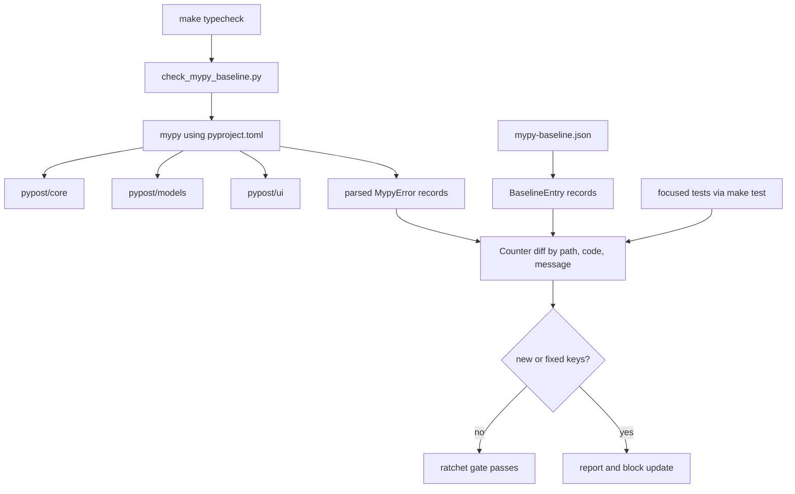
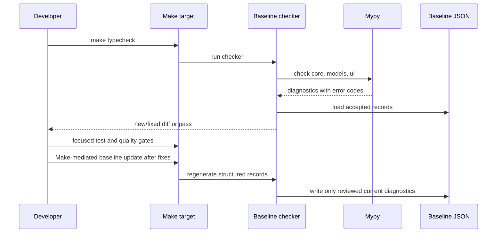

# PYPOST-1255: Ratchet reduction of remaining mypy baseline errors across PyPost

## Research

The approved business boundary is recorded in
[10-requirements.md](10-requirements.md): reduce legacy typing debt only in
`pypost/core`, `pypost/models`, and `pypost/ui`, preserve runtime behavior, and
remove baseline entries only when the corresponding diagnostics are genuinely
resolved.

Repository evidence reviewed for this design:

| Source | Finding | Architectural consequence |
| --- | --- | --- |
| `pyproject.toml` `[tool.mypy]` | Python 3.11, `check_untyped_defs`, `warn_return_any`, `no_implicit_optional`, and `show_error_codes` are enabled; `disallow_untyped_defs` remains false for incremental adoption. | Preserve the existing checker policy. Do not broaden strictness or introduce a new type-checking configuration in this task. |
| `scripts/check_mypy_baseline.py` | `MYPY_PATHS` is the authoritative three-directory scope. Diagnostics are parsed with path, line, code, and message, then compared as a `Counter` multiset keyed by `(path, code, message)`; line numbers are display-only. | Keep one scope list, preserve duplicate occurrences, and never use baseline editing to absorb a new key. |
| `mypy-baseline.json` | The file is version 2 and declares `error_count: 189`. The loaded error list currently contains 185 records, all visibly under `core` or `ui`; no model record is present. | Treat the 189-versus-185 metadata/list mismatch as pre-existing evidence. The final artifact must make `error_count == len(errors)` without counting bookkeeping correction as a type fix. `models` remains a checked, regression-protected path even when its baseline is empty. |
| `Makefile` `typecheck` | The supported gate installs the test environment and delegates to the baseline checker. There is no production behavior in this path. | Use Make targets for every check and provide a Make-mediated baseline-update path if regeneration is needed in Step 4. |
| `tests/test_mypy_baseline.py` and `tests/test_mypy_baseline_live.py` | Existing tests cover parser, structured records, duplicate-key accounting, and the live gate. The live gate runs mypy and requires zero new and zero resolved keys. | Extend coverage only for the selected PYPOST-1255 diagnostic and preserve the existing truthfulness contracts. |
| `doc/dev/static_type_checking.md` | Documents the path scope, version 2 record format, Counter semantics, and ratchet procedure. | Keep implementation and documentation contracts aligned; do not create a second baseline format or scope list. |

The initial repository gate was run before any Step 2 artifact edit:
`make typecheck` passed with `185 known errors`. This is the semantic count
currently loaded by the checker, not evidence that four type errors have been
fixed by PYPOST-1255. The approved requirements' starting figure of 189 is
retained as the business baseline. Step 4 must establish a fresh pre-change
diagnostic snapshot and distinguish this existing metadata inconsistency from
changes caused by the task.

The official [mypy configuration reference](https://mypy.readthedocs.io/en/stable/config_file.html)
supports repository configuration in `pyproject.toml`, including the existing
incremental-checking settings. The [mypy error-code reference](https://mypy.readthedocs.io/en/stable/error_codes.html)
confirms that error codes are part of the diagnostic contract. These references
support using the repository's existing configuration and structured diagnostic
keys rather than adding local suppressions or a parallel checker.

## Implementation Plan

1. **Capture the pre-change inventory.** Run the supported Make gate and retain
   the current `(path, code, message)` multiset, including duplicate counts,
   per-directory distribution, and any `new_keys` or `fixed_keys`. The initial
   result is the comparison point for identifying task-caused diagnostics.

2. **Triage a bounded increment.** Select a small set of existing records in
   the three allowed directories, starting with low-risk local typing contracts:

   - In `pypost/core`, narrow nullable values at calls, annotate local
     accumulators, and make optional returns explicit. Core integrations such
     as HTTP, MCP, cryptography, and metrics remain behind their existing
     interfaces.
   - In `pypost/models`, preserve the current domain contracts and keep the
     path in the mypy invocation. Since no model record is currently serialized,
     an error discovered there is a new regression or a pre-existing
     environment discrepancy, not debt that may be silently added to the
     baseline.
   - In `pypost/ui`, type dynamic widget attributes, nullable widget state,
     callback boundaries, and PySide6 enum/stub interactions with narrow local
     annotations or protocols. Preserve signal payloads, dialog lifecycle, and
     user-visible behavior.

   The increment must remain local to files represented by the selected
   diagnostics. Broad renames, redesign, strictness-policy changes, unrelated
   cleanup, and changes outside the three paths are excluded.

3. **Implement and verify the type fixes.** Step 4 will make the smallest
   source changes that satisfy the selected diagnostics without changing
   control flow, public signatures, serialized data, or UI interactions unless
   an existing type contract is being made explicit. After each increment,
   run `make typecheck` and classify the result against the pre-change
   inventory:

   - A key that was already present before Step 4 may be retired only when the
     source change directly explains its absence.
   - A key absent from the pre-change current multiset is task-caused if it
     appears after the change, even when it is in an allowed directory. It must
     be fixed or the source change must be reverted.
   - A pre-existing `new_key` or `fixed_key` from the initial snapshot remains
     an existing repository failure and is not claimed as PYPOST-1255 progress.
   - A path outside `MYPY_PATHS` is never absorbed into this baseline.

4. **Ratchet the data artifact only after source evidence is clean.** Use the
   checker’s existing `--update-baseline` behavior through a narrowly scoped
   Make target or equivalent Makefile wrapper. The normal `typecheck` gate must
   not update files automatically. Review the JSON diff for each removed
   `(path, code, message)` occurrence, preserve duplicate records, retain every
   unresolved diagnostic, keep `version: 2` and the exact three-path `scope`,
   and require `error_count == len(errors)`. The update is accepted only when a
   subsequent `make typecheck` reports no new or fixed keys and the final
   serialized count is lower than the pre-change serialized count as a result
   of genuine fixes, not metadata-only deletion.

5. **Run the project quality gates.** Validate the changed source and baseline
   using `make typecheck`, the focused Step 3/4 test through `make test`,
   `make lint`, and `make verify-ai-tasks`. Use `make check` when the complete
   repository gate is appropriate. No raw `pytest`, `mypy`, `flake8`, `pip`, or
   direct baseline-update command is part of the implementation workflow.

### Mandatory — Failing Repro (next Step 3)

This task has no intended runtime behavior change, but it does have a
verifiable static diagnostic that must be red before the Step 4 fix. Step 3
will add a focused test at
`tests/test_pypost_1255_mypy_baseline_repro.py` with a module-level timeout
marker. The test will use the existing `_run_mypy()` and `_parse_errors()`
helpers, and will be run only via a Make target.

The first target is the currently emitted core diagnostic from
`pypost/core/alert_manager.py`:

```text
code: arg-type
message: Argument 1 to "_webhook_log_target" has incompatible type
         "str | None"; expected "str"
```

The repro asserts that the fresh live diagnostic multiset contains zero
occurrences of this exact `(path, code, message)` key after the intended
narrowing fix. Before Step 4, the diagnostic is emitted by the current code,
so the test is red. After the focused fix, it is green if the diagnostic is
gone without adding another key. If the fresh pre-change run no longer emits
this record, Step 3 must select another still-present baseline key from that
same snapshot rather than manufacturing a failure.

Step 3 will also add a hermetic reconciliation guard around the same key
contract. Its fixture will contain one pre-existing baseline record, a
post-fix current stream with that record removed, and a separate synthetic
new diagnostic under `pypost/models`. It will assert that the former is
reported as fixed and the latter as new. This makes the distinction explicit:
retired debt is evidence for a ratchet, while any new key remains a blocker and
must not be hidden by regenerating the baseline. The fixture requires no live
network, Qt event loop, or application behavior.

The Step 3 sequence is therefore: capture the fresh pre-change inventory,
write the red focused test without changing production code, run it through
`make test`, then hand the test and its exact target diagnostic to Step 4.

## Architecture

### System and module interaction



### Components and responsibilities

| Component | Responsibility | Boundary and constraints |
| --- | --- | --- |
| `pypost/core` typing increment | Make existing service, integration, and worker contracts statically truthful. | Core changes may clarify `None`, collection, protocol, and third-party boundary types, but must preserve runtime behavior and public interactions. |
| `pypost/models` typing boundary | Keep domain model annotations compatible with core and UI consumers. | Remains in the checker scope and regression guard even with no current baseline entries; no forced model redesign. |
| `pypost/ui` typing increment | Clarify widget state, presenter callbacks, signal payloads, and Qt stub boundaries. | Prefer explicit attributes, protocols, and narrow adapters. Preserve Qt signal semantics, dialog lifecycle, and user workflows. |
| `pyproject.toml` mypy configuration | Define the existing Python version and gradual-checking policy. | Read-only configuration dependency for this task; no global policy expansion. |
| `check_mypy_baseline.py` | Run mypy, parse diagnostics, load the JSON record set, compute the multiset diff, and report blockers. | Remains the sole comparison implementation. Its `(path, code, message)` identity and Counter behavior are stable interfaces. |
| `mypy-baseline.json` | Persist the accepted unresolved diagnostic multiset and its scope metadata. | Data-only artifact. Every record must be a real unresolved diagnostic; duplicates are meaningful and must remain duplicated. |
| Makefile quality interface | Provide the supported entry points for type checking, testing, linting, and artifact verification. | All implementation and validation commands are Make-mediated. Baseline regeneration, if needed, must also be wrapped by Make. |
| Step 3/4 tests | Prove the selected diagnostic is retired and that new/fixed-key reporting remains truthful. | Test-only, deterministic where possible, with per-test timeouts and no external service dependency. |

### Dependencies and interfaces

The dependency direction is one-way for the quality flow:

1. `pyproject.toml` supplies mypy settings, while the checker supplies the
   authoritative path list and `--show-error-codes` invocation.
2. Mypy emits text for the three directories. `_parse_errors()` converts it to
   `MypyError(path, line, code, message)` records.
3. `_load_baseline()` converts version 2 JSON objects to `BaselineEntry`
   records. `_error_key()` maps both record types to
   `(path, code, message)`; line is never part of identity.
4. `_diff_errors()` compares `Counter` values and returns occurrence-level
   `new_keys` and `fixed_keys`. `main()` formats the result and returns a
   failing status for either non-empty collection.
5. Application modules do not import the checker or the baseline. The checker
   observes them only through mypy, so baseline bookkeeping cannot alter
   application execution.

The implementation must retain these contracts:

- `MYPY_PATHS == ("pypost/core", "pypost/models", "pypost/ui")`.
- The JSON remains version 2 with structured `path`, `code`, and `message`
  fields and matching `scope` and `error_count` metadata.
- A line-number shift alone is not a new error.
- Repeated identical keys are counted by occurrence, not collapsed by a set.
- A new error is never made acceptable by adding it to the baseline in the
  same change that introduced it.

### Selected patterns and rationale

- **Incremental typing:** Fix a small diagnostic family at a time while the
  existing gradual mypy policy remains unchanged. This limits behavior risk
  and makes each baseline deletion reviewable.
- **Boundary narrowing:** Validate or narrow nullable and dynamically typed
  values at the call boundary that requires a concrete type. This avoids
  propagating `Any` or broad casts through core and UI layers.
- **Explicit state and structural protocols:** Declare optional widget state,
  local accumulators, callbacks, and cross-layer interfaces where inference is
  ambiguous. Protocols are preferred when the existing behavior depends on a
  structural callback shape.
- **Typed third-party compatibility boundary:** Keep PySide6, cryptography,
  MCP, YAML, and metrics typing work localized to the existing integration
  module. Do not turn a stub limitation into a global ignore or alter the
  dependency policy.
- **Single-source, count-aware ratchet:** The checker and JSON remain the only
  baseline mechanism. Counter reconciliation preserves duplicate diagnostics,
  while the pre-change inventory provides evidence for task attribution.

### Data and control flow for a ratchet



### Risks and mitigations

| Risk | Mitigation |
| --- | --- |
| The 189 metadata value and 185 loaded records can be mistaken for four task fixes. | Record both pre-change facts, require genuine source-linked diagnostic retirement, and require final metadata/list equality. |
| A baseline regeneration absorbs a newly introduced error. | Require `new_keys == []` before accepting regeneration; review every baseline diff and rerun `make typecheck`. |
| Nullable narrowing changes a branch or error path. | Preserve existing control flow and defaults, then run focused module tests and the full Make test gate. |
| PySide6 or other third-party stubs disagree with runtime APIs. | Use narrow local annotations or compatibility protocols, retain runtime enum/signal behavior, and avoid broad ignores. |
| Duplicate diagnostics are lost during reconciliation. | Keep structured entries as a list and use the existing Counter multiset; do not deduplicate JSON records. |
| Line movement causes false baseline churn. | Keep line numbers for display only and preserve `(path, code, message)` identity. |
| A diagnostic outside the three paths is accidentally included. | Treat `MYPY_PATHS` and the JSON `scope` as exact allowlists and reject scope expansion in review. |

## Validation Strategy

Step 2 validation is documentation and repository-state validation only; no
production code or tests are changed in this step. The following checks belong
to the workflow and remain Make-only:

- `make typecheck` establishes the pre-change inventory and later proves that
  the final live multiset matches the ratcheted JSON.
- `make test` runs the focused red/green repro and existing baseline/runtime
  regression tests. Every added test must declare a timeout marker.
- `make lint` checks the affected Python source and repository documentation
  through the project’s configured lint target.
- `make verify-ai-tasks` verifies workflow artifacts after the architecture
  file and roadmap update.
- `make check` is the combined final quality gate when the full repository
  validation is requested; the live baseline test is included through the test
  suite even though `typecheck` is a separate Make target.

Acceptance evidence for the implementation is:

1. The final JSON count is lower than the pre-change serialized count and the
   approved 189 starting figure.
2. Every removed entry maps to a directly fixed diagnostic in `core`, `models`,
   or `ui`; unresolved diagnostics remain represented.
3. The final live run has no new or fixed keys relative to the final JSON, with
   duplicate occurrence counts preserved.
4. The focused repro is green, existing behavior tests are green, and all
   required Make gates pass.

## Q&A

- **Why is `pypost/models` listed if it has no current baseline record?** It is
  an authoritative checked path and must remain protected from new errors. The
  absence of current debt does not justify removing it from the scope or
  inventing a model refactor.

- **Which count is authoritative?** The live parsed diagnostic multiset and
  the serialized `errors` list are authoritative for reconciliation. The
  approved 189 figure is the business starting point; the existing metadata
  mismatch is pre-existing and must be made consistent, not used to claim
  progress.

- **Can the baseline be updated before all new errors are fixed?** No. A new
  key is a regression even when it is in scope. The baseline update is allowed
  only after the source is clean against the pre-change inventory and each
  removed occurrence is explained.

- **Does this task change runtime behavior?** No behavior change is intended.
  The implementation uses type annotations, safe narrowing, and localized
  contracts while preserving existing control flow, persistence, signals, and
  UI interactions.

- **Why preserve the current error-key shape?** It avoids line-number churn and
  still detects real message/code changes. Counter-based comparison is needed
  because multiple source occurrences can share the same key.

- **What is the Step 3 gate?** A focused live-mypy test must fail on a
  currently emitted selected diagnostic before production changes and pass
  after the corresponding narrow fix. A companion fixture must continue to
  report synthetic new errors rather than allowing them into the baseline.
