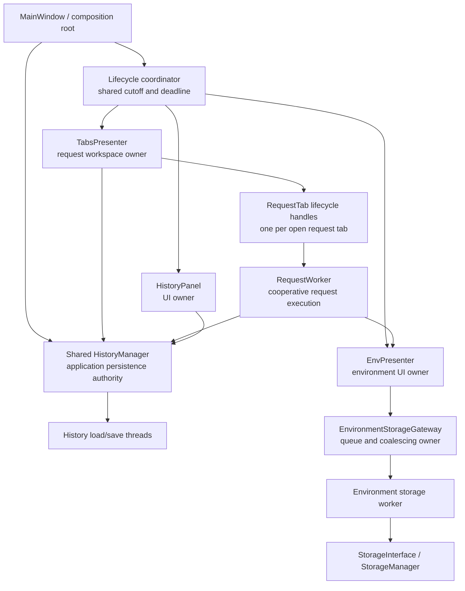

# PYPOST-1256: Standardize teardown() Contract Across Remaining UI Presenters

## Research

### Scope and current terminology

Jira describes `RequestPresenter`, `HistoryPresenter`, and `EnvironmentPresenter`. The current
repository uses these concrete ownership boundaries:

| Jira term | Current boundary | Current asynchronous responsibility |
| --- | --- | --- |
| RequestPresenter | `TabsPresenter` + `RequestTab` | Worker per tab; stream and cancel |
| HistoryPresenter | `HistoryPanel` + `HistoryManager` | Daemon load/save; panel refresh |
| EnvironmentPresenter | `EnvPresenter` + gateway | Encrypted workers; queued load/save |

There is no standalone `RequestPresenter` or `HistoryPresenter` class in the current UI. This
architecture therefore defines the contract at the existing ownership boundaries rather than
introducing aliases or renaming classes.

### Repository evidence

- `MainWindow` is the composition root. It creates and owns `TabsPresenter`, `EnvPresenter`,
  `HistoryPanel`, and one application-level shared `HistoryManager`, injecting that manager into
  the request-history path and the panel. It currently performs environment-idle waiting during
  exit.
- `TabsPresenter` stores each request worker on `RequestTab.worker`. It binds worker signals with
  closures that retain the tab, clears the reference on normal completion/error, and debounces
  streamed chunks through presenter-owned timers. Request-tab close currently removes the tab but
  does not provide the request worker with the same bounded teardown used by other tab kinds.
- `RequestWorker.stop()` sets a cooperative flag. `RequestService` checks that flag during request
  execution and retry backoff. The worker is one-shot and does not currently expose a bounded join
  contract to its tab owner.
- `HistoryManager` protects its entries with a lock, loads asynchronously in a daemon thread, and
  serializes debounced snapshots in another daemon thread. `flush()` joins the current save thread
  without a deadline. `main_window_signals.py` schedules a panel refresh after an asynchronous
  load, so a close path needs a callback fence in addition to thread coordination.
- `EnvironmentStorageGateway` permits one worker, replaces a pending save with the latest deep copy,
  and drains a pending load after the save queue. `wait_idle()` is bounded, but there is no owner
  teardown state that rejects new work or prevents late load/save signals from reaching
  `EnvPresenter`.
- Existing collection and WebSocket presenters provide local teardown precedents. They are useful
  evidence for bounded results and ordered cleanup, but this task does not make those unrelated
  presenters part of the new contract.

The existing developer guides were also consulted:
[request execution](../../doc/dev/request_execution.md),
[async environment storage](../../doc/dev/environment_storage_async.md), and
[presenter architecture](../../doc/dev/presenter_architecture.md). They document current behavior,
but not a single lifecycle contract for the three in-scope owners.

Qt's lifecycle model supports this separation of responsibilities: interruption requests are
advisory, `wait()` is the synchronization primitive when a bounded join is required, and a
`finished()` to `deleteLater()` connection is the normal deferred cleanup pattern. See the
[PySide6 QThread documentation][qthread] and the
[`QObject.deleteLater()` documentation][qobject-delete-later].
The design treats these as implementation constraints for Step 4, not as the public contract.

### Architectural problem statement

The three owners have different worker technologies and queue rules, but they share the same
failure shape:

1. an owner can be released while work is active or queued;
2. a queued signal or callback can retain a released UI object;
3. the current cleanup primitive either does not cover the owner or has no common bounded result;
4. repeated cleanup can race with completion and create duplicate effects or stale state.

The design must create one observable lifecycle boundary while preserving the domain-specific
rules for request cancellation, history persistence, and environment save ordering.

## Implementation Plan

The implementation will proceed after this architecture is accepted and a red repro is approved.
It will be organized around a small lifecycle protocol and owner-specific adapters:

1. Introduce the owner lifecycle state and result vocabulary described below without changing
   request, history, or environment business behavior.
2. Add the lifecycle fence at each owner boundary before removing or hiding its UI. The fence
   rejects new work and makes late UI callbacks harmless.
3. Add a request adapter that covers every active request tab, its worker, streaming buffer, and
   flush timer. It will request cooperative cancellation and wait only until the shared deadline.
4. Add a history adapter that drains the load/save state already accepted by `HistoryManager`,
   while retaining accepted appends, deletes, and clears. Panel refresh callbacks will be
   generation-aware.
5. Add an environment adapter that stops admission of new work and drains the existing gateway
   operation plus pending queue in its current ordering. A pending save will never be silently
   replaced or discarded by teardown.
6. Wire `MainWindow` as the composition-root coordinator. It will establish the shutdown cutoff,
   run owner teardown in the defined order, aggregate results, and retain timed-out coordinators
   until their background work reaches a safe terminal state.
7. Add focused tests through the existing Make targets, then update observability and developer
   documentation in later Top-Down steps.

**Mandatory — Failing Repro (next Step 3):** Create red tests before production changes. The repro
should use controlled fakes and synchronization gates rather than live network or disk timing:

- Request: start two request-tab workers, close the workspace while one emits a late response,
  error, chunk, retry, or cancellation signal, and assert a bounded result, no mutation of the
  released tabs, and no duplicate terminal handling.
- History: hold an async load and a debounced save at controlled barriers, close/re-teardown the
  panel, and assert that accepted append/delete/clear state is persisted while a late refresh cannot
  touch the panel.
- Environment: hold a load or save, queue a load and a newer save, tear down repeatedly, and assert
  ordering, latest-save preservation, bounded incomplete reporting, and no late presenter update.
- Common protocol: call teardown while idle, active, already finished, concurrently, and twice;
  assert idempotent result identity/equivalence and one lifecycle terminal outcome.

The red suite belongs in the existing presenter, manager, gateway, and lifecycle test areas as
appropriate. It must fail because the current owners lack the fence or bounded contract, not
because production code is changed prematurely.

## Architecture

### System module diagram



The arrows represent ownership or lifecycle coordination, not a requirement that all calls be
direct synchronous calls. UI updates remain on the UI thread; background work reports outcomes
through owner-controlled delivery gates.

### Modules and responsibilities

#### 1. Common lifecycle protocol

Each in-scope owner exposes the same externally meaningful operation:

```text
teardown(timeout_ms: int | None = None) -> TeardownResult
```

The conceptual protocol is intentionally duck-typed. The owners already have different base
classes (`QObject`, `QWidget`, and a plain Python manager); forcing a common inheritance tree
would create compatibility and threading risks without improving behavior.

`TeardownResult` is a value describing at least:

| Field | Meaning |
| --- | --- |
| `owner` | Stable safe owner category, never a URL, header, body, or secret |
| `outcome` | `success`, `incomplete`, or `failed` |
| `elapsed_ms` | Monotonic duration of the first teardown attempt |
| `active_count` | Work active when the first call established the cutoff |
| `pending_count` | Queued/coalesced work at that cutoff |
| `failure_kind` | Optional `cancelled`, `timeout`, `worker_error`, or `invariant` category |

The result is terminal for the owner attempt. A repeated call returns the same terminal result, or
observes the same in-progress attempt if the first call has not reached a terminal state. It does
not restart a timer, issue a second cancellation request, replay a queue, or emit a second
terminal effect.

#### 2. Lifecycle coordinator and cutoff

`MainWindow` remains the owner of cross-presenter shutdown ordering. A lightweight coordinator
tracks one shutdown generation and one monotonic deadline:

- Before teardown begins, it prevents new user actions and new asynchronous submissions at all
  three owner boundaries.
- It establishes the cutoff before releasing widgets, so every later callback can be classified
  as pre-cutoff work, accepted persistence, or a late UI update.
- It passes the remaining deadline to each owner instead of giving each owner a fresh unbounded
  wait.
- It aggregates owner results. The aggregate is successful only when every owner reports successful
  bounded cleanup.
- If any owner reports `incomplete` or `failed`, the coordinator preserves the owner/coordinator
  lifetime needed to finish backend cleanup, records the result, and never reports a clean release.

The coordinator is not a new application-wide worker pool and does not own domain data. It only
coordinates the three lifecycle owners and their delivery fences.

#### 3. Request workspace owner

`TabsPresenter` owns the request-tab inventory and the per-tab lifecycle handles. A handle covers
the `RequestWorker`, the closure-bound signal routes, the chunk buffer, and its flush timer. The
handle is the safety boundary for one tab; the presenter is the aggregation boundary for all open
request tabs.

Request teardown behavior:

- Stop admitting new sends and tab work once the cutoff is set.
- Request cooperative cancellation for every active request worker, not only the selected tab.
- Stop and discard only presentation buffers that can no longer be rendered. A response, error,
  retry, chunk, or cancellation signal received after the fence is ignored for UI purposes and is
  recorded as a late delivery.
- Wait for workers to reach their natural terminal state until the shared deadline. Forced thread
  termination is not part of the normal design because it can interrupt transport or persistence
  invariants.
- Return `success` only after no request worker or tab-owned timer can deliver a UI mutation. Return
  `incomplete` on deadline expiry with the outstanding count and retain the lifecycle handle.

Request history and environment side effects that were accepted before the cutoff are not undone.
The coordinator drains request workers before final history/environment persistence teardown so a
worker that has already committed an accepted history append or environment update is accounted
for before those downstream owners report success.

WebSocket and MCP client tabs remain compatibility boundaries. Their existing presenter-level
teardown methods continue to be used by their tab close helpers; this task standardizes the request
tab path and does not redesign those protocols.

#### 4. History owner

`HistoryPanel` remains a view. `HistoryManager` remains the persistence authority and is the
lifecycle resource that must outlive the panel while a save or load is draining. The history
boundary has two explicit scopes:

- **Panel-local scope:** `HistoryPanel` owns its closing generation, refresh callbacks, timers, and
  widget delivery. Its `teardown()` fences and disconnects panel delivery, and is idempotent for
  that panel instance. It does not tear down `HistoryManager`, because the manager can still be
  needed by `TabsPresenter` or another application caller after the panel closes.
- **Application scope:** `MainWindow` owns the injected shared `HistoryManager` and its lifecycle
  adapter. Only this application-level authority may begin manager teardown, after request-owner
  draining has completed. It drains accepted persistence and makes the manager unavailable to all
  application callers. Repeated or concurrent manager teardown calls share one attempt and return
  the same terminal result; neither `HistoryPanel` nor `TabsPresenter` may start a second attempt.

An application shutdown coordinates both scopes: it fences the panel, then tears down the shared
manager, and aggregates both results. A panel-only result means that no callback can mutate that
panel; it does not claim that shared history persistence is closed. Conversely, manager teardown
must retain the manager until its accepted work settles, even if the panel has already been
released. This separation makes ownership and lifecycle authority explicit without introducing a
second history store or changing the manager's business API.

History teardown behavior:

- **Panel-local:** Set the panel's closing generation before removing widgets or accepting no more
  refresh work.
- **Application-level:** Ensure the manager's load state has a deterministic terminal result. A
  load result that arrives after the panel fence may update manager state but must not refresh the
  panel.
- **Application-level:** Drain all accepted save snapshots, including the final snapshot produced
  by an append, delete, or clear. The latest accepted state wins according to the manager's
  existing debounce semantics.
- **Application-level:** Do not cancel a save by merely dropping the daemon-thread reference. If
  the deadline expires, return `incomplete`, keep the manager alive, and make the unfinished
  persistence explicit.
- **Panel-local:** Treat a callback after the fence as a no-op for the view, with at-most-once
  logging/metrics. It must not re-enable controls, rebuild the list, or emit a duplicate
  user-visible outcome.

History data format, retention cap, masking, ordering, and the `HistoryManager` API used by request
execution remain unchanged.

#### 5. Environment owner

`EnvPresenter` owns the `EnvironmentStorageGateway`, and the gateway owns the current worker plus
its pending load/save state. The presenter is the UI delivery boundary; the gateway is the accepted
storage-work boundary.

Environment teardown behavior:

- Set the presenter closing generation and stop admitting load/save/manager-refresh requests.
- Preserve the gateway's single-flight ordering: the active operation completes or reaches an
  explicit failure, the latest pending save is retained, and pending load work is either drained
  or explicitly reported as incomplete/cancelled. No accepted operation is silently reported
  complete.
- Preserve the latest accepted save snapshot. A teardown call must not replace a newer save with
  an older snapshot, and must not start a new operation after the owner has reached successful
  teardown.
- Ignore late load completion, load failure, save completion, and save failure at the presenter
  after the fence. Storage writes already accepted by the gateway continue under the gateway's
  retained lifetime.
- Return `success` only when no worker or pending queue item remains and no callback can mutate the
  presenter. A bounded wait expiry is `incomplete`, not success.

##### `env_update` admission and shutdown drain

An environment update is accepted at the request-to-environment handoff, not when its Qt signal is
later delivered to `EnvPresenter`. That handoff assigns a monotonic acceptance sequence under the
same lifecycle boundary as the shutdown cutoff. Therefore a queued `RequestWorker.env_update`
signal cannot make an already accepted update disappear when the presenter is fenced.

The cutoff and drain order is fixed:

1. The coordinator records the cutoff and closes admission atomically. Updates with an acceptance
   sequence at or before the cutoff are pre-cutoff; later submissions are rejected and classified
   as `rejected_after_cutoff`.
2. The request owner stops active workers and flushes every pre-cutoff environment update through
   the gateway's accepted-work ledger. Signal delivery to the presenter is notification only; it
   is never the durability boundary.
3. The environment owner fences presenter callbacks, then lets the active gateway operation finish
   and drains the pre-cutoff queue using the existing single-flight ordering.
4. The gateway persists the latest accepted save snapshot before reporting success. A pending save
   that is superseded by a newer accepted save is recorded as `coalesced_into_newer_save`, with
   the newer snapshot responsible for persistence; it is not silently discarded.
5. A pre-cutoff load is completed in the existing follow-on order, or is classified as failed or
   incomplete if storage fails or the shared deadline expires. A late signal may update retained
   storage state, but never the fenced presenter.

Every pre-cutoff update consequently has one explicit disposition: persisted, coalesced into a
newer persisted snapshot, failed with a storage error, or incomplete with the retained ledger and
gateway lifetime. The owner cannot report `success` while any accepted update lacks a disposition.
If the deadline expires before handoff or persistence, teardown returns `incomplete` and retains
the gateway/ledger for safe completion; it does not drop the update or relabel it as cancelled.

When encryption is disabled, the existing synchronous storage path has no asynchronous gateway
work; teardown is an immediate successful no-op after the presenter fence is installed. The
existing settings-change `wait_storage_idle()` behavior remains a compatibility operation and is
not treated as the application shutdown contract.

### Uniform state model

Every owner follows the same logical states, even though the internal worker mechanics differ:

```text
OPEN --teardown()--> CLOSING --all owned work settled--> CLOSED
  |                     |
  |                     +--deadline/error-----------> INCOMPLETE or FAILED
  +--teardown() again-->| same in-progress/terminal attempt
```

- `OPEN`: new operations and normal UI delivery are allowed.
- `CLOSING`: new operations are rejected; the delivery fence suppresses UI mutation; accepted
  persistence is drained and active work is cancelled or allowed to finish according to the
  owner.
- `CLOSED`: no associated asynchronous work or UI callback can affect the owner. Repeated teardown
  is a successful no-op returning the original result.
- `INCOMPLETE`: the deadline ended with outstanding work. The owner is not safe to destroy as if
  closed; its coordinator remains retained and late work remains fenced until it settles.
- `FAILED`: a lifecycle invariant or unrecoverable worker error prevented the contract from
  completing. The owner remains retained and the failure is visible to the composition root.

The state transition is guarded by one owner-local lifecycle lock or UI-thread state boundary.
The design does not require a particular lock, signal connection, or event-loop technique.

### Ownership and call ordering

The composition root uses this order because request completion can create history and environment
side effects, while those two owners must not be released before the request boundary is settled:

```text
MainWindow shutdown request
    |
    v
1. Establish one cutoff/deadline and disable new actions
    |
    v
2. Begin request-owner teardown for every open request tab
    |       - cancel active workers
    |       - fence late tab UI delivery
    |       - drain accepted request side effects
    v
3. Teardown history owner
    |       - fence panel refresh callbacks
    |       - drain accepted persistence snapshots
    v
4. Teardown environment owner
    |       - fence presenter signals
    |       - drain gateway worker and accepted queue
    v
5. Aggregate results, then release widgets only after success
```

The root may install all three fences at the start of step 1 so no new user work can begin while
the ordered drains run. Installing a fence does not discard a domain operation already accepted
by that owner. Request draining precedes downstream finalization; this is the explicit boundary
for history appends and environment updates produced by a request that was already in flight.

If a user closes one request tab without closing the application, the same request-tab handle
contract applies locally: fence that tab, cancel and bound its worker, then remove the tab only
after successful cleanup. A failed or incomplete result prevents treating the tab's worker as
detached and is reported to the owning workspace flow.

### Cancellation, queued work, and late signals

#### Cancellation

Cancellation is cooperative and owner-specific:

- Request execution receives a stop request and is expected to observe it at transport and retry
  boundaries.
- History saves are not cancelled after an accepted snapshot; they are drained for data integrity.
  An async load may finish or be explicitly classified as incomplete, but cannot refresh a fenced
  panel.
- Environment storage preserves accepted save order and the latest save snapshot. Queued loads
  and saves are drained using the existing queue policy or returned as an explicit incomplete
  outcome.

No owner interprets object destruction as cancellation, and no owner uses forced thread termination
as its normal success path.

#### Queued work

The cutoff is also an admission boundary. Work submitted after it is rejected with a lifecycle
state result and does not enter a queue. Work accepted before it is classified by owner:

| Owner | Active work | Queued work |
| --- | --- | --- |
| Request | Cancel cooperatively and await | Reject sends; drop stale presentation work |
| History | Settle accepted load/save | Drain snapshots; preserve latest save |
| Environment | Settle current operation | Preserve save; drain or classify queue |

For environment work, “preserve save; drain or classify queue” has the stronger rule above:
every pre-cutoff `env_update` is flushed to the gateway ledger before a terminal result, and every
queued load/save is persisted, coalesced with an explicit newer-save reference, failed, or reported
incomplete. A post-cutoff submission is the only operation rejected without persistence because it
was never accepted.

#### Late signals and callbacks

Every asynchronous delivery carries an owner-local generation or equivalent acceptance token. The
callback path checks the token and owner state before any widget mutation, signal propagation, or
user-visible effect. A stale callback is ignored safely and contributes only bounded diagnostics.
This covers queued Qt signals, timer callbacks, Python thread callbacks, normal completion after
cancellation, errors after success, and a second teardown racing with the first.

The fence is separate from worker disposal. A worker can be alive while its owner is `CLOSING`,
but it cannot mutate the released UI. This separation is required for bounded timeout behavior.

### Idempotency and timeout policy

The public policy is:

- `teardown()` accepts an optional finite timeout. Omission uses a finite owner default; there is no
  infinite default and no unbounded join hidden behind the API.
- The composition root establishes one monotonic shutdown deadline and passes the remaining
  budget. Repeated callers share that deadline rather than extending it.
- The initial UI policy is a 5-second total shutdown budget, subject to validation by the Step 3
  repro and real test evidence. Owner-specific budgets may subdivide the remaining budget but may
  not extend the root deadline.
- A worker that settles before the deadline produces `success`; a worker or queue still outstanding
  at the deadline produces `incomplete` with a timeout failure kind.
- A timeout never masquerades as success and never silently drops accepted history or environment
  persistence. The root retains the coordinator and records the outstanding work until a safe
  terminal state is reached.
- Repeated or concurrent teardown calls are idempotent. Only the first call establishes the fence,
  requests cancellation, and starts the deadline; later calls observe the same state/result.

The 5-second value is a policy default, not a request timeout, storage timeout, or retry timeout.
Those domain-level timeouts remain unchanged.

### Compatibility boundaries

- Preserve `RequestWorker.stop()`, `HistoryManager.flush()`, and
  `EnvironmentStorageGateway.wait_idle()` as compatibility primitives while routing shutdown
  callers through the new owner contract.
- Do not change `RequestService.execute()`, HTTP/MCP transport behavior, retry policy, history JSON
  format, masking, retention, environment encryption, atomic storage writes, or variable resolution.
- Do not require callers to know private worker fields such as `tab.worker`, `_save_pending`, or
  `_pending_save`; tests and application shutdown use the owner contract.
- Keep synchronous environment operation behavior unchanged when encryption is disabled.
- Keep existing WebSocket/MCP tab teardown, collection import teardown, and unrelated presenters
  outside this task. The request tab adapter must coexist with their current close helpers.
- Keep `HistoryManager` usable by non-UI request-service callers. Only the composition-root-owned
  UI instance participates in the coordinated shutdown.

### Observability

Each owner emits structured lifecycle events with safe scalar fields only:

- `lifecycle_teardown_started`: owner, generation, timeout budget, active count, pending count;
- `lifecycle_cancel_requested`: owner, operation category, count;
- `lifecycle_late_delivery_ignored`: owner, operation category, delivery kind;
- `lifecycle_teardown_completed`: owner, outcome, elapsed time, active/pending remainder;
- `lifecycle_teardown_timeout` or `lifecycle_teardown_failed`: owner, failure kind, elapsed
  time, remainder counts, and safe exception type.

Request URLs, bodies, headers, environment values, secret names, raw exception details, and object
identifiers are excluded or sanitized according to existing masking policy. The lifecycle layer
should add metrics for teardown attempts by outcome, timeout count, late-delivery count, and
duration. It should not create per-request or per-environment high-cardinality labels.

### Test seams and evidence

The design is testable without live network, encryption keys, or real timing races:

| Seam | Controlled dependency | Required evidence |
| --- | --- | --- |
| Request tab handle | Gated fake worker and signals | All tabs; late signals; bounded cancel |
| History owner | Fake I/O and load/save barriers | Snapshot, late refresh, races, repeat teardown |
| Environment owner | Fake storage and gated worker | Queue, coalescing, failure, timeout, order |
| Composition root | Three fake owners | Cutoff, order, shared deadline, aggregate failure |
| Common callback fence | Queued callback and timer | No mutation or duplicate visible effect |

Tests must assert state and observable result rather than private thread implementation. Existing
Make-based test, lint, and artifact verification targets remain the only repository validation
entry points.

### FR/AC traceability

The following matrix connects every functional requirement and measurable acceptance criterion to
an architectural decision and planned evidence. The Step 3 repro and Step 4 implementation tests
will provide the runtime evidence; this document supplies the intended coverage boundary.

| ID | Design decision | Planned verification |
| --- | --- | --- |
| FR-1 | Shared result contract per owner scope. | Idle/active contract tests. |
| FR-2 | Handles fence delivery and cancel workers. | Multi-tab/late-signal tests. |
| FR-3 | Panel fence is separate from manager drain. | Load/save/late-refresh tests. |
| FR-4 | Ledger preserves cutoff updates and queue state. | Order/persistence tests. |
| FR-5 | One attempt owns fence, deadline, and result. | Concurrent/repeat tests. |
| FR-6 | Domain APIs stay outside lifecycle adapters. | Existing behavior tests. |
| FR-7 | Controlled seams and docs define the contract. | Make tests and doc review. |
| AC-1 | All owner scopes expose lifecycle semantics. | Idle, active, finished, and repeat cases. |
| AC-2 | A finite deadline yields `success` or `incomplete`. | Gated timeout tests. |
| AC-3 | Generation fences suppress all late UI delivery. | Late completion/error/cancel tests. |
| AC-4 | Every open request tab gets ordered cancellation. | Two-tab race tests via `make test`. |
| AC-5 | Accepted history snapshots drain behind a fence. | Load/save/pending/repeat tests. |
| AC-6 | Environment work gets explicit dispositions. | Active/queued/failure/repeat tests. |
| AC-7 | Incomplete owners stay retained; success has no delivery path. | Lifecycle tests. |
| AC-8 | Business behavior stays outside lifecycle adapters. | Regression and baseline comparison. |
| AC-9 | Quality evidence uses prescribed Make targets. | `make lint` and `make verify-ai-tasks`. |
| AC-10 | Ownership, results, and caller expectations are documented. | Developer-doc review. |

### Failure handling and rollout risks

| Risk | Design response |
| --- | --- |
| Worker ignores cancel | Bound wait; return `incomplete`; retain handle; log timeout |
| History save runs at close | Keep manager alive; never claim success after dropping thread |
| Environment save is replaced | Freeze admission; preserve latest snapshot and order |
| Signal reaches deleted widget | Fence before release; validate generation before delivery |
| Teardown repeats or races | Share one attempt/result; avoid duplicate effects |
| Root releases dependencies early | Use root order; retain incomplete coordinators |
| Close helper bypasses cleanup | Call handle before removal, including deletion paths |
| Event processing re-enters | Keep contract loop-independent; validate waits in repro |
| Persistence exceeds budget | Measure outcomes; tune finite policy using evidence |
| Shared base breaks Qt ownership | Use behavioral protocol and local adapters |

Rollout should be staged behind focused lifecycle tests: request-tab fencing first, history and
environment persistence drains second, and composition-root orchestration last. Each stage must
preserve existing domain tests and leave the owner in a diagnosable `incomplete` state when a
cooperative dependency does not settle within its budget.

## Q&A

### Why is the common contract behavioral rather than a shared base class?

The three owners have incompatible framework bases and different persistence semantics. A
duck-typed, result-bearing contract standardizes what callers can observe without forcing Qt object
hierarchy changes or moving domain ownership.

### Why does request teardown run before history and environment teardown?

An in-flight request can append history and emit an environment update before its terminal worker
signal. Settling the request boundary first gives those accepted side effects a deterministic owner
to finish before downstream persistence is released.

### Does a timeout mean the UI may safely destroy the owner?

No. A timeout is `incomplete`, not `success`. The delivery fence prevents late UI mutation, but the
composition root must retain the lifecycle coordinator and any persistence authority until the
outstanding work settles or a separately defined process-level failure policy takes effect.

### Are existing 30-second environment idle waits reused for shutdown?

No. `wait_storage_idle()` remains a settings-transition compatibility operation. Shutdown uses one
finite shared deadline so one owner cannot make application teardown unbounded.

### What is deliberately deferred to Step 3 and Step 4?

Step 3 decides the exact red-test seams and exposes any timing or ownership contradictions. Step 4
selects the concrete Qt/Python synchronization, signal connection, and disposal mechanisms. This
artifact defines ownership, ordering, observable results, and safety invariants without prescribing
those implementation details.

[qthread]: https://doc.qt.io/qtforpython-6/PySide6/QtCore/QThread.html
[qobject-delete-later]: https://doc.qt.io/qtforpython-6/PySide6/QtCore/QObject.html
