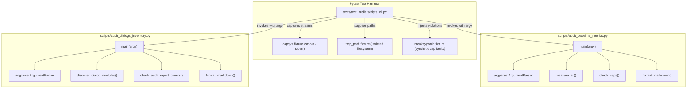

# PYPOST-1258: Dedicated unit tests for audit scripts CLI parsing and error handling

## Research

### 1. Analysis of `scripts/audit_baseline_metrics.py`

- **Purpose**: Enforces SOLID architectural LOC caps and baseline metric tracking across core
  modules.
- **CLI Entry Point**: `main(argv: list[str] | None = None) -> int`.
- **Argument Parser**: Uses standard library `argparse.ArgumentParser`.
- **Options**:
  - `--json <Path>`: Exports metric snapshot dictionary to the specified file path.
  - `--markdown <Path>`: Exports formatted markdown table to the specified file path. Parent
    directories are created if missing (`args.markdown.parent.mkdir(parents=True, exist_ok=True)`).
  - `--check`: Boolean flag. Evaluates `check_caps()` against `FILE_CAPS` and
    `MAIN_WINDOW_CLASS_CAP`. If violations occur, emits diagnostic lines to `sys.stderr` and
    returns exit code `1`. If clean, returns `0`.
  - Default (no options): Prints formatted markdown table to `sys.stdout` and returns `0`.
- **Error Handling & Exit Codes**:
  - Standard argparse rejection on unknown flags or missing arguments raises `SystemExit` with
    code `2` and writes error details to `sys.stderr`.
  - Violations under `--check` return integer `1`.
  - Clean runs return integer `0`.

### 2. Analysis of `scripts/audit_dialogs_inventory.py`

- **Purpose**: Discovers dialog modules under `pypost/ui/dialogs/` and verifies documentation
  coverage in `ai-tasks/PYPOST-374/30-dialogs-audit-report.md`.
- **CLI Entry Point**: `main(argv: list[str] | None = None) -> int`.
- **Argument Parser**: Uses `argparse.ArgumentParser`.
- **Options**:
  - `--json`: Boolean flag (`action="store_true"`). Dumps JSON representation to `sys.stdout`.
  - `--markdown`: Boolean flag (`action="store_true"`). Dumps Markdown table to `sys.stdout`.
  - `--check`: Boolean flag (`action="store_true"`). Checks if all discovered dialog files are
    present in the audit report file. If missing dialogs or missing report, prints issues to
    `sys.stderr` and returns `1`. If clean, prints `OK: <count> dialog module(s)...` to
    `sys.stdout` and returns `0`.
  - Default (no options): Prints tab-separated values (TSV) of paths and LOC to `sys.stdout`,
    ending with a `TOTAL` line, and returns `0`.
- **Error Handling & Exit Codes**:
  - Standard argparse rejection on unknown flags or unexpected positional arguments raises
    `SystemExit` with code `2` and writes to `sys.stderr`.
  - Coverage failure under `--check` returns integer `1`.
  - Clean execution returns integer `0`.

### 3. Gap Analysis in Existing Test Suites

- `tests/test_solid_audit_baseline.py`:
  - Validates `FILE_CAPS` constants, current LOC measurements, and Makefile target presence.
  - Does NOT test `main(argv)` argument parsing, flag branches, file output writing, stdout
    formatting, `--check` return codes, or error handling.
- `tests/test_dialogs_audit.py`:
  - Validates `discover_dialog_modules()` and `check_audit_report_covers()` against current disk.
  - Does NOT test `main(argv)` argument parsing, TSV/JSON/Markdown stdout output, `--check`
    exit code handling, or invalid argument rejection.
- Neither script has dedicated CLI unit tests verifying contract stability.

## Implementation Plan

### Test Suite Structure

A dedicated test module `tests/test_audit_scripts_cli.py` will be created with two primary test
classes:

1. `TestAuditBaselineMetricsCLI`:
   - `test_default_prints_markdown_to_stdout`: verifies `main([])` emits markdown report.
   - `test_json_export_writes_file`: verifies `main(["--json", <path>])` outputs valid JSON.
   - `test_markdown_export_creates_parent_and_file`: verifies `main(["--markdown", <nested_path>])`.
   - `test_combined_json_and_markdown`: verifies both file outputs generated simultaneously.
   - `test_check_clean_returns_zero`: verifies `main(["--check"]) == 0` on compliant repository.
   - `test_check_violation_returns_one_and_writes_stderr`: monkeypatches `check_caps` to simulate
     violations, verifying return code `1` and diagnostic stderr.
   - `test_invalid_argument_exits_code_two`: verifies `main(["--unknown"])` raises `SystemExit(2)`
     with stderr usage diagnostics.
   - `test_missing_option_argument_exits_code_two`: verifies `main(["--json"])` raises
     `SystemExit(2)` due to missing required path parameter.

2. `TestAuditDialogsInventoryCLI`:
   - `test_default_prints_tsv_to_stdout`: verifies `main([])` emits TSV lines and `TOTAL`.
   - `test_markdown_flag_prints_table`: verifies `main(["--markdown"])` emits markdown table.
   - `test_json_flag_prints_valid_json`: verifies `main(["--json"])` emits valid parseable JSON.
   - `test_check_clean_returns_zero_and_reports_ok`: verifies `main(["--check"]) == 0`.
   - `test_check_missing_report_returns_one`: monkeypatches `AUDIT_REPORT` to non-existent path,
     verifying return code `1` and stderr diagnostic.
   - `test_check_missing_dialog_returns_one`: monkeypatches `check_audit_report_covers` to return
     an unlisted dialog issue, verifying return code `1` and stderr emission.
   - `test_invalid_argument_exits_code_two`: verifies `main(["--invalid-flag"])` raises
     `SystemExit(2)` with stderr diagnostics.
   - `test_unexpected_positional_arg_exits_code_two`: verifies `main(["--json", "extra"])`
     raises `SystemExit(2)`.

### Mandatory — Failing Repro (next Step 3)

- **Target File**: `tests/test_pypost_1258_failing_repro.py`
- **Desired Behavior**: An automated red test executed prior to production test implementation
  that fails predictably, confirming the absence of dedicated CLI test protection for the audit
  scripts.
- **Assertion Design**:
  - The repro test will attempt to import `tests.test_audit_scripts_cli` and verify the presence
    of required test methods (`TestAuditBaselineMetricsCLI` and `TestAuditDialogsInventoryCLI`).
  - Because `tests/test_audit_scripts_cli.py` does not yet exist prior to Step 4, running
    `make test PYTEST_ARGS="tests/test_pypost_1258_failing_repro.py"` will fail immediately with
    `ModuleNotFoundError` (or explicit assertion failure).
  - External dependencies: None. Fully hermetic and in-process.
- **Sequencing**:
  1. Step 2 (Current): Architecture and design documented.
  2. Step 3 (Failing Repro): Author `tests/test_pypost_1258_failing_repro.py` and verify red status
     via `make test PYTEST_ARGS="..."`.
  3. Step 4 (Development): Implement `tests/test_audit_scripts_cli.py` and verify all tests pass.

## Architecture

### Module Interaction Diagram

### Module Responsibilities

| Module | Responsibility |
| --- | --- |
| `scripts/audit_baseline_metrics.py` | Measures codebase LOC against baseline caps, formats |
|                                    | markdown and JSON reports, checks compliance.       |
| `scripts/audit_dialogs_inventory.py`| Discovers dialog modules, formats TSV/Markdown/JSON, |
|                                    | verifies report documentation coverage.             |
| `tests/test_audit_scripts_cli.py`  | Dedicated unit test suite verifying CLI parsing,    |
|                                    | formatting branches, file writes, and exit codes.   |
| `tests/test_pypost_1258_failing_repro.py` | Step 3 automated failing repro validating the |
|                                           | gap prior to test suite implementation.      |

### Architectural Patterns

1. **In-Process Direct Invocation**:
   Instead of spawning subprocesses (`subprocess.run`), test cases invoke `main(argv)` directly in
   the current Python process. This reduces execution overhead from ~500ms to <5ms per test,
   ensures compatibility with test coverage measurement tools, and provides deterministic
   isolation.

2. **Standard Stream Interception**:
   Pytest's `capsys` fixture captures `sys.stdout` and `sys.stderr` emissions cleanly without
   interfering with test runner reporting or leaving uncaptured buffer state.

3. **Hermetic File System Isolation**:
   Tests targeting `--json <path>` and `--markdown <path>` utilize `tmp_path` (a unique per-test
   temporary directory) to ensure zero pollution or mutation of workspace files.

4. **Synthetic Fault Injection via Monkeypatching**:
   Negative scenarios (cap violations and unlisted dialog documentation) are tested using
   `monkeypatch.setattr` on `check_caps` or `check_audit_report_covers`. This guarantees tests
   remain stable regardless of future production code size changes.

### Interfaces and Data Contracts

- `main(argv: list[str] | None = None) -> int`:
  - Input: list of string arguments (e.g., `["--check"]`, `["--json", str(path)]`).
  - Output: integer exit code `0` (success/clean) or `1` (check failure).
  - Exceptions: `SystemExit(2)` on invalid CLI options or missing parameters.

## Q&A

**Q: Why not split into two separate test files?**
A: Both scripts are audit scripts located under `scripts/` with shared CLI testing patterns
(argparse validation, exit code contracts, and stdio formatting). Consolidating into
`tests/test_audit_scripts_cli.py` minimizes test file sprawl while keeping test classes cleanly
separated.

**Q: Why use `monkeypatch` instead of creating real oversized files for `--check` testing?**
A: Creating temporary oversized files or modifying existing codebase files introduces flakiness,
alters git status, and slows test execution. Monkeypatching `check_caps` and
`check_audit_report_covers` isolates the CLI and error-handling layer from filesystem state.

**Q: How does `argparse` signal errors in-process?**
A: When `argparse.ArgumentParser.parse_args()` encounters an invalid argument, it writes usage
diagnostics to `sys.stderr` and calls `sys.exit(2)`, which raises `SystemExit(code=2)`. Tests
catch this via `pytest.raises(SystemExit)` and assert `exc_info.value.code == 2`.
