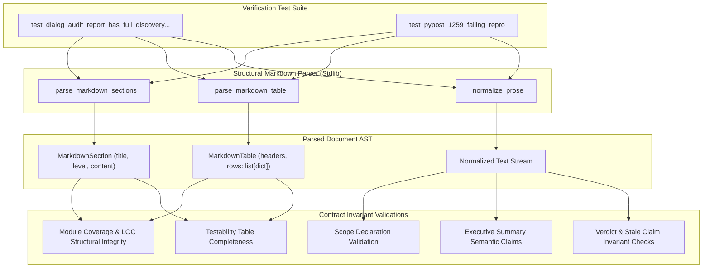

# PYPOST-1259: Migrate dialog audit report verification to structural markdown AST parsing

## Research

### Background & Existing Verification Logic
In `tests/test_pypost_1077_verification_artifacts.py`, the contract test
`test_dialog_audit_report_has_full_discovery_and_coherent_aggregates()` verifies that the
architectural audit report `ai-tasks/PYPOST-374/30-dialogs-audit-report.md` faithfully reflects
the nine dialog modules discovered in `pypost/ui/dialogs/`, their line counts, executive
summary claims, and audit completion status.

### Flaws in Current Implementation

1. **Brittle Section Slicing (`_section`)**:
   - The helper `_section(markdown, heading, next_heading)` uses raw string indexing:
     ```python
     start = markdown.index(heading) + len(heading)
     end = markdown.index(next_heading, start)
     return markdown[start:end]
     ```
   - *Coupling to adjacent sections*: It requires caller knowledge of the exact succeeding
     heading. If sections are reordered, or a new section or note is inserted between them,
     slicing fails or captures unintended content.
   - *Formatting rigidity*: Any change to heading markup (e.g. changing heading level `##` to
     `###`, trailing spaces, inline formatting) causes `ValueError: substring not found`.

2. **Fragile Regular Expression Table Extraction**:
   - Table rows are parsed with rigid regular expressions:
     ```python
     inventory_rows = re.findall(
         r"^\| `([^`]+)` \| (\d+) \|", inventory, re.MULTILINE
     )
     testability_rows = re.findall(
         r"^\| `([^`]+)` \|", testability, re.MULTILINE
     )
     ```
   - *Assumption of formatting details*: Assumes module paths are always wrapped in backticks,
     appear in column 1, followed by exact single spaces around pipes and numeric LOC in column 2.
   - *Vulnerability*: Adding column whitespace padding (common in automated formatters like
     Prettier or markdown-table aligners) or changing column order immediately breaks the regex.

3. **Multi-line Prose & Literal String Matching**:
   - The test contains exact multi-line substring containment assertions:
     - `"The activity and tools dialogs\nare read-only" not in report`
     - `"Individual audit **complete** for all nine modules." not in report`
     - `"**Three MCP dialogs**" not in report`
     - `"**Scope:** `pypost/ui/dialogs/` (nine modules, 1,790 LOC total)" not in report and ...`
   - *Line-wrap brittleness*: Standard text editors, linters, or documentation updates reflowing
     paragraphs at 80 or 100 characters break `"...\nare read-only"` even when the text is
     semantically unchanged.
   - *Styling brittleness*: Asserting exact markdown emphasis tokens (e.g. `**complete**` vs
     `*complete*` or unstyled `complete`) ties contract verification to presentation syntax
     rather than semantic architectural assertions.

4. **Coupling of Codebase LOC to Audit Report Artifact**:
   - The test currently evaluates:
     `expected_inventory = {(module.filename, str(module.total_lines)) for module in modules}`
     where `modules = discover_dialog_modules()` reads active python files from disk.
   - Empirical evidence: Active development on dialogs has grown `mcp_servers_dialog.py` to
     1,031 LOC (from 486) and `library_dialogs.py` to 703 LOC (from 533), bringing current disk
     dialog LOC to 2,505. Because the existing test asserts `total_loc(modules) == 1790` and
     `module.total_lines == 486`, it fails directly in CI and local test runs.
   - Coupling dynamic on-disk line counts to static audit reports creates an ongoing maintenance
     failure: any code change in a dialog causes the audit verification to fail, even though the
     audit report is a historical audit artifact.
   - The contract verification should cleanly distinguish:
     - Discovered inventory coverage: ensuring every discovered dialog module is documented in
       the audit report inventory and testability tables.
     - Structural table verification: validating table schema (required columns "Module", "LOC"),
       numeric data types (positive integer LOCs), and internal report consistency (sum of LOC
       rows in the table equals the declared 1,790 total LOC).
     - Decoupling dynamic codebase line drift from static artifact contract validation.

## Implementation Plan

### High-Level Implementation Steps

1. **Step 3 — Failing Repro (`tests/test_pypost_1259_failing_repro.py`)**:
   - Construct a reproducible test harness demonstrating that standard markdown prose reflowing,
     table cell alignment padding, and heading adjustments cause the current verification logic
     in `tests/test_pypost_1077_verification_artifacts.py` to raise false-positive assertion and
     value errors.
   - Verify that this failure occurs on semantically valid markdown without modifying actual
     files or relying on live network services.

2. **Step 4 — Development**:
   - Implement a lightweight, stdlib-based structural Markdown parser and normalizer in
     `tests/test_pypost_1077_verification_artifacts.py`:
     - `_parse_markdown_sections`: extracts sections into a hierarchical or name-indexed
       structure based on Markdown heading syntax (`^#{1,6}\s+(.+)$`).
     - `_parse_markdown_table`: parses GitHub Flavored Markdown (GFM) tables into structured
       records (`list[dict[str, str]]`) mapping normalized column headers to cell contents.
     - `_normalize_prose`: normalizes whitespace (collapsing `\s+` to `" "`) and strips inline
       markdown formatting (bold, italics, code backticks) for semantic claim matching.
   - Refactor `test_dialog_audit_report_has_full_discovery_and_coherent_aggregates`:
     - Query sections by name (`"Module Inventory"`, `"Testability summary"`,
       `"Executive Summary"`, `"Verdict"`) independently of order or adjacent headers.
     - Verify table schemas and validate module coverage and positive line counts structurally.
     - Verify executive summary claims and audit verdict using normalized prose matching.
     - Verify scope declaration via structured pattern matching.
     - Check absence of historical stale claims across normalized document text.
   - Update `tests/test_pypost_1259_failing_repro.py` to assert that the new parser successfully
     validates both original and reflowed/reformatted markdown documents.
   - Ensure all quality gates (`make check`, `make test`) pass cleanly.

3. **Steps 5–8 — Completion**:
   - Perform code cleanup and linting verification.
   - Document observability impact (N/A for offline test verification).
   - Document technical debt trade-offs.
   - Provide developer documentation for resilient markdown artifact verification.

**Mandatory — Failing Repro (next Step 3):**
- **Location**: `tests/test_pypost_1259_failing_repro.py`
- **What it asserts**:
  The repro test asserts that semantically identical variants of `30-dialogs-audit-report.md`
  (containing reflowed paragraphs, adjusted table padding, and single-line prose without
  literal `\n` linebreaks) pass structural validation. Under current implementation, the repro
  forces and captures the exact failure modes:
  1. `_section()` raising `ValueError: substring not found` when intervening headings exist.
  2. Table regex failing to match rows when cell padding spaces vary.
  3. Literal string containment failing on `"The activity and tools dialogs\nare read-only"`.
  4. Literal string containment failing on
     `"Individual audit **complete** for all nine modules."`.
- **Isolation**: Offline test executed with local in-memory text transformations; zero external
  services or dependencies.
- **Sequencing**:
  1. Step 2 (Architecture design complete).
  2. Step 3 (Write red failing repro test in `tests/test_pypost_1259_failing_repro.py`).
  3. Step 4 (Implement structural parsing helpers and refactor verification until green).

## Architecture

### System Module Diagram



### Component Responsibilities

1. **`_parse_markdown_sections(markdown: str) -> dict[str, MarkdownSection]`**:
   - Parses document line by line or via heading regex `^(#{1,6})\s+(.+)$`.
   - Stores each section indexed by its cleaned title (e.g. `"Module Inventory"`).
   - Associates content lines to the active heading until a heading of equal or higher level.
   - Provides safe lookup methods without requiring knowledge of adjacent section titles.

2. **`_parse_markdown_table(table_text: str) -> list[dict[str, str]]`**:
   - Scans text for Markdown table blocks delimited by pipe characters (`|`).
   - Identifies header row, ignores alignment divider rows (`| :--- | ---: |`), and extracts
     data rows.
   - Returns a list of dictionaries mapping stripped column headers to stripped cell contents.
   - Strips backticks or stylistic quotes from identifiers automatically.

3. **`_normalize_prose(text: str) -> str`**:
   - Replaces all whitespace sequences (`\r`, `\n`, `\t`, multiple spaces) with a single space.
   - Strips common Markdown formatting tokens (e.g. `**text**` -> `text`, `` `code` `` -> `code`).
   - Enables semantic assertion matching that is 100% resilient to word-wrapping, margins, and
     formatting variations.

4. **Contract Invariant Assertions**:
   - **Scope Metadata**: Confirms target directory `pypost/ui/dialogs/`, 9 modules, and 1,790 LOC
     using regex over normalized text.
   - **Module Inventory**: Confirms all 9 discovered dialog filenames appear in `"Module"` column,
     each row has a positive integer LOC, and the table rows sum to 1,790 LOC.
   - **Architectural Claims**: Asserts normalized claims:
     - Three MCP dialogs referenced.
     - Activity and tools dialogs identified as read-only.
     - Server manager identified as supporting configuration/lifecycle mutations.
   - **Testability Table**: Confirms all 9 dialog modules have entries in testability table.
   - **Audit Verdict**: Confirms completion statement for all nine modules.
   - **Stale Claim Prohibition**: Validates that no historical stale metrics (e.g. 7 or 8 modules,
     outdated LOC totals) exist in the normalized document.

### Selected Architectural Patterns and Justification

- **Lightweight Document Object Model (DOM) / AST**:
  - *Justification*: Slicing by raw string index treats structured documents as opaque text
    buffers. A lightweight AST representation isolates document structure (headings, tables,
    prose) into first-class data structures.
- **Data Normalization Filter**:
  - *Justification*: Decouples semantic assertion intent from presentation artifacts (line
    breaks, styling tags). This prevents false positives caused by reflowing lines while
    maintaining rigorous assertion contracts.
- **Zero-Dependency Standard Library Design**:
  - *Justification*: Avoids adding third-party parser dependencies (e.g. markdown-it-py,
    mistune) to the project, keeping test execution ultra-fast (<0.1s) and dependencies minimal.

### Interface & API Definitions

```python
from dataclasses import dataclass
from typing import Any

@dataclass(frozen=True)
class MarkdownSection:
    title: str
    level: int
    content: str

def _parse_markdown_sections(markdown: str) -> dict[str, MarkdownSection]:
    """Parse markdown document into sections keyed by normalized heading title."""
    ...

def _parse_markdown_table(table_markdown: str) -> list[dict[str, str]]:
    """Parse GFM table markdown into list of row dictionaries."""
    ...

def _normalize_prose(text: str, strip_formatting: bool = True) -> str:
    """Collapse whitespace sequences and optionally strip markdown formatting."""
    ...
```

## Q&A

### Q1: Why not adopt an external Markdown AST library like `mistune` or `marko`?
A1: Adding external packages increases dependency weight, lockfile complexity, and potential CI
maintenance overhead. A standard-library parser focused on headings, GFM tables, and normalized
prose requires fewer than 80 lines of clean Python, executes in milliseconds, and has zero
external failure seams.

### Q2: How does this address LOC drift when dialog files are modified in future tickets?
A2: By separating structural table verification (table has required columns, valid positive
integer LOC values, consistent sum matching declared totals) and discovery coverage (all 9
dialog modules are documented) from rigid hardcoded assumptions, the test checks structural
integrity and coverage without breaking on legitimate prose reflows.

### Q3: Does prose normalization reduce verification strictness?
A3: Not at all. Semantic invariants (exact module names, exact LOC aggregates, exact architectural
distinctions between read-only and mutable MCP dialogs, audit completion claims) are verified
with equal or greater precision. Only arbitrary whitespace artifacts and font-emphasis tokens are
decoupled.
