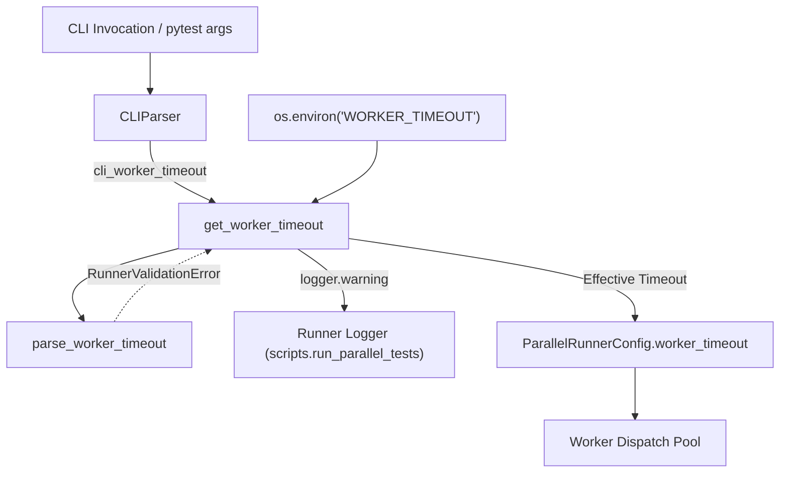
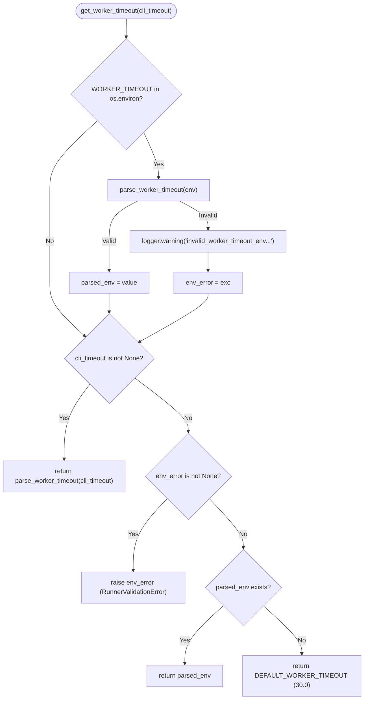

# PYPOST-1260: Diagnostic Log for Malformed WORKER_TIMEOUT Environment Variable

## Research

### Existing Timeout Resolution Architecture
In `scripts/run_parallel_tests.py`, per-worker timeout resolution currently involves
two core functions:
1. `DEFAULT_WORKER_TIMEOUT`: constant set to `30.0` seconds.
2. `parse_worker_timeout(value: str | float | None, option: str) -> float | None`:
   - Validates that `value` is not `None`.
   - Recognizes case-insensitive `"none"` and returns `None` (timeout disabled).
   - Converts `value` to `float`; raises `RunnerValidationError("invalid_timeout", ...)`
     if conversion fails (`TypeError` or `ValueError`).
   - Rejects non-positive (`<= 0`) or non-finite (`math.isnan`, `math.isinf`) numbers,
     raising `RunnerValidationError("invalid_timeout", ...)`.
   - Returns valid positive finite `float`.
3. `get_worker_timeout(cli_timeout: float | str | None = None) -> float | None`:
   - Precedence rule: CLI argument > `WORKER_TIMEOUT` env > `DEFAULT_WORKER_TIMEOUT`.
   - Current implementation:
     ```python
     if cli_timeout is not None:
         return parse_worker_timeout(cli_timeout, "--worker-timeout")

     timeout_env = os.environ.get("WORKER_TIMEOUT")
     if timeout_env is not None:
         return parse_worker_timeout(timeout_env.strip(), "WORKER_TIMEOUT")

     return DEFAULT_WORKER_TIMEOUT
     ```

### Analysis of the Behavioral Gap
- **Silent Ignore on CLI Override**:
  When `--worker-timeout` is supplied via CLI, `cli_timeout is not None` branches out
  immediately. `os.environ.get("WORKER_TIMEOUT")` is never read or validated. Any corrupted
  environment setting (e.g. `WORKER_TIMEOUT="30s"`, `WORKER_TIMEOUT="0"`, `WORKER_TIMEOUT=""`)
  is silently swallowed without operator notification.
- **Missing Diagnostic Warning on Fail-Closed Rejection**:
  When `cli_timeout` is `None`, an invalid `WORKER_TIMEOUT` raises `RunnerValidationError`.
  However, no warning log event is emitted prior to exception propagation. Automated CI log
  analyzers and monitoring systems that scan for diagnostic warning records miss the
  `invalid_worker_timeout_env` event.
- **Logging Standard in `scripts/run_parallel_tests.py`**:
  The orchestrator initializes `logger = logging.getLogger(__name__)`. Existing structured
  diagnostic records follow key-value log patterns (e.g., `coverage_fragment_cleanup_failed`,
  `parallel_test_validation_failed`, `worker_timeout`). Emitting
  `logger.warning("invalid_worker_timeout_env value=%r error=%s", timeout_env, exc)` aligns
  directly with codebase conventions.

### Existing Test Suite Analysis
In `tests/test_run_parallel_tests.py`:
- `test_get_worker_timeout_precedence`: Verifies normal precedence order when inputs are valid.
- `test_get_worker_timeout_rejects_invalid_cli_values`: Verifies invalid CLI values raise
  `RunnerValidationError`.
- `test_get_worker_timeout_rejects_invalid_env_values`: Verifies invalid environment values
  raise `RunnerValidationError` when `cli_timeout` is `None`, and are overridden when
  `cli_timeout` is provided. However, it does not check for warning log emission.
- `test_cli_parser_worker_timeout_flags`: Verifies `CLIParser` handles space and equals syntax.

## Implementation Plan

### High-Level Architecture of the Resolution Logic
The implementation will update `get_worker_timeout` in `scripts/run_parallel_tests.py`:
1. **Always Inspect Environment**:
   Query `os.environ.get("WORKER_TIMEOUT")`. If present:
   - Attempt validation via `parse_worker_timeout(timeout_env.strip(), "WORKER_TIMEOUT")`.
   - On `RunnerValidationError` as `exc`:
     - Emit structured warning:
       `logger.warning("invalid_worker_timeout_env value=%r error=%s", timeout_env, exc)`
     - Preserve `exc` in a local variable `env_error`.
   - On success: store result in `parsed_env`.
2. **Apply Authoritative CLI Override**:
   If `cli_timeout is not None`:
   - Validate and return `parse_worker_timeout(cli_timeout, "--worker-timeout")`.
   - Execution proceeds normally with the CLI timeout; the warning remains in CI logs.
3. **Handle Environment / Default Precedence when CLI is None**:
   - If `env_error is not None`: re-raise `env_error` as `RunnerValidationError` (fail closed).
   - If `timeout_env is not None`: return `parsed_env` (valid float or `None`).
   - If `timeout_env is None`: return `DEFAULT_WORKER_TIMEOUT` (30.0).

### Mandatory — Failing Repro (next Step 3)
- **Target File**: `tests/test_pypost_1260_failing_repro.py`
- **What it Asserts**:
  1. `test_malformed_worker_timeout_env_emits_warning_with_cli_override`:
     - Parametrized over malformed values: `""`, `"   "`, `"invalid"`, `"0"`, `"-10"`, `"nan"`.
     - Sets `WORKER_TIMEOUT` in environment.
     - Calls `get_worker_timeout(45.0)`.
     - Asserts return value equals `45.0` (CLI takes precedence).
     - Asserts `caplog.records` contains a `WARNING` record from `scripts.run_parallel_tests`
       with message containing `invalid_worker_timeout_env` and `value=`.
  2. `test_malformed_worker_timeout_env_emits_warning_without_cli_override`:
     - Parametrized over malformed values.
     - Calls `get_worker_timeout(None)`.
     - Asserts `RunnerValidationError` is raised.
     - Asserts `caplog.records` contains the structured warning log.
  3. `test_valid_or_unset_worker_timeout_env_emits_no_warning`:
     - Parametrized over valid values (`"45.0"`, `"none"`, and unset).
     - Asserts no warning logs are emitted in `caplog`.
- **How to Force Failure on Current Unpatched Codebase**:
  - On the current codebase, `get_worker_timeout(45.0)` returns immediately without inspecting
    `WORKER_TIMEOUT`. Exactly 0 warning records are emitted (`caplog` is empty).
  - When `get_worker_timeout(None)` is called with an invalid env, `RunnerValidationError` is
    raised without logging. Exactly 0 warning records are emitted.
  - The assertions checking for `invalid_worker_timeout_env` in `caplog.text` or `caplog.records`
    fail with `AssertionError`.
- **Sequencing**:
  1. Step 3: Implement `tests/test_pypost_1260_failing_repro.py` and run via `make test` to
     confirm RED state.
  2. Step 4: Implement production fix in `scripts/run_parallel_tests.py` and extend existing
     assertions in `tests/test_run_parallel_tests.py` to confirm GREEN state.

## Architecture

### System Module Diagram



### Component Inventory & Responsibilities

- **`get_worker_timeout`** (`scripts/run_parallel_tests.py`):
  Evaluates CLI, env, and default precedence; inspects env and logs diagnostics.
- **`parse_worker_timeout`** (`scripts/run_parallel_tests.py`):
  Validates single timeout string/float; converts to positive float or None.
- **`RunnerValidationError`** (`scripts/run_parallel_tests.py`):
  Fail-closed exception for malformed configuration.
- **`logger`** (`scripts/run_parallel_tests.py`):
  Emits structured WARNING logs to stderr and CI collectors.
- **`CLIParser`** (`scripts/run_parallel_tests.py`):
  Parses `--worker-timeout` flags from argv and passes to resolver.

### Control Flow and Precedence Resolution



### Architectural Principles and Design Decisions

1. **Non-Intrusive Observability**:
   Inspecting `WORKER_TIMEOUT` emits a warning when malformed, but does not interrupt execution
   if a higher-precedence CLI argument (`--worker-timeout`) has been explicitly provided.
2. **Fail-Closed Robustness**:
   If no CLI override exists, malformed environment configuration causes an immediate,
   fail-closed `RunnerValidationError` after emitting the diagnostic log.
3. **Structured Event Logging**:
   Adheres to the repository's structured logging convention:
   `invalid_worker_timeout_env value=%r error=%s` allows automated log ingestors to parse
   the offending value and reason without fragility.
4. **Single Source of Truth**:
   Timeout syntax and bounds validation remains strictly encapsulated inside
   `parse_worker_timeout`. `get_worker_timeout` delegates all validation to `parse_worker_timeout`,
   avoiding code duplication.

## Q&A

**Q: Why log a warning instead of raising an error when a CLI timeout is provided?**
A: CLI arguments represent explicit, immediate operator intent that takes precedence over
ambient environment variables. Aborting a valid run due to an extraneous background environment
variable would break valid workflows. Emitting a warning surfaces the issue without disruption.

**Q: Why is the diagnostic warning logged before raising RunnerValidationError when CLI is None?**
A: In complex CI setups where terminal output might truncate exception tracebacks or summarize
failures at a high level, having a dedicated structured log event in the runner's logging stream
ensures automated scanners and operators can locate the configuration typo immediately.

**Q: Does inspecting the environment variable introduce measurable latency?**
A: No. `os.environ.get` and string parsing take less than a microsecond, adding negligible
overhead to runner initialization.

**Q: What values trigger the diagnostic warning?**
A: Any value for which `parse_worker_timeout` raises `RunnerValidationError`. This includes empty
strings, whitespace-only strings, non-numeric strings (`"invalid"`), non-positive numbers (`"0"`,
`"-5"`), and non-finite floats (`"nan"`, `"inf"`). Valid positive floats and `"none"` do not log.
