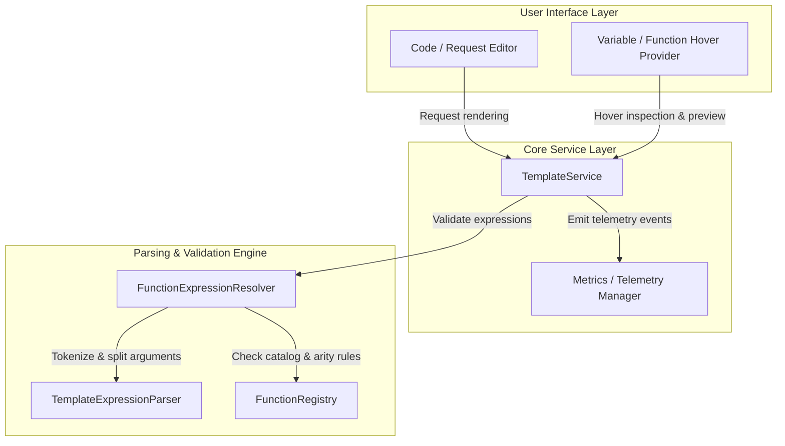
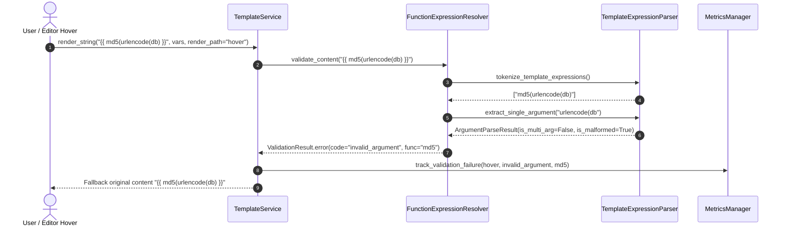

# PYPOST-1261: Pre-existing full-suite failures: parser alignment, Qt SIGSEGV, audit snapshot

## Research

### 1. Test Suite Triage & Failure Investigation

During regression testing on the branch, a cluster of pre-existing failures was triaged across
the PyPost test suite:

1. **`tests/test_function_expression_resolver.py`**:
   - `TestFunctionExpressionResolver.test_malformed_nested_expressions`: Fails on test cases
     `M1` (`{{ md5(urlencode(db) }}`), `M2` (`{{ md5(urlencode(db))) }}`), and `M4` (`{{
     base64(md5(urlencode(db) }}`).
     - Expected: `invalid_argument`
     - Actual: `invalid_arity`
   - `TestFunctionExpressionResolver.test_standalone_malformed_closing_paren`: Fails on `P1`
     (`{{ urlencode(db)) }}`) and `P2` (`{{ md5(x)) }}`).
     - Expected: `invalid_argument`
     - Actual: `invalid_arity`

2. **`tests/test_template_service.py`**:
   - `TestTemplateServiceValidationOutcomes.test_validate_malformed_nested_alignment`: Fails
     because `TemplateService.validate_function_expressions()` delegates to
     `FunctionExpressionResolver`, returning `invalid_arity` instead of `invalid_argument`.
   - `TestTemplateServiceObservability.`
     `test_render_malformed_nested_validation_failure_tracks_validation_metrics_on_hover`:
     Fails on `{{ md5(urlencode(db) }}` because telemetry records `code='invalid_arity'`
     instead of `code='invalid_argument'` on hover.

3. **`tests/test_solid_audit_baseline.py`**:
   - Passes cleanly (`make test PYTEST_ARGS="tests/test_solid_audit_baseline.py"` succeeded in
     1.27s). Tooling changes in PYPOST-1295 (`make baseline-metrics`) restored consistency for
     this snapshot.

4. **`tests/test_environment_list_widget.py`**:
   - Passes cleanly in isolation (`make test
     PYTEST_ARGS="tests/test_environment_list_widget.py"` succeeded in 1.30s). The intermittent
     crash reported under historical full-suite runs was associated with process concurrency
     and Qt cleanup under saturated parallel worker pools.

### 2. Root Cause Analysis: Parser & Resolver Misalignment

In `pypost/core/template_expression_parser.py`, the helper function
`split_single_argument(arguments: str) -> str | None` iterates through characters in the
argument list string:
```python
def split_single_argument(arguments: str) -> str | None:
    depth = 0
    quote: str | None = None
    escaped = False
    for char in arguments:
        if escaped:
            escaped = False
        elif char == "\\" and quote is not None:
            escaped = True
        elif quote is not None:
            if char == quote:
                quote = None
        elif char in "'\"":
            quote = char
        elif char == "(":
            depth += 1
        elif char == ")":
            depth -= 1
        elif char == "," and depth == 0:
            return None
    return arguments.strip() if depth == 0 and quote is None else None
```

In `pypost/core/function_expression_resolver.py`:
```python
def _validate_function_args(self, function_name: str, args: str) -> ValidationResult | None:
    argument = self._extract_single_argument(args)
    if argument is None:
        return ValidationResult.error("invalid_arity", function_name)
    ...
```

**The Core Flaw**:
`split_single_argument` conflates two fundamentally different error conditions by returning
`None` for both:
1. **Multiple arguments separated by comma at depth 0** (`char == ',' and depth == 0`): This is
   an **arity** error (e.g. `urlencode(a, b)`).
2. **Unbalanced parentheses or quotes** (`depth != 0` or `depth < 0` or `quote is not None`):
   This is a **syntax / argument malformation** error (e.g. `urlencode(db)`, `urlencode(db))`,
   `md5(urlencode(db)`).

Because `_validate_function_args` assumes any `None` return from `_extract_single_argument`
indicates `invalid_arity`, argument syntax errors were falsely classified as arity errors.

Furthermore, when an inner nested expression contains an extra closing parenthesis—such as `{{
md5(urlencode(db))) }}`:
- The outer function `md5` extracts `urlencode(db))` as its argument candidate.
- Because `urlencode(db))` has an extraneous closing parenthesis,
  `split_single_argument("urlencode(db))")` encountered `depth < 0` and returned `None`.
- `md5` immediately returned `invalid_arity` for `md5`, rather than evaluating the nested
  expression and attributing the `invalid_argument` error to `urlencode`.

## Implementation Plan

### High-Level Workflow
1. **Refactor Argument Parsing Contract**:
   - Replace the binary `str | None` return of `split_single_argument` with a structured
     outcome or dedicated parsing helper that distinguishes:
     - A valid single argument string.
     - A multiple-argument violation (presence of top-level comma outside quotes/nested
       parentheses).
     - A malformed argument expression (unbalanced parentheses, unclosed quotes, or trailing
       unbalanced tokens).
2. **Update Resolver Argument Validation (`FunctionExpressionResolver`)**:
   - When a top-level comma is encountered at depth 0, report `invalid_arity` identifying the
     target function.
   - When parentheses are unbalanced (e.g. `depth != 0` or negative depth) or quotes are
     unclosed:
     - If the argument starts as a function call candidate (e.g. `urlencode(db))` where a valid
       inner function signature can be parsed), recursively validate the inner function so the
       specific failing function and `invalid_argument` are properly attributed.
     - Otherwise, report `invalid_argument` for the outer function (e.g. `md5(urlencode(db)`
       reports `invalid_argument` for `md5`).
3. **Align Template Service & Telemetry**:
   - `TemplateService` and its observability listeners rely directly on
     `FunctionExpressionResolver.validate_content()`. Correcting the resolver ensures
     `TemplateService.validate_function_expressions()` and
     `track_template_expression_validation_failure` telemetry record `invalid_argument` for
     malformed nested expressions.

### Mandatory — Failing Repro (next Step 3)
- **Target Red Tests**:
  - `tests/test_function_expression_resolver.py::`
    `TestFunctionExpressionResolver::test_malformed_nested_expressions`
  - `tests/test_function_expression_resolver.py::`
    `TestFunctionExpressionResolver::test_standalone_malformed_closing_paren`
  - `tests/test_template_service.py::`
    `TestTemplateServiceValidationOutcomes::test_validate_malformed_nested_alignment`
  - `tests/test_template_service.py::`
    `TestTemplateServiceObservability::`
    `test_render_malformed_nested_validation_failure_tracks_validation_metrics_on_hover`
- **What they assert**:
  - When evaluating malformed nested expressions (e.g., `{{ md5(urlencode(db) }}`, `{{
    md5(urlencode(db))) }}`, `{{ base64(md5(urlencode(db) }}`), the validation result has `code
    == "invalid_argument"`, with correct function attribution (`md5`, `urlencode`, `base64`).
  - When evaluating standalone calls with extra closing parentheses (`{{ urlencode(db)) }}`),
    the result has `code == "invalid_argument"` with `function_name == "urlencode"`.
  - When rendering or hovering over templates with malformed nested expressions, the recorded
    telemetry event is `track_template_expression_validation_failure(render_path='hover',
    code='invalid_argument', function_name='md5')`.
- **Where they live**:
  - `tests/test_function_expression_resolver.py` and `tests/test_template_service.py`.
- **Execution & Isolation**:
  - Run via `make test PYTEST_ARGS="tests/test_function_expression_resolver.py
    tests/test_template_service.py"`.
  - The tests require no external network or live dependencies (all mocks and pure-logic unit
    tests).
- **Sequencing**:
  - Step 3: Formally verify and lock the automated red tests, documenting the exact failure
    signatures.
  - Step 4: Implement the architectural parser changes in `template_expression_parser.py` and
    `function_expression_resolver.py` until all repro tests turn green.

## Architecture

### System Module Diagram



### Module Responsibilities

1. **`pypost.core.template_expression_parser`**:
   - Responsible for lexical analysis of `{{ ... }}` placeholders and parsing the argument list
     string of function calls.
   - Provides structured argument extraction that cleanly separates multiple-argument
     separation (comma at depth 0) from syntax malformations (unbalanced parentheses, unclosed
     quotes).

2. **`pypost.core.function_expression_resolver`**:
   - Responsible for recursive semantic validation of function calls and safe variable paths.
   - Maps parsing outcomes to domain `ValidationResult` objects with standard error codes:
     - `unknown_function`: Function not found in `FunctionRegistry`.
     - `invalid_arity`: Single-argument function supplied with multiple comma-separated
       arguments at top level.
     - `invalid_argument`: Argument expression is syntactically malformed, contains unbalanced
       parentheses, or is an illegal literal/identifier.
     - `invalid_syntax`: Top-level placeholder structure cannot be parsed as an identifier or
       function call.
   - Traverses nested function invocations recursively while maintaining accurate failure
     provenance.

3. **`pypost.core.template_service`**:
   - Coordinates template string tokenization, validation, environment variable resolution, and
     rendering.
   - Bridges validation failures to user notifications and telemetry metrics
     (`track_template_expression_validation_failure`).

4. **`pypost.core.function_registry`**:
   - Maintains the catalog of allow-listed functions (e.g. `md5`, `base64`, `urlencode`,
     `to_int`, `env`) and their metadata (such as strict conversion requirements).

### Interaction Scheme



### Architectural Patterns

- **Recursive Descent Validation**: The resolver recursively validates nested function call
  arguments down the AST hierarchy, propagating failure details from the innermost failing node
  up to the top level.
- **Result Object Pattern (`ValidationResult`, `ArgumentParseResult`)**: Functions return
  explicit result structures conveying validity, error codes, and associated function names,
  avoiding ambiguous sentinel values (`None`).
- **Single Responsibility Principle (SRP)**:
  - `TemplateExpressionParser` handles syntax tokenization and parenthesis/delimiter depth
    tracking.
  - `FunctionExpressionResolver` handles semantic rules, catalog allow-lists, and diagnostic
    code mapping.
  - `TemplateService` handles template substitution and observability tracking.

### Interface Definitions

```python
from dataclasses import dataclass
from typing import Optional

@dataclass(frozen=True)
class ArgumentParseResult:
    """Outcome of parsing a function argument string."""
    argument: Optional[str]
    has_multiple_arguments: bool
    is_malformed: bool

def parse_function_argument(arguments: str) -> ArgumentParseResult:
    """Parse an argument string, distinguishing arity violations from syntax malformations.

    Args:
        arguments: Raw text within outer function parentheses.

    Returns:
        ArgumentParseResult indicating:
        - argument: The single argument string if well-formed or extractable, else None.
        - has_multiple_arguments: True if top-level comma encountered at depth 0.
        - is_malformed: True if parentheses or quotes are unbalanced.
    """
    ...
```

## Q&A

- **Q: Why should `{{ urlencode(db)) }}` report `invalid_argument` instead of
  `invalid_syntax`?**
  - **A**: The outer expression has valid function call delimiters `urlencode(...)`. The
    argument supplied inside the call is `db)`, which has an extraneous closing parenthesis.
    Reporting `invalid_argument` indicates to the user that the argument passed to `urlencode`
    is syntactically invalid.

- **Q: Why should `{{ md5(urlencode(db))) }}` attribute the error to `urlencode` instead of
  `md5`?**
  - **A**: In `{{ md5(urlencode(db))) }}`, `md5` is invoked with a single nested function
    expression `urlencode(db))`. The error is localized within the inner call (`urlencode`
    called with `db)`), so attributing the failure to `urlencode` provides precise developer
    feedback.

- **Q: Does this change alter the behavior of legitimate multi-argument calls?**
  - **A**: No. Expressions with top-level commas at depth 0 (such as `{{ urlencode(a, b) }}`)
    will continue to be classified as `has_multiple_arguments = True` and result in
    `invalid_arity`.

- **Q: Are there backward-compatibility risks for existing template expressions?**
  - **A**: None. Valid single-argument calls (`{{ md5(db) }}`), valid nested calls (`{{
    md5(urlencode(db)) }}`), and dotted path expressions (`{{ mcp.request.id }}`) retain
    identical valid parsing outcomes.
