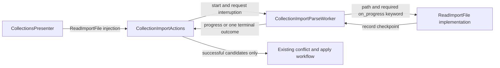

# PYPOST-1266: Typed collection import reader contract

## Research

The approved [requirements](10-requirements.md) address reader-dependent cancellation, originating
in [PYPOST-1229 debt item 1](../PYPOST-1229/60-tech-debt.md). Repository inspection found:

- `pypost/core/qt/collection_import_parse_worker.py` declares `ReadImportFile` as
  `Callable[..., ...]`. Its signature inspection decides whether to supply `on_progress`; failure
  to inspect a callable takes the same no-callback path as a single-argument reader.
- The worker already checks interruption before reading, after each progress signal, and before
  publishing a result. `CollectionImportCancelled` unwinds reading into `parse_cancelled`.
- `load_collection_import_candidates()` accepts an optional progress callback and invokes it after
  each record, including invalid records. Callback exceptions propagate outside record validation.
  Loading and decoding precede these checkpoints.
- `CollectionImportActions` already consumes `ReadImportFile`; `CollectionsPresenter` and the
  helper in `tests/test_collections_import_ui.py` still describe a single-argument callable.
- `tests/test_collection_import_progress.py` explicitly expects a legacy single-argument reader
  to succeed. `tests/test_collection_import_responsiveness.py` injects another such reader.
- Synchronous core callers, library imports, and environment imports have separate responsibilities
  and do not require migration to the background collection worker contract.

Python's [callback protocol specification](https://typing.python.org/en/latest/spec/callables.html)
supports declaring keyword parameters through `Protocol.__call__`. Its assignability rules allow
an implementation to accept a broader set of calls than the protocol requires. Therefore the
existing parser's optional callback can implement a worker contract requiring the keyword.

## Implementation Plan

1. Complete Step 3's independent red-test review before changing production code.
2. Replace the existing worker-module `ReadImportFile` alias with the protocol below. Remove
   `inspect`, `_callable_accepts_progress()`, and the no-callback branch; call every reader directly
   with `on_progress=_emit_progress`.
3. Propagate `ReadImportFile | None` to the presenter's injection parameter and affected collection
   test helper annotations. Keep the existing import location for `CollectionImportActions`.
4. Update collection worker/presenter reader fakes that lack the keyword. Fakes that model record
   processing must call the supplied checkpoint at their processing boundary and let it unwind.
   Existing optional-callback fakes already accept the required call shape; no blanket signature
   rewrite is necessary. A fake raising a file error before any record need not emit progress.
5. Run focused contract, parser, progress, cancellation, responsiveness, and presenter regressions
   through `make test`; run `make lint`, `make typecheck`, and `make verify-ai-tasks` at the relevant
   later quality gates. Update `doc/dev/collection_import.md` in Step 8 to describe the contract.

### Failing Repro: Step 3

Use a focused `tests/test_collection_import_reader_contract.py` module with an explicit timeout
marker and finite event-loop/thread waits. Use `qapp`, signal capture, and injected readers rather
than live services or elapsed-time assertions. Retain worker references through bounded cleanup.

- Add an opaque callable reader whose `__signature__` metadata is invalid for `inspect.signature`,
  but whose real `__call__` accepts `path` and keyword `on_progress`. Give the callback a default
  only to expose the old fallback: without it, reading finishes without a checkpoint. With it,
  invoke the callback after record one of a short deterministic sequence. A direct-connected
  progress handler requests interruption in the worker thread before `_emit_progress` checks it.
  Assert one processed record, one progress notification, exactly one `parse_cancelled`, and zero
  completed/failed signals. The baseline skips the callback and completes, so this must be red.
- Replace `test_collection_import_parse_worker_supports_legacy_single_arg_reader` in the existing
  progress module with rejection coverage: the reader body must not execute, `parse_failed` must
  contain `TypeError`, and neither completion nor cancellation may be emitted. The baseline calls
  its body and succeeds, so this must also be red. Preserve the `progress` alias assertion.

Run `make test PYTEST_ARGS='tests/test_collection_import_reader_contract.py
tests/test_collection_import_progress.py' WORKERS=1 WORKER_TIMEOUT=60` and record the expected
assertion failures before production changes. Review the red artifacts independently, then apply
the implementation until green. Additional supported-shape and production checks belong to the
same focused contract module during Step 4.

## Architecture

### Components and dependencies



- `CollectionsPresenter` selects the production reader or an injected compatible implementation.
- `CollectionImportActions` owns worker lifecycle and existing terminal outcome handling.
- `CollectionImportParseWorker` owns Qt interruption checks, progress signals, and cancellation
  exception handling. It always supplies its checkpoint and never inspects a reader signature.
- `ReadImportFile` defines the structural dependency injection boundary in the existing worker
  module. Functions, bound methods, and callable objects need no inheritance or registration.
- `load_collection_import_candidates()` remains the Qt-free production implementation. Its
  optional callback supports synchronous callers; the background worker always supplies one.
- Collection test substitutes obey the same boundary and propagate checkpoint exceptions.

### Main interface

```python
class ReadImportFile(Protocol):
    def __call__(
        self,
        path: Path,
        /,
        *,
        on_progress: Callable[[int, int], None],
    ) -> tuple[list[Collection], list[str]]: ...
```

`path` is positional-only in the protocol so implementation parameter names such as `_path` do
not affect compatibility. `on_progress` is a required keyword at this boundary. Implementations
may accept it as keyword-only, positional-or-keyword, or a correctly typed keyword forwarding
argument, and may give it an optional default. A positional-only callback, a differently named
keyword without forwarding, or a single-argument reader does not meet the contract.

Each reader must invoke the supplied callback at its existing safe record checkpoints and allow
callback exceptions to propagate immediately. The type declaration proves call compatibility;
behavioral tests prove cooperative cancellation. Neither runtime protocol checks nor a new token,
adapter, signature validator, or capability registry is needed.

The worker performs `reader(path, on_progress=_emit_progress)` once. Its callback emits existing
progress and checks interruption; cancellation unwinds through `CollectionImportCancelled` to one
`parse_cancelled`. The pre-read and pre-publication guards remain. Unsupported readers fail through
the existing generic `parse_failed` route with `TypeError`; no retry omits the checkpoint. Ordinary
file errors retain `CollectionImportFileError`, and successful candidates and record errors retain
their current return and signal shapes.

### Contract validation and limits

- Parameterize function keyword-only and positional-or-keyword forms, a bound method, a callable
  object, and keyword forwarding. Cover successful return/progress and interruption at a checkpoint
  for these supported shapes, including the opaque metadata regression.
- Exercise the actual production reader with a small temporary JSON collection list through the
  worker. Check normal candidates/errors/progress and checkpoint cancellation without publication.
  Broader JSON/YAML and lifecycle matrices remain PYPOST-1265 scope.
- Existing presenter cancellation tests verify that cancelled candidates are never applied and
  cancellation does not display a parsing failure. Existing progress/error tests protect ordinary
  outcomes; the responsiveness fake must gain a checkpoint while retaining its original purpose.
- Run `make typecheck` to check protocol propagation against the repository's existing baseline.
  No source-text assertions or new type-checking infrastructure are required.
- Reading/decoding interruption, forced termination, lifecycle wait changes, environment readers,
  and import planning changes are outside this design. PYPOST-1267 owns decode latency and
  PYPOST-1264 owns teardown policy; the contract introduces no whole-file latency promise.

## Q&A

- **Why retain the progress callback?** It already supplies the required cancellation checkpoint;
  formalizing it resolves this issue without introducing a second cancellation mechanism.
- **Must the pure parser require the keyword for every caller?** No. The worker's protocol requires
  a supplied callback, while the parser can accept more call forms for its synchronous users.
- **Why direct invocation rather than runtime validation?** Python argument binding rejects readers
  lacking the keyword, and compatible opaque callables work without signature inspection.
- **Who accepts this step?** The autonomous orchestrator after independent architecture review;
  Step 2 remains `[/]` until that gate passes.
