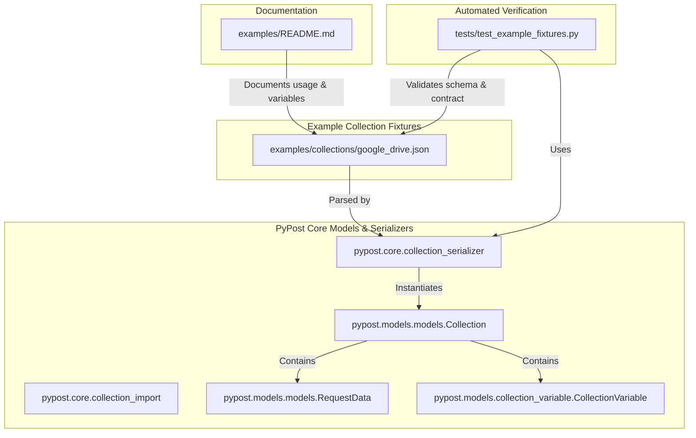

# PYPOST-1268: High-Level Architecture Design

## Research

### Google Drive API v3 Standard Patterns
Google Drive v3 uses HTTP REST semantics:
- **Base Endpoint**: `https://www.googleapis.com/drive/v3`
- **Upload Endpoint**: `https://www.googleapis.com/upload/drive/v3`
- **Authentication**: `Authorization: Bearer <access_token>`
- **Files Resource**:
  - `GET /files`: list files (`pageSize`, `q`, `fields`, `orderBy`, `pageToken`).
  - `GET /files/{fileId}`: get file metadata or media (`alt=media`).
  - `POST /files` or `POST /upload/drive/v3/files?uploadType=multipart`: create file metadata or upload content.
  - `PATCH /files/{fileId}`: update metadata or content.
  - `DELETE /files/{fileId}`: permanently delete or trash file.
- **Permissions Resource**:
  - `GET /files/{fileId}/permissions`: list permissions for a file.
  - `POST /files/{fileId}/permissions`: create sharing permission (`role`, `type`, `emailAddress`).
  - `DELETE /files/{fileId}/permissions/{permissionId}`: revoke permission.

### PyPost Collection Schema & Serialization Architecture
- PyPost stores collections as JSON files deserialized via `pypost.core.collection_serializer.read_collection_file` or `pypost.core.collection_import.load_collection_import_candidates`.
- Top-level model is `Collection` in `pypost.models.models`.
- Requests are modeled as `RequestData`:
  - `id`: unique string identifier (e.g., `gdrive-files-list`).
  - `name`: human-readable name.
  - `method`: GET, POST, PATCH, DELETE, etc.
  - `url`: templated URL using Jinja2 syntax (e.g., `{{ google_drive_base_url }}/files`).
  - `headers`, `params`, `body`, `body_type`, `yaml_as_json`, `expose_as_mcp`, `mcp_params`, `retry_policy`.
- Variables are modeled as `CollectionVariable`:
  - `name`, `type`, `default`, `description`, `required`, `secret`.
- Presets are stored under `presets: Dict[str, Dict[str, Any]]`.
- Companion documentation is maintained in `examples/README.md`.

## Implementation Plan

1. **Step 3 (Failing Repro Test)**:
   - Design and write a failing contract test in `tests/test_example_fixtures.py` (or dedicated `tests/test_google_drive_collection_example.py`) asserting:
     - The fixture `examples/collections/google_drive.json` exists.
     - It deserializes into a `Collection` instance with `id == "google-drive-v3"`.
     - Required variable declarations (`google_drive_base_url`, `google_drive_upload_base_url`, `google_drive_access_token` [secret]) are present.
     - Expected request IDs (`gdrive-files-list`, `gdrive-files-get-metadata`, `gdrive-files-create-metadata`, `gdrive-files-upload-multipart`, `gdrive-permissions-list`, `gdrive-permissions-create`) are defined with correct HTTP methods, URL templates, and headers.
   - Run the test in Step 3 to establish a clean RED failure (missing file / unpopulated definitions).
2. **Step 4 (Development)**:
   - Construct `examples/collections/google_drive.json` adhering to PyPost Collection Schema v2.
   - Verify serialization / deserialization round-trip with PyPost models.
   - Run tests until green.
   - Update `examples/README.md` to document the new collection and its usage.
3. **Step 5 (Code Cleanup)**:
   - Format JSON and Python tests to adhere to style guidelines and schema linters.
4. **Step 6 (Observability)**:
   - Validate parse error logging and schema verification traces.
5. **Step 7 (Technical Debt Analysis)**:
   - Review for security, maintenance, and potential future expansions (e.g. Google Drive v3 revisions, shortcuts, or export MIME types).
6. **Step 8 (Dev Docs)**:
   - Ensure developer documentation notes the new collection fixture.

## Architecture

### Component & Data Flow Diagram

### Module Responsibilities

1. **`examples/collections/google_drive.json`**:
   - Primary declarative artifact. Contains the structured JSON representation of the Google Drive v3 REST collection.
2. **`pypost.models.models.Collection` & `RequestData`**:
   - In-memory data structures guaranteeing strong typing, field validation, and default value propagation.
3. **`tests/test_example_fixtures.py`**:
   - Contract test suite verifying file existence, schema validity, required endpoints, header structures, and template parameter safety.
4. **`examples/README.md`**:
   - Guidance for users importing and utilizing the collection, including placeholder configuration.

### Selected Architectural Patterns

- **Declarative Specification Pattern**: HTTP requests and collection variables are defined entirely in structured JSON, decoupled from execution logic.
- **Contract Testing Pattern**: Unit tests enforce rigid invariants on shipped example fixtures to avoid silent schema regressions or accidental breakage across releases.
- **Secrets Isolation Pattern**: Sensitive OAuth tokens are strictly bound to collection variables marked `secret: true`, avoiding hardcoded tokens.

### Main Interfaces and Signatures

- **Collection ID**: `google-drive-v3`
- **Collection Name**: `Google Drive API v3`
- **Variables**:
  - `google_drive_base_url`: string, default `https://www.googleapis.com/drive/v3`, required true, secret false.
  - `google_drive_upload_base_url`: string, default `https://www.googleapis.com/upload/drive/v3`, required true, secret false.
  - `google_drive_access_token`: string, default `""`, required true, secret true.
- **Requests**:
  - `gdrive-files-list`: `GET {{ google_drive_base_url }}/files`
  - `gdrive-files-get-metadata`: `GET {{ google_drive_base_url }}/files/{{ file_id }}`
  - `gdrive-files-download-media`: `GET {{ google_drive_base_url }}/files/{{ file_id }}?alt=media`
  - `gdrive-files-create-metadata`: `POST {{ google_drive_base_url }}/files`
  - `gdrive-files-upload-multipart`: `POST {{ google_drive_upload_base_url }}/files?uploadType=multipart`
  - `gdrive-permissions-list`: `GET {{ google_drive_base_url }}/files/{{ file_id }}/permissions`
  - `gdrive-permissions-create`: `POST {{ google_drive_base_url }}/files/{{ file_id }}/permissions`

## Q&A

- **Q**: Why separate base URL and upload base URL?
  **A**: Google Drive API v3 uses a separate host/path for file binary uploads (`https://www.googleapis.com/upload/drive/v3`) compared to standard metadata and query endpoints (`https://www.googleapis.com/drive/v3`).
- **Q**: Is a separate companion environment file strictly required?
  **A**: The collection defines default variables and presets directly within the schema v2 collection file, while `examples/README.md` details how to configure or import them.
