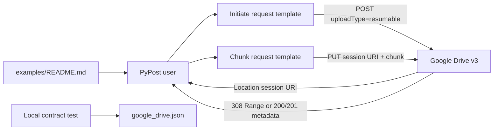

# PYPOST-1275: Add Google Drive resumable upload request templates

## Research

The existing Google Drive fixture already provides the upload base URL, a secret bearer-token
variable, and a multipart upload request. The new workflow should extend that fixture using its
existing collection/request schema rather than introduce a runtime upload client.

The official Google Drive v3 upload guidance defines a two-stage resumable flow:

1. `POST https://www.googleapis.com/upload/drive/v3/files?uploadType=resumable` starts a session.
   A successful response has a `Location` header containing the session URI and an empty body.
2. Each subsequent transfer uses `PUT` against that session URI. The request body is one content
   chunk and `Content-Length` plus `Content-Range` identify the chunk. `308 Resume Incomplete`
   means more data is required; `200 OK` or `201 Created` indicates completion.

References:

- [Google Drive upload guide](https://developers.google.com/workspace/drive/api/guides/manage-uploads)
- [Google Drive v3 `files.create` reference](https://developers.google.com/workspace/drive/api/reference/rest/v3/files/create)

## Implementation Plan

Update only the Google Drive example fixture, its deterministic contract test, and the examples
README during Step 4. Preserve all existing request IDs and fields. Add two independently
selectable request definitions:

- `gdrive-files-upload-resumable-initiate` for session creation and metadata.
- `gdrive-files-upload-resumable-chunk` for sending one chunk to the returned session URI.

The contract test will load the fixture through `read_collection_file` and assert the request
methods, URLs, query semantics, header templates, body types, and handoff variable. It will not
make HTTP calls or require credentials. The README will describe the order of operations, repeatable
chunking, continuation responses, and the fact that the session URI must be supplied to stage two.

**Mandatory — Failing Repro (next Step 3):** Add a red test to
`tests/test_google_drive_collection_example.py` before changing the JSON or README. The test will
fail against the current fixture because both resumable request IDs are absent. It will assert:

- initiation is `POST` to the upload base URL with `uploadType=resumable`;
- initiation carries bearer authorization, JSON metadata, and an explicit JSON content type;
- the initiation description documents the `Location` response/session handoff;
- chunk transfer is `PUT` to a `{{ google_drive_upload_session_url }}` placeholder;
- chunk transfer carries bearer authorization, binary content, `Content-Length`, and
  `Content-Range` placeholders;
- the chunk description documents `308` continuation and `200`/`201` completion semantics; and
- the existing core request contract remains intact.

Run the focused test through `make test` and confirm red before implementation. Then add the
fixture fields and README text, rerun the focused test for green, and run the repository's
applicable `make` validation targets.

## Architecture

### System boundary and module diagram

This is a declarative example-data change. No production upload service, network adapter, session
store, retry loop, or credential provider is introduced.



### Components and responsibilities

| Component | Responsibility | Change |
| --- | --- | --- |
| `examples/collections/google_drive.json` | Declaratively defines variables and request templates | Add session URL, chunk metadata, initiation request, and chunk request |
| `tests/test_google_drive_collection_example.py` | Validates fixture shape and essential Google Drive semantics locally | Add deterministic contract assertions for both stages and their handoff |
| `examples/README.md` | Explains how users select and sequence examples | Add resumable-upload usage and continuation guidance |
| Google Drive API | Creates the session and accepts chunk PUTs | External dependency; never contacted by contract tests |

### Request and response/session handoff

The initiation request uses the existing `google_drive_upload_base_url` variable:

```text
POST {{ google_drive_upload_base_url }}/files?uploadType=resumable
Authorization: Bearer {{ google_drive_access_token }}
Content-Type: application/json
Accept: application/json
```

Its JSON body contains representative file metadata, such as a placeholder name and MIME type.
The request description explicitly says to capture the response `Location` header. The caller
copies that value into the `google_drive_upload_session_url` variable before selecting the chunk
request. The session URI is opaque and must not be reconstructed from the base URL.

The chunk request uses the session variable directly:

```text
PUT {{ google_drive_upload_session_url }}
Authorization: Bearer {{ google_drive_access_token }}
Content-Type: application/octet-stream
Content-Length: {{ google_drive_chunk_length }}
Content-Range: bytes {{ google_drive_chunk_start }}-{{ google_drive_chunk_end }}/{{ google_drive_file_size }}
```

Its body is a text-safe representative chunk with `body_type: "text"`; the template is a
reference, not a binary-file transport implementation. Users replace the body and placeholders
with the actual bytes and byte positions. A `308` response and its `Range` header determine the
next chunk; a `200` or `201` response ends the upload. The example does not promise retries,
automatic scheduling, status polling, or completion in one request.

### Variables and schema seams

Retain `google_drive_access_token` as the only secret variable. Add non-secret, required string
placeholders with safe illustrative defaults or empty values as appropriate:

- `google_drive_upload_session_url`: opaque `Location` value returned by initiation;
- `google_drive_chunk_length`: byte count for the current body;
- `google_drive_chunk_start` and `google_drive_chunk_end`: inclusive byte offsets; and
- `google_drive_file_size`: total size, used in `Content-Range`.

The exact defaults must remain local examples, never real session IDs, credentials, or user data.
Each new request follows the existing fields (`id`, `name`, `method`, `url`, `headers`, `params`,
`body`, `body_type`, `yaml_as_json`, exposure/MCP metadata, and `retry_policy`) so the existing
serializer and collection model continue to validate it.

### Safety and secret handling

- No live network or Google account is used by tests.
- The OAuth token remains `secret: true` and is referenced only through the existing variable.
- Session URLs are treated as sensitive, short-lived bearer-like values in descriptions and are
  never hard-coded as real returned URLs.
- Contract assertions inspect strings and parsed models only; they must not log token or session
  values beyond deterministic placeholder text.
- Chunk size rules and retry/resume behavior are documented as caller responsibilities, not
  implemented in the collection fixture.

### Compatibility and dependency direction

The new requests depend only on variables in the same collection. The chunk request depends on
the output of initiation at runtime, but the fixture remains stateless: PyPost's normal variable
substitution is the handoff mechanism. Existing list, metadata, download, metadata-create,
multipart, and permission requests are unchanged. The test adds coverage without changing the
serializer or application APIs.

## Q&A

| Question | Answer |
| --- | --- |
| Why are there two requests instead of one? | Google Drive creates a session first and accepts content through later PUT requests to the returned location. |
| Is the session URI generated by the example? | No. Google Drive returns it in `Location`; the caller supplies it to the chunk template. |
| Can the chunk request complete the whole upload? | It may complete the final chunk, but the template represents one chunk and may be repeated. |
| Why is the chunk body text rather than binary? | The example format is a readable request template; it does not implement a binary upload client. |
| What is deliberately excluded? | Live integration, credential setup, retries, chunk scheduling, progress UI, and session persistence. |
