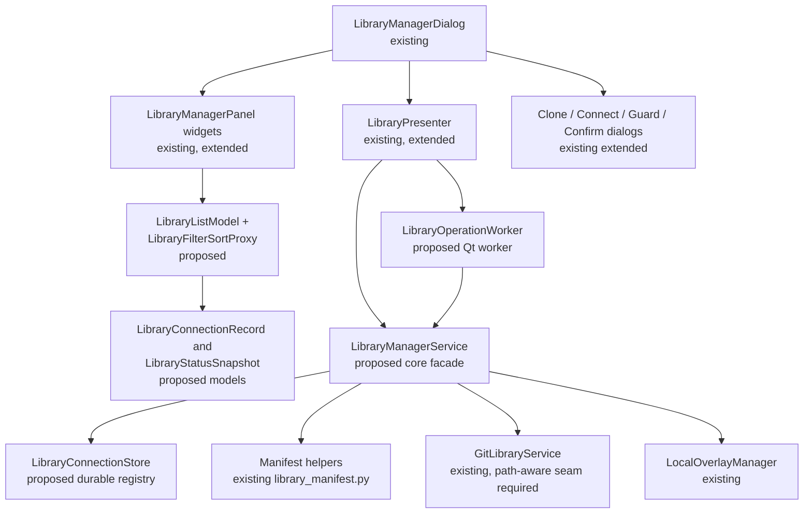
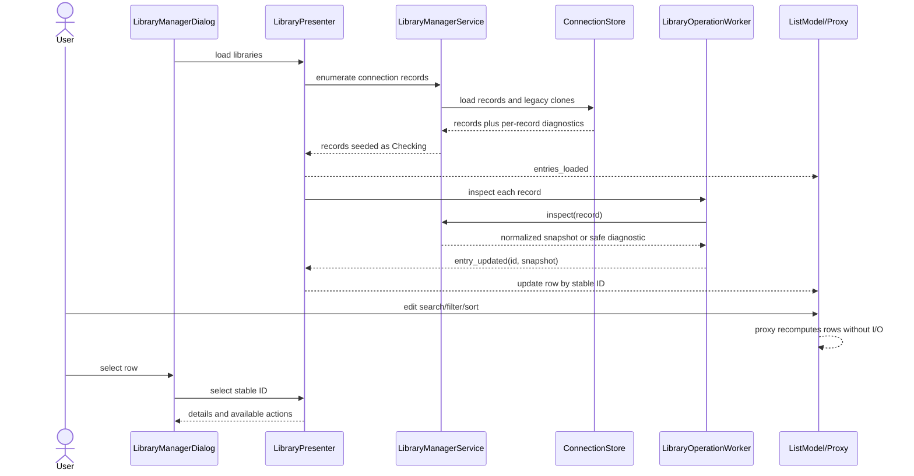

# PYPOST-1278: Enhance Library Manager with a manageable list of collection libraries

## Research

Research was performed against the repository and the official Qt for Python documentation.

### Existing repository components

- `pypost/ui/dialogs/library_dialogs.py` contains `LibraryManagerDialog`, clone, dirty-pull,
  branch-switch, and commit/push dialogs. The manager is a synchronous master-detail dialog.
- `pypost/ui/widgets/library_manager_panel.py` contains `LibraryListWidget`,
  `LibraryDetailWidget`, and `LibraryCollectionsWidget`. The list is currently a `QListWidget`
  containing library IDs, and detail badges are derived directly from `GitRepoStatus`.
- `pypost/ui/presenters/library_presenter.py` is an MVP `QObject` presenter. It discovers only
  directories below `GitLibraryService.base_dir`, caches only the selected library, and delegates
  Git operations through synchronous methods.
- `pypost/core/git_service.py` provides the existing clone, status, dirty-check, pull, branch
  listing, checkout, commit, push, and local-directory deletion operations. Its public operations
  resolve a library ID to `base_dir / library_id`.
- `pypost/core/library_manifest.py` provides manifest discovery, parsing, and collection-file
  validation through `find_and_read_manifest()` and `validate_manifest_collections()`.
- `pypost/models/git_library.py` provides `GitRepoStatus`, `GitOperationResult`, and structured
  Git diagnostics. `GitRepoStatus` has branch, clean/dirty, and ahead/behind data but no source
  type, remote reachability, last-modified value, or check timestamps.
- `pypost/core/local_overlay_manager.py` stores per-library local overlays and currently exposes
  `delete_overlay()`. Overlay data must not be deleted by a disconnect operation.
- Existing UI workers under `pypost/core/qt/` use one-shot `QThread` objects and signal completion
  or failure back to a presenter. `CollectionsPresenter` and the WebSocket stream UI provide
  repository examples for presenter-owned models and proxy models.
- Existing regression coverage is in `tests/test_ui_library_manager.py` and
  `tests/test_ui_library_manager_repro.py`; both use injected fakes or mocks and an offscreen Qt
  application. Tests declare the required `pytest.mark.timeout` marker.
- `doc/dev/library_manager_ui.md` documents the PYPOST-1223 surface and terminology and will be
  a Step 8 documentation target. It currently describes the old clone-only and destructive
  remove behavior.

### Authoritative Qt guidance

- [Qt for Python: Model/View Programming][qt-model-view] explains the separation between data
  models and views, recommends model/view classes over item-based convenience classes when the
  data or presentation is non-trivial, and describes `QSortFilterProxyModel` as the place for
  custom filtering and sorting.
- Its `filterAcceptsRow()` and `lessThan()` extension points directly support the required
  case-insensitive identity search, exact status filtering, and deterministic three-key sorting.
  This is relevant because the current `QListWidget` cannot provide those rules without
  duplicating state in the view.

The source is used as an architectural reference, not as an assertion that any proposed Qt
class already exists in this repository.

## Implementation Plan

Step 4 should implement the design in small, testable increments:

1. Add pure domain records for connection source, normalized synchronization state, condition
   badges, diagnostics, operation state, and timestamps. Preserve `GitRepoStatus` as the raw
   backend snapshot; do not change the collection manifest format.
2. Add a durable connection store for in-place registrations and explicit source type. On load,
   merge stored connections with legacy managed clones discovered below the current Git service
   base directory. Deduplicate by canonical path and library identity without silently removing
   a record.
3. Add a core manager service/adapter that resolves a connection record to a safe local path,
   validates manifests, normalizes status, and delegates Git work to the existing
   `GitLibraryService`. The adapter must provide a path-aware seam for registered directories;
   it must not pass a local path through the existing `library_id` parameter.
4. Move status reads and operations that can touch disk or a remote into one-shot Qt workers.
   Keep all worker completion, failure, and teardown handling on the GUI thread and admit at most
   one operation of a given kind per connection ID.
5. Extend `LibraryPresenter` to cache a snapshot for every connection, preserve last-known local
   data across failed checks, expose selection by stable ID, and emit operation events carrying
   the affected stable ID. Keep compatibility wrappers for current presenter methods while the
   existing tests and callers are migrated.
6. Replace the list's internal item storage with a typed model, a custom filter/sort proxy, and a
   status delegate. Extend the manager and dialogs with add-menu, search/filter/sort controls,
   row/detail actions, source-aware confirmations, and empty/no-match guidance.
7. Add focused presenter/model/UI tests and then update `doc/dev/library_manager_ui.md` in Step 8.

### Mandatory — Failing Repro (next Step 3)

Create a new focused red test module at `tests/test_ui_library_manager_pypost_1278_repro.py`.
Do not change production code in Step 3. Every test must use
`pytestmark = pytest.mark.timeout(30)` or an equivalent module/class marker and must run with the
existing offscreen `qapp` fixture.

Use `tmp_path`, deterministic fake service/store objects, fixed timestamps, and injected clocks;
do not invoke live Git, a network, credentials, or a real user directory.

The red repro should cover these slices:

<table>
<thead>
<tr>
<th>Slice</th>
<th>Red assertion and isolated setup</th>
</tr>
</thead>
<tbody>
<tr>
<td>Identity and rows</td>
<td>
A fake set containing display names, missing display names, stable IDs, source types, and raw 
status snapshots produces one row per connection and falls back to the stable ID.
</td>
</tr>
<tr>
<td>Search and status filter</td>
<td>
Case-folded search matches display name or ID; one exact synchronization or condition label 
matches only rows carrying that label; no filter returns all rows.
</td>
</tr>
<tr>
<td>Deterministic sorting</td>
<td>
Name, status, and last-modified ascending/descending results follow the requirements, including 
missing timestamps after timestamped rows and ascending tie-breakers even when the primary 
direction is descending.
</td>
</tr>
<tr>
<td>Selection</td>
<td>
Filtering keeps selection by stable ID when present, clears it when absent, and shows no stale 
details while exposing no-selection guidance.
</td>
</tr>
<tr>
<td>Offline and stale</td>
<td>
A fake refresh failure retains last-known local name/path/modification/local-change data, adds 
<code>Offline</code> and <code>Stale</code>, exposes <code>Unknown</code> synchronization 
state, and never exposes <code>Current</code>; another row remains usable.
</td>
</tr>
<tr>
<td>Operation admission</td>
<td>
A second identical refresh, pull, or branch-switch request is rejected or disabled while the 
first fake worker is active; completion refreshes the affected row and failure leaves a truthful
diagnostic.
</td>
</tr>
<tr>
<td>Dirty safeguard</td>
<td>
Pull and branch switch with fake dirty files stop before the Git call and expose the file list or
an explicit unavailable-file message. Cancel leaves the fake repository unchanged.
</td>
</tr>
<tr>
<td>Add/connect</td>
<td>
A valid temporary manifest is registered in place with no copy/move/write to the selected
directory. Missing manifest, invalid manifest, duplicate canonical path, and identity collision
are rejected with safe guidance. Cancel causes no store or file-system call.
</td>
</tr>
<tr>
<td>Disconnect/delete</td>
<td>
Disconnect removes only the connection record and preserves both source types and their local
data. Delete is offered only for a cloned record, requires confirmation, and calls clone deletion
plus overlay cleanup only after confirmation.
</td>
</tr>
<tr>
<td>Clipboard and actions</td>
<td>
The exact resolved local path is copied, confirmation is exposed, and a row/detail action carries
the intended stable ID. Registered rows have no destructive delete action.
</td>
</tr>
</tbody>
</table>

The sequence is: research and inspect current contracts (this step) → add the isolated red tests
against the proposed seam → independently review the red tests → implement the smallest
production change → run the same tests until green. Step 3 should prefer pure model/presenter
assertions and fakes; a local temporary manifest is sufficient for validation coverage.

## Architecture

### Design principles and boundaries

The existing MVP composition remains the UI architecture. The change separates three concerns
that are currently mixed in the presenter or widgets:

1. A connection record describes what is managed and where it lives.
2. A manager service obtains raw local/Git facts and turns them into a truthful, user-facing
   snapshot.
3. A Qt model/view surface renders and filters snapshots without performing I/O.

No new Git provider, authentication type, manifest field, collection serializer, or general Git
client is introduced. Existing Git and manifest capabilities remain dependencies behind the new
manager boundary.

### Proposed module map

The following new files are proposed boundaries; they do not exist yet. Existing files are marked
explicitly so the implementation does not mistake a proposal for a current API.

#### `pypost/models/library_manager.py` — proposed, pure domain models

- `LibrarySourceType`: `Cloned managed copy` or `Registered local directory`.
- `LibrarySyncStatus`: the exact eight synchronization labels in requirement order:
  `Checking`, `Unknown`, `Local changes and remote updates`, `Local changes`,
  `Remote updates available`, `Locally ahead`, `No remote source`, and `Current`.
- `LibraryCondition`: `Offline`, `Unavailable`, `Invalid`, and `Error`. `Stale` is a boolean or
  marker on the snapshot, never a filter value.
- `LibraryConnectionRecord`: stable connection ID, optional declared manifest identity, display
  name, canonical local path, source type, and any non-secret remote metadata needed for display.
  The stable connection ID is persisted: existing clone folder IDs remain compatible, while a new
  in-place registration gets one stable ID even when a manifest omits an explicit ID.
- `LibraryStatusSnapshot`: sync status, zero or more condition statuses, clean/local-change
  details, remote position, active branch or `No active branch`, last-modified value or `None`,
  last successful check time, stale marker, and safe diagnostic data.
- `LibraryListEntry`: the immutable row projection combining a connection record, manifest display
  data, status snapshot, and operation state. It is the only row payload the view needs.

The records should follow the repository's typed Python/Pydantic model style. Timestamps should be
timezone-aware. `None` means unavailable and must render as `Unavailable`; it must not be replaced
with the manager-open time.

[qt-model-view]: https://doc.qt.io/qtforpython-6/overviews/qtwidgets-model-view-programming.html

#### `pypost/core/library_connection_store.py` — proposed repository/store

This non-Qt component persists connection metadata separately from user libraries. It should use
the existing `~/.pypost` application-data convention by default, with an injected path in tests,
for example `library_connections.json`, and atomic replacement for writes. A record contains no
credentials or tokens.

Responsibilities:

- Load valid records and return safe diagnostics for malformed records without hiding all other
  connections.
- Add, update, and remove a connection record transactionally.
- Canonicalize paths for duplicate checks while preserving the user-facing exact path.
- Detect duplicate canonical paths and declared manifest identities before writing.
- Merge explicit records with legacy clones found below `GitLibraryService.base_dir`; legacy
  clones are treated as `Cloned managed copy` and use their existing folder ID.
- Remove only a connection record for disconnect. It must not delete a path or overlay.

The store is a repository for connection metadata, not a replacement for `StorageManager`, Git,
or `LocalOverlayManager`.

#### `pypost/core/library_status.py` — proposed pure status normalizer

`LibraryStatusResolver` accepts a raw `GitRepoStatus` where available, local metadata, remote
reachability, the prior successful snapshot, and a clock. It returns a `LibraryStatusSnapshot`
without raising user-facing raw exceptions.

The successful-check mapping is deterministic:

`GitLibraryService.status()` parses `HEAD...@{u}` with the first count as `ahead_count` and the
second as `behind_count`; the resolver must preserve that mapping.

<table>
<thead>
<tr>
<th>Condition of a successful check</th>
<th>Synchronization label</th>
</tr>
</thead>
<tbody>
<tr>
<td>Check is in progress</td>
<td><code>Checking</code></td>
</tr>
<tr>
<td>No usable current result</td>
<td><code>Unknown</code></td>
</tr>
<tr>
<td>Uncommitted local changes and <code>behind_count &gt; 0</code></td>
<td><code>Local changes and remote updates</code></td>
</tr>
<tr>
<td>Uncommitted local changes and <code>behind_count == 0</code></td>
<td><code>Local changes</code></td>
</tr>
<tr>
<td><code>behind_count &gt; 0</code>, with no uncommitted changes</td>
<td><code>Remote updates available</code></td>
</tr>
<tr>
<td><code>ahead_count &gt; 0</code> and <code>behind_count == 0</code>, with no 
uncommitted changes</td>
<td><code>Locally ahead</code></td>
</tr>
<tr>
<td>No configured remote source</td>
<td><code>No remote source</code></td>
</tr>
<tr>
<td>Clean, reachable, tracking source, and both counts are zero</td>
<td><code>Current</code></td>
</tr>
</tbody>
</table>

For a clean repository that is both ahead and behind, `Remote updates available` is the safest
available vocabulary and the detail view retains both counts. A remote configured without a
successful current check is not `Current`; it is `Unknown` with `Offline`, `Unavailable`, or
`Error` as appropriate.

When a remote check fails, the resolver carries forward only the last successfully read local
name, path, modification value, branch/local-change details, and check time. The current sync
label becomes `Unknown` when the failed check prevents a current result. The row gets `Stale` and
the failure condition, with a safe next step. Conditions remain independent badges, so `Offline`
does not replace the synchronization badge.

The resolver must distinguish:

- `Offline`: a remote-dependent check cannot reach the source;
- `Unavailable`: local path or required information cannot be read;
- `Invalid`: manifest or connection information is incomplete/invalid; and
- `Error`: the latest requested operation failed after admission.

The existing Git error types and manifest diagnostics are inputs to this classification. The
normalizer must not display their raw messages or embedded credential material.

#### `pypost/core/library_manager_service.py` — proposed core facade

This facade is the only business-facing dependency the presenter needs. Its boundary is
connection-record based, not free-form path based. Conceptually it provides:

- enumerate/load connections and inspect one or all connections;
- validate and connect an existing local directory without copying, moving, or overwriting it;
- clone a remote repository through the existing Git service and register it only after validation;
- return dirty-file details before pull or branch switch;
- refresh, pull, list branches, and switch branch for the selected record;
- disconnect a record; and
- delete a cloned managed copy only after the caller has confirmed and the facade has rechecked
  the source type and managed-path containment.

The current `GitLibraryService` accepts only a library ID and maps it to its managed base
directory. The implementation therefore needs a narrow path-aware adapter seam. It may preserve
the current ID-based wrappers for existing callers, but it must never overload an ID with an
arbitrary user path. Registered local directories must be resolved and validated as records before
Git or filesystem operations are invoked.

The facade owns source-specific lifecycle rules:

- Disconnect removes the connection record and retains the complete local directory and overlay
  data for both source types.
- Delete is unavailable for `Registered local directory`.
- Delete for `Cloned managed copy` requires a confirmed record, verifies the path is inside the
  managed clone root, removes that clone and its associated local overlay, and never touches the
  remote source.

#### `pypost/core/qt/library_operation_worker.py` — proposed one-shot worker

Use the existing `QThread` worker pattern for status inspection and disk/remote operations. A
worker receives an injected manager-service callable and immutable arguments, then emits a
structured success or failure result. The presenter owns the worker reference until its native
`finished` signal has been handled. GUI widgets are never accessed from the worker thread.

Operation admission is keyed by `(stable_connection_id, operation)`. The same operation cannot be
submitted twice while active; unrelated libraries may continue to render and refresh. A visible
in-progress state is emitted before the worker starts and cleared only on success or failure.

### UI model/view and presentation

`LibraryListWidget` remains the public composite widget used by `LibraryManagerDialog`, but its
internal `QListWidget` should become a `QListView` backed by:

- `LibraryListModel` (`QAbstractListModel`) holding `LibraryListEntry` values and exposing stable
  ID, searchable identity, display text, status labels, timestamps, and accessible text through
  explicit roles;
- `LibraryFilterSortProxyModel` (`QSortFilterProxyModel`) implementing case-insensitive search,
  one exact status/condition filter, and the three required sort modes; and
- a `QStyledItemDelegate` or equivalent row renderer that shows readable text badges for sync,
  clean/local-change, condition/stale, source, and last modified. Accessible text must contain
  those meanings; color is supplementary only.

The proxy comparator uses these keys:

- Name: case-folded display name, falling back to stable ID, then stable ID ascending.
- Status: canonical synchronization order, then case-folded display name, then stable ID.
- Last modified: timestamped rows first, missing timestamps last in both directions; then
  case-folded display name, synchronization order, and stable ID.

The selected sort direction changes only the primary key. All tie-breakers remain ascending. The
proxy owns no business state and performs no disk or Git work. Search and filter updates invalidate
the proxy immediately. The view maps selected proxy indexes back to the source model and restores
selection by stable ID after model resets.

The list toolbar should provide:

- a case-insensitive search field;
- a single-select status menu with the eight sync values followed by `Offline`, `Unavailable`,
  `Invalid`, and `Error` in the exact requirement order, plus an explicit all-status option;
- sort field and ascending/descending controls; and
- an Add menu with `Clone remote library...` and `Connect local directory...`.

Rows and the selected detail pane can share a context-menu/action adapter. Every action receives
the stable ID captured from the row model, never the current row number after filtering. Required
actions are refresh, pull/synchronize, switch branch, copy exact path, disconnect, and—only for a
clone—delete.

`LibraryDetailWidget` should render the normalized snapshot rather than infer labels from Git
counts. It must show branch or `No active branch`, local changes, sync position, last modified,
last successful check/stale state, safe diagnostic guidance, and available actions. With no
selection it must clear all detail values and show guidance. Empty collection and no-match states
are separate widgets/states: the former offers clone/connect entry points, while the latter offers
clear-search and clear-filter actions.

`LibraryManagerDialog` remains the composition root. It wires presenter signals to the model and
detail panel, owns confirmation dialogs, and maps safe diagnostics to user-facing messages. It
does not call `GitLibraryService` or delete files directly.

### Interaction flows

#### Load, search, filter, and select

#### Safe pull or branch switch

1. The view emits the selected stable ID and operation.
2. The presenter asks the service for dirty state in a worker before admitting pull or checkout.
3. If local changes exist, the GUI guard names the library and lists affected files, or states
   that the file list is unavailable. Cancel or address-changes ends the flow without a Git call.
4. If clean, or after the required safeguard path, one operation is admitted and the action is
   disabled for that connection while progress is visible.
5. Success triggers a fresh status/manifest read. Failure updates that row with `Error` and safe
   guidance; it never turns a failed refresh into `Current`.

#### Add a library

The Add menu opens either the existing clone dialog or a proposed `LibraryConnectDialog`. The
connect flow chooses a directory, validates readability, manifest discovery, manifest schema, and
referenced collection files, then checks canonical-path and identity duplicates. Only after all
checks pass does the store write a connection record. The directory remains at its original path.
Clone follows the existing Git/auth flow, validates the cloned result, and then records it as a
managed clone. Cancel at any dialog stage performs no store or filesystem mutation.

#### Disconnect or delete

The confirmation text includes library name, source type, and exact path. Disconnect explicitly
says all local files will be retained and then removes only the connection record. Delete is shown
only for a clone and explicitly says the local clone, associated local data, and local changes will
be permanently removed; it never affects the remote. Cancel leaves both the record and all files
unchanged. The service repeats the source/path safety checks at execution time so stale UI state
cannot turn a registered path into a destructive operation.

### Dependencies and dependency direction

<table>
<thead>
<tr>
<th>Component</th>
<th>Depends on</th>
<th>Must not depend on</th>
</tr>
</thead>
<tbody>
<tr>
<td><code>pypost.models.library_manager</code> (proposed)</td>
<td>Standard Python/Pydantic types</td>
<td>PySide6, Git subprocesses, filesystem writes</td>
</tr>
<tr>
<td><code>LibraryConnectionStore</code> (proposed)</td>
<td>Domain records, JSON/path utilities</td>
<td>Qt widgets, Git, authentication secrets</td>
</tr>
<tr>
<td><code>LibraryStatusResolver</code> (proposed)</td>
<td>Raw status and local metadata records</td>
<td>Widgets, message boxes, raw error rendering</td>
</tr>
<tr>
<td><code>LibraryManagerService</code> (proposed)</td>
<td>Store, manifest helpers, <code>GitLibraryService</code>, 
<code>LocalOverlayManager</code></td>
<td>Dialogs and row indexes</td>
</tr>
<tr>
<td><code>LibraryOperationWorker</code> (proposed)</td>
<td>Manager-service boundary, Qt thread signals</td>
<td>Direct widget access</td>
</tr>
<tr>
<td><code>LibraryPresenter</code> (existing, extended)</td>
<td>Manager service, worker, domain records</td>
<td>Git subprocess details and widget internals</td>
</tr>
<tr>
<td><code>LibraryListModel</code>/ proxy/delegate (proposed)</td>
<td>Domain row projections and Qt model/view</td>
<td>Git, store, network, destructive operations</td>
</tr>
<tr>
<td><code>LibraryManagerDialog</code> and panels (existing, extended)</td>
<td>Presenter signals and widget adapters</td>
<td>Direct filesystem deletion or authentication internals</td>
</tr>
</tbody>
</table>

Construction should use dependency injection already supported by
`LibraryPresenter(service=..., overlay_manager=...)`, extended with the connection store,
operation executor, clock, and path metadata reader. This keeps pure normalization and UI tests
independent of live services.

### Risks and mitigations

<table>
<thead>
<tr>
<th>Risk</th>
<th>Mitigation</th>
</tr>
</thead>
<tbody>
<tr>
<td>Current Git APIs are clone-ID based</td>
<td>
Introduce a path-aware manager/backend seam; retain old ID wrappers and never treat a user path as
an ID.
</td>
</tr>
<tr>
<td>Legacy clone discovery and new registry diverge</td>
<td>Merge by canonical path and identity, report collisions, and make registry writes atomic.</td>
</tr>
<tr>
<td>Offline refresh clears useful information</td>
<td>
Cache per connection, keep last successful local facts, set <code>Unknown</code> plus condition and
<code>Stale</code>, and test another row remains usable.
</td>
</tr>
<tr>
<td>Status precedence hides a state</td>
<td>
Centralize the exact resolver and test all vocabulary values, including ahead/behind ties and no
remote.
</td>
</tr>
<tr>
<td>Proxy indexes become wrong after filtering/sorting</td>
<td>Carry stable ID in a model role and resolve actions/selections by ID, not row number.</td>
</tr>
<tr>
<td>Synchronous Git/disk work freezes the dialog</td>
<td>
Use one-shot workers, per-operation admission, and bounded lifecycle cleanup following existing Qt
worker patterns.
</td>
</tr>
<tr>
<td>Delete accidentally removes a registered directory</td>
<td>
Persist source type, enforce managed-root containment, expose no registered delete action, and
recheck before deletion.
</td>
</tr>
<tr>
<td>Diagnostics expose credentials or raw Git output</td>
<td>
Map structured error categories to safe text; sanitize URLs and never show tokens, keys,
passphrases, or raw subprocess output.
</td>
</tr>
<tr>
<td>Recursive modification-time scans are slow or platform-sensitive</td>
<td>
Run metadata collection off-thread, use a bounded/provider abstraction, and render
<code>Unavailable</code> when a reliable value cannot be established.
</td>
</tr>
<tr>
<td>Existing tests assume current signal payloads and widgets</td>
<td>
Preserve compatibility wrappers where practical and add focused PYPOST-1278 tests without
weakening old regression coverage.
</td>
</tr>
</tbody>
</table>

### Issues found during inspection

These are implementation inputs, not changes made in Step 2:

- `LibraryPresenter.load_libraries()` only scans the managed clone directory, so an in-place
  connection cannot be represented without a durable registry.
- `LibraryPresenter.refresh_status()` clears the selected cache and emits `None` for every error;
  this cannot implement last-known offline/stale presentation or keep per-library rows usable.
- `LibraryListWidget` stores only plain IDs in `QListWidget`; it has no searchable identity,
  status filter, deterministic sort, row badges, or stable-ID proxy selection.
- `LibraryDetailWidget` turns zero ahead/behind counts into `Up to date` even when the status is
  unavailable and renders a detached head as `detached`, both of which conflict with truthful
  vocabulary and `No active branch` guidance.
- `LibraryManagerDialog._on_delete_clicked()` always presents destructive removal, and
  `LibraryPresenter.delete_library()` calls the clone-directory deletion and overlay deletion
  path without a source-type distinction.
- `GitLibraryService` uses `base_dir / library_id` throughout its operations, so local-directory
  registration requires a deliberate location adapter rather than a path string passed as an ID.
- `GitRepoStatus` does not contain a last-modified timestamp, remote reachability, or last-check
  metadata. The status layer must obtain those facts or render `Unavailable`.
- The existing Git and presenter operations execute synchronously from dialog handlers, which is
  incompatible with the responsiveness requirement for remote and disk work.
- `LibraryPresenter.get_diagnostic_message()` can return generic exception text and raw command
  details; the enhanced UI needs a safe diagnostic mapping.
- `GitLibraryService.discover_manifest()` iterates `MANIFEST_CANDIDATE_NAMES`, which includes
  `pypost-library.yml`.
- The `.yml` discovery omission is in `LibraryPresenter.load_libraries()`, whose scan checks
  `pypost-library.yaml` and `pypost-library.json` but not `pypost-library.yml`.

## Q&A

### Why change internals while retaining `LibraryListWidget`?

The public name preserves the current dialog composition and test seam. Internally, a model plus
proxy is needed for independent search/filter/sort state, exact tie-break rules, status roles,
accessible text, and selection by stable ID. This follows the Qt model/view guidance cited above.

### Does local connection change or copy a directory?

No. Validation reads the selected directory and its existing manifest/collection files. The store
persists a reference to the canonical path; it never moves, copies, or overwrites user files.

### How can a stale row be useful without claiming it is current?

The row retains the last successfully read local facts and check time, adds `Stale` and the
appropriate condition, and sets synchronization to `Unknown` when a current result was not
obtained. Remote-dependent actions are disabled or explain that connectivity is required.

### How are disconnect and delete kept distinct?

They are separate presenter/service commands. Disconnect removes metadata only and is available
for both source types. Delete is clone-only, confirmation-gated, managed-root constrained, and
the only command allowed to remove the clone and its associated overlay.

### What is the stable identifier for a registered directory?

The connection store persists a stable connection ID at registration. A declared manifest identity
is stored separately for duplicate/conflict checks. Existing clone folder IDs remain stable for
backward compatibility; an absent manifest ID does not cause the manager ID to change on reload.

### Does this task change Git or manifest behavior?

No. The manager adapts and presents existing capabilities. A narrow path-aware seam is needed so
the existing Git behavior can operate on registered directories, but adding providers,
authentication types, merge tooling, or manifest fields is out of scope.

### What is executed in Step 3?

Only the isolated red tests described in the Implementation Plan are added and reviewed. They use
temporary directories, fake service/store boundaries, and offscreen Qt. No production code or live
external service is used until the Step 3 gate has passed.
