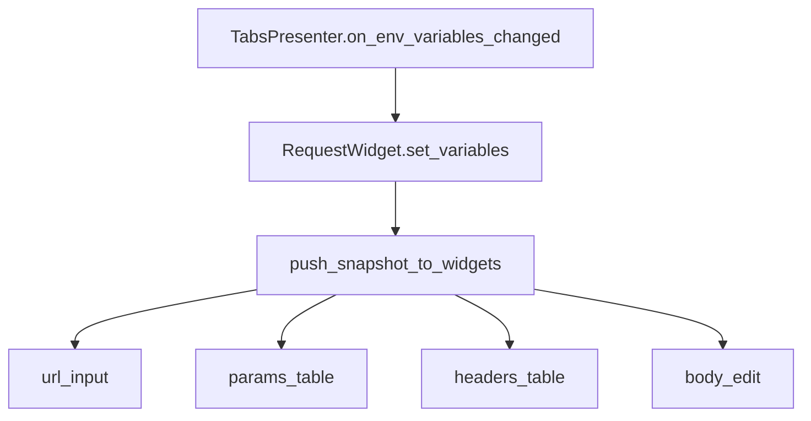

# PYPOST-128: Variable snapshot fan-out helper

## Research

PYPOST-116 established presenter-level reactivity and push snapshots into widgets.
Alternatives considered:

| Option | Verdict |
| --- | --- |
| Global `VariableContext` / observer bus | Deferred — high churn, no current pain beyond fan-out boilerplate |
| Qt property bindings per field | Rejected — multiplies signal wiring per tab |
| Declared child registry + shared push helper | **Selected** — minimal diff, aligns with existing pattern |

## Components

## Design

1. **`RequestWidget._variable_snapshot_targets`** — tuple of child widgets that accept
   environment snapshots (`set_variables`, `set_hidden_keys`).
2. **`push_snapshot_to_widgets(widgets, method_name, value)`** in `mixins.py` — calls the
   named method on each target when present (duck typing for optional editors).
3. **`set_hidden_keys`** reuses the same target list for consistency.

## Interfaces

| Symbol | Responsibility |
| --- | --- |
| `_variable_snapshot_targets` | Single place to register variable-aware children |
| `push_snapshot_to_widgets` | Generic fan-out for snapshot methods |
| `set_variables` / `set_hidden_keys` | Delegate to helper + existing side effects |

## Tests

New module `tests/test_request_editor_variable_propagation.py` verifies all four targets
receive the dict after `RequestWidget.set_variables`.
