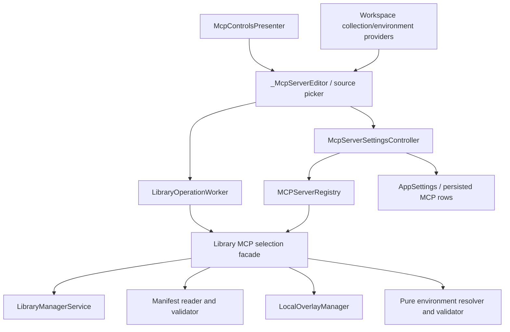

# PYPOST-1280: Select a library collection for an MCP server

## Research

The approved requirements are consistent with the current PyPost boundaries:

- `_McpServerEditor` in `pypost/ui/dialogs/mcp_servers_dialog.py` currently
  presents local collection, proxy, and environment selectors. Its
  `configuration()` method creates a `McpServerConfiguration` and the dialog
  delegates persistence to its injected save callback.
- `McpControlsPresenter` opens the dialog and supplies workspace collections and
  environments. `McpServerSettingsController` owns the persisted
  `AppSettings.mcp_servers` rows and delegates runtime state to
  `MCPServerRegistry`.
- `MCPServerRegistry` resolves collection and environment IDs independently,
  deep-copies configuration inputs, validates endpoint references, and starts
  each endpoint independently. This is the compatibility boundary for existing
  workspace-backed and proxy rows.
- `LibraryManagerService.list_connections()` returns stable connection records;
  `inspect()` and `find_and_read_manifest()` provide safe manifest discovery and
  structured diagnostics. `LibraryConnectionStore` preserves stable IDs for
  registered and cloned libraries.
- `LibraryManifest` supplies collection paths, variable metadata, defaults, and
  presets. `LocalOverlayManager` stores active-profile selection, non-secret
  overrides, and secrets outside the library, with optional encrypted secret
  storage. `EnvironmentVariableResolver` and the existing manifest resolution
  models provide the natural pure validation seam.
- `LibraryOperationWorker` is a one-shot Qt-thread adapter that reports either a
  result or an exception. It has no widget access, so it can be used for
  cancellable discovery/preparation orchestration while the dialog owns busy and
  cancel state.

Relevant existing verification seams include `tests/test_mcp_servers_dialog.py`,
`tests/test_mcp_server_controller.py`, `tests/test_mcp_server_registry.py`,
`tests/test_library_manifest_and_overlay_repro.py`, the library UI tests, and
`doc/dev/mcp_server_registry.md` / `doc/dev/testability.md`.

## Implementation Plan

The implementation will extend the existing MVP-style dialog/presenter flow and
keep library discovery, manifest parsing, resolution, and persistence in
injectable non-Qt services. The sequence is:

1. Add an explicit local collection-source value to the editor: `workspace` or
   `library`. Switching source clears the incompatible selection and disables
   save until the new source has a valid selection.
2. Inject a library-selection facade into the presenter/dialog. It will list
   connected libraries by stable ID, read and validate the selected manifest,
   and expose manifest collection entries by stable path/index. The dialog will
   use `LibraryOperationWorker` for discovery and preparation, with generation
   or request identity checks so late results cannot overwrite a newer choice.
3. Add a pure library-backed selection value containing the library stable ID,
   manifest ID, collection path, and collection index where needed to disambiguate
   repeated records. The value is carried unchanged from picker to validation,
   controller, registry, and later edit/list rendering.
4. Prepare an in-memory environment draft from manifest/collection metadata,
   the selected profile, and a copy of the local overlay. Resolve values in this
   order: manifest/collection defaults, active-profile values, local non-secret
   overrides, then local secrets. Validate profile existence, declared types,
   required values, and the selected library/collection before enabling Save.
5. Commit as one logical save through a checked two-phase boundary. A
   `LibraryMcpSaveTransaction` stages the overlay and candidate MCP row, retains
   the previous overlay/settings/registry snapshot, and exposes `commit()` and
   `rollback()` outcomes. The controller commits the checked persistence snapshot
   before replacing the registry row; if either persistence or registry validation
   fails, rollback restores the previous snapshot and reports an actionable safe
   diagnostic. The existing fire-and-forget `ConfigManager.save_config()` path must
   not be treated as the success signal for this transaction.
6. Keep runtime lookup explicit. Inject a `LibraryRuntimeResolver` with
   `resolve(selection, environment_id) -> RuntimeInputs`, where `selection` is the
   stable library/manifest/path/index value and `RuntimeInputs` contains copied
   collection requests plus the validated effective environment. The registry calls
   this resolver only when library metadata is present; legacy `collection_id` and
   `environment_id` lookup remains the workspace path, and a missing library entry
   never falls back to a workspace collection.

**Mandatory — Failing Repro (next Step 3):** Create a deterministic, offline
red contract suite before production changes. It should use temporary library
directories, fake `LibraryManagerService`/overlay/resolver/controller boundaries,
and Qt test doubles or the existing `qapp` fixture; no Git remote, network, or
real secret is permitted.

The primary red scenario belongs in a new focused test module such as
`tests/test_mcp_library_collection_pypost_1280_repro.py` and must assert:

1. A local MCP editor can choose `library`, asynchronously lists a connected
   stable library, and displays a manifest collection rather than the workspace
   collection list. A library selection retains library ID, manifest ID, path,
   and index; it is not coerced to a workspace collection ID.
2. Given defaults, a selected profile, a local non-secret override, and a local
   secret, the prepared environment has exactly the precedence
   `default < profile < override < secret`, records provenance, masks the secret
   in visible diagnostics, and rejects a missing required or wrong-typed value.
3. A valid selection reaches the controller and registry with the same library
   identity and environment association, and a reload/list-edit round trip
   retains that identity. The existing workspace and proxy paths remain
   unchanged.
4. Invalid/missing manifest, missing collection, unavailable profile, and
   persistence failure each produce a distinct recoverable error. The previous
   saved row and overlay remain byte-for-byte/equivalent unchanged.
5. Cancellation while the worker is busy clears the busy state, ignores a late
   result, performs no overlay write, and creates no partial registry/controller
   row. A second unrelated configured server remains manageable.

Each test must carry the repository-required pytest timeout marker. Step 3 must
run the focused Make target and demonstrate failure specifically because the
library source picker, identity propagation, environment draft, or transactional
save contract is not yet implemented. The test must not be weakened to pass by
changing production code in Step 3; Step 4 owns the fix.

## Architecture

### Component diagram

### Responsibilities and interfaces

| Component | Responsibility and planned interface |
| --- | --- |
| `McpControlsPresenter` | Supplies existing workspace data and library facade; opens the editor without changing proxy routing or legacy environment behavior. |
| `_McpServerEditor` | Owns source-picker UX, library/profile/variable controls, busy/cancel/error state, and an immutable draft. Emits a complete business selection only after validation. |
| Library selection facade | Qt-free orchestration boundary: `list_libraries()`, `list_manifest_collections(library_id)`, `prepare_selection(selection, draft)`, and `validate(selection, environment)`. It re-resolves the authoritative record before commit and returns a stable `LibraryCollectionSelection`. |
| `LibraryOperationWorker` | Runs the facade's read-only discovery/preparation operation off the GUI thread. The dialog owns cancellation; result handlers verify request identity and discard stale results. |
| `LibraryManagerService` / manifest reader | Resolves stable connection records, local roots, manifests, and declared collection paths. Invalid, unreadable, stale, or missing entries become structured recoverable diagnostics. |
| `LocalOverlayManager` | Loads a selected library's local profile, overrides, and secrets and provides staged `prepare`, checked `commit`, and `rollback` operations. Secret persistence uses the existing codec; it never writes shared library files. |
| Pure environment resolver | Combines defaults, profile, override, and secret layers; returns effective values, provenance, missing-required names, and type errors without logging values. |
| `LibraryRuntimeResolver` | Resolves `LibraryCollectionSelection` plus `environment_id` into immutable runtime inputs: authoritative collection requests and the validated effective environment. Missing or stale identity is a structured failure. |
| `McpServerSettingsController` | Owns `LibraryMcpSaveTransaction`: it stages the overlay and `AppSettings` row, asks the registry to validate the candidate runtime, calls checked persistence `commit()`, then installs the registry row. `rollback()` restores the previous row and overlay. |
| `MCPServerRegistry` | Owns endpoint lifecycle and independent statuses. Its injected runtime adapter has separate workspace lookup and `LibraryRuntimeResolver` branches, preserving proxy behavior and never coercing library identity into a workspace ID. |
| Models/persistence | Extend `McpServerConfiguration` with optional library source metadata and an environment association that can be serialized, migrated compatibly, and restored before runtime start. |

### Checked save contract

The save boundary is a small, testable protocol rather than an implied ordering of
side effects:

- `PreparedLibraryMcpSave` contains the candidate `McpServerConfiguration`, candidate
  local overlay, resolved `RuntimeInputs`, and immutable previous snapshots for the
  `AppSettings` row, overlay, and registry configuration. `prepare()` performs no
  writes and fails with a structured validation or resolution diagnostic.
- `McpServerSettingsController.validate_runtime(candidate)` delegates to the registry
  without mutation. The registry returns `ValidationResult(ok, category, safe_message)`
  after resolving either the workspace lookup or
  `LibraryRuntimeResolver.resolve(selection, environment_id)` branch.
- `CheckedSettingsStore.commit(candidate_settings, candidate_overlay, expected_previous)`
  writes the staged settings and overlay to temporary/atomic persistence locations and
  returns `SaveResult(committed, category, safe_message)`. A write, serialization, or
  expected-previous mismatch returns `committed=false`; it never swallows the error.
- `LibraryMcpSaveTransaction.commit()` calls that checked store exactly once, marks the
  transaction committed only on `committed=true`, and returns the same safe failure
  category otherwise. The controller then asks the registry to install the already
  preflighted candidate. If installation fails, it invokes `rollback()`.
- `LibraryMcpSaveTransaction.rollback()` is idempotent and uses the retained snapshots
  to restore the prior in-memory registry/settings and persisted overlay/settings. It
  returns `RollbackResult(restored, category, safe_message)` so rollback failure is
  visible and cannot be mistaken for a successful save. The existing
  `ConfigManager.save_config()` may remain the legacy path for unrelated settings, but
  library-backed MCP saves use `CheckedSettingsStore` (or an adapter with this exact
  checked contract).

This ordering gives Step 3 a deterministic failure seam: fake the checked store or
registry install to return a named failure and assert that the prior row and overlay
remain unchanged. No live filesystem, Git remote, or secret value is required.

### Source-picker and async interaction

The editor starts in the existing workspace mode for compatibility. In library
mode it shows connected-library identity first, then manifest-declared
collections with name, description, stable path/index, and availability. An
empty result is an explicit unavailable state, not a blank selectable item.

Discovery and environment preparation take snapshots of the selected stable IDs
and run through the worker. While active, the relevant controls are disabled,
progress is visible, and Cancel invalidates the request token. Completion is
accepted only when the token still matches the current draft; errors map to
library unavailable, manifest invalid, collection missing, profile invalid, or
environment invalid messages. No worker callback writes settings or overlays.

### Identity, environment, and persistence flow

The saved local row must contain enough source metadata to re-open the same
library asset: library stable ID, manifest ID, normalized collection path, and
collection index when duplicate records require it. A display name is only
presentation data. On edit, the resolver rechecks the connection and manifest;
stale identity fails visibly instead of silently selecting a workspace item.

Environment preparation is copy-on-write. The draft starts from manifest and
collection defaults, applies the chosen profile, then the loaded local overlay's
non-secret overrides and secrets. The UI displays provenance and masked secret
status, while the runtime receives only the validated effective snapshot. The
`LibraryMcpSaveTransaction` stages both the overlay and MCP row, asks the registry
to validate `LibraryRuntimeResolver.resolve(selection, environment_id)`, and then
performs a checked persistence commit. A persistence or registry failure invokes
rollback against the retained overlay/settings/registry snapshot, so a failed
save cannot leave only half of the library selection durable.

### Observability boundaries

Existing controller, registry, library, and overlay logging remains the owner of
operational events. Add only bounded events needed to distinguish discovery
started/completed/cancelled/failed and validation/save outcomes. Log counts,
stable non-secret IDs, error categories, and durations; never log environment
values, secret contents, bearer tokens, full headers, or manifest values marked
secret. UI messages use the structured diagnostic category and actionable text.

### Compatibility and migration

Legacy workspace rows continue to deserialize with absent library metadata and
use the current collection/environment lookup. Proxy rows remain outside the
library source flow. Existing registry startup, per-row failure isolation, port
validation, and reconfiguration semantics remain intact. Older persisted rows
must not be rewritten as library rows, and a missing library must fail that row
independently while leaving other servers usable.

## Q&A

### Why not import the library collection into workspace storage first?

Importing is explicitly out of scope and would lose the requirement that the
saved MCP row remains library-backed. The source metadata must therefore be
first-class at the MCP configuration boundary.

### Why use a pure preparation/validation facade?

It keeps filesystem and manifest failure cases deterministic, prevents Qt
widgets from owning domain rules, and lets controller/registry tests verify
identity and transactional behavior without a live library or GUI event loop.

### What is the secret-handling boundary?

Secrets enter only through the local overlay/editor draft, are encrypted at rest
when configured, are masked in the UI and diagnostics, and are passed to runtime
through the validated environment snapshot. Shared manifest and collection files
remain unchanged.
