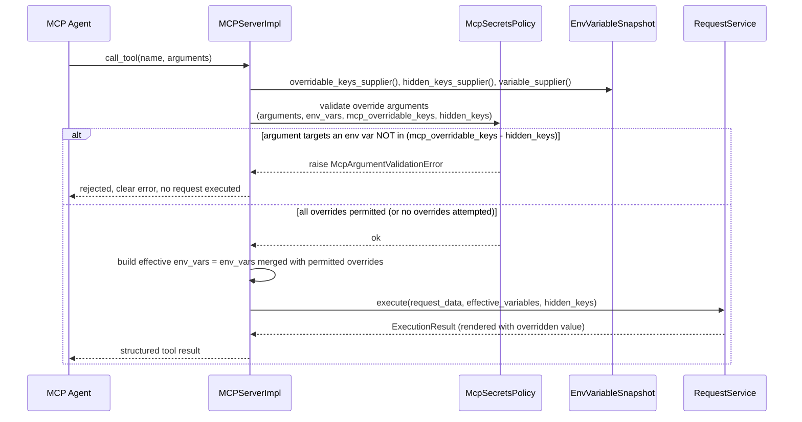
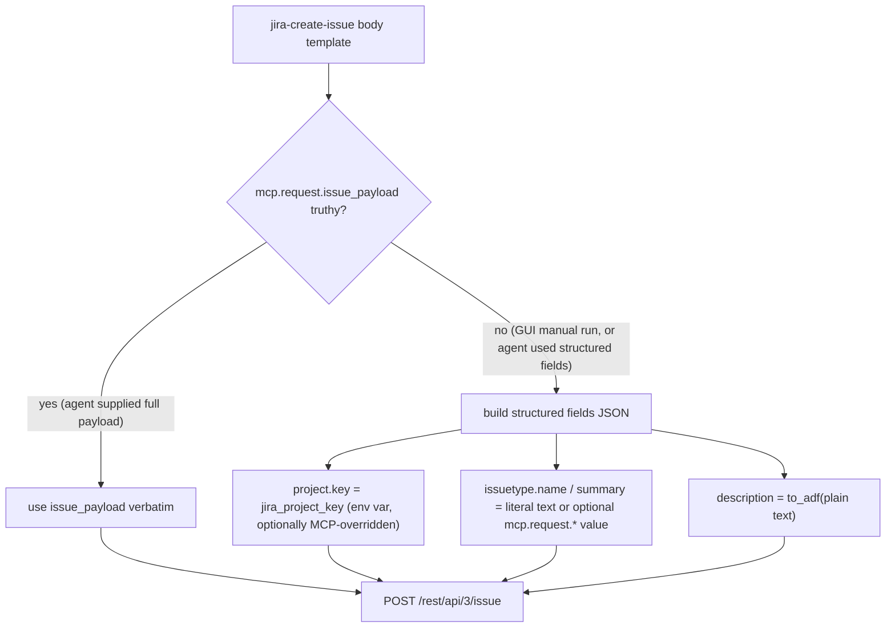

# PYPOST-1283: Unify jira-create-issue collection item and add MCP environment variable override policy

## Research

**Repo areas inspected (actual code, not assumed):**

- `pypost/models/models.py:136` — `Environment` model: `id`, `name`,
  `variables: Dict[str, str]`, `hidden_keys: Set[str]`, `enable_mcp: bool`. No
  per-variable override permission exists today.
- `pypost/core/mcp_secrets_policy.py` — `McpSecretsPolicy`: static rules that (a)
  discover `mcp.request.VAR` placeholders that become agent tool inputs, (b)
  discover top-level env-var placeholders a request references, and (c) build the
  agent-visible `inputSchema` by excluding hidden/env-only names. Today it has no
  concept of "override" — env vars are never agent-settable, only `mcp.request.*`
  values are.
- `pypost/core/mcp_server_impl.py` — `MCPServerImpl`. `_call_tool_inner` builds
  `visible_specs`/`complete_specs` (via `resolve_mcp_call_param_specs`), preflight
  validates arguments, then `_execute_request_sync` → `_build_execution_variables`
  merges `mcp_args` under a `mcp.request` namespace via `_merge_execution_variables`
  (`{**env_vars, "mcp": {"request": mcp_args}}`). **Confirmed: environment variable
  values are never touched by caller arguments today** — an MCP caller cannot
  currently override `jira_project_key` or any other bare env var at all; only
  `mcp.request.*`-prefixed placeholders are settable per call. This is exactly the
  "no override at all" half of the DoD's stated gap.
- `pypost/core/mcp_tool_contract.py` — `McpArgumentValidationError` (safe error, no
  value echoed back), `resolve_mcp_call_param_specs`, `build_tool_input_schema`,
  `validate_mcp_execution_arguments`. This is the natural home for a new
  `McpArgumentValidationError("<key>", "override", "not_permitted")`-style raise
  when a disallowed override is attempted.
- `pypost/core/environment_variable_resolver.py` — resolves `{{ }}` expressions
  *within* environment variable values (self-referential env templating); runs
  before the resolved env dict is merged into the Jinja render context. This is
  the natural point after which override substitution must already have happened
  (overrides apply to the raw values fed into this resolver, not after).
- `pypost/core/env_variable_snapshot.py` — `EnvVariableSnapshot`: main-thread-owned
  copy of `variables`/`hidden_keys`, exposed as `snapshot_variables()` /
  `snapshot_hidden_keys()` callables wired as `MCPServerImpl` suppliers. This is
  the existing supplier-callback pattern to extend for the new permission set —
  confirmed call chain: `EnvPresenter` (`pypost/ui/presenters/env_presenter.py:94-95`)
  → `MCPServerManager` (`pypost/core/qt/mcp_server.py`) →
  `MCPServerRegistry` (`pypost/core/mcp_server_registry.py:386-387,515-516`) →
  `MCPServerImpl` / `MCPProxyServerImpl`. All four layers currently thread
  `variable_supplier` and `hidden_keys_supplier` through identically; a third
  `overridable_keys_supplier` must be threaded the same way at every layer.
- `pypost/ui/widgets/environments/environment_variables_widget.py` —
  `EnvironmentVariablesWidget`: 3-column `QTableWidget` (`Variable`, `Value`,
  `Hidden`), `COL_VAR/COL_VAL/COL_HIDDEN = 0/1/2`. Hidden is a per-row checkbox
  widget (`_make_hidden_checkbox`) wired to `_on_hidden_toggled`, which mutates
  `env.hidden_keys` and re-renders the value cell (masked/unmasked). Sync back to
  the model happens in `_sync_env_variables_from_table`, called from
  `on_var_changed` and row delete/move handlers. Column headers/tooltips/labels
  live in `pypost/core/environment_messages.py` (`COLUMN_VARIABLE`,
  `COLUMN_VALUE`, `COLUMN_HIDDEN`, no MCP-override string yet).
- `pypost/core/function_registry.py` — `FunctionRegistry`: catalog of Jinja
  globals (`urlencode`, `md5`, `base64`, `to_int`, `env`), each a plain
  `Callable[..., Any]` bound into `Environment.globals` by
  `register_into_env`. Functions like `base64()` return a bare string that the
  template author wraps in quotes (`"...{{ base64(x) }}..."`). `to_int` is
  registered "strict" (raises `IntegerConversionError` — see
  `template_expression_types.py`) — the precedent for a function that can fail
  on bad input.
- `pypost/core/template_service.py` — `TemplateService` uses a stock
  `jinja2.Environment()` with **default (non-strict) `Undefined`**: an
  unresolved variable such as `mcp` (absent for a manual GUI run, since
  `_merge_execution_variables` only exists on the MCP call path) stringifies to
  `""` and is falsy in ``/boolean context — it does not raise. This is
  confirmed by reading `render_string` (`pypost/core/template_service.py:67+`)
  and is the mechanism that lets one Jinja body template serve both the MCP path
  (`mcp` defined) and the GUI path (`mcp` undefined) without new engine
  features.
- `pypost/core/request_service.py` / `pypost/core/qt/worker.py` — GUI manual runs
  call `RequestService.execute(request_data, variables, hidden_keys=...)` where
  `variables` is the selected environment's resolved variable dict — **no
  `mcp.request` namespace is ever populated for a manual run**. This is *why*
  the current `jira-create-issue` body (`{{ mcp.request.issue_payload }}`) is
  unusable from the GUI: for a manual run this placeholder always renders empty.
- `examples/collections/jira_mcp.json` — `jira-create-issue` request: body is
  exactly `{{ mcp.request.issue_payload }}`, `mcp_params.issue_payload` is
  `required: true`. Every other Jira request in the collection follows this
  same "hand a whole payload through `mcp.request.*_payload`" shape; only
  `jira-create-issue` is in scope for rework per the requirements.
- `examples/environments/jira_cloud.json` — one `Environment`:
  `jira_base_url`, `jira_project_key`, `jira_credentials` (hidden). No
  override-permission field exists yet.
- No pre-existing `mcp_overridable_keys`, `overridable`, or `McpArgumentValidationError`
  override usage anywhere in the repo (`grep` confirmed) — this is new
  capability, not a refactor of an existing partial mechanism.

**ADF v3 note:** "ADF v3" in the Jira summary refers to the Jira Cloud REST API
*v3* (`/rest/api/3/...`), which is the API version that requires descriptions
as Atlassian Document Format, not a distinct ADF schema version — ADF documents
themselves declare `"version": 1`. Minimal valid shape:
`{"version": 1, "type": "doc", "content": [{"type": "paragraph", "content": [{"type": "text", "text": "..."}]}]}`.
Plain text with blank-line-separated paragraphs maps naturally to multiple
`paragraph` nodes; empty input maps to a single empty paragraph
(`"content": []`), which Jira Cloud accepts.

## Implementation Plan

1. **Environment model** — add `mcp_overridable_keys: Set[str] = Field(default_factory=set)`
   to `Environment` (`pypost/models/models.py`). Empty-by-default is the
   secure-by-default behavior the requirements call for; no migration is needed
   for existing persisted environments (a missing field deserializes to the
   default empty set under Pydantic).
2. **Policy layer (`McpSecretsPolicy`)** — add the single source of truth for
   "which env vars may an agent override right now": `effective_overridable_keys(mcp_overridable_keys, hidden_keys) = mcp_overridable_keys - hidden_keys`
   (Hidden always wins, computed fresh every call — never trusts stored
   mutual-exclusivity). Add a partition/validation helper that, given the raw
   MCP call `arguments` dict and a request's discovered `mcp.request.*` names,
   separates arguments into (a) names that target `mcp.request.*` tool inputs
   (existing behavior, unchanged) and (b) names that target environment
   variables; for (b), any name that is a known environment variable but is not
   in `effective_overridable_keys` raises `McpArgumentValidationError`
   (`pypost/core/mcp_tool_contract.py`, new `kind="override_not_permitted"`
   branch, following the existing safe-message-without-value pattern).
3. **Execution enforcement (`MCPServerImpl` / `MCPProxyServerImpl`)** — add an
   `overridable_keys_supplier` alongside the existing `variable_supplier` /
   `hidden_keys_supplier`, threaded through the same chain used today
   (`EnvVariableSnapshot` → `EnvPresenter` → `MCPServerManager` →
   `MCPServerRegistry` → `MCPServerImpl`/`MCPProxyServerImpl`). In
   `_call_tool_inner`'s preflight step, validate attempted overrides before
   any request executes (reject-before-execute, matching the DoD: "the request
   is not executed with the attempted override applied"). In
   `_build_execution_variables`, apply only the *permitted* overrides onto a
   copy of `env_vars` before `resolve_environment_variables` runs, so
   self-referential env-var templating sees the overridden value. `list_tools`
   additionally advertises overridable, non-hidden env-var names as optional
   string properties on the tool's `inputSchema` so an agent can discover what
   it may override without reading source.
4. **UI (`EnvironmentVariablesWidget`)** — add a 4th table column, "MCP
   Override" (`COL_MCP_OVERRIDE = 3`; new `COLUMN_MCP_OVERRIDE` string in
   `pypost/core/environment_messages.py`), same checkbox-per-row pattern as
   Hidden. Wire mutual exclusion in both toggle handlers: checking Hidden
   unchecks-and-disables the row's MCP Override checkbox; checking MCP Override
   unchecks-and-disables Hidden while checked (only one may be active); the
   existing `_sync_env_variables_from_table` gains a fourth column read/write
   into `env.mcp_overridable_keys`, mirroring how it already maintains
   `env.hidden_keys`.
5. **`to_adf` template function (`FunctionRegistry`)** — register a new global
   `to_adf(text)` alongside `base64`/`to_int`, in a small new module (e.g.
   `pypost/core/adf.py`) so the conversion logic is unit-testable independent
   of the registry. Unlike `base64`, its return value is a JSON-serialized ADF
   *document object* meant to be substituted **unquoted** into a JSON body
   template (`"description": {{ to_adf(description) }}`), matching how the
   body is already free-form Jinja-rendered JSON text.
6. **Bundled example rework
   (`examples/collections/jira_mcp.json` /
   `examples/environments/jira_cloud.json`)** — restructure only the
   `jira-create-issue` request body into a dual-path Jinja template using the
   engine's existing default-`Undefined` falsiness (see Research):
   - MCP fallback path: when `mcp.request.issue_payload` is supplied (truthy),
     use it verbatim as the full request body — unchanged agent capability.
   - Structured path (used when no `issue_payload` is supplied — the case for
     every GUI run, and for an agent that prefers structured fields): plain
     JSON fields for project key (`jira_project_key` env var), issue type and
     summary (literal text a GUI user edits directly in the Body editor, or
     optional `mcp.request.*` params an agent may supply instead via
     Jinja `default(...)` fallback), and description piped through
     `to_adf(...)` so neither a human nor an agent ever hand-writes ADF.
   - `mcp_params` gains optional (non-required) entries for the structured
     fields so an agent can supply them individually without needing the full
     payload — additive to the existing `issue_payload` fallback param, not a
     replacement.
   - `examples/environments/jira_cloud.json` gains
     `"mcp_overridable_keys": ["jira_project_key"]` — base URL and credentials
     stay non-overridable, matching the DoD's stated safe default.

**Mandatory — Failing Repro (next Step 3):** This task has real runtime
behavioral change (new permission enforcement path, new template function, new
request body shape), so Step 3 needs red tests, not `N/A`. Before any
production code changes:
- A test asserting `McpArgumentValidationError` is raised (and the request is
  never executed — assert the mock HTTP client / `RequestService` is never
  invoked) when an MCP `call_tool` supplies a value for an environment
  variable that is present in the environment but absent from
  `mcp_overridable_keys` — covering both "never marked overridable" and "marked
  Hidden regardless of `mcp_overridable_keys` content" as two cases. Lives
  under `tests/test_mcp_server_impl.py` or a new
  `tests/test_mcp_environment_override_policy.py`, using the existing
  `MCPServerImpl` test harness/mocks already present in
  `tests/test_mcp_server_impl.py` (no live external deps).
- A test asserting a permitted override (`mcp_overridable_keys` contains the
  name, not hidden) *does* flow through to the resolved execution variables
  used to render the request (assert the rendered URL/body/params reflect the
  overridden value, not the environment's stored value).
- A test asserting `Environment().mcp_overridable_keys` defaults to `set()`
  (secure-by-default for the bare model) — `tests/test_models.py` or wherever
  `Environment` defaults are already covered.
- A test (`pytest-qt`, mirroring `tests/test_environment_variables_widget.py`'s
  existing patterns) asserting: checking the Hidden checkbox for a row
  unchecks and disables that row's MCP Override checkbox, and vice versa; and
  that `env.mcp_overridable_keys`/`env.hidden_keys` never simultaneously
  contain the same key after any sequence of UI toggles.
- A test for `to_adf`: plain single-line text produces a well-formed ADF doc
  with one paragraph/one text node; multi-paragraph text (blank-line
  separated) produces multiple paragraph nodes; empty string produces a valid
  doc with an empty paragraph, not an error.
- Sequencing: write each red test against the *current* code (they must fail
  for the right reason — `AttributeError`/`KeyError` on the not-yet-existing
  field, or "no exception raised" where one is now required — not for
  unrelated reasons), get them independently reviewed per `td-25-failing-repro`,
  then proceed to Step 4 implementation until green.

## Architecture

### Module responsibilities

- **`pypost/models/models.py` (`Environment`)** — data-of-record for the new
  per-variable permission: `mcp_overridable_keys: Set[str]`. Purely a schema
  change; no behavior. Secure-by-default via `default_factory=set`.
- **`pypost/core/mcp_secrets_policy.py` (`McpSecretsPolicy`)** — single
  authority for "what may an agent see/set," extended with "what may an agent
  override." Computes the effective overridable set (`mcp_overridable_keys -
  hidden_keys`) fresh on every call — the enforcement point, not the storage
  point, is what guarantees Hidden always wins even if UI/import ever produced
  an inconsistent stored state.
- **`pypost/core/mcp_tool_contract.py`** — carries the safe error type
  (`McpArgumentValidationError`) used for override rejection, consistent with
  how missing/invalid `mcp.request.*` arguments are already reported.
- **`pypost/core/mcp_server_impl.py` (`MCPServerImpl`)** / **`mcp_proxy_server_impl.py`
  (`MCPProxyServerImpl`)** — execution boundary. Owns the new
  `overridable_keys_supplier`, calls into `McpSecretsPolicy` for
  preflight validation (reject before execute) and for building the
  overridden environment snapshot used by `_build_execution_variables`.
  Also advertises overridable keys in `list_tools`' schema.
- **`pypost/core/env_variable_snapshot.py` (`EnvVariableSnapshot`)** →
  **`pypost/ui/presenters/env_presenter.py`** → **`pypost/core/qt/mcp_server.py`**
  (`MCPServerManager`) → **`pypost/core/mcp_server_registry.py`**
  (`MCPServerRegistry`) — existing supplier-callback relay chain, extended
  with one more parallel callable (`overridable_keys_supplier`) at every hop,
  mirroring `hidden_keys_supplier` exactly.
- **`pypost/ui/widgets/environments/environment_variables_widget.py`
  (`EnvironmentVariablesWidget`)** — presentation and direct edit surface for
  the new permission; the only place a human sets `mcp_overridable_keys`.
  Owns the UI-side half of Hidden/Override mutual exclusivity (the other half
  is the execution-time defense-in-depth in `McpSecretsPolicy`).
- **`pypost/core/function_registry.py` (`FunctionRegistry`)** /
  **`pypost/core/adf.py` (new)** — `to_adf(text)` as a Jinja global,
  registered the same way as `base64`/`to_int`. Pure function: plain text in,
  ADF-document JSON string out. No knowledge of Jira, MCP, or environments —
  reusable by any collection author, not just the bundled example.
- **`examples/collections/jira_mcp.json`, `examples/environments/jira_cloud.json`**
  — consumers of all of the above: the dual-path body demonstrates `to_adf`
  and the GUI/MCP-shared template pattern; the environment demonstrates a
  sane default `mcp_overridable_keys`.

### Data flow — MCP override enforcement (new)



### Data flow — jira-create-issue dual GUI/MCP path (new)



### Key decisions

1. **Enforcement lives at the execution boundary, not just storage.**
   `McpSecretsPolicy` recomputes `mcp_overridable_keys - hidden_keys` on every
   call rather than trusting a pre-filtered stored set. This directly satisfies
   the non-functional requirement that Hidden/Override exclusivity holds "at
   execution time, independent of how the variable's flags were set or
   stored" — protecting against import, manual JSON edits, or future bugs that
   might otherwise produce an inconsistent `Environment`.
2. **New permission is opt-in and additive, never open by default.**
   `mcp_overridable_keys` defaults to empty; an environment created before this
   change, or a variable never explicitly marked, is non-overridable — matching
   "must never default open."
3. **No new namespace for overrides — env vars are overridden by name,
   `mcp.request.*` stays as-is.** Overriding reuses the environment variable's
   own bare name (e.g. `jira_project_key`) as the MCP argument name, so
   existing bare-name template references (`{{ jira_project_key }}`) need no
   change to honor an override; `mcp.request.*` continues to serve inputs that
   were never environment-backed (e.g. `issue_payload`). Keeping these two
   mechanisms distinct avoids collision rules and keeps the change additive.
4. **Reject-before-execute, not best-effort.** Override validation happens in
   the preflight step of `_call_tool_inner`, before `_execute_request_sync` is
   invoked — matching the DoD ("the request is not executed with the
   attempted override applied"), and reusing the same preflight/execution-
   boundary split `MCPServerImpl` already has for `mcp.request.*` argument
   validation.
5. **`to_adf` is a generic, Jira-agnostic template function**, not
   Jira-specific glue bolted onto the collection loader. It lives in
   `FunctionRegistry` next to `base64`/`urlencode`/`to_int` so any collection
   author gets it, satisfying the user story "As a collection author, I want a
   way to convert plain text into Jira's rich-text format from within a
   request definition" without special-casing Jira in the core template
   engine.
6. **The dual-path body relies on Jinja's existing default-`Undefined`
   falsiness** (``) rather than adding new
   template-engine capability. This was verified against
   `pypost/core/template_service.py`'s stock `jinja2.Environment()` (no
   `StrictUndefined`), so it works for both a GUI manual run (`mcp` absent from
   context) and an MCP call (`mcp.request.issue_payload` present or absent)
   with zero engine changes — keeping this task's scope to the collection
   content and the override/ADF mechanisms, not the template engine.
7. **No new GUI widget for structured request fields.** The GUI-fillable
   "ordinary fields" (issue type, summary, plain-text description) are edited
   directly in the request's existing Body JSON editor, the same surface every
   other request already uses — consistent with the requirement's constraint
   that the fix must not require general rework of the environment/request
   editing system beyond what's needed for this task, and with the explicit
   out-of-scope note that library/collection editing UX beyond the one
   permission control is not part of this task.

### Interfaces (signatures, no bodies)

```
# pypost/models/models.py
class Environment(BaseModel):
    ...
    mcp_overridable_keys: Set[str] = Field(default_factory=set)

# pypost/core/mcp_secrets_policy.py
class McpSecretsPolicy:
    @staticmethod
    def effective_overridable_keys(
        mcp_overridable_keys: Iterable[str], hidden_keys: Iterable[str]
    ) -> Set[str]: ...

    @staticmethod
    def validate_environment_overrides(
        arguments: Mapping[str, Any],
        env_vars: Mapping[str, str],
        mcp_overridable_keys: Iterable[str],
        hidden_keys: Iterable[str],
    ) -> None:  # raises McpArgumentValidationError
        ...

    @staticmethod
    def apply_permitted_overrides(
        env_vars: Mapping[str, str],
        arguments: Mapping[str, Any],
        mcp_overridable_keys: Iterable[str],
        hidden_keys: Iterable[str],
    ) -> dict[str, str]: ...

# pypost/core/mcp_server_impl.py (and mcp_proxy_server_impl.py mirror)
class MCPServerImpl:
    def __init__(self, ..., overridable_keys_supplier: Callable[[], set[str]] | None = None): ...
    def set_overridable_keys_supplier(self, supplier: Callable[[], set[str]] | None) -> None: ...

# pypost/core/env_variable_snapshot.py
class EnvVariableSnapshot:
    def update(
        self,
        variables: dict[str, str],
        hidden_keys: set[str] | None = None,
        overridable_keys: set[str] | None = None,
    ) -> None: ...
    def snapshot_overridable_keys(self) -> set[str]: ...

# pypost/core/adf.py (new)
def to_adf(text: str) -> str:
    """Plain text -> JSON-serialized Atlassian Document Format v1 doc."""
    ...

# pypost/core/function_registry.py
_DEFAULT_CATALOG["to_adf"] = to_adf

# pypost/ui/widgets/environments/environment_variables_widget.py
COL_MCP_OVERRIDE = 3
# vars_table becomes QTableWidget(0, 4); env.mcp_overridable_keys synced
# alongside env.hidden_keys in _sync_env_variables_from_table; toggle
# handlers enforce mutual exclusion between COL_HIDDEN and COL_MCP_OVERRIDE
# checkboxes per row.
```

## Q&A

- Q: Does an MCP override use the same `mcp.request.*` namespace as other agent
  inputs, or the bare environment-variable name?
  A: The bare environment-variable name. Confirmed by reading
  `mcp_server_impl.py`: today `mcp.request.*` is reserved for inputs that have
  no environment-variable backing (e.g. `issue_payload`), and env vars are
  referenced bare (`{{ jira_project_key }}`) everywhere in the example
  collection. Reusing the bare name means existing request templates need no
  change to become override-aware, and keeps the two mechanisms (declared tool
  inputs vs. environment overrides) clearly separated by name origin, not by a
  parsed prefix.
- Q: Where exactly must Hidden/Override mutual exclusivity be enforced, given
  the model itself does not forbid both sets containing the same key?
  A: Twice, independently, per the non-functional requirement: (1) the UI
  (`EnvironmentVariablesWidget`) prevents a human from checking both boxes for
  one row at input time, and (2) `McpSecretsPolicy.effective_overridable_keys`
  subtracts `hidden_keys` from `mcp_overridable_keys` on every execution-time
  check, so even a hand-edited or imported environment with both sets
  containing the same key can never let that key be overridden. Neither layer
  is allowed to assume the other has already enforced it.
- Q: Why not add a GUI-only structured-fields editor (separate title/type/
  summary/description inputs) instead of reusing the Body JSON editor?
  A: Requirements scope explicitly excludes "general rework of the environment
  or MCP permission/config system beyond the single new per-variable override
  permission," and the entities/components list in the task brief names only
  `Environment`, `MCPServerImpl`, `McpSecretsPolicy`,
  `EnvironmentVariablesWidget`, `FunctionRegistry`, and the two example JSON
  files — no new request-editor widget. Reusing the existing Body editor with
  a Jinja `to_adf(...)` call satisfies "no hand-written ADF/JSON" (the actual
  stated pain point) without adding a new UI surface.
