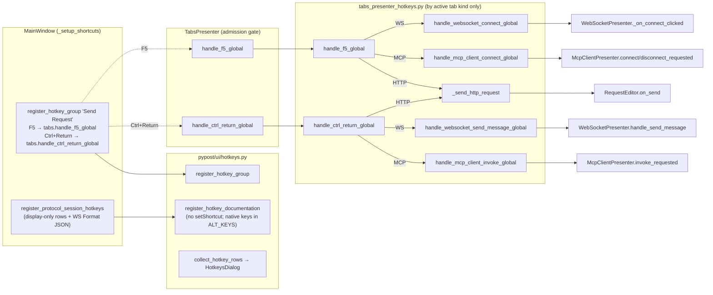

# PYPOST-1285: Disambiguate Ctrl+Enter shortcut routing and documentation across protocol tabs

## Research

### Current wiring (code as of `1b990ba5`)

| Layer | File | What it does today |
| --- | --- | --- |
| Binding | `pypost/ui/main_window.py` `_setup_shortcuts` (~L298) | One `register_hotkey(section="Request Editor", label="Send Request", keys=("F5", "Ctrl+Return"), slot=tabs.handle_send_request_global)`. Both keys go to the **same** slot: F5 is the `QAction` shortcut, Ctrl+Return is an extra `QShortcut`. |
| Admission wrapper | `pypost/ui/presenters/tabs_presenter.py` L678-711 | `handle_send_request_global`, `handle_websocket_send_global`, `handle_mcp_client_send_global`, and others check `_admission_open()`, then delegate. |
| Routing | `pypost/ui/presenters/tabs_presenter_hotkeys.py` | `handle_send_request_global`: MCP tab → `handle_mcp_client_send_global` (invoke when focus is in `invoke_form`, otherwise connect toggle); WS tab → `handle_websocket_send_global` (send when focus is in `composer`, otherwise `_on_connect_clicked`); HTTP → `request_editor.on_send()`. The slot cannot tell which key was pressed, so **F5 and Ctrl+Return behave the same way**. Both depend on focus. |
| Help rows | `pypost/ui/main_window_protocol_hotkeys.py` | Display-only rows via `register_hotkey_documentation`: WS/MCP "Connect / Disconnect" = `F5, Ctrl+Return`; "Send Message" / "Invoke Tool" = `Ctrl+Return`. |
| Registry | `pypost/ui/hotkeys.py` | `register_hotkey_documentation` → `tag_action(keys=...)`, which calls `action.setShortcut(QKeySequence(keys[0]))` on the "display-only" action and adds it to the parent. |
| Callers | `grep` | `handle_send_request_global` is bound only in `main_window.py`. Nothing else in `pypost/` calls `handle_websocket_send_global`, `handle_mcp_client_send_global`, `_focus_in_composer`, or `_focus_in_invoke_form`. Only `tests/test_main_window_hotkeys.py` uses the connect and invoke handlers directly. |

### Customization check

Hotkeys are **not user-configurable**. `AppSettings` has no hotkey fields, and every key is a
literal in `main_window.py`, `main_window_protocol_hotkeys.py`, or the per-tab Save actions.
There is nothing to migrate, and splitting the binding cannot break user bindings. Making
hotkeys configurable is out of scope (see `10-requirements.md`).

### Latent defect found: "display-only" Help rows steal the real shortcuts

`register_hotkey_documentation` is meant to add display-only rows (see
`doc/dev/websocket_hotkeys.md`: "to avoid duplicate Qt shortcut bindings"). In practice
`tag_action` gives every documentation `QAction` a live `QKeySequence` (its first key), and the
action is added to `MainWindow` with the default `Qt.WindowShortcut` context. So `MainWindow`
ends up with several enabled actions bound to the same key:

- `F5`: "Send Request" (real), WS "Connect / Disconnect" (doc), MCP "Connect / Disconnect" (doc).
- `Ctrl+Return`: "Send Request" alt `QShortcut` (real), WS "Send Message" (doc), MCP "Invoke Tool" (doc).
- `Ctrl+L`: "Focus URL Bar" `QAction` (real, `main_window.py` L306-312), WS "Focus URL Bar"
  (doc, `main_window_protocol_hotkeys.py` L34-40), MCP "Focus URL Bar" (doc, L63-69).

Qt treats identical keys in the same context as an ambiguous overload. `QAction::event` logs
`QAction::event: Ambiguous shortcut overload: <key>` and does **not** trigger.

**Full audit of documentation rows.** `register_hotkey_documentation` has exactly six callers,
all in `main_window_protocol_hotkeys.py`. `tag_action` binds only `keys[0]`; later keys go to
`ALT_KEYS_PROPERTY` and are display-only. Every real binding on `MainWindow` was checked
(`main_window.py` `_create_menu_bar` / `_setup_shortcuts`, the WS "Format JSON"
`register_hotkey`). Per-tab Save actions and widget-local `QShortcut`s use keys that no
documentation row uses.

| Documentation row (section / label) | Keys | Live key bound by `tag_action` | Collides with real action | Effect today |
| --- | --- | --- | --- | --- |
| WS / Connect / Disconnect | `F5, Ctrl+Return` | `F5` | Send Request `QAction` (F5) | F5 dead |
| WS / Send Message | `Ctrl+Return` | `Ctrl+Return` | Send Request alt `QShortcut` | Ctrl+Return dead |
| WS / Focus URL Bar | `Ctrl+L, Alt+D` | `Ctrl+L` | Focus URL Bar `QAction` (Ctrl+L) | **Ctrl+L dead** |
| MCP / Connect / Disconnect | `F5, Ctrl+Return` | `F5` | Send Request `QAction` (F5) | F5 dead |
| MCP / Invoke Tool | `Ctrl+Return` | `Ctrl+Return` | Send Request alt `QShortcut` | Ctrl+Return dead |
| MCP / Focus URL Bar | `Ctrl+L, Alt+D` | `Ctrl+L` | Focus URL Bar `QAction` (Ctrl+L) | **Ctrl+L dead** |

`Alt+D` is not affected. It is only a real alt `QShortcut` plus a display-only
`ALT_KEYS_PROPERTY` entry on the doc rows, so it stays unique and works. No other key
(`Ctrl+Shift+F`, `Ctrl+Q`, `Ctrl+,`, `F12`, `Ctrl+E`, `Ctrl+N/W/Tab/Shift+Tab`, `Alt+1..9`,
`Ctrl+P/H/B/T`) is bound by a documentation row. The affected set is therefore exactly
**{F5, Ctrl+Return, Ctrl+L}**.

An empirical probe ran through `make test PYTEST_ARGS=<scratch test>` with the offscreen
platform. It used a bare `QWidget` with one `register_hotkey(F5, Ctrl+Return)` plus the two WS
documentation rows, and sent `QTest.keyClick`:

| Setup | F5 slot calls | Ctrl+Return slot calls |
| --- | --- | --- |
| No documentation rows | 1 | 1 |
| With WS documentation rows | **0** | **0** (stderr: `Ambiguous shortcut overload: F5`) |

A second probe (same runner, scratch file deleted afterwards) used a bare `QWidget` with the real
`register_hotkey("Focus URL Bar", keys=("Ctrl+L", "Alt+D"))` plus
`register_protocol_session_hotkeys(w, MagicMock())`. It called `show()`, `activateWindow()`,
and `QTest.qWaitForWindowActive(w, 2000)`, which returned `True` offscreen.

| Setup | Ctrl+L slot calls | Alt+D slot calls |
| --- | --- | --- |
| No documentation rows | 1 | 1 |
| With protocol documentation rows | **0** | 1 |

As a result, the real keyboard path for F5, Ctrl+Return, and Ctrl+L is probably dead in **all**
tabs (HTTP included) since PYPOST-1162/1175. Only Alt+D focuses the URL bar today. Existing
tests never notice because they call presenter handlers directly and never send key events. This
task cannot meet DoD items 1, 3, 5, and 6 ("pressing the key does X") unless documentation rows
stop binding shortcuts, so the fix is in scope. The same fix re-enables Ctrl+L, which differs
from the literal "as today" of DoD 7. This is treated as restoring the documented behavior
(Help already lists `Ctrl+L / Alt+D`), and it is recorded under Risks and guarded by tests E3
and F3.

### Widget-level key consumption

- `CodeEditor.keyPressEvent` handles `Return/Enter`, but it does not accept
  `ShortcutOverride` for `Ctrl+Return`. Window-level shortcuts therefore win over the text
  editors (composer payload, MCP args, request body), so `Ctrl+Return` does not insert a newline
  there. This is unchanged.
- `HistoryPanel` binds only `QKeySequence.Copy` on its list widget. Nothing in the sidebar
  consumes F5 or Ctrl+Return.
- Modal dialogs are separate windows, so `MainWindow` window-shortcuts do not fire while a
  dialog is active. This is unchanged.

### Precondition guards (reused, unchanged)

- `WebSocketPresenter.handle_send_message` returns early with
  `websocket_send_blocked_not_open` when the state is not `OPEN`. It never touches the
  connection, which satisfies DoD 2.
- `McpClientPresenter.invoke_requested` ignores the call when an invoke is in flight, when the
  session is not connected (shows "Connect before invoking a tool."), or when no tool is
  selected. Invalid arguments show a validation error. It never connects. This satisfies DoD 4.

### Background references

- Qt 6 `QShortcut`, "Ambiguous shortcuts" and `activatedAmbiguously()`
  (<https://doc.qt.io/qt-6/qshortcut.html>, signal:
  <https://doc.qt.io/qt-6/qshortcut.html#activatedAmbiguously>): "activatedAmbiguously() is
  emitted if the key sequence is still ambiguous … The activated() signal is not emitted in
  this case." The default context is `Qt::WindowShortcut`.
- Qt 6 `QAction` shortcut properties (<https://doc.qt.io/qt-6/qaction.html#shortcut-prop>,
  <https://doc.qt.io/qt-6/qaction.html#shortcutContext-prop>): a `QAction` added to a widget
  takes part in the same shortcut map. Two enabled actions with the same sequence and context
  are ambiguous, and Qt logs `QAction::event: Ambiguous shortcut overload` instead of
  triggering.
- `Qt::ShortcutContext` (<https://doc.qt.io/qt-6/qt.html#ShortcutContext-enum>):
  `WindowShortcut` is "active when its parent widget is a logical subwidget of the active
  top-level window". So every action and shortcut parented to `MainWindow` competes for the
  same key, whichever widget has focus.
- `QTest::qWaitForWindowActive` (<https://doc.qt.io/qt-6/qtest.html#qWaitForWindowActive>):
  a bounded wait for window activation. `WindowShortcut` needs an active window, so the
  keystroke tests (E, F) call it first.
- Both probes above confirm this behavior on PySide6 (offscreen platform).

## Implementation Plan

1. **Registry fix (`pypost/ui/hotkeys.py`)**: make `register_hotkey_documentation` truly
   display-only. It must not call `setShortcut`. It stores every key, already converted to
   platform-native text (`QKeySequence(k).toString(NativeText)`), in `ALT_KEYS_PROPERTY`.
   `_keys_from_action` already returns `ALT_KEYS_PROPERTY` when the shortcut is empty, so
   `collect_hotkey_rows` output is unchanged for existing rows ("Focus URL Bar" still shows
   `Ctrl+L / Alt+D`), and "Send Message" still shows the native name. `tag_action` stays as it
   is for real actions (`tag_action` callers such as Save, Quit, and per-tab Save keep binding).
2. **Key-specific routing (`tabs_presenter_hotkeys.py`)**: replace the single focus-dependent
   router with two key-specific, focus-independent routers:
   - `handle_f5_global(presenter)`: MCP → `handle_mcp_client_connect_global`; WS →
     `handle_websocket_connect_global`; HTTP → `request_editor.on_send()`; none → no-op.
   - `handle_ctrl_return_global(presenter)`: MCP → `handle_mcp_client_invoke_global`; WS →
     `handle_websocket_send_message_global` (new: `ws_tab.presenter.handle_send_message()`,
     guarded for `presenter is None`); HTTP → `request_editor.on_send()`; none → no-op.
   - Delete `handle_send_request_global`, `handle_websocket_send_global`,
     `handle_mcp_client_send_global`, `_focus_in_composer`, `_focus_in_invoke_form`, and
     `_is_descendant`, and drop the now-unused `QApplication` and `QWidget` imports. Nothing
     else in the app depends on them.
   - Factor the HTTP branch into one private `_send_http_request(presenter)` that both routers
     use, so HTTP behavior is defined in one place.
3. **Presenter facade (`tabs_presenter.py`)**: replace the three wrappers
   `handle_send_request_global`, `handle_websocket_send_global`, and
   `handle_mcp_client_send_global` with `handle_f5_global`, `handle_ctrl_return_global`, and
   `handle_websocket_send_message_global`. Each one checks `_admission_open()` first, as the
   wrappers do today. `handle_websocket_connect_global`, `handle_mcp_client_connect_global`,
   and `handle_mcp_client_invoke_global` stay.
4. **Binding (`main_window.py`)**: replace the "Send Request" `register_hotkey` with
   `register_hotkey_group(section="Request Editor", label="Send Request",
   bindings=(("F5", tabs.handle_f5_global), ("Ctrl+Return", tabs.handle_ctrl_return_global)),
   order=1, collapse_keys=False)`. That gives one Help row `F5 / Ctrl+Return` (same text as
   today) and two independent `QShortcut`s with one slot each. The two keys keep the same
   window context and parent as today.
5. **Help rows (`main_window_protocol_hotkeys.py`)**: WS and MCP "Connect / Disconnect" →
   `keys=("F5",)`. "Send Message" and "Invoke Tool" stay `("Ctrl+Return",)`. Update the module
   docstring.
6. **User docs**:
   - `doc/user/hotkeys.md`: WS row → `Connect / Disconnect | F5 | Connects or disconnects the
     session`. MCP row → `Connect / Disconnect | F5 | Connects or disconnects the session`.
     "Send Message" and "Invoke Tool" descriptions say that the key works anywhere in the tab.
   - `doc/user/websocket.md` L25 → "Click **Connect** (or press `F5`)". L44 → "Click **Send** or
     press `Ctrl+Enter` to transmit the active message". Check `doc/user/mcp-client.md` for
     similar wording. A grep shows none today, so add nothing unless a mention exists.
7. **Tests**: Step 3 red tests (below), then update existing tests that use old names or
   doc-row keys (`test_*_session_documentation_rows_registered` → `keys=("F5",)`).
8. **Dev docs (Step 8)**: update `doc/dev/websocket_hotkeys.md`, `doc/dev/mcp_client_hotkeys.md`
   (routing tables and API blocks), and `doc/dev/hotkeys.md` (documentation rows are
   display-only and never bind a key).

### Behavior matrix (target)

These rows are independent of focus anywhere in `MainWindow`. That includes the composer, the
MCP args form, the URL bar, the message stream, the sidebar (Collections, History), and no focus
at all. This resolves reviewer note (a). The key is a window-level shortcut on `MainWindow`, and
the router reads only `currentWidget()` of the workspace tabs, never `QApplication.focusWidget()`.

| Active tab | F5 | Ctrl+Return |
| --- | --- | --- |
| HTTP Request | Send Request (unchanged, note b) | Send Request (unchanged, note b) |
| WebSocket | `_on_connect_clicked` (connect / disconnect / cancel attempt) | `handle_send_message` (blocked silently with a log when not `OPEN`) |
| MCP Client | `disconnect_requested` if CONNECTED/CONNECTING, else `connect_requested` | `invoke_requested` (existing guards) |
| None / admission closed | no-op | no-op |

### Mandatory: Failing Repro (Step 3)

Sequence: research (done) → red tests (Step 3, no production edits) → Step 4 implementation
until green. Everything runs offscreen with no network: WS/MCP presenters are spied, and
`MainWindow` collaborators are patched.

**Helper for presenter-level dispatch.** Both keys are bound to `handle_send_request_global`
today. The tests use a small helper in `tests/test_main_window_hotkeys.py`:

```python
_KEY_SLOTS = {"F5": "handle_f5_global", "Ctrl+Return": "handle_ctrl_return_global"}

def _press(presenter, key):
    slot = getattr(presenter, _KEY_SLOTS[key], None)
    if slot is None:  # current code binds both keys to one slot; removed in Step 4
        slot = presenter.handle_send_request_global
    slot()
```

The helper reproduces what each key does today, so the tests fail on **assertions about the
wrong action**, not on `AttributeError`. Step 4 deletes the fallback branch.

**Focus control.** Use `patch.object(QApplication, "focusWidget", return_value=<widget or
None>)`, patched on the `PySide6.QtWidgets.QApplication` class rather than on a module
attribute. This makes focus deterministic offscreen and keeps the patch valid after Step 4
removes the `QApplication` import from `tabs_presenter_hotkeys.py`.

**Timeouts.** Module `pytestmark = pytest.mark.timeout(120)` already exists in
`tests/test_main_window_hotkeys.py`, and `tests/test_hotkeys.py` already has
`pytestmark = pytest.mark.timeout(30)`. New tests inherit these markers, as `do-testing`
requires.

#### A. `tests/test_main_window_hotkeys.py::TestCtrlReturnF5RoutingWebSocket` (real `TabsPresenter` + blank WS tab; spy `tab.presenter.handle_send_message` and `tab.presenter._on_connect_clicked`)

| Test | Focus | Assert | Today |
| --- | --- | --- | --- |
| `test_ctrl_return_outside_composer_sends_not_toggles` | `connection_editor.url_input` | send ×1, connect ×0 | **RED**: connect toggled |
| `test_ctrl_return_with_no_focus_sends_not_toggles` | `None` (sidebar / outside the tab) | send ×1, connect ×0 | **RED** |
| `test_ctrl_return_in_composer_sends` | `composer.payload_edit` | send ×1, connect ×0 | green (guard) |
| `test_ctrl_return_disconnected_does_not_connect` | `url_input`; real `handle_send_message` (no spy), state `SessionState.IDLE` | connect spy ×0, `presenter.state` unchanged | **RED** |
| `test_f5_in_composer_toggles_not_sends` | `composer.payload_edit` | connect ×1, send ×0 | **RED**: message sent |
| `test_f5_outside_composer_toggles` | `url_input` and `None` | connect ×1, send ×0 | green (guard) |

Connected (`OPEN`) cases mirror MCP group B. Set `tab.presenter._current_state =
SessionState.OPEN`. Keep the **real** `_on_connect_clicked`, and spy
`tab.presenter.handle_disconnect`, `tab.presenter.handle_connect`, and
`tab.presenter.handle_send_message`, so nothing touches the network.

| Test | Focus / state | Assert | Today |
| --- | --- | --- | --- |
| `test_ctrl_return_open_outside_composer_does_not_disconnect` | `url_input` and `None`, `OPEN` | send ×1, disconnect ×0, connect ×0 | **RED**: disconnected |
| `test_ctrl_return_open_in_composer_sends_not_disconnects` | `composer.payload_edit`, `OPEN` | send ×1, disconnect ×0 | green (guard) |
| `test_f5_open_in_composer_disconnects_not_sends` | `composer.payload_edit`, `OPEN` | disconnect ×1, send ×0 | **RED**: message sent |
| `test_f5_open_outside_composer_disconnects` | `url_input` and `None`, `OPEN` | disconnect ×1, send ×0 | green (guard) |

The disconnected rows above (state `SessionState.IDLE`, the default for a blank tab) plus these
`OPEN` rows cover the DoD 16 grid for WebSocket: {Ctrl+Return, F5} × {focus inside composer,
outside / none} × {disconnected, connected}.

#### B. `tests/test_main_window_hotkeys.py::TestCtrlReturnF5RoutingMcpClient` (blank MCP tab; spy `invoke_requested`, `connect_requested`, `disconnect_requested`)

| Test | Focus / state | Assert | Today |
| --- | --- | --- | --- |
| `test_ctrl_return_outside_invoke_form_invokes_not_toggles` | `url_input`, DISCONNECTED | invoke ×1, connect ×0 | **RED** |
| `test_ctrl_return_connected_outside_form_does_not_disconnect` | `None`, state CONNECTED (patch `state` / `_state`) | invoke ×1, disconnect ×0 | **RED** |
| `test_ctrl_return_in_invoke_form_invokes` | a descendant of `invoke_form` | invoke ×1 | green (guard) |
| `test_f5_in_invoke_form_toggles_not_invokes` | `invoke_form` descendant, DISCONNECTED | connect ×1, invoke ×0 | **RED** |
| `test_f5_connected_in_invoke_form_disconnects` | `invoke_form` descendant, CONNECTED | disconnect ×1, invoke ×0 | **RED** |

#### C. `tests/test_main_window_hotkeys.py::TestCtrlReturnF5RoutingHttp` (regression, note b)

- `test_f5_sends_http_request` and `test_ctrl_return_sends_http_request`: spy
  `request_editor.on_send`, assert ×1 each. Green today; kept as guards.
- `test_keys_noop_without_tabs`: no tab is open, and both keys raise nothing.

#### D. Help rows: `tests/test_main_window_hotkeys.py::TestProtocolSessionHelpRows`

Call `register_protocol_session_hotkeys(root, MagicMock())` on a bare `QWidget`, then
`collect_hotkey_rows(root)`:

- `test_websocket_connect_row_lists_only_f5`: WS "Connect / Disconnect" == `"F5"`. **RED**
  today (`F5 / Ctrl+Return`).
- `test_mcp_connect_row_lists_only_f5`: same for the MCP Client section. **RED**.
- `test_send_and_invoke_rows_list_native_ctrl_return`: "Send Message" and "Invoke Tool" ==
  `QKeySequence("Ctrl+Return").toString(NativeText)`. Green guard for DoD 9 and 10.
- `test_no_key_listed_twice_within_session_sections`: split each row's display on `" / "`, and
  check that no key repeats within the WebSocket Session or MCP Client section. **RED**.
- `test_documentation_rows_bind_no_shortcut`: every action that
  `register_protocol_session_hotkeys` creates without a slot has `shortcut().isEmpty()`.
  Identify the "Format JSON" real action by label and exclude it. **RED**: doc rows bind F5 or
  Ctrl+Return.

#### Window activation (mandatory for E and F)

`Qt::WindowShortcut` fires only for the active top-level window. Every keystroke test in E and F
must therefore:

1. Call `w.show()`, then `w.activateWindow()`.
2. Assert `QTest.qWaitForWindowActive(w, 2000) is True`. The wait is bounded, as `do-testing`
   requires. The Step 2 probe got `True` on the offscreen platform. If a platform cannot
   activate the window, the test calls `pytest.skip("window activation unavailable on this
   QPA platform")` instead of asserting slot counts, and Step 3 records the skip in the
   roadmap. A skipped test never counts as red.
3. Give the focus target focus (`setFocus()` + `processEvents()`), then send the key.
4. Close the window in `try/finally` (`w.close()`, then `processEvents()`). A bare `QWidget`
   (group E) closes directly. A real `MainWindow` (group F) must not run the production
   shutdown: `MainWindow.closeEvent` → `main_window_lifecycle.close_event` calls
   `window._shutdown_for_exit()` → `shutdown_for_exit` → `window.teardown(timeout_ms=5000)`.
   With a `MagicMock` `TabsPresenter` the outcome is not `"success"`, so `event.ignore()` runs,
   the window stays open, and teardown can block for up to 5 s. Before `w.close()`, replace the
   bound method on the instance, following the precedent in
   `tests/test_presenter_teardown_contract_repro.py::test_main_window_close_event_rejects_incomplete_cleanup`
   (`root._shutdown_for_exit = lambda: ...`):
   `w._shutdown_for_exit = lambda: TeardownResult("main_window", "success", 0)`
   (`TeardownResult` from `pypost.core.lifecycle`). `close_event` then calls
   `event.accept()`, and the close completes without touching teardown. Assert
   `not w.isVisible()` after `processEvents()` so a regression in this strategy fails loudly.

With activation asserted first, a red result can only come from the ambiguous-shortcut defect
or the old single-slot binding, never from a missing active window.

#### E. Registry regression: `tests/test_hotkeys.py`

- `test_documentation_row_does_not_make_bound_shortcut_ambiguous` (E1): on an activated
  `QWidget` (see above) with a focused `QLineEdit` child, call
  `register_hotkey(keys=("F5", "Ctrl+Return"), slot=spy)` plus
  `register_hotkey_documentation(keys=("F5",))` and `register_hotkey_documentation(keys=("Ctrl+Return",))`.
  Then `QTest.keyClick(line_edit, Qt.Key_F5)` and `QTest.keyClick(line_edit, Qt.Key_Return,
  Qt.ControlModifier)`, each followed by `processEvents()`. Assert the spy count is 1 after
  each press. **RED** today: count 0 because of the ambiguous overload (reproduced by the probe).
- `test_documentation_row_displays_native_text` (E2): a doc row registered with `("Ctrl+Return",)`
  displays `QKeySequence("Ctrl+Return").toString(NativeText)`. Green guard: the display must
  not regress once `setShortcut` is removed.
- `test_focus_url_ctrl_l_not_ambiguous_with_protocol_doc_rows` (E3): on an activated `QWidget`,
  call the real `register_hotkey("Focus URL Bar", keys=("Ctrl+L", "Alt+D"), slot=spy)` plus
  `register_protocol_session_hotkeys(w, MagicMock())`. Then `QTest.keyClick(le, Qt.Key_L,
  Qt.ControlModifier)` → spy ×1, and `QTest.keyClick(le, Qt.Key_D, Qt.AltModifier)` → spy ×2.
  **RED** today: Ctrl+L gives 0 (probe). Alt+D is a guard for DoD 7.

#### F. End-to-end key wiring: `tests/test_main_window_hotkeys.py::TestMainWindowSendKeyWiring`

Build a real `MainWindow` with the patch set from
`tests/test_main_window.py::test_build_layout_sidebar_is_qtabwidget`, but **do not** patch
`_setup_shortcuts`. `TabsPresenter` is a `MagicMock` (`mock_tabs`). Activate the window as
described in "Window activation" (`show()`, `activateWindow()`, assert
`QTest.qWaitForWindowActive(window, 2000)`, or skip and record it; close in `finally`). Give a
sidebar widget a `QLineEdit` child as the focus target. The patched `HistoryPanel` or
`collections.panel` can be a `QWidget` with that child.

- `test_f5_key_dispatches_f5_router_once` (F1): `QTest.keyClick(focus_target, Qt.Key_F5)` →
  `mock_tabs.handle_f5_global` called once, and `mock_tabs.handle_ctrl_return_global` not
  called. **RED** today: `handle_f5_global` is never called (the key is ambiguous, and the old
  binding targets another name). The failure is a `MagicMock` assertion, not an
  `AttributeError`.
- `test_ctrl_return_key_dispatches_ctrl_return_router_once` (F2): the mirror case. **RED**.
- `test_ctrl_l_and_alt_d_reach_handle_focus_url` (F3): `QTest.keyClick(focus_target, Qt.Key_L,
  Qt.ControlModifier)` → `mock_tabs.handle_focus_url` ×1. Then `Qt.Key_D` + `Qt.AltModifier` →
  ×2. **RED** today on Ctrl+L (ambiguous with the WS and MCP "Focus URL Bar" doc rows). Alt+D is
  a green guard. This pins the intended Ctrl+L re-enablement (Risks, DoD 7).
- `test_no_documentation_row_binds_a_key` (F4): no keystrokes, so activation is not needed.
  For every `QAction` in `window.actions()` that has a Help section property and is not
  connected (`action.receivers(SIGNAL("triggered(bool)")) == 0`), assert `shortcut().isEmpty()`.
  **RED** today: the six doc rows bind F5, Ctrl+Return, and Ctrl+L. This guards against future
  collisions, not only the three found by the audit.
- `test_send_request_help_row_unchanged` (F5): `collect_hotkey_rows(window)` still contains
  `("Send Request", "F5 / Ctrl+Return")` under Request Editor. Green guard for DoD 11.
- `test_other_help_rows_unchanged` (F6): snapshot every `collect_hotkey_rows(window)` row
  except the WS and MCP "Connect / Disconnect" rows. Compare with a literal list taken from
  today's output in Step 3 (it includes "Focus URL Bar: Ctrl+L / Alt+D", Save, Format JSON, and
  the tab rows). Green guard for DoD 7 (display side).

If building `MainWindow` offscreen proves flaky, Step 3 may drop group F and rely on E plus D
(registry-level key events and Help rows). It must record that decision in the roadmap. E3
still covers Ctrl+L at registry level, and D5 covers "documentation rows bind nothing" for the
protocol rows.

Run the red set with
`make test PYTEST_ARGS='tests/test_main_window_hotkeys.py tests/test_hotkeys.py -v'`.
The Step 4 exit gate is `make check` (lint, the full test suite, and `verify-ai-tasks`; DoD 17).
Step 4 must also keep the existing button tests green (DoD 8). Those tests cover the
`WebSocketTab` and `McpClientTab` Connect, Send, and Invoke buttons, which call presenter
methods directly and never go through the routers changed here.

### DoD traceability

| DoD | Requirement (short) | Design element | Test(s) |
| --- | --- | --- | --- |
| 1 | WS Ctrl+Enter only sends, any focus | `handle_ctrl_return_global` → `handle_websocket_send_message_global`; no focus inspection | A: `ctrl_return_*` (disconnected and `OPEN`; inside, outside, no focus); F2 |
| 2 | WS blocked send changes nothing | Reused `handle_send_message` `OPEN` guard | A: `test_ctrl_return_disconnected_does_not_connect` |
| 3 | MCP Ctrl+Enter only invokes, any focus | `handle_ctrl_return_global` → `handle_mcp_client_invoke_global` | B: `ctrl_return_*` (DISCONNECTED and CONNECTED); F2 |
| 4 | MCP blocked invoke changes nothing | Reused `invoke_requested` guards | B: `test_ctrl_return_outside_invoke_form_invokes_not_toggles`, `test_ctrl_return_connected_outside_form_does_not_disconnect` |
| 5 | WS/MCP F5 only connects / disconnects | `handle_f5_global` → `*_connect_global` | A: `f5_*` (disconnected and `OPEN`); B: `f5_*`; F1 |
| 6 | HTTP F5 and Ctrl+Enter send | Shared `_send_http_request` in both routers | C; F1, F2 |
| 7 | Other shortcuts as today | Registry fix limited to documentation rows; `tag_action` and `register_hotkey` unchanged for real actions | E1, E3 (Alt+D guard; Ctrl+L re-enabled, see Risks); F3, F6; existing `tests/test_hotkeys.py` |
| 8 | Buttons unchanged | No change to tab widgets or presenter actions (see Modules: actions unchanged) | Existing WS and MCP tab button tests, kept green by `make check` |
| 9 | WS Help rows: F5 / native Ctrl+Enter | `main_window_protocol_hotkeys.py` keys plus native text in the registry | D1, D3, E2 |
| 10 | MCP Help rows | Same | D2, D3 |
| 11 | Request Editor row unchanged | `register_hotkey_group(collapse_keys=False)` | F5 |
| 12 | No key twice per section | Help rows edit | D4 |
| 13 | `doc/user/hotkeys.md` matches | Plan step 6 | Step 4 review against the D rows; `make lint` (doc lint) |
| 14 | Other guides stop saying Ctrl+Enter connects | Plan step 6 (`websocket.md`, `mcp-client.md` check) | Step 4 review; `make lint` |
| 15 | Docs, Help, and behavior agree | Plan steps 5 and 6 share the target behavior matrix | D with A, B, C, and F; review |
| 16 | Tests: WS and MCP, both keys, focus in and out, connected and disconnected, HTTP unchanged | Groups A–F | A (WS grid including `OPEN`), B (MCP grid), C (HTTP) |
| 17 | `make check` passes | Make-only gate | `make check` at the end of Step 4 (and again in Steps 5–8) |

D1 to D5 are the group D tests in the order listed: `websocket_connect_row`, `mcp_connect_row`,
`send_and_invoke_rows`, `no_key_listed_twice`, `documentation_rows_bind_no_shortcut`.

## Architecture

### Module diagram



### Modules and responsibilities

- **`pypost/ui/hotkeys.py` (registry)** binds keys to slots and collects Help rows. Change:
  documentation rows never bind keys. The invariant becomes "a Help row is either bound
  (`register_hotkey` / `register_hotkey_group` / `tag_action`) or display-only
  (`register_hotkey_documentation`), never both".
- **`pypost/ui/main_window.py` (composition root)** decides which key maps to which presenter
  entry point. Change: there are now two keys and two slots, under the same single Help row.
- **`pypost/ui/main_window_protocol_hotkeys.py` (Help content for session tabs)** holds the WS
  and MCP rows. Change: F5 only for Connect / Disconnect.
- **`TabsPresenter` (facade)** applies the admission gate and delegates. Change: the wrapper
  set is renamed and replaced (see interfaces).
- **`tabs_presenter_hotkeys.py` (router)** maps a key intent and the active tab kind to a tab
  action. Change: there is no focus inspection, and each key has one router.
- **`WebSocketPresenter` / `McpClientPresenter` / `RequestEditor` (actions)** are unchanged.
  Their existing guards enforce the "blocked send / invoke" behavior.

### Interfaces

```python
# pypost/ui/presenters/tabs_presenter_hotkeys.py
def handle_f5_global(presenter: TabsPresenter) -> None: ...
def handle_ctrl_return_global(presenter: TabsPresenter) -> None: ...
def handle_websocket_send_message_global(presenter: TabsPresenter) -> None: ...
# kept: active_tab_kind, current_*_tab, handle_websocket_connect_global,
#       handle_websocket_format_json_global, handle_mcp_client_connect_global,
#       handle_mcp_client_invoke_global, handle_focus_url, handle_switch_to_*_global
# removed: handle_send_request_global, handle_websocket_send_global,
#          handle_mcp_client_send_global, _focus_in_composer, _focus_in_invoke_form,
#          _is_descendant

# pypost/ui/presenters/tabs_presenter.py (TabsPresenter, each guarded by _admission_open())
def handle_f5_global(self) -> None: ...
def handle_ctrl_return_global(self) -> None: ...
def handle_websocket_send_message_global(self) -> None: ...

# pypost/ui/hotkeys.py: signature unchanged, semantics tightened
def register_hotkey_documentation(parent, *, section, label, keys, order,
                                  collapse_keys=False) -> QAction:
    """Display-only row: never sets a QKeySequence on the action."""
```

### Patterns and justification

- **Key-specific command routing (one slot per key).** Qt slots cannot see which key fired
  them. Binding each key to its own entry point is the simplest way to give each key one
  meaning, and it avoids inspecting `QKeyEvent` or keeping state.
- **Route by tab kind, never by focus.** This directly encodes the Predictability NFR and
  removes `QApplication.focusWidget()` coupling, along with hidden state the user cannot see.
- **Strict separation of display and binding in the registry.** This fixes the ambiguous
  overload at its source, so future documentation rows cannot silently break real shortcuts.
- **Reuse existing action guards.** The presenters already block an invalid send or invoke
  without changing the connection, so no new validation is added (scope: out).

### Risks

- The `register_hotkey_group` display uses raw key strings (`F5 / Ctrl+Return`), as today's
  alt-key display does. On macOS the Request Editor row stays non-native, which is no change
  from today. The session rows become native through the registry fix.
- Fixing the ambiguity **re-enables** F5 and Ctrl+Return keystrokes that are probably dead in
  production today. This is intended (DoD 6: HTTP still sends), but it is a user-visible
  change. Note it in the commit and the dev docs.
- The same fix **re-enables Ctrl+L** ("Focus URL Bar"). Today it is ambiguous with the WS and
  MCP "Focus URL Bar" documentation rows, so only Alt+D works (probe). Strictly, this departs
  from DoD 7 ("as today"). It is accepted because Help and `doc/user/hotkeys.md` already promise
  `Ctrl+L / Alt+D`, so behavior moves to match the docs (DoD 15) and no new binding is added.
  Mitigations: E3 and F3 pin the behavior, and the commit message and dev docs (Step 8) say
  "Ctrl+L focuses the URL bar again". If the gate owner rejects this, the alternative is to
  drop `Ctrl+L` from all three rows. That is a scope change and needs a requirements update.
- Offscreen window activation may not be available on every QPA platform. In that case E and F
  skip (and the skip is recorded) instead of failing, and D plus A–C still give coverage that
  does not depend on key events.

## Q&A

- **Q: What do F5 and Ctrl+Enter do when a WS or MCP tab is active but focus is in the
  sidebar, history panel, or elsewhere outside the tab content?** (reviewer note a)
  A: The same as with focus inside the tab. F5 runs Connect / Disconnect on the active tab, and
  Ctrl+Enter runs Send Message or Invoke Tool on the active tab, subject to the action's
  existing guards. Both are `MainWindow` window-context shortcuts, and the router looks only at
  the active workspace tab kind. Tests A and B cover the "no focus / outside" case through
  `focusWidget() → None`. Test F covers a real keystroke from a sidebar widget.
- **Q: Does the HTTP tab change?** (reviewer note b)
  A: No. Both routers send the request through the shared `_send_http_request`. The Help row
  still reads `Send Request: F5 / Ctrl+Return`. Tests C and F guard this.
- **Q: Could user-customized bindings break?**
  A: No. Bindings are hard-coded, and no settings or registry persistence exists.
- **Q: Why fix `register_hotkey_documentation` in this ticket?**
  A: Without the fix, the keys F5, Ctrl+Return, and Ctrl+L are ambiguous on `MainWindow` and
  trigger nothing (probe results above), so DoD 1, 3, 5, and 6 cannot be met or tested with
  real key events. The fix is minimal: one function stops calling `setShortcut`. It also
  restores Ctrl+L for "Focus URL Bar" (see Risks).
- **Q: Why not a single key-aware slot (for example, inspecting `QKeySequence` of the sender)?**
  A: `QShortcut` and `QAction` triggered signals carry no key. Wiring one slot per key is
  explicit and testable, and it matches the existing per-action handler style.
