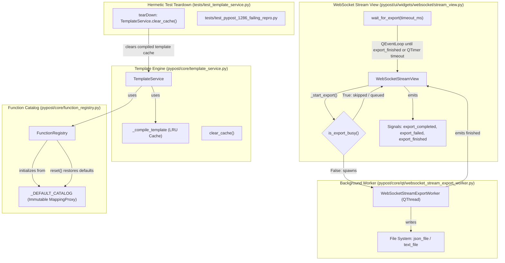

# PYPOST-1286: Eliminate flakiness in WebSocket stream export and template strict-conversion tests

## Research

### 1. WebSocket Stream View Export Flakiness

#### Repro Test & Production Architecture
- **Test**: `tests/test_websocket_stream_view_repro.py::test_stream_view_transcript_export_actions`
  (lines 789–825).
- **Production Code**: `pypost/ui/widgets/websocket/stream_view.py` (`WebSocketStreamView`, lines
  523–973) and `pypost/core/qt/websocket_stream_export_worker.py` (`WebSocketStreamExportWorker`,
  lines 23–85).

#### Root Cause Analysis
1. **Asynchronous Background Execution**:
   - `stream_view.export_json(path)` and `stream_view.export_text(path)` delegate to
     `_start_export(path, format)`.
   - `_start_export` creates a `WebSocketStreamExportWorker(QThread)` and calls `worker.start()`.
   - The worker runs `export_stream_to_json_file` or `export_stream_to_text_file` off the main GUI
     thread, writes the file to the filesystem, emits `export_completed(path, format)`, and returns.
2. **Timing Race in Test Synchronization**:
   - In `test_stream_view_transcript_export_actions`:
     ```python
     stream_view.export_json(json_file)
     process_until(lambda: json_file.exists(), timeout_ms=10_000)
     stream_view.export_text(text_file)
     process_until(lambda: text_file.exists(), timeout_ms=10_000)
     ```
   - The predicate `json_file.exists()` becomes `True` the instant the OS flushes the file bytes
     to disk.
   - However, at that exact millisecond, the background worker thread is still finishing its
     execution loop: emitting `export_completed`, unwinding `run()`, terminating the native thread,
     and posting Qt's `finished` signal to the main GUI thread event loop.
   - The slot `_on_export_worker_finished` (which resets `self._export_worker = None` and enables
     the export button) has NOT yet run on the main thread when `process_until` returns.
3. **Silent Drop of Sequential Export**:
   - The test immediately executes `stream_view.export_text(text_file)`.
   - `_start_export` checks:
     ```python
     if self.is_export_busy():
         logger.info("websocket_stream_export_skipped reason=busy format=%s", export_format)
         return
     ```
   - Because `self._export_worker` is still running or its `finished` cleanup has not yet been
     processed on the main thread, `is_export_busy()` evaluates to `True`.
   - `export_text` logs a notice and **silently drops the export request on the floor**.
   - The test invokes `process_until(lambda: text_file.exists(), timeout_ms=10_000)`. Because the
     worker was never spawned, `text_file` is never created.
   - `process_until` spins for 10 seconds and raises `AssertionError: condition not met within
     10000ms`.
4. **Why Failure Manifests Under Parallel Load**:
   - When running the test alone on an idle machine, thread termination and event loop dispatch
     frequently happen within the 10 ms polling interval of `process_until`.
   - Under heavy multi-worker parallel execution (`make test` with 8 concurrent workers saturating
     all CPU cores), thread scheduling latency and event loop queue delays increase significantly.
     The file write finishes well ahead of thread teardown and Qt signal delivery, causing
     `is_export_busy()` to remain `True` when `export_text` is called, failing ~1 out of 2 runs.
5. **Teardown and Lifecycle Deficiencies**:
   - `WebSocketStreamView` does not expose public completion signals (`export_completed`,
     `export_failed`, `export_finished`) for callers/tests to observe.
   - `WebSocketStreamView` provides no synchronous wait helper (`wait_for_export`).
   - If the widget is deleted (`deleteLater` in `finally`), any still-running export worker is not
     joined, causing potential thread leaks or crashes during teardown.

---

### 2. Template Service Strict-Conversion Fallback Flakiness

#### Repro Test & Production Architecture
- **Test**: `tests/test_template_service.py::TestTemplateServiceRenderString::`
  `test_strict_conversion_keeps_literal_fallback_for_unrelated_failed_token` (lines 193–202).
- **Production Code**: `pypost/core/template_service.py` (`TemplateService`, lines 30–261),
  `pypost/core/function_registry.py` (`FunctionRegistry`, lines 67–153), and
  `pypost/core/function_expression_resolver.py` (`FunctionExpressionResolver`, lines 28–312).

#### Root Cause Analysis
1. **Intended Fallback Contract**:
   - In `test_strict_conversion_keeps_literal_fallback_for_unrelated_failed_token`:
     ```python
     content = "{{to_int(issue_id)}}/{{not_allowed(value)}}"
     result = self.svc.render_string_strict_conversion(
         content, {"issue_id": "42", "value": "ignored"}
     )
     self.assertEqual(content, result)
     ```
   - The template contains a valid strict conversion placeholder `{{to_int(issue_id)}}` (with valid
     integer input `"42"`) alongside an invalid non-strict placeholder `{{not_allowed(value)}}`.
   - Because the non-strict placeholder fails validation (`unknown_function: not_allowed`), the
     template renderer catches `ValueError`.
   - In `_contains_failed_to_int_call`, the service evaluates whether any strict conversion failed:
     - Provenance inspection finds no failed strict conversions (`not_allowed` is not strict).
     - Placeholders with strict functions (`to_int(issue_id)`) are dynamically evaluated in a
       temporary template `{{to_int(issue_id)}}` with `{"issue_id": "42"}`.
     - Since `to_int("42")` succeeds without error, `_contains_failed_to_int_call` returns `False`.
     - The service preserves backward-compatible literal fallback, returning `content`.
2. **State Pollution and Isolation Vulnerabilities**:
   - **Mutable Global Catalog**: `_DEFAULT_CATALOG` in `pypost/core/function_registry.py` is a
     plain mutable Python `dict`. While `FunctionRegistry.__init__` shallow-copies it via
     `dict(_DEFAULT_CATALOG)`, any external test or extension modifying `_DEFAULT_CATALOG`
     permanently pollutes all future `FunctionRegistry` instances in the same process.
   - **Dynamic Registration Side-Effects**: `FunctionRegistry.register(..., is_strict=True)`
     and `register_strict` add functions to `_strict_functions`. If a shared registry is used or if
     a test registers custom functions without cleanup, subsequent evaluations of `not_allowed`
     or other names can be mistakenly categorized as strict conversions.
   - **Compiler Cache and State Accumulation**: `TemplateService` caches compiled templates via
     `@lru_cache(maxsize=256)` on `_compile_template`. While instantiated per `TemplateService`,
     tests that mock, wrap (`wraps=self.svc._compile_template`), or leave unclosed patches can
     corrupt compilation outcomes.
   - **Lack of Hermetic Teardown**: Neither `TestTemplateServiceRenderString` nor global test
     fixtures (`tests/conftest.py`) explicitly reset function catalogs or template compiler caches
     between tests. When tests execute in shared process batches or under parallel runner
     re-ordering, leftover registered functions or mutated catalog entries cause
     `_contains_failed_to_int_call` to misidentify non-strict tokens as strict failures, raising
     `IntegerConversionError` instead of returning literal fallback.

---

## Implementation Plan

### High-Level Implementation Plan

1. **Step 3: Automated Failing Repro Tests (`tests/test_pypost_1286_failing_repro.py`)**:
   - Write deterministic red tests before touching production code.
   - Repro Test 1: Exercise the WebSocket stream export busy-state race by triggering rapid
     sequential export actions (`export_json` then `export_text`) with a controlled
     worker completion delay, proving that the second export is dropped under uncoordinated waits.
   - Repro Test 2: Exercise `TemplateService` and `FunctionRegistry` isolation by testing that
     global catalog mutations or shared registry modifications across test boundaries fail to leak
     into `render_string_strict_conversion`, verifying that literal fallback is deterministically
     preserved.

2. **Step 4: Development and Stabilization**:
   - **Area A — WebSocket Stream View & Export Worker Lifecycle**:
     - Expose public Qt completion signals on `WebSocketStreamView`:
       - `export_completed = Signal(str, str)`: emits `(path, format)` on success.
       - `export_failed = Signal(str, object)`: emits `(format, error)` on failure.
       - `export_finished = Signal()`: emits upon worker thread termination and busy-state reset.
     - Add public synchronization method:
       - `wait_for_export(timeout_ms: int = 5000) -> bool`: runs a local `QEventLoop` bounded by
         a single-shot `QTimer` until `export_finished` fires or the budget expires. Returns `True`
         if idle, `False` on timeout. Nonpositive budgets only inspect the current state.
     - Add clean teardown in `WebSocketStreamView`:
       - Override `closeEvent` and provide `cleanup()` to gracefully wait for any running worker
         before widget disposal, preventing dangling thread execution.
     - Update `test_stream_view_transcript_export_actions` in
       `tests/test_websocket_stream_view_repro.py`:
       - Synchronize each export step using `stream_view.wait_for_export()` and explicit completion
         checks, ensuring the first worker is fully finished and un-busied before starting the next.
   - **Area B — Template Service Hermetic Isolation**:
     - Protect `_DEFAULT_CATALOG` in `pypost/core/function_registry.py` by wrapping it in
       `types.MappingProxyType` or exposing an immutable factory `get_default_catalog() -> dict`,
       guaranteeing that accidental mutations of the module catalog are blocked at runtime.
     - Add `clear_cache()` method to `TemplateService` to allow explicit eviction of cached Jinja
       templates.
     - Add `FunctionRegistry.reset()` so tests can restore a registry to its default catalog.
     - Add `tearDown()` in `TestTemplateServiceRenderString` that calls
       `TemplateService.clear_cache()`. No `tests/conftest.py` autouse fixture is added: per-test
       service instances plus the immutable catalog already provide isolation.
   - **Area C — Full-Suite Parallel Verification**:
     - Execute multiple consecutive full-suite parallel runs (`make test` across all files) to
       confirm zero flakiness under high CPU contention.

---

### Mandatory — Failing Repro (next Step 3)

- **File**: `tests/test_pypost_1286_failing_repro.py`
- **Assertion 1 (WebSocket Export Race Repro)**:
  - Spawns a `WebSocketStreamView` and triggers `stream_view.export_json(path1)`.
  - Simulates the exact test pattern where `path1.exists()` is satisfied while the worker
    thread is artificially delayed in completing its thread exit (e.g. 50 ms delay in thread exit).
  - Immediately invokes `stream_view.export_text(path2)`.
  - Asserts that without explicit synchronization or queueing, `is_export_busy()` is `True` and
    the second export request is rejected, failing to create `path2`.
- **Assertion 2 (WebSocket Synchronization Verification)**:
  - Asserts that `stream_view.wait_for_export()` waits for full thread termination and resets
    `is_export_busy() == False`, allowing consecutive exports to succeed without race conditions.
- **Assertion 3 (Template Service State Isolation Repro)**:
  - Exercises `FunctionRegistry` catalog immutability: asserts that attempts to mutate the default
    catalog or dynamic registrations in one test scope do not leak into another `TemplateService`
    instance evaluating strict conversion fallbacks.
  - Verifies that `render_string_strict_conversion("{{to_int(id)}}/{{not_allowed(val)}}", ...)`
    deterministically preserves literal fallback across multiple consecutive invocations.
- **Sequencing**:
  - Step 3: Write `tests/test_pypost_1286_failing_repro.py` asserting the required contracts and
    reproducing the busy-state drop (RED).
  - Step 4: Implement `wait_for_export`, export signals, catalog protection, and test sync (GREEN).

---

## Architecture

### System Component Diagram



### Module Responsibilities and Architectural Modifications

#### 1. `pypost/ui/widgets/websocket/stream_view.py` (`WebSocketStreamView`)
- **Responsibilities**: Host stream inspector controls, render virtualized frames, manage export
  actions and busy states.
- **Architectural Enhancements**:
  - **Expose Public Signals**:
    ```python
    export_completed = Signal(str, str)   # (path, export_format)
    export_failed = Signal(str, object)   # (export_format, error)
    export_finished = Signal()            # Emitted when worker finishes and busy clears
    ```
    Relay worker signals through the view so external consumers and automated tests can connect
    directly to completion events without inspecting private worker attributes.
  - **Deterministic Wait Primitive**:
    ```python
    def wait_for_export(self, timeout_ms: int = 5000) -> bool:
        if not self.is_export_busy():
            return True
        if timeout_ms <= 0:
            return False
        loop = QEventLoop()
        timer = QTimer()
        timer.setSingleShot(True)
        timer.timeout.connect(loop.quit)
        self.export_finished.connect(loop.quit)
        try:
            timer.start(timeout_ms)
            loop.exec()
        finally:
            timer.stop()
            self.export_finished.disconnect(loop.quit)
        return not self.is_export_busy()
    ```
    Production code only; it never imports test helpers. Allows tests and UI workflows to wait
    deterministically for thread lifecycle completion.
  - **Ownership Until Native Teardown**:
    Busy ownership lasts until `QThread.finished` is handled and a nonblocking `wait(0)` join
    succeeds. Retries use `QTimer.singleShot(10, self, ...)` so a pending retry is dropped
    if the view is destroyed first. Only then is the worker released, `deleteLater()` scheduled,
    and `export_finished` emitted.
  - **Widget Teardown Safety**:
    `cleanup()` returns `wait_for_export(_WORKER_FINISH_WAIT_MS)`; `closeEvent` ignores the
    close while an export remains owned after that bounded wait.

#### 2. `pypost/core/function_registry.py` (`FunctionRegistry`)
- **Responsibilities**: Maintain catalog of allowed functions and strict-conversion metadata.
- **Architectural Enhancements**:
  - **Catalog Immutability**:
    Convert `_DEFAULT_CATALOG` to an immutable `types.MappingProxyType` or provide
    `get_default_catalog() -> dict[str, Callable[..., Any]]` returning a fresh dictionary copy.
    Prevents tests or callers from mutating the module-level catalog dictionary.
  - **Reset Seam**:
    `FunctionRegistry.reset()` restores the instance to its pristine default state
    (`_DEFAULT_CATALOG` entries and strict set `{"to_int"}`); available for test isolation.

#### 3. `pypost/core/template_service.py` (`TemplateService`)
- **Responsibilities**: Expression tokenization, validation, Jinja rendering, and strict conversion
  fallback handling.
- **Architectural Enhancements**:
  - **Cache Management**:
    Provide `clear_cache()` method on `TemplateService` that executes
    `self._compile_template.cache_clear()`.
  - **Strict Evaluation Isolation**:
    Ensure `_contains_failed_to_int_call` dynamic evaluation runs strictly isolated from external
    global registrations.

#### 4. Test Isolation & Synchronization
- **Responsibilities**: Per-test isolation and export synchronization.
- **Architectural Enhancements**:
  - No `tests/conftest.py` fixture is added. `TestTemplateServiceRenderString.tearDown()` calls
    `TemplateService.clear_cache()`; `FunctionRegistry.reset()` is available where needed.
  - In `tests/test_websocket_stream_view_repro.py`, update
    `test_stream_view_transcript_export_actions`
    to wait on `stream_view.wait_for_export()` after each export action.

---

## Q&A

- **Q: Why not simply replace the async export worker with synchronous file writes in the UI?**
  **A**: Exporting large WebSocket stream buffers (e.g. 50,000 entries with megabytes of JSON or
  text) would block the Qt main thread, freezing the desktop interface and violating responsive UI
  requirements. The async `QThread` pattern is necessary in production; the bug is purely the lack
  of deterministic synchronization in tests and the absence of completion signals.

- **Q: Why did `test_stream_view_transcript_export_actions` check file existence directly?**
  **A**: The test author verified that the file was written, but overlooked that the worker thread
  was still running its exit routine when the file first appeared on disk. When the second export
  was immediately requested, the view was still busy, so the second export was silently rejected.

- **Q: How does `wait_for_export()` solve the race condition deterministically?**
  **A**: `wait_for_export()` runs a timer-bounded `QEventLoop` until `export_finished` fires,
  guaranteeing that the worker's `finished` signal has been processed, `self._export_worker` has
  been cleared, and the view is ready to accept the next export before the test proceeds.

- **Q: Does making `_DEFAULT_CATALOG` immutable break dynamic function registration (PYPOST-1247)?**
  **A**: No. PYPOST-1247 designed `FunctionRegistry.register()` to operate on instance dictionaries
  (`self._functions`), not the global module dictionary. Freezing `_DEFAULT_CATALOG` ensures that
  instance-level registrations can never corrupt other registry instances across tests.

- **Q: Will these architectural changes affect production performance?**
  **A**: No. Adding signals to `WebSocketStreamView` has zero CPU overhead during normal use.
  Freezing `_DEFAULT_CATALOG` with `MappingProxyType` adds no runtime cost. The changes solely
  provide robust synchronization and airtight test isolation.
