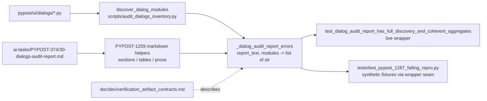

# PYPOST-1287: Restore an accurate, drift-proof dialog audit inventory

## Research

### Current verification (`aef30005`)

- `tests/test_pypost_1077_verification_artifacts.py::test_dialog_audit_report_has_full_discovery_and_coherent_aggregates`
  reads the report from the module-level path `_DIALOG_AUDIT_REPORT` and gets discovery from
  `discover_dialog_modules()` and `check_audit_report_covers()`. Both are imported by name from
  `scripts/audit_dialogs_inventory.py`, so they are monkeypatchable attributes of the test module.
- It uses the PYPOST-1259 helpers (`_parse_markdown_sections`, `_parse_markdown_table`,
  `_normalize_prose`, `MarkdownSection`, `_SectionDict`, `_RowDict`). The same module also
  holds three unrelated AST tests, which are out of scope.
- Pinned snapshot values in the check:
  - `len(modules) != 9`;
  - `sum(loc_values) != 1790`;
  - `mcp_servers_dialog.py == "486"`;
  - the literal Scope strings `"nine ... 1,790 LOC total"`;
  - the literal verdict `"... all nine modules."`;
  - the message `"... each of the nine dialog modules"`.
- The check never compares a row's LOC with `DialogModule.total_lines`. Drift is therefore
  invisible as long as the report agrees with itself (DoD 4 gap).
- Errors are collected into one list and raised as a single `assert not errors` with the
  messages joined by newlines. This pattern is already suitable for per-case messages.
- `tests/test_pypost_1259_failing_repro.py` imports `_normalize_prose`,
  `_parse_markdown_sections`, `_parse_markdown_table` and `_section` from the 1077 module. Their
  names and signatures must stay unchanged.
- `tests/test_dialogs_audit.py` and `tests/test_audit_scripts_cli.py` cover the script's
  discovery and CLI. Neither pins the report's figures, so neither is affected.

### Discovery and generator

- `scripts/audit_dialogs_inventory.py` is the single LOC authority. It reads `*.py` under
  `pypost/ui/dialogs/` except `__init__.py`, and computes `total_lines = len(splitlines())`.
  The other APIs are `total_loc()`, `check_audit_report_covers()` (filename-substring check
  against the hard-wired `AUDIT_REPORT` path), and the CLI options `--markdown`, `--json` and
  `--check`.
- **No Makefile target** wraps this script (`grep` of `Makefile` shows only
  `audit_baseline_metrics.py` targets). The documented commands are
  `.venv/bin/python scripts/...`, which `AGENTS.md` (make-only) does not allow.
- The table that `--markdown` emits (`| Module | LOC | Non-empty |`, with full `pypost/...`
  paths and a bold Total row) has a **different schema** from the report's Module Inventory
  (`| Module | LOC | Class | Responsibility | Opened from |`, bare filenames). It cannot be pasted
  in without losing the hand-written Class, Responsibility and Opened-from columns.

### Stale figures (from Step 1, re-checked)

| Location | Stale text | Kind |
| --- | --- | --- |
| Report line 4 | Scope `nine dialog modules, 1,790 LOC total` | aggregate |
| Report line 33 | `library_dialogs.py` 533 | row |
| Report line 35 | `mcp_servers_dialog.py` 486 | row |
| Report line 40 | `**Total:** 1,790 LOC` | aggregate |
| Report line 42 | `Regenerate counts:` raw script call | process prose |
| Report line 123 | `The 486-LOC dialog ...` | figure in prose |
| Report line 163 | `At 263 LOC ...` (currently correct) | figure in prose |
| `verification_artifact_contracts.md` lines 27-28 | `nine modules, 1,790 LOC, ... 486 LOC` | current contract |
| `verification_artifact_contracts.md` lines 52-58 | `all 9`, `1,790`, `486`, `all 9 modules` | current contract |
| `solid_audit.md` lines 120-121 | PYPOST-1111 entry, 1,787 / 486 | historical; keep |

## Implementation Plan

1. **Step 3 (red)**: add `tests/test_pypost_1287_failing_repro.py` (design below). Make no
   production or report changes.
2. **Step 4, iteration 1 (check)**: refactor the dialog check in
   `tests/test_pypost_1077_verification_artifacts.py` into a pure validator that takes the report
   text and the discovered modules (see Architecture). Remove every pinned count and LOC. The
   live test becomes a thin wrapper around it.
3. **Step 4, iteration 2 (report refresh)**: edit
   `ai-tasks/PYPOST-374/30-dialogs-audit-report.md` by hand. The values come from the new
   validator's failure output from `make test`, which prints each module's recorded and
   discovered values:
   - `library_dialogs.py` → 703 and `mcp_servers_dialog.py` → 1,031;
   - Scope → `nine dialog modules, 2,505 LOC total`;
   - Total → `2,505 LOC (vs PYPOST-40 grouped ~400 LOC)`;
   - add `**Inventory refreshed:** 2026-10-07 (PYPOST-1287)` under the Date line, and keep the
     original audit date;
   - in the `mcp_servers_dialog.py` assessment, replace `The 486-LOC dialog separates` with
     `The dialog separates`. This keeps figures in the inventory only and makes no rating change
     (out of scope, Q4). The figure in `settings_dialog.py` (`At 263 LOC`) stays because it is
     correct today. This hand refresh re-checks it against discovery; no automated rule guards
     per-dialog prose figures (DoD 4 does not require it);
   - replace the `Regenerate counts:` line with a make-only refresh instruction (the
     `make test PYTEST_ARGS=...` command, whose failures list recorded and discovered values).
4. **Step 4, iteration 3 (docs)**: rewrite the current contract text in
   `doc/dev/verification_artifact_contracts.md` (Contract Architecture paragraph and PYPOST-1259
   invariants 1-4). State that every figure comes from `discover_dialog_modules()`, with no
   snapshot numbers, and describe the per-case messages. Leave the `doc/dev/solid_audit.md`
   PYPOST-1111 entry as written.
5. **Gates**: run
   `make test WORKERS=1 PYTEST_ARGS='tests/test_pypost_1077_verification_artifacts.py tests/test_pypost_1287_failing_repro.py tests/test_pypost_1259_failing_repro.py tests/test_dialogs_audit.py -q'`,
   then `make check`, and compare any failure against the documented pre-existing set (DoD 8).

**Mandatory — Failing Repro (Step 3):**

- **File**: `tests/test_pypost_1287_failing_repro.py`, `pytestmark = pytest.mark.timeout(10)`
  (pure in-memory unit tier). It runs offline and has no Qt dependency.
- **Seam (no production change needed)**: use `monkeypatch` on the 1077 test module `m`:
  - `m.discover_dialog_modules` returns a synthetic `list[DialogModule]`, built with the real
    `scripts.audit_dialogs_inventory.DialogModule` dataclass, for example
    `alpha_dialog.py` 120 and `beta_dialog.py` 80;
  - `m.check_audit_report_covers` returns `[]`, because the real one reads the hard-wired
    production path;
  - `m._DIALOG_AUDIT_REPORT` points to a `tmp_path` file written by a local
    `_synthetic_report(rows, scope_count, scope_total, total_line, verdict_count)` builder. The
    builder emits all required sections and semantic phrases: Three MCP dialogs, the read-only
    sentence for activity and tools, the server-manager mutation sentence, the Testability
    summary table, and `Individual audit complete for all <n> modules.`

  Each test then calls
  `m.test_dialog_audit_report_has_full_discovery_and_coherent_aggregates()` directly.
- **Cases (all red at `aef30005`)**:
  1. *Coherent synthetic report passes*: the report matches the synthetic discovery (two modules,
     200 LOC, scope `two dialog modules, 200 LOC total`). Expect no `AssertionError`. Red today
     because the check pins nine modules, 1,790 and 486 (proves DoD 5).
  2. *Per-module LOC drift*: the report records `alpha_dialog.py` at 100 and discovery says 120.
     Expect `pytest.raises(AssertionError)`. One single line of the message must match
     `alpha_dialog\.py\D.*\b100\b.*\b120\b` (module name, recorded value, discovered value on
     the same line). Red today because no message compares recorded and discovered LOC.
  3. *Missing and unknown modules*: discovery adds `gamma_dialog.py` and the report lists
     `ghost_dialog.py`. The message must name both files individually. Red today because the
     current message is generic and names neither.
  4. *Aggregate drift*: rows are correct, but Scope declares `three` modules and Scope and Total
     both declare 999 LOC. Messages print the parsed int (R4), so the word `three` appears as `3`.
     One single line must match `declared\D*\b3\b\D+discovered\D*\b2\b` (module count), and one
     single line must match `declared\D*\b999\b\D+discovered\D*\b200\b` (total LOC). Red today.
  5. *Live drift*: with the real discovery and real report, the inventory LOC map must equal
     `{m.filename: m.total_lines}`. Red today (533/486 vs 703/1,031). This is the actual defect.
     It turns green after the iteration-2 refresh.
- **Assertion style**: split `str(excinfo.value)` into lines and require that at least one
  single line satisfies the case's check (a shared `_any_line_matches(message, pattern)` helper
  using `re.search`). Never search the joined message for bare digits: `"2"` also occurs in
  `"200"`. Filename-only checks (case 3) may use per-line substring matches. Do not compare
  full messages, so that Step 4 can choose the exact wording.
- **Conventions**: follow the `lsr-python` skill (type hints, small pure helpers, no bare
  `except`) and the `do-testing` skill (timeouts, no sleeps, offline unit tier).
- **Sequencing**: write and review the red test (Step 3); then iteration 1 turns cases 1-4 green;
  then iteration 2 turns case 5 and the live 1077 test green. Step 4 must keep the
  module-level names `discover_dialog_modules`, `check_audit_report_covers` and
  `_DIALOG_AUDIT_REPORT`, and the live test function name, as the stable seam.

## Architecture

### Component diagram



### Modules and responsibilities

| Component | Responsibility | Change |
| --- | --- | --- |
| `scripts/audit_dialogs_inventory.py` | Single source of truth for the module set and LOC | None |
| PYPOST-1259 helpers (1077 test module) | Structural markdown parsing | None (signatures frozen) |
| `_dialog_audit_report_errors` (new, 1077 test module) | Pure contract validator; expected values come only from `modules` | New |
| Live test wrapper | Reads `_DIALOG_AUDIT_REPORT`, calls discovery, coverage and validator, and asserts with no errors | Slimmed |
| `tests/test_pypost_1287_failing_repro.py` | Synthetic drift and coherence proofs, plus live drift proof | New (Step 3) |
| PYPOST-374 report | Documentation-as-contract data | Figures refreshed |
| `verification_artifact_contracts.md` | Describes the enforced contract | Snapshot figures removed |

### Validator interface

```python
def _dialog_audit_report_errors(
    report_markdown: str,
    modules: Sequence[DialogModule],
) -> list[str]:
    """Return one human-readable error per contract violation; empty list means valid."""
```

Small private helpers live next to it in the same module. No new shared module is created; the
extraction stays a PYPOST-1259 follow-up. Code follows the `lsr-python` skill: full type hints,
`Sequence` from `collections.abc`, pure helpers without I/O, and module-level compiled regexes.

- `_parse_int(text: str) -> int | None` accepts `2,505`, `2505` and `**2,505**`.
- `_parse_count(token: str) -> int | None` accepts digits or the English words zero to twenty
  (`_NUMBER_WORDS` tuple). This is a vocabulary for parsing, not a pinned count.

### Contract rules (expected values only from `modules`)

Let `expected = {m.filename: m.total_lines}`, `n = len(modules)` and `total = sum(expected.values())`.

| Rule | Check | Message shape (DoD 4) |
| --- | --- | --- |
| R1 sections | Module Inventory, Testability summary, Executive Summary and Verdict all present | `audit report missing section: <name>` |
| R2 set | Each `expected` key not found in the inventory, and each inventory module not in `expected`; duplicate rows | `module inventory missing discovered dialog module: <f>` / `module inventory lists unknown dialog module: <f>` / `module inventory lists <f> more than once` |
| R3 LOC | For each common module, the row LOC must equal `total_lines`; non-numeric or non-positive LOC is an error | `<f>: recorded LOC <r> != discovered LOC <d>` |
| R4 aggregates | The Scope line regex `Scope: pypost/ui/dialogs/ \((\w+) (?:dialog )?modules, ([\d,]+) LOC total\)`, the Total line regex `Total: ([\d,]+) LOC` and the inventory row sum, each compared with `n` and `total` | `scope total LOC: declared <x> != discovered <total>`, `Total line LOC: declared <x> != discovered <total>`, `inventory row sum: <x> != discovered <total>`; a missing Scope or Total line is its own error |
| R5 module count | Only two places: the Scope module-count token (from the R4 Scope regex) must parse via `_parse_count` and equal `n`; the Verdict must contain `Individual audit complete for all <token> modules.` with `_parse_count(token) == n` (DoD 6, Q3). No scan of other prose | `scope module count: declared <x> != discovered <n>` / `verdict module count: declared <x> != discovered <n>` / `verdict must state completion for all <n> modules` (phrase absent) |
| R6 testability | The Testability summary filename set must equal the `expected` keys | `testability table missing/unknown dialog module: <f>` |
| R7 semantics (kept) | Three MCP dialogs; activity and tools are read-only; server-manager mutation; existing stale-claim denylist | Existing messages unchanged |

**Normalization and number rendering (R4, R5):**

- The Scope, Total and Verdict regexes run on `_normalize_prose(...)` output, never on raw report
  lines. Raw lines carry markdown emphasis and code spans (report line 4
  ``**Scope:** `pypost/ui/dialogs/` (...)``, line 40 `**Total:** 1,790 LOC`, line 221
  `Individual audit **complete** for all nine modules.`), which the regexes do not expect.
- Every `<x>`, `<n>` and `<total>` in a message is the parsed `int`, printed with plain `str(int)`
  (no thousands separator, no number word). A Scope token `three` is reported as `3`, and
  `2,505` as `2505`. A token that `_parse_count` or `_parse_int` cannot parse is reported as its
  own error that quotes the raw token (for example `scope module count unparseable: 'several'`).

**DoD traceability:**

| DoD item | Covered by |
| --- | --- |
| 1 Report accuracy | Iteration-2 hand refresh; R2, R3; repro case 5 |
| 2 Aggregate coherence | R4, R5 (Scope count); repro cases 1 and 4 |
| 3 No superseded figures | Hand refresh (`486-LOC` prose, `At 263 LOC` check); R3, R4 |
| 4 Drift detection | R2 (case 3), R3 (case 2), R4 and R5 (case 4) |
| 5 No pinned snapshot | All expectations from `modules`; repro case 1 |
| 6 Semantic invariants | R1, R5 (Verdict phrase), R6, R7 |
| 7 Documentation aligned | Iteration 3 |
| 8 Gates | Implementation Plan step 5 |

The live wrapper keeps `check_audit_report_covers(modules)` as an extra guard tied to the real
report path. It no longer pins `len(modules)`.

### Patterns and justification

- **Functional core, imperative shell**: a pure validator taking `(text, modules)` makes the
  drift behavior testable with synthetic data and no filesystem. The thin wrapper keeps the live
  contract.
- **Derived expectations (oracle = discovery)**: the only source of numbers is
  `DialogModule.total_lines`, which removes snapshot maintenance (DoD 5).
- **Collect-all errors**: one run reports every stale cell, so a developer can refresh the report
  in one pass (user story 2).

### Refresh decision: hand edit, not generator

The existing generator (`--markdown`) has a different table schema and would drop the curated
columns. It has no make target, and calling it directly breaks `AGENTS.md`. The refresh touches
four figures and one prose clause. The new validator's messages state every value that needs to
change, so `make test` serves as the make-compliant refresh oracle.

### Alternatives rejected

- **Generate the whole inventory table from the script**: rejected because it loses the
  Class, Responsibility and Opened-from columns, and the script would need a schema change
  (scope creep).
- **Add a `make dialog-inventory` target**: not needed for DoD. Recorded as a Step 7 candidate,
  together with the raw `.venv/bin/python` commands still in the doc's Usage section.
- **Tolerance band on LOC**: rejected per Q2 (exact contract).
- **Add 1,790, 486 and 533 to the stale-claim denylist**: rejected because they are literal LOC
  values (DoD 5), and R2-R5 already detect them structurally (rows and aggregates). The prose
  figure `486-LOC` is removed by the hand refresh.
- **Validate `library_dialogs.py` or MCP prose semantics beyond figures**: out of scope (no
  re-audit).

## Q&A

### Q1: Does the existing stale-claim denylist (`"446"`, `"1,747"`, ...) violate DoD 5?

A1: No (interpretation). DoD 5 forbids pinned *expected* values. The denylist is a DoD 6
invariant ("prohibition of historical stale claims") and stays unchanged. Known risks, all
recorded for Step 7 and not changed here:

- the bare `"446"` and `"1,747"` substrings could collide with a future legitimate figure;
- the count-specific entries `"seven modules"`, `"eight modules"`, `"all seven modules"` and
  `"all eight modules"` (`tests/test_pypost_1077_verification_artifacts.py` ~336-349) clash
  with DoD 5 if discovery legitimately shrinks to seven or eight modules: R5 would then require
  `all seven modules`, which the denylist rejects. Today discovery finds nine, so no clash
  occurs in this task.

### Q2: Why accept number words up to twenty only?

A2: The report uses English words ("nine"). Above twenty, the check accepts digits, and
`_parse_count` handles both forms. The vocabulary encodes no expected value.

### Q3: Is `check_audit_report_covers` still needed?

A3: It is redundant with R2 but is kept in the live wrapper. It is cheap, and it stays the CLI
`--check` contract that `tests/test_dialogs_audit.py` also uses.

### Q4: Does the date in the report change?

A4: The original `**Date:** 2026-06-11` (audit date) stays. A separate `Inventory refreshed`
line records the PYPOST-1287 refresh, so the audit history stays accurate.
