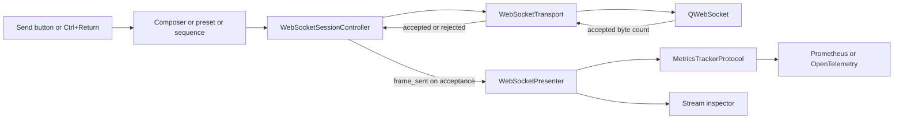

# PYPOST-1288: Count outbound WebSocket messages and bytes

## Research

- `WebSocketPresenter` already receives the application's metrics object and connects to
  `WebSocketSessionController.frame_sent`. Composer, presets, sequences, and the presenter's
  fallback send path all call the controller's `send_text` or `send_binary` methods. This gives
  one counting point for every WebSocket tab send path.
- The controller currently emits `frame_sent` after calling the transport. Its `RawFrame`
  contains the original payload format and byte size: UTF-8 encoded length for text and raw
  length for binary. The stream inspector uses the same signal, but its `out` display direction
  is separate from the metrics label `outbound`.
- The existing metrics protocol, `MetricsWebSocketMixin`, Prometheus registry, and OpenTelemetry
  tracker already expose `track_websocket_message(direction, kind)` and
  `track_websocket_message_bytes(direction, byte_count)`. Both existing counters need a call
  site, not new instruments or labels.
- Qt for Python documents that `QWebSocket.sendTextMessage` and `sendBinaryMessage` return the
  number of payload bytes sent. The adapter currently discards that result. The return value and
  connected state can distinguish a full synchronous handoff from a rejected or partial send;
  neither establishes peer receipt. See the
  [Qt for Python QWebSocket API](https://doc.qt.io/qtforpython-6/PySide6/QtWebSockets/QWebSocket.html).

## Implementation Plan

1. Extend `WebSocketTransport.send_text` and `send_binary` to report whether the complete
   message was accepted by the open transport. In `QtWebSocketTransport`, retain the current
   payload and send calls, but check the connected socket state and compare Qt's returned byte
   count with the payload length. A connected, accepted zero-byte message is still one message.
   A disconnected socket or incomplete handoff reports failure; an exception does not report
   acceptance. Update transport test doubles to implement the same return contract.
2. Keep the controller's existing open-state guard. Emit one `frame_sent` `RawFrame` only after
   the transport reports acceptance. Use its existing UTF-8 or binary byte-size calculation;
   do not count on an attempted send or on a later stream flush. Preserve the existing
   user-facing send, validation, and connection flow.
3. At the start of `WebSocketPresenter._on_frame_sent`, record one outbound message with
   `kind=frame.payload_format.value` and `frame.byte_size` outbound bytes through the injected
   metrics object. Keep the existing stream-entry path and its display direction. Do not use
   payload text, URL, session ID, or secret values as labels.
4. Update `doc/prometheus_monitoring.md` to state when these outbound counters change, that
   `direction="outbound"` is the public label, and that text counts UTF-8 payload bytes while
   binary counts raw payload bytes. Clarify that peer delivery is outside the metric contract.

**Failing repro for Step 3:** Before changing production code, add
`tests/test_websocket_outbound_metrics_repro.py` with an explicit pytest timeout. Create a
`WebSocketPresenter` with a `MetricsRegistry` and a controller using a deterministic fake
`WebSocketTransport`; open it and invoke its `on_opened` callback without a live server. Send a
non-ASCII text message and a binary message through the controller. Assert the registry exposes
exactly one `websocket_messages_total{direction="outbound",kind="text"}`, exactly one binary
message, and `websocket_message_bytes_total{direction="outbound"}` equal to their combined
UTF-8 and binary payload lengths. Assert a blocked send while the controller is not open leaves
both totals unchanged. Add a fake transport rejection case that reports an unsuccessful handoff
and assert no `frame_sent` signal and no count; this exercises the acceptance boundary. The
accepted-send assertions must fail on the current code because the presenter never records
either metric. Run the repro with the repository's `make test` target, then implement until the
test and full quality gate pass.

## Architecture

The transport adapter owns Qt-specific acceptance detection. The controller owns session state,
raw byte-size calculation, and the single successful-send signal. The presenter owns the existing
metrics dependency and maps that signal to both outbound counters. Metric backends remain
interchangeable behind `MetricsTrackerProtocol`; the stream inspector remains a separate
subscriber to the accepted frame. This observer flow counts once per accepted message regardless
of which UI path initiated it and avoids a second count during stream display or export.

The interface contract is:

- `WebSocketTransport.send_text(message: str) -> bool` and
  `send_binary(payload: bytes) -> bool`: return true only for full acceptance by an open
  transport; false for rejection or incomplete handoff. The controller does not emit
  `frame_sent` on false. Transport exceptions retain their existing propagation behavior and
  produce no successful-send signal.
- `WebSocketSessionController.frame_sent(RawFrame)`: emit once after an accepted text or binary
  message. `RawFrame.byte_size` is the original payload length, never the masked or truncated
  inspector length.
- `MetricsTrackerProtocol.track_websocket_message("outbound", "text" | "binary")` and
  `track_websocket_message_bytes("outbound", byte_count)`: called once each by the presenter
  for that signal. Both calls use the same direction value. The bytes counter has no kind label.

## Q&A

- **Why count in the presenter?** It already receives the metrics object and the controller's
  successful-send signal. No new global metrics dependency or per-control wiring is required.
- **Why change the transport return contract?** The current `None` return cannot distinguish a
  Qt send call that accepted the payload from one that returned without handing it off. The
  synchronous Qt result provides the missing boundary without claiming peer delivery.
- **Does `out` become a metrics label?** No. `out` remains a stream display value;
  `outbound` is the metrics direction for both counters.
