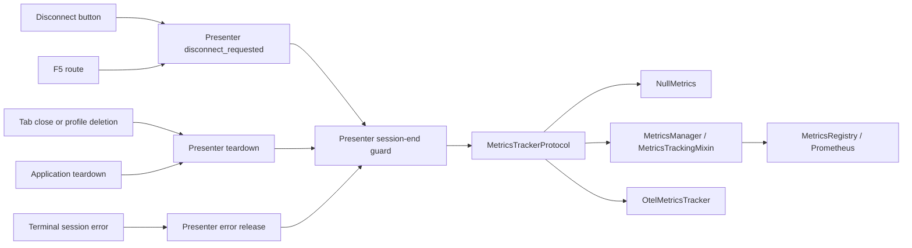

# PYPOST-1289: Count MCP client session disconnects

## Research

- The accepted requirements define an established session as a tab reaching `CONNECTED` and
  ending when it leaves that state. They require one count with `user`, `error`, or `teardown`.
- `McpClientPresenter` owns the tab state and a local `_session` marker. A successful Connect
  `list_tools` result sets both. Refresh and Invoke failures currently leave the tab connected;
  a failed Connect has never established a session. `MCPClientService.run` opens and closes a
  transport for each operation, so transport context exit is not the tab session end.
- The Disconnect button and `F5` both call `disconnect_requested`. Regular tab close calls
  `presenter.teardown()`. Closing tabs for deleted MCP profiles currently removes them without
  calling that teardown. Application teardown reaches `tabs_presenter_lifecycle.teardown`,
  which currently handles request workers but does not release MCP presenters.
- `TabsPresenter._insert_mcp_client_tab` currently omits its `_metrics` dependency when it
  constructs `McpClientPresenter`. Production wiring must pass the tracker so the new counter
  reaches the application's configured metrics output.
- Existing MCP Client counters use `mcp_client_*_total`. Prometheus recommends `_total` for
  counters and bounded labels; OpenTelemetry recommends consistent names and attributes for
  related metrics. The three fixed reasons provide a bounded, identity-free attribute.
  [Prometheus naming guidance](https://prometheus.io/docs/practices/naming/),
  [OpenTelemetry metric guidance](https://opentelemetry.io/docs/specs/semconv/general/metrics/).

## Implementation Plan

1. Add `track_mcp_client_disconnect(reason: str) -> None` to `MetricsTrackerProtocol`,
   `NullMetrics`, `MetricsRegistry`, the Qt `MetricsTrackingMixin`, and `OtelMetricsTracker`.
   Export `mcp_client_disconnect_total` with only the `reason` label or attribute.
2. Pass `TabsPresenter._metrics` to every new `McpClientPresenter`. Make one presenter-owned
   release operation take an end reason and count only a previously established, still-active
   session. Both user entry points call it with `user`; presenter teardown calls it with
   `teardown`. A terminal error path, when one actually releases an established session, calls
   it with `error`. Keep Refresh and Invoke failures connected as they are today.
3. Have every tab-removal route invoke presenter teardown before removing an MCP tab. Extend
   application `TabsPresenter` teardown to visit MCP tabs and invoke the same idempotent
   release. Preserve current request-worker teardown and UI behavior.
4. Cover the presenter's session-end rules and the Prometheus, OTel, Qt, and null tracker
   surfaces. Update the metrics catalog and MCP Client developer documentation with the
   counter, reason meanings, and distinction between a failed attempt and a session end.
5. Run the repository's Makefile quality gate after implementation.

**Failing Repro (Step 3):** Before production changes, add a timed automated test in
`tests/test_mcp_client_presenter.py` that injects a recording tracker and simulates successful
Connect settlement through `_on_list_ok` with a valid `ResponseData` tools body. Assert that
Disconnect emits exactly one `user` count, repeated Disconnect and teardown emit none, and a
subsequent successful Connect can produce a second count. Parallel cases should establish a
session then exercise teardown and an explicit terminal-error release, each with its reason.
Assert that failed Connect, cancelled Connect, and nonterminal Refresh/Invoke errors do not
increment the disconnect counter. Use direct presenter callbacks or a fake worker so no live
MCP server or network is required. Add focused red tests for metrics output and the tab/profile
and application teardown routes as needed. Sequence: inspect current behavior, write and run
red tests through `make test`, implement the design until green, then run `make check`.

## Architecture

### Responsibilities and dependencies

| Module | Responsibility |
| --- | --- |
| `mcp_client_presenter.py` | Own the session state and emit once per session end. |
| `tabs_presenter.py` | Inject the configured metrics tracker. |
| `tabs_presenter_hotkeys.py`, MCP tab | Route `F5` and button to user disconnect. |
| `tabs_presenter_close.py` | Teardown on ordinary tab close. |
| `tabs_presenter_mcp_close.py` | Teardown on deleted-profile tab close. |
| `tabs_presenter_lifecycle.py` | Teardown MCP tabs during application shutdown. |
| `metrics_protocol.py` | Define the API and disabled-metrics no-op behavior. |
| `metrics_registry.py`, `qt/metrics_tracking.py` | Expose and forward the Prometheus counter. |
| `metrics_otel.py` | Emit the OTel counter and reason attribute. |

The presenter depends only on `MetricsTrackerProtocol`, not on either metrics backend. The
workspace owns presenters and supplies its tracker; tab widgets and hotkeys only express user
intent. This follows the existing dependency-injection and presenter patterns.

### Session-end contract

`track_mcp_client_disconnect(reason: str) -> None` accepts only `user`, `error`, or `teardown`
from the lifecycle caller. The emitted metric is `mcp_client_disconnect_total{reason="..."}`
in Prometheus and the same named OTel counter with a `reason` attribute. No connection ID,
address, tool arguments, or credentials appear in metric attributes.

The presenter's central release operation captures whether `_state == CONNECTED` and the
`_session` marker exists **before** clearing either. It clears the marker and changes state
before attempting the increment, then performs normal worker/UI cleanup. A repeat call sees
no established session and cannot increment again. Successful Refresh may replace the marker
but does not end the tab session; successful reconnect after a prior end creates a new
countable session. Cancellation while `CONNECTING` has no established marker and adds no
disconnect. Metric emission is best effort: catch tracker exceptions around the increment so
instrumentation cannot stop the release or alter the user's disconnect action.

An `error` count belongs only to a transition that actually releases a tab that was connected.
The current Connect failure occurs before establishment; Refresh and Invoke errors keep the
tab connected. They continue to use their existing outcome counters and produce no disconnect
count. The error reason is available at the central release boundary for any terminal error
path; testing that boundary verifies its classification without making ordinary operation
errors close a session. A future terminal-error caller must use that boundary, not emit a
metric directly.

## Q&A

- **Why count in the presenter rather than the MCP transport?** The service opens a fresh MCP
  transport for each operation. The tab presenter owns the established-session transition
  defined by the requirements.
- **Why route all close paths through teardown?** The presenter's idempotent release prevents
  duplicate counts when a user disconnect is followed by tab close or application shutdown.
- **Do Refresh and Invoke errors count as `error`?** No. Their current behavior leaves the tab
  connected. Counting them would report a session end that did not occur.
- **Does a counter provide session duration?** No. It provides aggregate session-end counts;
  exact per-session duration is outside this task.
