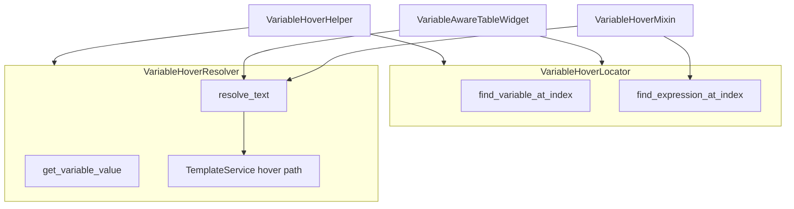

# PYPOST-129: Split VariableHoverHelper responsibilities

## Research

- `VariableHoverMixin` uses `find_expression_at_index` on mouse move, then `resolve_text` on the
  matched token only.
- `VariableAwareTableWidget` scans the full cell text with `EXPRESSION_PATTERN` and calls
  `resolve_text` on the entire cell — no cursor index.
- `TemplateService.render_string(..., render_path="hover")` already handles function
  expressions; plain-variable chains stay in the UI layer (PYPOST-115, PYPOST-123).
- Tests patch `VariableHoverHelper._template_service`; facade must preserve that hook.

## Implementation Plan

1. Extract `VariableHoverLocator` with patterns and `find_*_at_index` methods.
2. Extract `VariableHoverResolver` with `resolve_text`, `get_variable_value`, `set_metrics`,
   and `TemplateService` ownership.
3. Reduce `VariableHoverHelper` to a delegating facade with `_template_service` alias.
4. Update `VariableHoverMixin`, `VariableAwareTableWidget`, and `RequestWidget` to import the
   focused classes.
5. Add `TestVariableHoverSplit`; keep existing `TestVariableHoverHelper` on the facade.

## Architecture

### Responsibilities

| Component | Responsibility |
| --- | --- |
| `VariableHoverLocator` | Regex patterns; token under cursor index |
| `VariableHoverResolver` | Preview values; plain chains; expression render |
| `VariableHoverHelper` | Backward-compatible facade delegating to both |

### Parity contract

- No change to hover behaviour, patterns, or metrics path.
- `set_metrics` lives on `VariableHoverResolver` (and facade).
