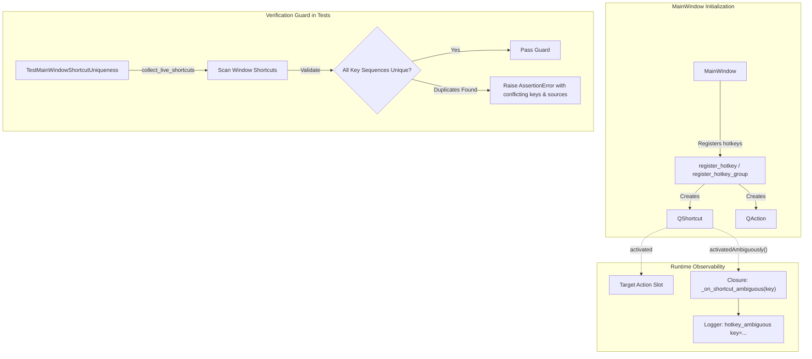

# PYPOST-1290: Window-wide guard: each live key sequence bound once (+ ambiguous-activation log)

## Research

### Background and Context
During PYPOST-1285, keyboard shortcut routing across HTTP, WebSocket, and MCP tabs was restructured.
During that work, a latent bug was discovered: Help dialog display rows created as `QAction` objects
with `action.setShortcut(...)` introduced duplicate key sequence registrations in the `MainWindow`
context for F5, Ctrl+Return, and Ctrl+L. Because Qt detects multiple active handlers claiming the same
key sequence in the same context, it treated them as ambiguous and silenced the shortcuts entirely,
leaving users with unresponsive keys without any warning or exception.

While PYPOST-1285 addressed the immediate protocol session Help rows by storing their shortcut texts in
`ALT_KEYS_PROPERTY` rather than calling `setShortcut()`, the application remains vulnerable to:
1. Future live shortcut collisions: Adding a new shortcut in any menu, toolbar, or tab that collides
   with an existing window-level shortcut.
2. Accidental action bindings: Creating informational actions or Help items with active shortcuts.
3. Silent ambiguity at runtime: Qt emits `QShortcut::activatedAmbiguously`, but currently no component
   connects to this signal, meaning collisions in production or manual testing fail silently.

### Qt Shortcut Architecture
- `QShortcut` objects are attached to parent widgets (such as `MainWindow`) and define key sequences
  with a shortcut context (default `Qt.WindowShortcut`). When triggered, Qt dispatches `activated`
  if unambiguous, or `activatedAmbiguously()` (zero arguments) if multiple shortcuts match the active
  key combination.
- `QAction` objects attached to menus, toolbars, or added via `QWidget.addAction()` can also define
  shortcuts via `QAction.shortcut()`. If an action has an active shortcut and an attached receiver
  (e.g., `triggered` or menu connection), it participates in window shortcut dispatch.
- Documentation-only rows managed by `pypost/ui/hotkeys.py` store informational shortcut strings in
  custom dynamic properties (`pypost_hotkey_alt_keys`) and must have empty `QAction.shortcut()`.

### SOLID Audit Baseline Metrics
`pypost/ui/main_window.py` is subject to a strict LOC cap (file LOC 459 / cap 477; class LOC 411 / cap 426).
Therefore, any helper functions for shortcut collision inspection or ambiguity signal wiring must reside
in `pypost/ui/hotkeys.py` rather than increasing `main_window.py` LOC.

## Implementation Plan

1. **Ambiguous Activation Logging**:
   - In `pypost/ui/hotkeys.py`, update `register_hotkey` and `register_hotkey_group` where `QShortcut`
     instances are instantiated.
   - Connect `shortcut.activatedAmbiguously` to a handler that passes the key sequence string (e.g. via
     `lambda k=key: _on_shortcut_ambiguous(k)` or `functools.partial`) since `activatedAmbiguously`
     emits no arguments.
   - In `_on_shortcut_ambiguous(key: str) -> None`, emit a structured WARNING:
     `logger.warning("hotkey_ambiguous key=%s", key)`.
   - Ensure the warning emission is safe and does not crash or raise exceptions.

2. **Window-wide Shortcut Uniqueness Verification**:
   - Create a reusable inspection function `collect_live_shortcuts(root: QWidget) -> list[tuple[str, str, str]]`
     in `pypost/ui/hotkeys.py` that scans:
     a. All `QShortcut` child instances of `root` that are enabled.
     b. All `QAction` objects attached to `root` (and its menubar/menus/actions) having non-empty
        shortcuts and active trigger receivers or non-documentation purpose.
   - Add a test class `TestMainWindowShortcutUniqueness` in `tests/test_main_window_hotkeys.py` that:
     a. Instantiates a full `MainWindow`.
     b. Collects all live shortcut key sequences across the window using `collect_live_shortcuts`.
     c. Asserts that no key sequence is bound more than once within the window context.
     d. Asserts that all documentation-only rows have empty shortcuts.

3. **Failing Repro (Step 3)**:
   - Before applying the production fix in `pypost/ui/hotkeys.py`, write automated tests in
     `tests/test_main_window_hotkeys.py`:
     a. Test verifying that when two `QShortcut`s share the same key sequence on a widget, triggering
        the ambiguous activation emits the `hotkey_ambiguous key=...` WARNING log. Currently, because
        `activatedAmbiguously` is not wired, this test will fail (no log emitted).
     b. Test verifying the window-wide uniqueness assertion by deliberately injecting a duplicate
        shortcut and asserting that the duplicate detector catches and reports the collision.
   - Sequence: write red tests in `tests/test_main_window_hotkeys.py` -> verify failure via `make test` ->
     implement logging and helpers in `pypost/ui/hotkeys.py` -> verify green via `make test` -> run `make check`.

## Architecture

### Architectural Patterns and Justification

1. **Observer / Publish-Subscribe Pattern (Qt Signals & Slots)**:
   - *Pattern*: `QShortcut.activatedAmbiguously` is an event publisher notifying registered observers.
   - *Justification*: Qt's signal-slot mechanism provides loose coupling and native event-loop dispatch.
     By observing `activatedAmbiguously` via a parameter-binding adapter (closure / partial), the application
     gains non-intrusive runtime visibility into ambiguous key activations without altering widget focus or
     key event routing.

2. **Composite / Tree-Traversal Pattern**:
   - *Pattern*: `collect_live_shortcuts` recursively traverses the QObject composite hierarchy (`findChildren(QShortcut)`,
     `findChildren(QAction)`, `actions()`, `menuBar()`).
   - *Justification*: Qt UI hierarchies are composite trees of widgets, layouts, menus, and actions. Discovering
     all live bindings window-wide requires inspecting composite components uniformly to build a consolidated
     shortcut registry.

3. **Invariant Guard Pattern (Automated Test Verification)**:
   - *Pattern*: Automated validation of application-wide invariants at build/test time.
   - *Justification*: Preventing regressions by asserting that the set of live key sequences contains zero
     duplicates ensures that regressions like PYPOST-1285 cannot recur undetected.

### Module Responsibilities and Interfaces

- **`pypost/ui/hotkeys.py`**:
  - `_on_shortcut_ambiguous(key: str) -> None`: Logs `hotkey_ambiguous key=<key>` at WARNING level.
  - `register_hotkey(...)`: Connects created `QShortcut` instances' `activatedAmbiguously` signal to
    `lambda k=key: _on_shortcut_ambiguous(k)`.
  - `register_hotkey_group(...)`: Connects group `QShortcut` instances' `activatedAmbiguously` to
    `lambda k=key: _on_shortcut_ambiguous(k)`.
  - `collect_live_shortcuts(root: QWidget) -> list[tuple[str, str, str]]`: Traverses `root` to discover all live
    `(key_sequence_str, context, owner_description)` entries for testing and diagnostic verification.

- **`tests/test_main_window_hotkeys.py`**:
  - `TestMainWindowShortcutUniqueness`: Verifies that `collect_live_shortcuts(main_window)` contains no duplicate
    key sequences.
  - `TestHotkeyAmbiguousLogging`: Tests that triggering `activatedAmbiguously` on hotkey shortcuts logs the expected warning.

## Q&A

- **Q: Does `QAction` have an `activatedAmbiguously` signal?**
  **A:** No, Qt defines `activatedAmbiguously` on `QShortcut`, whereas `QAction` relies on Qt internal event
  filtering which logs a C++ console message. Connecting `QShortcut.activatedAmbiguously` covers shortcuts created
  via `register_hotkey`, `register_hotkey_group`, and tab-level shortcuts.
- **Q: Why place `collect_live_shortcuts` in `pypost/ui/hotkeys.py` instead of a test-only file?**
  **A:** Placing the live shortcut collection logic in `pypost/ui/hotkeys.py` makes it available for both automated
  regression tests and potential runtime diagnostics or CLI inspection, while keeping `main_window.py` under its strict LOC cap.
