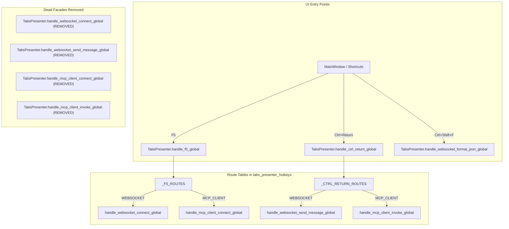

# PYPOST-1291: Remove uncalled TabsPresenter hotkey facade methods

## Research

### Background and Context
`TabsPresenter` acts as a central presenter coordinating multiple tab types (HTTP Request, WebSocket,
and MCP Client). Prior to PYPOST-1285, several individual facade methods were added to `TabsPresenter` to
dispatch protocol-specific actions:
- `handle_websocket_connect_global(self)`
- `handle_websocket_send_message_global(self)`
- `handle_mcp_client_connect_global(self)`
- `handle_mcp_client_invoke_global(self)`

In PYPOST-1285, keyboard shortcut routing was centralized around `TabsPresenter.handle_f5_global()`
and `TabsPresenter.handle_ctrl_return_global()`. When triggered, these methods delegate to
`pypost/ui/presenters/tabs_presenter_hotkeys.py`, which consults route tables `_F5_ROUTES` and
`_CTRL_RETURN_ROUTES` based on the active `TabProtocol`.

The four individual facades on `TabsPresenter`:
1. Have zero production callers in the codebase.
2. Direct callers around the standard routing pipeline, bypassing `hotkey_routed` event logging.
3. Consume lines of code in `TabsPresenter`, a core class strictly governed by the SOLID audit baseline
   metric caps (`ai-tasks/PYPOST-376/baseline-metrics.md`).
4. `handle_websocket_format_json_global(self)` is actively bound by `main_window_protocol_hotkeys.py`
   to `Ctrl+Shift+F`, and thus must be preserved.

### Test Callers
In `tests/test_main_window_hotkeys.py`:
- `test_f5_on_websocket_tab_toggles_connect` (line 74): Calls `presenter.handle_websocket_connect_global()`.
- `test_f5_on_mcp_client_tab_toggles_connect` (line 180): Calls `presenter.handle_mcp_client_connect_global()`.
- `test_invoke_global_dispatches_presenter` (line 238): Calls `presenter.handle_mcp_client_invoke_global()`.
- `handle_websocket_send_message_global` has zero callers across both production code and tests.

These tests should test the unified entry points `presenter.handle_f5_global()` and
`presenter.handle_ctrl_return_global()` on active tabs.

## Implementation Plan

1. **Delete Dead Facade Methods from `TabsPresenter`**:
   - In `pypost/ui/presenters/tabs_presenter.py`, remove:
     - `handle_websocket_connect_global(self)`
     - `handle_websocket_send_message_global(self)`
     - `handle_mcp_client_connect_global(self)`
     - `handle_mcp_client_invoke_global(self)`
   - Keep `handle_websocket_format_json_global(self)`, `handle_f5_global(self)`,
     `handle_ctrl_return_global(self)`, and navigation handlers.

2. **Update Test Callers**:
   - In `tests/test_main_window_hotkeys.py`:
     - Update `test_f5_on_websocket_tab_toggles_connect` to call `presenter.handle_f5_global()`.
     - Update `test_f5_on_mcp_client_tab_toggles_connect` to call `presenter.handle_f5_global()`.
     - Update `test_invoke_global_dispatches_presenter` to call `presenter.handle_ctrl_return_global()`.

3. **Update Baseline Metrics**:
   - Recalculate LOC for `pypost/ui/presenters/tabs_presenter.py`.
   - Update `ai-tasks/PYPOST-376/baseline-metrics.md` with the new lower baseline count.

4. **Failing Repro (Step 3)**:
   - Before removing the facades from `TabsPresenter`, write a test in `tests/test_main_window_hotkeys.py`
     verifying that `TabsPresenter` does NOT have `handle_websocket_connect_global`,
     `handle_websocket_send_message_global`, `handle_mcp_client_connect_global`, or
     `handle_mcp_client_invoke_global` as attributes (`hasattr(TabsPresenter, ...) is False`).
   - This test will fail today (demonstrating the dead facades exist) and pass once they are removed.

## Architecture

### Module Responsibilities and Interfaces

- **`pypost/ui/presenters/tabs_presenter.py`**:
  - Exposes unified dispatch handlers `handle_f5_global()` and `handle_ctrl_return_global()`.
  - Removes redundant per-protocol admission-checked methods that duplicate route-table logic.
- **`pypost/ui/presenters/tabs_presenter_hotkeys.py`**:
  - Maintains module-level routing functions and route tables.
- **`tests/test_main_window_hotkeys.py`**:
  - Asserts that dead facade methods are absent from `TabsPresenter`.
  - Tests dispatch through unified handlers.
- **`ai-tasks/PYPOST-376/baseline-metrics.md`**:
  - Records updated LOC count for `tabs_presenter.py`.

## Q&A

- **Q: Does removing these facades break any external integration or public API?**
  **A:** No. `TabsPresenter` is an internal UI presenter, not a public library API. All internal shortcut
  wiring in `MainWindow` routes through `handle_f5_global` and `handle_ctrl_return_global`.
- **Q: What is the impact on `ai-tasks/PYPOST-376/baseline-metrics.md`?**
  **A:** Removing ~20 LOC drops `tabs_presenter.py` LOC from 1074 to ~1054, further safely below the
  1165 baseline cap.
