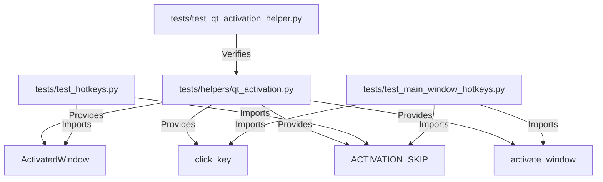

# PYPOST-1292: High-Level Architecture Design

## Research

### Current State
Two separate test modules contain duplicate code for Qt window activation and key simulation:

1. `tests/test_hotkeys.py`:
   - Declares `_ACTIVATION_SKIP = "window activation unavailable on this QPA platform"`.
   - Defines `_ActivatedWindow` context manager which builds a bare `QWidget` containing a
     `QLineEdit`, shows and activates it via `QTest.qWaitForWindowActive(..., 2000)` (skipping with
     `_ACTIVATION_SKIP` on failure), focuses the line edit, and simulates key clicks via
     `QTest.keyClick`.

2. `tests/test_main_window_hotkeys.py`:
   - Declares `_ACTIVATION_SKIP = "window activation unavailable on this QPA platform"`.
   - In `TestMainWindowSendKeyWiring`, defines `_activate()` and `_click()`, which perform the
     exact same sequence: `show()`, `activateWindow()`, `QTest.qWaitForWindowActive(..., 2000)`,
     `pytest.skip(_ACTIVATION_SKIP)`, `focus_target.setFocus()`, `processEvents()`, and `keyClick`.

### Design Decisions
- Extract shared functionality to `tests/helpers/qt_activation.py` alongside other test helpers
  (`qt_wait.py`, `qt_item_view.py`).
- Provide clean, reusable primitives:
  - `ACTIVATION_SKIP: str` (the standard skip message).
  - `activate_window(window: QWidget, focus_target: QWidget | None = None, timeout_ms: int = 2000) -> None`
  - `click_key(target: QWidget, key: Qt.Key, modifier: Qt.KeyboardModifier = Qt.KeyboardModifier.NoModifier) -> None`
  - `ActivatedWindow(timeout_ms: int = 2000)` (context manager providing `window`, `line_edit`,
    `activate()`, and `click(key, modifier)`).
- Both `tests/test_hotkeys.py` and `tests/test_main_window_hotkeys.py` will import from
  `tests.helpers.qt_activation`.

## Implementation Plan

### Step 3: Failing Repro Test
- Create an automated test in `tests/test_qt_activation_helper.py` that imports
  `ACTIVATION_SKIP`, `activate_window`, `click_key`, and `ActivatedWindow` from
  `tests.helpers.qt_activation` and verifies their interface and functionality.
- Since `tests/helpers/qt_activation.py` does not yet exist, running this test will fail
  with `ModuleNotFoundError: No module named 'tests.helpers.qt_activation'`.
- Production code remains completely untouched.

### Step 4: Development
1. Create `tests/helpers/qt_activation.py` implementing `ACTIVATION_SKIP`, `activate_window`,
   `click_key`, and `ActivatedWindow`.
2. Verify Step 3 test passes green.
3. Refactor `tests/test_hotkeys.py`:
   - Replace private `_ACTIVATION_SKIP` and `_ActivatedWindow` with imports from
     `tests.helpers.qt_activation`.
4. Refactor `tests/test_main_window_hotkeys.py`:
   - Replace duplicate `_ACTIVATION_SKIP` with import from `tests.helpers.qt_activation`.
   - In `TestMainWindowSendKeyWiring`, delegate `_activate()` and `_click()` to `activate_window`
     and `click_key`.
5. Run full test suite (`make test`), lint (`make lint`), and typecheck (`make typecheck`).

## Architecture

### Component Diagram

### Module Responsibilities

| Module | Responsibilities |
| --- | --- |
| `tests/helpers/qt_activation.py` | Shared Qt window activation, key simulation, and standard QPA skip policy. |
| `tests/test_hotkeys.py` | Hotkey documentation registration and ambiguity tests, consuming shared `ActivatedWindow`. |
| `tests/test_main_window_hotkeys.py` | Main window hotkey routing tests, consuming shared `activate_window` and `click_key`. |
| `tests/test_qt_activation_helper.py` | Unit tests verifying the shared activation helper contract and behavior. |

## Q&A

- **Q: Why not put the helper into `conftest.py` as a fixture?**
  **A:** `tests/test_main_window_hotkeys.py` is written as `unittest.TestCase` subclasses, where
  pytest fixtures are less ergonomic. Having a dedicated helper module under `tests/helpers/` matches
  existing repository patterns (e.g. `qt_wait.py`, `qt_item_view.py`) and allows direct importing
  by both pytest function-style tests and `unittest.TestCase` classes.
- **Q: Should `tests/helpers/__init__.py` re-export the new helpers?**
  **A:** Re-exporting in `__init__.py` or importing directly from `tests.helpers.qt_activation` both work;
  direct module import (`from tests.helpers.qt_activation import ...`) is clearer and prevents
  unnecessary coupling.
