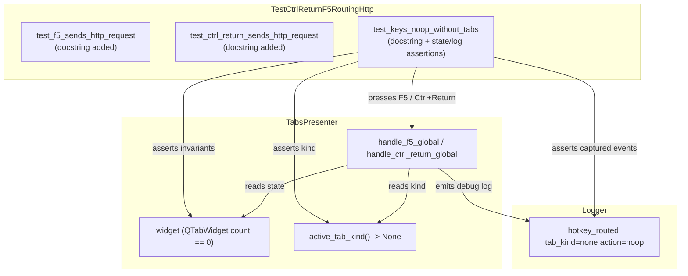

# PYPOST-1293: Add assertions to test_keys_noop_without_tabs; docstrings for HTTP routing tests

## Research

An inspection of `tests/test_main_window_hotkeys.py` reveals:
1. `TestCtrlReturnF5RoutingHttp` (~lines 472-501) defines three test cases:
   - `test_f5_sends_http_request`: Tests F5 dispatch to `on_send` when an HTTP tab is active. Lacks a docstring.
   - `test_ctrl_return_sends_http_request`: Tests Ctrl+Return dispatch to `on_send` when an HTTP tab is active. Lacks a docstring.
   - `test_keys_noop_without_tabs`: Checks `presenter.active_tab_kind()` is `None` before presses, calls `_press(presenter, "F5")` and `_press(presenter, "Ctrl+Return")`, but asserts nothing afterward. Lacks a docstring.
2. The missing assertions in `test_keys_noop_without_tabs` allow potential regressions where a key press might mutate tab count, open a default tab, or fail to follow the expected no-op path.
3. The lack of docstrings is inconsistent with the rest of `tests/test_main_window_hotkeys.py` where all other test classes and methods contain concise one-line docstrings.
4. `TabsPresenter` exposes `presenter.widget` (the `QTabWidget`), allowing inspection of `presenter.widget.count()`. The hotkey logger `pypost.ui.presenters.tabs_presenter_hotkeys` records `hotkey_routed key=<key> tab_kind=none action=noop`.

## Implementation Plan

1. **Step 3 (Failing Repro Test)**:
   - Add a contract conformance test verifying that all tests in `TestCtrlReturnF5RoutingHttp` have non-empty docstrings and that `test_keys_noop_without_tabs` performs post-press assertions.
   - Specifically, test that `test_f5_sends_http_request.__doc__`, `test_ctrl_return_sends_http_request.__doc__`, and `test_keys_noop_without_tabs.__doc__` exist.
   - Run the test to observe failure (red) on the docstring assertions.
2. **Step 4 (Development)**:
   - Update `TestCtrlReturnF5RoutingHttp`:
     - Add docstrings to `test_f5_sends_http_request` and `test_ctrl_return_sends_http_request`.
     - In `test_keys_noop_without_tabs`, add docstring and assert that before and after `F5` and `Ctrl+Return`:
       - `presenter.widget.count()` is 0.
       - `presenter.active_tab_kind()` is `None`.
       - Captured debug logs from `_ROUTING_LOGGER` include `hotkey_routed key=f5 tab_kind=none action=noop` and `hotkey_routed key=ctrl_return tab_kind=none action=noop`.
   - Run test suite to verify all green.
3. **Step 5 (Code Cleanup)**:
   - Run `make lint` and `make typecheck` to ensure no formatting or typing issues.
4. **Step 6 (Observability)**:
   - Verify log format and assertions match project observability conventions.
5. **Step 7 (Tech Debt)**:
   - Document any tech debt findings and verify Phase C blocker review.
6. **Step 8 (Dev Docs)**:
   - Update or verify relevant dev docs in `doc/dev/`.

## Architecture

### Component Diagram

### Module Responsibilities

- `tests/test_main_window_hotkeys.py`:
  - Contains unit test suite for main window and tab presenter hotkey routing.
  - `TestCtrlReturnF5RoutingHttp`: Group C regression guards verifying that HTTP requests are sent on active tabs and that no-tab states remain unaffected.

## Q&A

- Q: Why check both tab count and active tab kind?
  A: Tab count ensures no new tab was spawned or leaked; active tab kind ensures presenter internal protocol detection remains `None`.
- Q: Why assert debug logs in `test_keys_noop_without_tabs` when `TestHotkeyRoutedLogging` also tests it?
  A: Verifying the log event confirms that the key was handled via the expected noop routing branch rather than being ignored or swallowed by an unhandled exception.
