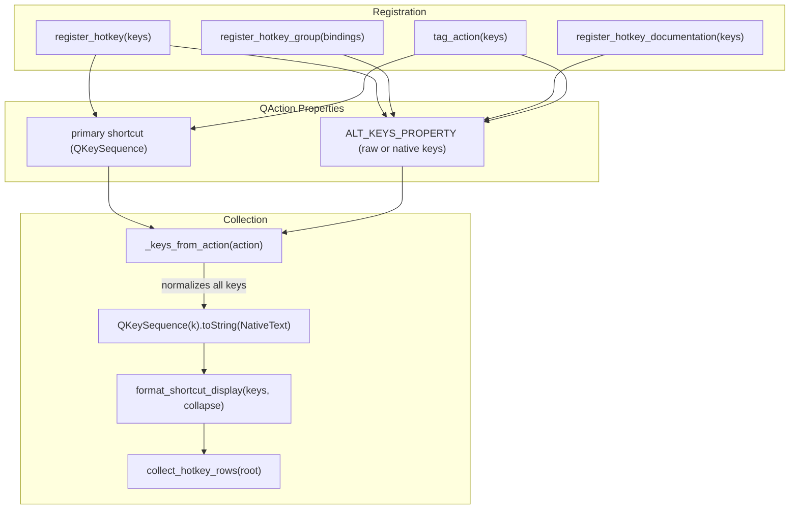

# PYPOST-1294: Platform-neutral Help-row snapshot; NativeText for all displayed keys

## Research

1. **Current key collection in `pypost/ui/hotkeys.py`**:
   - `_keys_from_action(action: QAction) -> list[str]`:
     ```python
     def _keys_from_action(action: QAction) -> list[str]:
         alt = action.property(ALT_KEYS_PROPERTY)
         if alt and action.shortcut().isEmpty():
             return list(alt)
         keys: list[str] = []
         primary = action.shortcut().toString(QKeySequence.SequenceFormat.NativeText)
         if primary:
             keys.append(primary)
         if alt:
             keys.extend(alt)
         return keys
     ```
   - Primary shortcuts are converted via `toString(NativeText)`, but `ALT_KEYS_PROPERTY` values
     are passed through unchanged as raw strings.
   - For `register_hotkey_group` (e.g. `Alt+1 ... Alt+9`) and `tag_action`
     (e.g. `F5 / Ctrl+Return`), raw strings are stored in `ALT_KEYS_PROPERTY`. On macOS, this
     produces a mix of raw strings and native symbols (e.g. `F5 / Ctrl+Return` instead of
     `F5 / ⌘↩`).
   - `register_hotkey_documentation` converted keys explicitly on registration, but doing this in
     multiple places or only for documentation rows creates an inconsistent design.

2. **Snapshot test in `tests/test_main_window_hotkeys.py`**:
   - `_EXPECTED_OTHER_HELP_ROWS` hardcodes string literals (e.g. `"Quit Application", "Ctrl+Q"`).
   - On macOS, Qt renders shortcuts with native modifier symbols (e.g. `⌘Q`), causing
     `test_other_help_rows_unchanged` to fail on non-Linux platforms.

## Implementation Plan

1. **Step 3 (Failing Repro Test)**:
   - Add a unit test in `tests/test_hotkeys.py` verifying that all displayed keys extracted by
     `collect_hotkey_rows` (including alternative keys registered via `tag_action` /
     `register_hotkey` and group keys via `register_hotkey_group`) are converted via
     `QKeySequence.SequenceFormat.NativeText`.
   - By intercepting or inspecting the conversion to `NativeText`, demonstrate that current
     alt keys bypass `NativeText` formatting and return raw strings.
   - Run the test to observe failure (red).
2. **Step 4 (Development)**:
   - In `pypost/ui/hotkeys.py`:
     - Update `_keys_from_action` so that all keys (both primary and every key in `alt`) are
       consistently converted via `QKeySequence(key).toString(NativeText)`.
     - In `tag_action`, normalize keys before comparing with `primary` to avoid duplicate entries
       on macOS.
   - In `tests/test_main_window_hotkeys.py`:
     - Transform `_EXPECTED_OTHER_HELP_ROWS` dynamically using a helper `_to_native_spec` that
       converts each key or range in the spec through `QKeySequence(k).toString(NativeText)`.
   - Verify all tests pass cleanly on Linux and would produce valid native symbols on macOS.
3. **Step 5 (Code Cleanup)**:
   - Run `make lint` and `make typecheck` to ensure no formatting or typing issues.
4. **Step 6 (Observability)**:
   - Verify observability impact (UI display formatting, no production logging change).
5. **Step 7 (Tech Debt)**:
   - Document resolution of TD-7 and verify Phase C blocker review.
6. **Step 8 (Dev Docs)**:
   - Update `doc/dev/hotkeys.md` to document universal `NativeText` formatting for Help dialog keys.

## Architecture

### Component Diagram



### Module Responsibilities

- `pypost/ui/hotkeys.py`:
  - `_keys_from_action`: Single point of truth that normalizes all keys (primary + alt) to
    `NativeText` before display formatting.
  - `format_shortcut_display`: Formats native key sequences with delimiters (`/` or `...`).
- `tests/test_main_window_hotkeys.py`:
  - `_to_native_spec`: Converts expected help row test specifications into platform-native
    strings dynamically.

## Q&A

- Q: Why normalize in `_keys_from_action` rather than at registration time?
  A: Normalizing during extraction in `_keys_from_action` provides defense-in-depth: regardless
  of whether an action was tagged via `tag_action`, `register_hotkey`, `register_hotkey_group`,
  or manually via `action.setProperty(ALT_KEYS_PROPERTY, ...)`, `collect_hotkey_rows` will always
  output consistent `NativeText`.
- Q: Will this alter existing test expectations on Linux?
  A: No, on Linux/X11, `NativeText` produces the standard `Ctrl+...`, `Alt+...` text, so all
  Linux snapshot rows remain identical while becoming fully portable on macOS.
