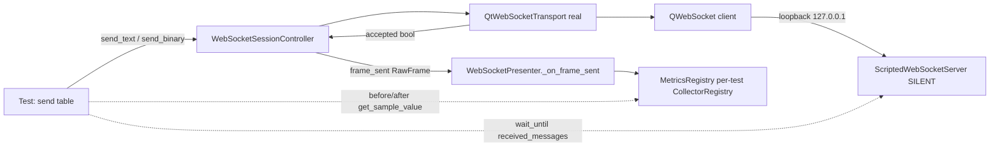

# PYPOST-1297: Verify outbound WebSocket metrics through a real loopback send

## Research

All findings were checked against base commit `286b3a4c`.

### Send and metric path

- `WebSocketSessionController.send_text` and `send_binary`
  (`pypost/core/qt/websocket_session.py`, about lines 159-201) check for the `OPEN` state.
  They calculate `byte_size` (UTF-8 length for text, raw length for binary) and call the
  transport. They emit `frame_sent(RawFrame)` only when the transport returns `True`.
- The controller's default transport factory is `lambda: QtWebSocketTransport(parent=self)`.
  When a test does not call `set_transport_factory`, the real Qt adapter is used.
- `QtWebSocketTransport.send_text` and `send_binary` (`pypost/core/qt/websocket_transport.py`,
  about lines 191-204) return `False` if the socket is not `ConnectedState`. Otherwise they
  return whether Qt's returned byte count equals the payload's byte length. Today the
  real-socket result is tested only through a `Mock` socket
  (`test_qt_transport_reports_complete_handoff_only`).
- `WebSocketPresenter.__init__` takes `session_controller=` and `metrics=`, and it connects
  `frame_sent` to `_on_frame_sent`. `_on_frame_sent` (about lines 456-459) calls
  `track_websocket_message("outbound", frame.payload_format.value)` and
  `track_websocket_message_bytes("outbound", frame.byte_size)`. Then it queues a stream entry.
  The presenter does not need a tab. The PYPOST-1288 repro already builds it without one.
- Composer, preset, sequence, and presenter fallback sends all call
  `controller.send_text` or `controller.send_binary`. This means
  `controller.send_*` → `frame_sent` → `presenter._on_frame_sent` is the shared send path and
  metric recording that the WebSocket tab uses. That satisfies the DoD without driving widgets.
  Requirements allow this.
- Signal delivery is direct, so the counters change synchronously inside the `send_*` call.
  The presenter connects with the default `AutoConnection`
  (`websocket_presenter.py`, about line 175: `frame_sent.connect(self._on_frame_sent)`), and
  the controller and presenter live on the same (GUI) thread, so Qt resolves it to a direct
  call. `send_text`/`send_binary` call `self.frame_sent.emit(frame)` as their last statement,
  only after the transport returns `True` (`websocket_session.py`, about lines 159-201).
  When the transport returns `False`, the controller logs `websocket_send_rejected` and
  returns without emitting. Peer receipt is asynchronous and needs event-loop processing.

### Metrics registry and reading values

- `MetricsRegistry()` creates its own `CollectorRegistry` (`self.registry`), and each test
  builds a fresh instance. Values from other tests cannot leak in, and the design is stable
  under xdist workers.
- `websocket_messages_total{direction, kind}` and `websocket_message_bytes_total{direction}`
  are the counters. Read them with the public prometheus_client API:
  `metrics.registry.get_sample_value("websocket_messages_total", {"direction": "outbound",
  "kind": "text"})`. It returns `None` before the first increment, so the helper treats
  `None` as `0.0`. This avoids the private `_value.get()` used in the PYPOST-1288 tests.

### Loopback peer

- `tests/conftest.py::ws_test_server` (function-scoped, depends on `qapp`) starts
  `tests.websocket_echo_server.ScriptedWebSocketServer` on `127.0.0.1:0` and stops it in
  `finally`. No external network is used.
- The server records every received message in `received_messages`,
  `received_text_messages`, and `received_binary_messages`. It records the message before
  checking the configured behavior, and it applies no size filter. The `SILENT` behavior
  (`server.configure(ServerBehaviorConfig(behavior=ServerBehavior.SILENT))`) still records
  receipt but sends nothing back. Inbound frames therefore cannot interleave with the
  outbound assertions.
- The inline `echo_server` fixture in `tests/test_websocket_session_controller.py` echoes
  but does not record what the peer received. So it can show peer receipt only indirectly,
  through the echo.

### Bounded waits

- `pypost.agent.ui_wait.wait_until(condition, timeout=..., message=...)` (re-exported by
  `tests/helpers/qt_wait.py`) polls `processEvents` until a wall-clock deadline and raises
  `UiWaitTimeoutError`. Echo-server tests use it with `timeout=5.0`. The existing loopback
  test uses 50-iteration `processEvents` loops. They are capped by iteration count, not by
  wall-clock time, and the new test should not copy them.
- do-testing tiers: GUI or presenter tests take 30-60 s and integration tests 60-120 s. The
  target module has `pytestmark = pytest.mark.timeout(30)`. The new test makes one
  connection and four sends, each with a 5 s maximum wait, so its worst case exceeds 30 s.
  It needs its own `@pytest.mark.timeout(60)` (signal method, not `method="thread"`).

### Zero-byte messages

- [RFC 6455 §5.6](https://www.rfc-editor.org/rfc/rfc6455#section-5.6) defines data frames,
  and the payload length field in §5.2 allows 0, so zero-length text and binary messages are
  valid. The Qt adapter treats an empty send as accepted when Qt returns `0 == len(payload)`.
- Qt's `QWebSocketPrivate::doWriteFrames` handles the zero-payload case by writing a single
  frame. `QWebSocketDataProcessor` emits `textMessageReceived` and `binaryMessageReceived`
  on the final frame whatever its length. This comes from Qt source knowledge, not from Qt
  documentation. It is therefore a **verification risk**. Step 3 must observe it on the real
  socket. If Qt does not accept or deliver an empty message, that is a finding under the
  requirements, not a reason to weaken the check.

## Implementation Plan

This is a coverage-only task. **No production change is expected.** The deliverable is one new
integration test. A production change becomes necessary only if that test exposes a real
defect, for example Qt returning a byte count that does not match for non-ASCII or empty
payloads. That would be fixed in Step 4 or recorded as a blocker, as the requirements say.

1. Add a test
   `test_real_loopback_send_records_outbound_metrics_and_reaches_peer(qapp, ws_test_server)`
   to `tests/test_websocket_outbound_metrics_repro.py`, marked `@pytest.mark.timeout(60)`.
2. Setup:
   - Configure the server as `SILENT`.
   - Create `metrics = MetricsRegistry()` and `controller = WebSocketSessionController()`.
     Do not override the transport factory, so the real `QtWebSocketTransport` is used.
   - Create `presenter = WebSocketPresenter(connection=WebSocketConnection(url=server.url),
     session_controller=controller, metrics=metrics)`.
   - Open the connection with `controller.open(HandshakeTarget(url=server.url),
     heartbeat=HeartbeatConfig(interval_seconds=0))`.
   - Wait with `wait_until(lambda: controller.state == SessionState.OPEN and
     len(server.clients) == 1, timeout=5.0)`.
   - Wrap the body in `try/finally: presenter.teardown()`. The fixture stops the server.
3. Read counters with a small module-level helper, `_outbound(metrics) -> tuple[float,
   float, float]`. It returns (text count, binary count, outbound bytes) through
   `get_sample_value`, with `None` treated as `0.0`.
4. Run a table of sends in order:

   | Kind | Payload | Expected count delta | Expected bytes delta |
   | --- | --- | --- | --- |
   | text | `"héllo 💡 мир"` | text +1, binary +0 | `len(payload.encode("utf-8"))` |
   | binary | `b"\x00\x01\x7f\x80\xfe\xff"` | binary +1, text +0 | `len(payload)` = 6 |
   | text | `""` | text +1, binary +0 | +0 |
   | binary | `b""` | binary +1, text +0 | +0 |

   For each row `i` (0-based), in this exact order:
   1. Take the `before` snapshot.
   2. Call `controller.send_text` or `controller.send_binary`.
   3. Take the `after` snapshot **immediately**, with no `wait_until` or `processEvents`
      in between. The counters are already final here, because `frame_sent` is delivered
      directly inside `send_*` (see Research).
   4. Assert the count delta, then the bytes delta (messages below).
   5. Only then wait for peer receipt with
      `wait_until(lambda: len(server.received_messages) == i + 1, timeout=5.0,
      message=f"row {i} {kind} ({n} bytes) not received by peer")`.
   6. Assert peer receipt: `server.received_messages[-1] == payload` and its type matches
      the kind (`str` or `bytes`).

   After all rows, also assert `server.received_text_messages == ["héllo 💡 мир", ""]` and
   `server.received_binary_messages == [b"\x00\x01\x7f\x80\xfe\xff", b""]`.

   Metrics are asserted before the peer wait on purpose. If the adapter rejects a send (or
   Qt drops an empty frame), the metric assertion names the cause at once. Waiting first
   would turn the same defect into a 5 s `UiWaitTimeoutError` that hides it. A frame that is
   counted but never arrives still fails, at step 5, with the row-specific timeout message.

   Assertion messages are fixed so that Step 3 can match each mutant's first failure line.
   With `n = len(payload)` for binary and `len(payload.encode("utf-8"))` for text:

   - Count: `row {i} {kind} ({n} bytes) count delta: expected text=+{et} binary=+{eb},
     got text=+{dt:g} binary=+{db:g}`
   - Bytes: `row {i} {kind} ({n} bytes) bytes delta: expected +{n}, got +{dbytes:g}`

   The expected byte values come from the payload, not from `RawFrame.byte_size`, so the
   check is not circular. A guard assertion makes sure the non-ASCII text's encoded length
   (18) differs from its character count (11). Comparing deltas covers the before/after DoD.
   Failure messages contain only the row, the kind and the sizes, never the payload.
5. Leave `test_real_loopback_roundtrip` and the PYPOST-1288 fake-transport tests unchanged.
6. Run `make test WORKERS=1 PYTEST_ARGS='tests/test_websocket_outbound_metrics_repro.py
   tests/test_websocket_session_controller.py -q'`, then `make lint` and `make check`.
   Accept only the failures already known as PYPOST-1299, PYPOST-1298, PYPOST-1263,
   PYPOST-1305, and PYPOST-1306.

**Mandatory — Failing Repro (Step 3):**

*How td-25 applies.* td-25 allows `N/A — no behavioral change` only when there is no runtime
behavioral change. This task changes no runtime behavior, and the outbound metric code
already exists from PYPOST-1288. A test that asserts the desired behavior is therefore
expected to pass on current code. Forcing a "red" by editing production code would break
td-25's rule against production changes in Step 3. Marking the test `xfail` would hide the
result, which is also forbidden. The honest approach has two parts.

1. **Production-red is N/A, with evidence.** Step 3 writes the integration test above, the
   task's real deliverable, and runs it through `make test`. Then:
   - If it **fails** on current code for a contract reason (count, bytes, empty-message
     acceptance, or peer receipt), that is a genuine red repro of a real defect. Step 4 fixes
     the defect or records it as a blocker, following the requirements.
   - If it **passes**, record in the roadmap: `N/A — no behavioral change (coverage-only);
     test green on current code`, and attach the sensitivity evidence from part 2.
2. **Sensitivity proof by test-only mutation (not committed).** To show the new test would
   catch the regressions named in the requirements, Step 3 adds a temporary scratch module,
   `tests/test_pypost_1297_mutation_probe.py`. It has one test per mutant
   (`test_mutant_m1` … `test_mutant_m4`). Each test installs its mutant with pytest
   `monkeypatch` **before** the presenter is built (the signal binds `self._on_frame_sent`
   in `__init__`), then calls the shared table directly. It never edits any
   file under `pypost/`. To make reuse easy, the real test keeps its body in a module-level
   function, `_run_loopback_send_table(server)`, which builds the presenter itself. This is
   a small structural choice, not a test-only seam in production code.

   Each probe test is written to **fail** (it calls the table without `pytest.raises`), so
   the evidence is the real assertion line in pytest's output. Mutants and the exact first
   failure line expected for each:

   - **M1, counts stay at zero.** Patch: `_on_frame_sent` skips both metric calls.
     First failing line:
     `row 0 text (18 bytes) count delta: expected text=+1 binary=+0, got text=+0 binary=+0`
   - **M2, double count.** Patch: `_on_frame_sent` calls `track_websocket_message` twice.
     First failing line:
     `row 0 text (18 bytes) count delta: expected text=+1 binary=+0, got text=+2 binary=+0`
   - **M3, wrong bytes.** Patch: `_on_frame_sent` records `len(frame.payload)`, the
     character count, as bytes. First failing line:
     `row 0 text (18 bytes) bytes delta: expected +18, got +11`
   - **M4, empty send not accepted.** Patch: the Qt adapter returns `False` for an empty
     payload (defined below). First failing line:
     `row 2 text (0 bytes) count delta: expected text=+1 binary=+0, got text=+0 binary=+0`

   M4 is defined precisely as: wrap `QtWebSocketTransport.send_text` and `send_binary` so
   the wrapper **always forwards the payload to the original method** (Qt sends the frame)
   and then returns `False` when the payload is empty, otherwise the original result. This
   models "Qt reports a short handoff for an empty message". Rows 0 and 1 pass. On row 2 the
   controller logs `websocket_send_rejected` and does not emit `frame_sent`, so the count
   assertion fails immediately, before any peer wait. Because the frame still reaches the
   peer, the old wait-first order would even have let receipt pass. The variant "returns
   `False` without sending" fails on the same line, since metrics are asserted first.

   Each mutant is run on its own with
   `make test WORKERS=1 PYTEST_ARGS='tests/test_pypost_1297_mutation_probe.py -k m<N> -q'`
   (N = 1…4). Make must exit non-zero, and the first `AssertionError` line must match the
   list above. The real test is also run on its own and must be green.

   **Evidence for the reviewer.** Step 3 writes `ai-tasks/PYPOST-1297/30-failing-repro.md`.
   For each mutant it records the exact `make` command, the `make` exit code, and the first
   assertion line from the output. It records the same for the real test (exit code 0). The
   roadmap STEP 3 sub-items link this note.

   **Probe lifetime.** The probe file **stays in the working tree until the Step 3 review
   passes**. The Step 3 review subagent (td-25) re-runs each mutant command itself and
   confirms that the exit code and first assertion line match the note. The orchestrator
   deletes the probe at the Step 3 acceptance gate, before Step 4 starts. It then confirms
   with `git status` that only `tests/test_websocket_outbound_metrics_repro.py` and
   `ai-tasks/PYPOST-1297/` changed and that `pypost/` has no diff. While the probe exists,
   `make check` and an unfiltered `make test` are expected to fail on it, so Step 3 uses
   only the targeted commands above. The full `make check` runs in Step 4, after deletion.

   **Deviation from td-25.** td-25's N/A path says "add `N/A — no behavioral change` and do
   **not** write a test". This plan deviates on purpose: Step 3 writes the coverage test and
   a temporary mutation probe. The reason is that the test *is* the task's deliverable, so
   the N/A path would leave Step 3 with nothing to review. Production-red is impossible
   without editing `pypost/`, which td-25 forbids. The mutation probe replaces the red run
   as proof that the test fails for the intended reasons, and the probe's lifetime above
   keeps that proof re-runnable by the independent reviewer td-25 requires.

The Step 3 review subagent checks four things. The green or red result is explained
honestly. Each mutant, re-run by the reviewer, fails with the exit code and first assertion
line recorded in `30-failing-repro.md`. No production file changed. The probe is still
present at review time (its deletion is the orchestrator's gate action, checked at the gate).

Order of work: research (this step) → Step 3 test plus mutation evidence → Step 4. Step 4
makes no production change unless Step 3 found a real defect. In that case it fixes the
defect until the test is green.

## Architecture

No production module changes. The test adds an observer harness around the existing chain.

### Modules and responsibilities

| Module | Role in this task | Changed |
| --- | --- | --- |
| `WebSocketSessionController` | Send guard, byte size, `frame_sent` after acceptance | No |
| `QtWebSocketTransport` | Real Qt handoff and acceptance result under test | No |
| `WebSocketPresenter` | Maps `frame_sent` to the outbound counters | No |
| `MetricsRegistry` | Isolated per-test counters read by public sample API | No |
| `ScriptedWebSocketServer` (`ws_test_server`) | Hermetic peer that records receipt | No |
| `tests/test_websocket_outbound_metrics_repro.py` | Hosts the new integration test | Yes (test) |

### Interfaces used

- `WebSocketSessionController.send_text(str) -> None`, `send_binary(bytes) -> None`, and
  the `frame_sent(RawFrame)` signal. The contract is unchanged from PYPOST-1288.
- `QtWebSocketTransport.send_text/send_binary -> bool`. It returns true only for a full
  handoff on a connected socket.
- `MetricsTrackerProtocol.track_websocket_message("outbound", kind)` and
  `track_websocket_message_bytes("outbound", n)`.
- `CollectorRegistry.get_sample_value(name, labels) -> float | None`. This is how the test
  reads values.
- `ScriptedWebSocketServer.received_messages`, `received_text_messages`,
  `received_binary_messages`, `clients`, and `configure(ServerBehaviorConfig)`.
- `wait_until(condition, *, timeout, message)`. It is bounded by wall-clock time and raises
  `UiWaitTimeoutError`.

### Patterns and justification

- **Integration test with an observer harness.** The real chain runs from start to end. The
  test observes the two ends it has to prove: the counter deltas and peer receipt.
- **Baseline-relative assertions.** Before and after deltas per send meet the isolation DoD.
- **Hermetic loopback fixture.** It reuses the existing `ws_test_server` fixture, which binds
  an ephemeral port on 127.0.0.1 and is safe under xdist.

### Decision: add a new test, not extend `test_real_loopback_roundtrip`

The new test goes into `tests/test_websocket_outbound_metrics_repro.py`. Rejected alternatives:

- **Extend `test_real_loopback_roundtrip`.** The PYPOST-1288 tech-debt note suggests this
  ("A follow-up could extend that test"). It is rejected for four reasons:
  - The test belongs to a controller-layer module, which does not import any UI presenter or
    metrics today. Adding them would mix layers.
  - Its inline `echo_server` fixture does not record what the peer received, so zero-byte
    receipt could only be inferred from an echo.
  - Its waits are capped by iteration count, not by time.
  - The requirements require the existing round-trip coverage to keep passing unchanged.

  The Jira summary asks to assert metrics through a real Qt loopback send. It does not
  require that a specific test be edited.
- **A new standalone test file.** It is rejected because the existing PYPOST-1288 module
  already holds the outbound metric contract, with its imports, `qapp` usage, timeout marker,
  and the fake-transport cases. Keeping real and fake evidence for the same contract in one
  module lets a reader see the whole contract in one place.
- **Driving the composer widget.** It is rejected because the requirements state that the
  shared send path is enough. Widget input would add flakiness without covering any new
  metric code.
- **`presenter.handle_connect()` instead of `controller.open()`.** It is rejected because it
  uses the process-global session-slot limiter and template resolution, which are outside
  scope. `controller.open` follows the PYPOST-1288 repro pattern. The metric recording
  happens after the open, so it is the same either way.

## Q&A

- **Q: Will the test be red on current code?**
  A: Probably not. PYPOST-1288 put the metric recording in place. The test is the coverage
  deliverable, and its ability to catch the regressions named in the requirements is shown
  by the temporary mutation probe in Step 3, whose
  results are recorded in `30-failing-repro.md`. If it is red, that is a real finding, handled
  in Step 4.
- **Q: Why both empty text and empty binary when the requirements need only one kind?**
  A: It costs little, and both go through different Qt send methods and different adapter
  comparisons.
- **Q: Why the `SILENT` server instead of echo?**
  A: Receipt is recorded either way. `SILENT` keeps inbound frames and inbound metrics out of
  the outbound check and removes any ordering race with echoed frames.
- **Q: Is any production change needed?**
  A: No, unless the real socket shows a defect, for example a byte count from Qt that does
  not match for non-ASCII text or an empty payload that is rejected or not delivered. Step 4
  would then fix it or record a blocker, and the test would not be weakened.
