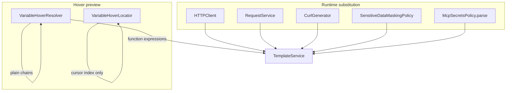

# PYPOST-134: Variable substitution centralization — architecture verification

## Verdict

**Already centralized.** No migration to a common `TemplateEngine` is required. PYPOST-18
delivered `TemplateService` as the single Jinja2-backed substitution service; this ticket
documents that state and closes the PYPOST-15 follow-up.

## Research

| Historical item | Resolution |
| --- | --- |
| PYPOST-15 debt: move to `TemplateEngine` | Superseded by PYPOST-18 `TemplateService` |
| PYPOST-18: unify Jinja2 `Environment` | Removed `TemplateEngine`; single `Environment` in `TemplateService` |
| PYPOST-129: split hover helper | Locator vs resolver; expressions still use `TemplateService` |
| PYPOST-450+: function expressions | Validation/render pipeline owned by `TemplateService` + resolver |

`grep` audit (2026-06): no `template_engine.py`, no ad-hoc `jinja2.Template(...)` outside
`TemplateService._render_with_jinja`.

## Current architecture

### Central service

`pypost/core/template_service.py` (`TemplateService`):

- Owns one `jinja2.Environment` per instance
- `render_string(content, variables, render_path)` — all runtime substitution
- `parse(content)` — AST for MCP secrets / variable discovery
- `validate_function_expressions(content)` — allow-list validation before render

Composition root: `main.py` constructs `TemplateService(metrics=metrics_manager)` and injects
into `MainWindow` → presenters → workers.

### Runtime consumers (all via `render_string` or `parse`)

| Consumer | Module | API used | Render path |
| --- | --- | --- | --- |
| HTTP send | `http_client.py` | `render_string` | `runtime` (default) |
| MCP/history preview | `request_service.py` | `render_string` | `runtime` |
| Copy as cURL | `curl_generator.py` | `render_string` | `runtime` |
| History masking | `sensitive_data_masking_policy.py` | `render_string` | `runtime` |
| MCP secrets AST | `mcp_secrets_policy.py` | `parse` | N/A |
| Hover tooltips | `mixins.py` (`VariableHoverResolver`) | `render_string` | `hover` |

### Intentional non-centralized path

`VariableHoverResolver._resolve_plain_reference_chain` resolves plain `{{name}}` references for
tooltips only (cycle/depth bounds, hidden-key masking). This is **not** runtime substitution
debt — documented in PYPOST-129 and `doc/dev/ui_mixins.md`.

## Implementation plan

1. Record audit verdict in `doc/dev/template_service.md`.
2. No code migration — close PYPOST-134 as verification complete.

## Verification evidence

| Check | Location |
| --- | --- |
| `TemplateService` render/parse unit tests | `tests/test_template_service.py` |
| HTTP uses injected service | `tests/test_http_client.py` |
| Hover expression parity | `tests/test_variable_hover_helper.py` |
| No `TemplateEngine` module | `glob **/template_engine.py` → empty |
