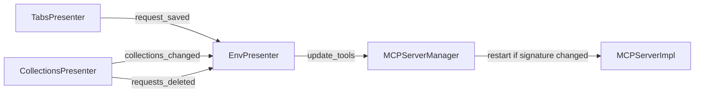

# PYPOST-136: MCP tool list refresh on collection changes

## Research

- `MCPServerManager.update_tools()` in `pypost/core/mcp_server.py` restarts uvicorn when
  called while running, but had no callers.
- `EnvPresenter._get_mcp_tools()` reads live collections via injected `get_collections`.
- `MainWindow` already connects `request_saved`, `collections_changed`, and `requests_deleted`
  for tree/tab sync — same hooks suit MCP refresh.

## Implementation Plan

1. **Signature helper** — `mcp_tools_signature(tools)` returns sorted `(id, name)` pairs for
   exposed requests; skip restart when unchanged.
2. **Manager** — `update_tools()` returns `bool`, logs `mcp_tools_changed`, restarts only on
   signature delta while running.
3. **Presenter** — `refresh_mcp_tools()` updates button count; calls `update_tools` when current
   environment has `enable_mcp`.
4. **MainWindow wiring** — connect `refresh_mcp_tools` to `request_saved`,
   `collections_changed`, `requests_deleted`.

## Architecture

| Component | Change |
| --- | --- |
| `mcp_server.py` | `mcp_tools_signature`, signature-aware `update_tools` |
| `env_presenter.py` | `refresh_mcp_tools()` |
| `main_window.py` | Signal connections |

## Q&A

| Question | Answer |
| --- | --- |
| Compare by id only? | Id + name — rename changes MCP tool name. |
| Double restart on env reload? | `update_tools` no-ops when signature matches. |

## Worklog

role: execution, step: 2, step_name: Architecture, tokens_used: 2400
