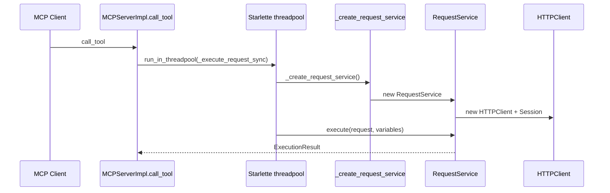

# PYPOST-138: Architecture — MCP per-call RequestService

## Research

- MCP server runs uvicorn + asyncio on a dedicated thread (`MCPServerManager`).
- `call_tool` uses `run_in_threadpool` because `RequestService.execute` is synchronous.
- `requests.Session` must not be shared across threadpool workers without synchronization.
- GUI path already uses one `RequestService` per `RequestWorker` instance (one-shot).

## Decision

Remove the long-lived `self.request_service` on `MCPServerImpl`. Introduce
`_create_request_service()` that returns a new `RequestService` with the same injected
`metrics` and `template_service`. `_execute_request_sync` calls the factory on every
invocation.

## Flow

## Test strategy

| Test | File | Asserts |
| --- | --- | --- |
| Fresh service per sync call | `tests/test_mcp_server_impl.py` | Two `_execute_request_sync` calls → distinct services/sessions |
| Existing call_tool mocks | MCP test suites | Stub `_create_request_service` instead of `request_service` attr |

## Out of scope

- Thread-safe singleton `HTTPClient` redesign.
- History/alert wiring on MCP path (unchanged — MCP uses default no-op managers).
