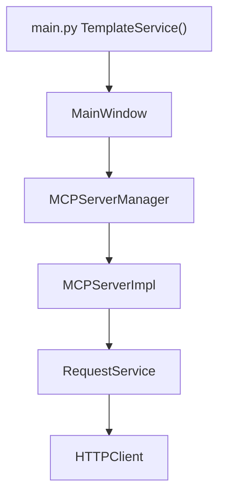

# PYPOST-144: Architecture — TemplateService Injection in HTTPClient & MCPServerImpl

## Research

- PYPOST-45 already removed `template_service = TemplateService()` from
  `pypost/core/template_service.py` and added constructor parameters across consumers.
- PYPOST-144 verifies and documents the subset affecting `HTTPClient` and `MCPServerImpl`.
- Production wiring: `main.py` → `MainWindow` → `MCPServerManager` / `TabsPresenter` passes
  a single `TemplateService` instance.

## Design

### Dependency flow

### HTTPClient

- Parameter: `template_service: TemplateService | None = None`
- When `None`, creates `TemplateService()` locally (backward-compatible tests).
- All `render_string` calls use `self._template_service`.
- Debug log when injection is used.

### MCPServerImpl

- Parameter: `template_service: TemplateService | None = None`
- Stores `self._template_service` (may be `None`; schema regex fallback still works).
- Passes value to `RequestService(metrics=..., template_service=self._template_service)`.
- `_extract_mcp_variables` uses `self._template_service.parse` when available.

## Implementation Plan

1. Confirm no `import template_service` in target files (already satisfied).
2. Add `TestMCPServerImplInjection` mirroring `TestHTTPClientInjection`.
3. Update developer docs noting direct global access debt is closed.

## Files

| File | Change |
|------|--------|
| `pypost/core/http_client.py` | Verified — no code change required |
| `pypost/core/mcp_server_impl.py` | Verified — no code change required |
| `tests/test_mcp_server_impl.py` | Add injection test |
| `doc/dev/tech-debt/PYPOST-21.md` | Mark section 2 resolved |
