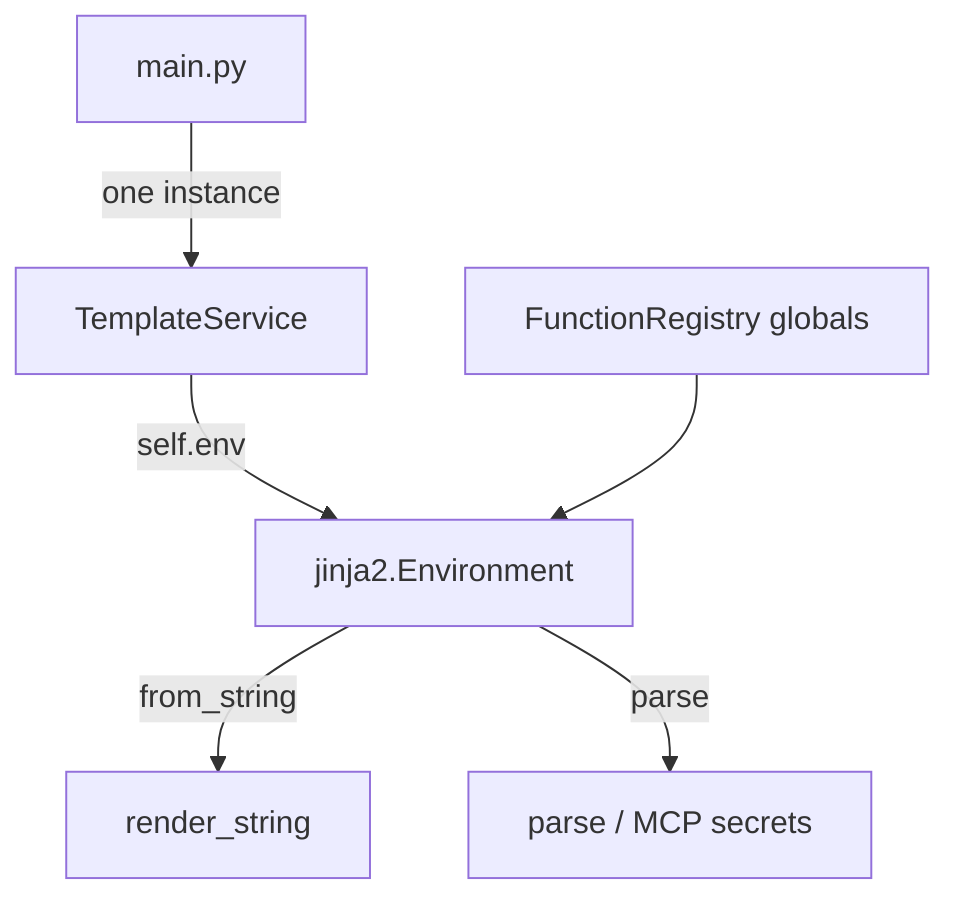

# PYPOST-146: Single Jinja2 Environment — architecture verification

## Verdict

**Already implemented.** PYPOST-18 delivered `TemplateService` with one `jinja2.Environment` per
instance. This ticket documents that state, adds a regression test, and closes the PYPOST-18
performance follow-up.

## Research

| Item | Finding |
| --- | --- |
| `TemplateService.__init__` | `self.env = Environment()` once; `FunctionRegistry.register_into_env(self.env)` |
| `render_string` | `_render_with_jinja` → `self.env.from_string(content).render(**variables)` |
| `parse` | `return self.env.parse(content)` |
| Production grep | Only `pypost/core/template_service.py` constructs `jinja2.Environment()` |
| `main.py` | Single `TemplateService(metrics=metrics_manager)` injected into UI stack |
| Old `TemplateEngine` | Removed (PYPOST-18); no ad-hoc `jinja2.Template(...)` in production |
| Compile cache | Not active; PYPOST-455 deferred `lru_cache` → PYPOST-148 |

### Jinja2 caching notes

- `Environment.get_template(name)` uses the loader cache by default.
- `Environment.from_string(source)` compiles on each call unless a custom cache is configured.
- Centralizing one `Environment` still wins by sharing globals/filters and avoiding redundant
  `Environment()` allocation versus the pre-PYPOST-18 pattern.

## Current architecture



### Production injection chain

```
main.py → MainWindow → TabsPresenter / MCPServerManager
         → RequestService → HTTPClient   (same TemplateService id())
```

Fallback constructors (`HTTPClient()`, `RequestService()`) may create a local
`TemplateService()` when omitted — each owns its own env. Production path uses injection from
`main.py` (PYPOST-134, PYPOST-143).

### Known exception

`VariableHoverHelper._hover_template_service` — module-level instance for hover preview only;
not part of the request pipeline (PYPOST-134).

## Implementation plan

1. Add `TestTemplateServiceSingleEnvironment` in `tests/test_template_service.py`.
2. Add PYPOST-146 section to `doc/dev/template_service.md`.
3. No production code changes required.

## Verification evidence

| Check | Location |
| --- | --- |
| Shared env identity test | `tests/test_template_service.py` |
| Existing render/parse tests | `tests/test_template_service.py` |
| Caching deferral analysis | `doc/dev/template_expression_functions.md` (PYPOST-455) |
| No duplicate production env | grep `jinja2.Environment()` in `pypost/` → `template_service.py` only |
