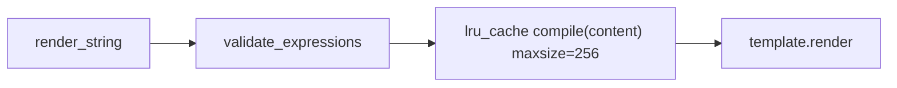

# PYPOST-148: Architecture — template compile cache

## Audit (2026-06)

| Check | Result |
| --- | --- |
| Bounded compile cache on `TemplateService` | **Not present** |
| `_render_with_jinja` | `self.env.from_string(content)` every call |
| Shared `Environment` | One per instance (`self.env`) — PYPOST-146 |
| Guard tests for future cache | `tests/test_template_service_caching_eval.py` (PYPOST-455) |

## Benchmark evidence (PYPOST-455, local 2026-06-11)

| Scenario | µs/render |
| --- | ---: |
| Plain `{{host}}/{{id}}` | ~130 |
| Function `{{urlencode(host)}}` | ~152 |
| Nested `{{base64(md5(token))}}` | ~182 |
| Simulated HTTP request (URL + headers + params + body) | ~708 |

Network I/O dominates request latency. No user-reported slowdown at audit time.

## Decision

**Defer compile cache implementation.** Document closure of PYPOST-18 debt item with benchmark
reference and revisit criteria. No production code change.

## Future implementation (if revisiting)

| Strategy | Recommendation |
| --- | --- |
| A. `functools.lru_cache` on `_compile_template(content)` | **Preferred** — bounded, instance-scoped |
| B. Validation LRU | Secondary; catalog changes complicate invalidation |
| C. Jinja2 `BytecodeCache` | More setup; still allocates `Template` per call |
| D. Full render memo | Low hit rate; variables change per request |

## Revisit triggers

| Signal | Action |
| --- | --- |
| Hover lag with function templates | Profile hover path; add compile LRU |
| Sustained high `template_expression_render_attempts` | Add duration metric; evaluate LRU |
| Templates with 20+ placeholders in production | Targeted optimization |
