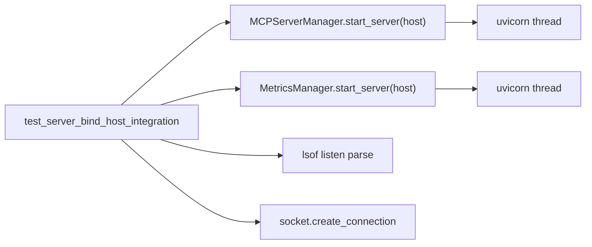

# PYPOST-150: Server bind host integration tests

## Research

- `test_mcp_server_manager.py` and `test_metrics_server_startup.py` start servers on
  `127.0.0.1` only; they prove port readiness, not host fidelity.
- `validate_bind_host` (PYPOST-151) accepts `127.0.0.1`, `0.0.0.0`, `localhost`, `::1`.
- `lsof -iTCP:<port> -sTCP:LISTEN` reports actual listen addresses (`127.0.0.1`, `*`,
  `[::1]`).

## Implementation Plan

1. **`tests/test_server_bind_host_integration.py`** — shared helpers (`_free_port`,
   `_wait_for_listen`, `_listen_addresses_for_port`, `_client_host_for_bind`).
2. **Parameterized cases** — one row per supported bind host for MCP and metrics.
3. **Assertions** — TCP connect succeeds via the appropriate client address; when `lsof`
   is available, parsed listen set matches expected normalized bind address.
4. **`doc/dev/testing.md`** — add row to MCP/metrics coverage table.

## Architecture

| Component | Change |
| --- | --- |
| `test_server_bind_host_integration.py` | New integration module |
| `doc/dev/testing.md` | Coverage table row |
