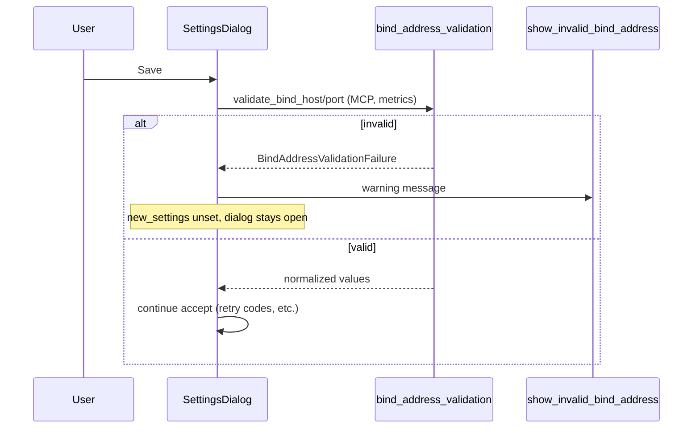

# PYPOST-151: Architecture

## Approach

Mirror the retryable status codes validation pattern (PYPOST-423/444): pure-Python parser
module, structured failure type, dialog helper, `accept()` guard with WARNING log.

## Components

| File | Role |
| ---- | ---- |
| `pypost/core/bind_address_validation.py` | `validate_bind_host`, `validate_bind_port`, `BindAddressValidationFailure` |
| `pypost/ui/collection_item_dialogs.py` | `show_invalid_bind_address` QMessageBox helper |
| `pypost/ui/dialogs/settings_dialog.py` | `_validate_bind_addresses()` called from `accept()` |

## Host rules

- Strip whitespace; reject empty.
- Accept if `ipaddress.ip_address()` succeeds (IPv4/IPv6).
- Else accept RFC-style hostnames (labels, hyphens, dots).

## Port rules

- Range 1024–65535 (matches existing `QSpinBox` range).

## Tests

| File | Coverage |
| ---- | -------- |
| `tests/test_bind_address_validation.py` | Parser unit tests |
| `tests/test_settings_dialog.py` | `TestSettingsDialogBindAddressValidation` |
