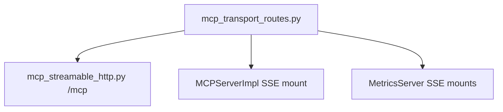

# PYPOST-152: MCP transport routes architecture

## Research

- `MCP_STREAMABLE_HTTP_PATH` already lived in `mcp_streamable_http.py`; SSE paths were
  duplicated as string literals in `MCPServerImpl._create_sse_app()` and `MetricsServer._create_app()`.
- `SseServerTransport` expects the messages path segment passed to its constructor; Starlette
  `Mount` paths must match for POST routing to work.
- `AppSettings` holds host/port only (`mcp_host`, `mcp_port`, `metrics_*`); route paths are
  protocol defaults, not persisted user settings.

## Implementation Plan

1. Add `pypost/core/mcp_transport_routes.py` with three module-level constants.
2. Import constants in `mcp_streamable_http.py` (streamable route) and both server builders.
3. Update routing unit tests to assert against imported constants.
4. Document module in `doc/dev/mcp_integration.md`.

## Architecture

## Worklog

role: execution, step: 2, step_name: Architecture, tokens_used: 1600
