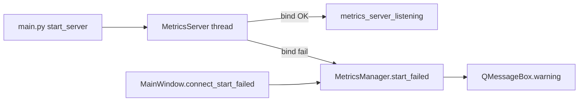

# PYPOST-153: Port binding error handling

## Research

- `MCPServerManager` (PYPOST-556): deferred `status_changed(True)`, `start_failed(str)`,
  `sys.exit` hook, OSError catch in uvicorn thread.
- `MetricsServer` logged "started" when the thread spawned, not when listening; no failure path.
- `main.py` starts metrics before `MainWindow`; UI slot must replay early failures.

## Implementation Plan

1. **`server_bind.format_bind_error`** — shared operator message for any uvicorn server.
2. **`MetricsServer`** — mirror MCP startup hook, OSError handling, structured ERROR logs.
3. **`MetricsManager`** — `QObject` with `start_failed` signal; buffer until
   `connect_start_failed`.
4. **`MainWindow`** — `QMessageBox.warning` on metrics failure (parallel to EnvPresenter MCP).
5. **Tests** — port busy, listen success, deferred failure delivery.

## Architecture

| Component | Change |
| --- | --- |
| `server_bind.py` | Shared bind error text |
| `MetricsServer` | Failure notify + deferred success log |
| `MetricsManager` | Signal + pending failure buffer |
| `MainWindow` | Metrics failure dialog |
