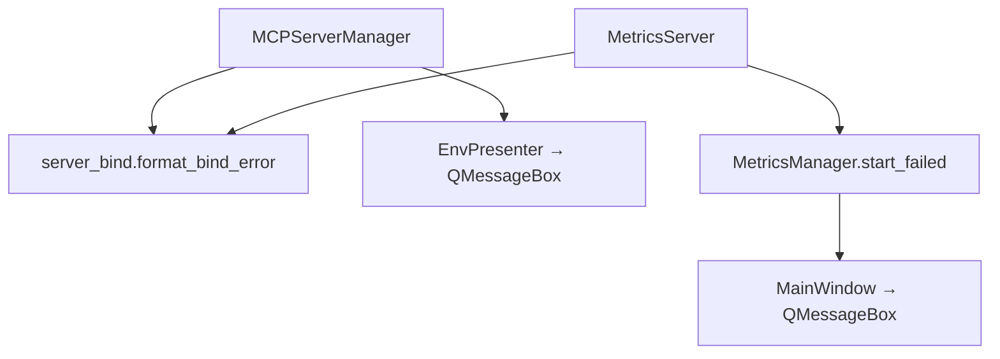

# PYPOST-154: Port bind error handling — verification architecture

## Research (current state)

| Server | Manager | UI handler | Deferred delivery | Tests |
| --- | --- | --- | --- | --- |
| MCP | `MCPServerManager` | `EnvPresenter._on_mcp_start_failed` | No (presenter wires at init) | `test_mcp_server_manager.py` |
| Metrics | `MetricsManager` | `MainWindow._on_metrics_start_failed` | Yes (`connect_start_failed`) | `test_metrics_server_startup.py` |

Both uvicorn threads call `format_bind_error` (MCP via `format_mcp_bind_error` wrapper) on
`OSError`, log at ERROR, and emit `start_failed(str)`.

## Verification Plan

1. Run existing integration tests for MCP and metrics port-busy paths.
2. Add `test_server_bind.py` covering shared message formatting for both server names.
3. Update `doc/dev/mcp_integration.md` troubleshooting and metrics startup flow.
4. Update `doc/dev/testing.md` coverage table with PYPOST-154 scope note.

## Architecture (unchanged)

No structural changes required — verification confirms PYPOST-556 + PYPOST-153 design.
