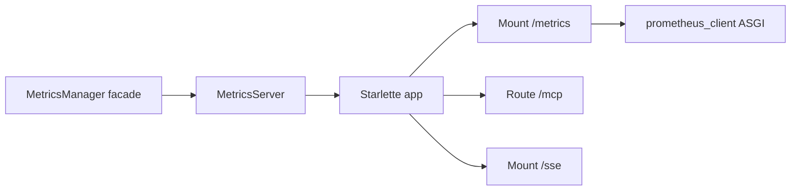

# PYPOST-166: Metrics routing architecture

## Research

| Location | Finding |
| --- | --- |
| `pypost/core/metrics.py` | Facade only — delegates to `MetricsRegistry` + `MetricsServer`; no ASGI/WSGI code |
| `pypost/core/metrics_server.py` | `_create_app()` builds Starlette with `Mount("/metrics", app=prometheus_app)` |
| Repo grep for `PATH_INFO` | No matches under `pypost/` |
| `tests/test_mcp_asgi_compatibility.py` | Asserts `/metrics` mount type and scrape via `TestClient` |

## Before (PYPOST-23 debt)

Monolithic `MetricsManager` owned counters, MCP, and uvicorn. Prometheus scrape used a
wrapper that inspected `environ['PATH_INFO'] == '/metrics'` — ad-hoc WSGI routing.

## After (PYPOST-75, verified PYPOST-166)

### Route table (`MetricsServer._create_app`)

| Path | Mechanism | Handler |
| --- | --- | --- |
| `/metrics` | `Mount` | `make_asgi_app(registry=...)` |
| `/mcp` | `Route` (streamable HTTP) | MCP SDK ASGI |
| `/sse` | `Mount` | Legacy SSE sub-app |

## Implementation Plan

1. Grep codebase for `PATH_INFO` / manual metrics path checks — none found.
2. Read `metrics_server.py` — confirm Starlette `Mount("/metrics")`.
3. Run `tests/test_mcp_asgi_compatibility.py` and `tests/test_metrics_server_endpoint.py`.
4. Document declarative routing in `doc/dev/mcp_integration.md`.
5. Close PYPOST-166 — no refactor required.
