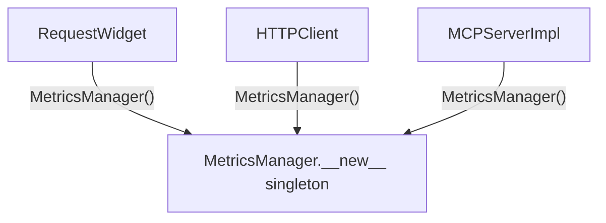
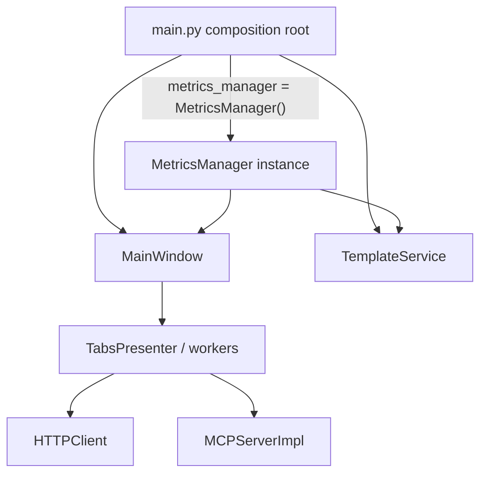

# PYPOST-167: MetricsManager DI architecture

## Research

| Location | Finding |
| --- | --- |
| `pypost/core/metrics.py` | Plain `QObject` facade — no `__new__`, no `_instance` |
| `pypost/main.py` | Sole production `MetricsManager()` — passed to `MainWindow`, `TemplateService` |
| `pypost/ui/main_window.py` | Accepts `metrics: MetricsManager` in constructor only |
| Repo grep `MetricsManager()` in `pypost/` | Single match: `main.py:30` |
| Tracking consumers | `MetricsTrackerProtocol \| None` + `resolve_metrics()` (PYPOST-73/74) |

## Before (PYPOST-23 debt)

Hidden global state: every call site got the same instance without explicit wiring.

## After (PYPOST-44, verified PYPOST-167)

### Injection chain

| Layer | Type | Notes |
| --- | --- | --- |
| Composition root | `MetricsManager` | Lifecycle: `start_server` / `stop_server` |
| `MainWindow` | `MetricsManager` | Needs Qt `start_failed` signal |
| Presenters, services, workers | `MetricsTrackerProtocol` | `resolve_metrics()` when omitted |
| Tests | `MagicMock(spec=MetricsTrackerProtocol)` or real instance | No global patching |

## Implementation Plan

1. Grep `pypost/` for `MetricsManager()` — only `main.py`.
2. Confirm no singleton machinery in `metrics.py`.
3. Run `make test`.
4. Update dev docs; close PYPOST-167 — no refactor required.
