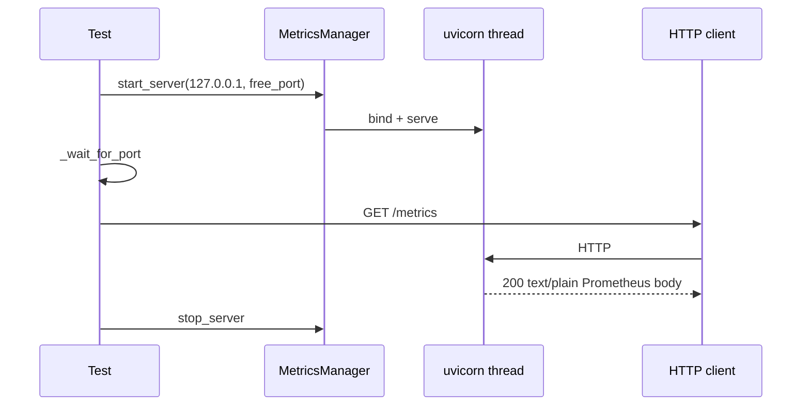

# PYPOST-169: Metrics HTTP integration test architecture

## Research

- `tests/test_metrics_server_endpoint.py` — unit-level `/metrics` via Starlette `TestClient`.
- `tests/test_metrics_server_startup.py` — port listen + bind failure signaling (PYPOST-153).
- `tests/test_metrics_server_integration.py` — live uvicorn + MCP resource (PYPOST-563).

Gap: no live HTTP GET `/metrics` after `MetricsManager.start_server`.

## Implementation Plan

1. Reuse `_free_port`, `_wait_for_port` helpers from existing integration module.
2. Add `_fetch_metrics_http` using stdlib `urllib.request` (real outbound HTTP).
3. Add `TestMetricsServerHttpIntegration` with:
   - baseline scrape after start (status, content type, default counters);
   - counter increment visible in live scrape.
4. Document coverage in `doc/dev/testing.md`.

## Test Flow

| Component | Change |
| --- | --- |
| `tests/test_metrics_server_integration.py` | HTTP integration class + helper |
| `doc/dev/testing.md` | Coverage table row |
